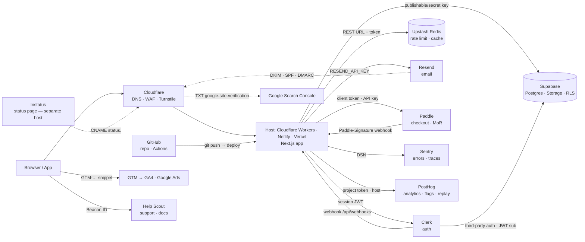

# v2p portable pack (generated 2026-10-01; do not edit)

<!-- source: SKILL.md -->

# v2p — vibe to product (router)

## 1. What this does
v2p is a thin orchestrator: each phase reads the previous handoff file and writes one of its own in `<project>/.v2p/`.
It never reimplements what superpowers or gstack already do; later phases call them.
Portable pack: if this arrives as one pasted document, the files named below follow it as sections. Run the handshake first and use only the standards sections for the chosen profile.
Receipts, every phase: when a v2p script or gate refuses or blocks, stop and show the user its output; never write, edit or seal a `.v2p/` handoff file, `.v2p/work/` record or `.*-pass` receipt by hand.
Blocks between `<!-- claude-only -->` markers apply to Claude Code only; other runtimes skip them.

## 2. Entry
Optional argument: `handshake | adopt | scavenge | brand | mapping | execute | review | deploy`.

**Model guard:** before `adopt`, `scavenge`, `brand`, `mapping`, `execute`, `review` or `deploy`, if you are a small/fast model tier (Haiku-class, or any runtime's mini/flash/lite tier), stop before reading the phase file and reply only: "This phase needs a larger model. Switch model (Claude Code: `/model` → Sonnet or Opus) and run it again."

**Before asking the first question of any phase — including `adopt` — read that phase's file (table in §5) in full and follow it step by step.** This router only says which phase to run. Every question, template and gate lives in the phase file; never improvise them from the table.

No argument: probe the directory first. Portable: ask the user whether this folder has code and whether `.v2p/BRIEF.md` exists.
- BRIEF exists → print its §1 Profile line and its "Next" line, then offer: resume, or re-run the handshake.
  - "Next" resolution: BRIEF exists and no `.v2p/SCAVENGE.md` → offer `scavenge`; SCAVENGE exists and no `.v2p/DESIGN.md` → offer `brand`; DESIGN exists and no `.v2p/PLAN.md` → offer `mapping`; PLAN exists and no `.v2p/EXECUTE.md` → offer `execute`; EXECUTE exists and no `.v2p/REVIEW.md` → offer `review`; REVIEW exists and no `.v2p/DEPLOY.md` → offer `deploy`; DEPLOY exists → print `live since <written date> at <target>` and offer: redeploy (`deploy`) or re-theme (`brand`).
- No BRIEF and code present (a manifest such as package.json, pyproject.toml, go.mod, Cargo.toml, or source files) → ask: "Existing code found: Adopt it (scan, derive BRIEF, audit, tidy) (Recommended) / Fresh handshake (ignores the code)". Adopt → `phases/adopt.md`.
- No BRIEF and no code → ask "What are we building? One paragraph." and start the handshake. A docs-only folder (README and notes, no code) also goes here; add one line: "`/v2p adopt` merges existing notes into docs/."
- `/v2p adopt` always runs adopt; with an existing BRIEF it keeps it and runs audit + tidy only.

## 3. Target directory
- The BRIEF goes to `$PWD/.v2p/BRIEF.md`.
- If `$PWD` has no code and no `.v2p/`, ask once whether this directory is the project.
- Never scaffold a project.
- Recommend committing `.v2p/`: it is the contract between phases.

## 4. Profiles
| Profile | Shape |
|---|---|
| `landing` | one-action page, no login |
| `saas-web` | logged-in, users outside your organisation |
| `internal-tool` | logged-in, users work for you |
| `native-app` | iOS/Android binary |

Disambiguators (ask only the one that separates the two candidates):
- internal-tool vs saas-web → "Do users work for you?"
- landing vs saas-web → "Does anyone log in?"
- native-app vs saas-web → "If I handed you a finished API tomorrow, how much work remains?"

No fit: pick the nearest profile and record the gap in BRIEF §10. Never invent a profile.
AI features, payments, webhooks, i18n, special-category data, GraphQL and file uploads are conditional blocks inside the standards, not profiles.

## 5. Phases
| Phase | File | Writes | Status |
|---|---|---|---|
| `handshake` | `phases/handshake.md` | `.v2p/BRIEF.md` | available |
| `adopt` | `phases/adopt.md` | `.v2p/BRIEF.md` + `.v2p/AUDIT.md` | available |
| `scavenge` | `phases/scavenge.md` | `.v2p/SCAVENGE.md` | available |
| `brand` | `phases/brand.md` | `.v2p/DESIGN.md` (+ root `DESIGN.md` symlink) | available |
| `mapping` | `phases/mapping.md` | `.v2p/PLAN.md` | available |
| `execute` | `phases/execute.md` | `.v2p/EXECUTE.md` (+ `.v2p/PLAN-AMENDMENTS.md`) | available |
| `review` | `phases/review.md` | `.v2p/REVIEW.md` | available |
| `deploy` | `phases/deploy.md` | `.v2p/DEPLOY.md` | available |

## 6. When to load references
- Standards: per the profile mapping below, at the end of the handshake (to fill BRIEF §9) and by later phases.

| Profile | Files loaded (in order) | Also |
|---|---|---|
| landing | `references/standards/core.md`, `references/standards/web.md`, `references/standards/landing.md` | `references/landing-10-sections.md`, `references/ux-laws.md` |
| saas-web | `references/standards/core.md`, `references/standards/web.md`, `references/standards/saas-web.md` | `references/ux-laws.md` at review |
| internal-tool | `references/standards/core.md`, `references/standards/web.md`, `references/standards/internal-tool.md` | `references/ux-laws.md` at review |
| native-app | `references/standards/core.md`, `references/standards/native-app.md` | none |

- `references/landing-10-sections.md`: only for `landing`.
- `references/ux-laws.md`: at any UI review, and at review.
- BRIEF layout: `references/brief-template.md`.
- SCAVENGE and PLAN layouts: `references/scavenge-template.md` (scavenge), `references/plan-template.md` (mapping).
- DESIGN layout: `references/design-template.md` (brand).
- EXECUTE and REVIEW layouts: `references/execute-template.md` (execute), `references/review-template.md` (review).
- DEPLOY layout: `references/deploy-template.md` (deploy).
- Adopt: `references/tidy-rules.md` (what should exist, what is debris, what is never touched) and `references/audit-template.md` (layout of `.v2p/AUDIT.md`).
- Startup stack: `references/stack/overview.md` at mapping step 1; `references/stack/alternatives.md` only when a BRIEF constraint or a growth trigger needs a non-default provider or the country-eligibility lists; `references/stack/wiring.md` and `references/stack/security.md` by execute/review/deploy (mapping reads them only to cite row ids).
- Source rule for every v2p file: no `---` horizontal rules (use `***`); the DESIGN.md frontmatter fence is the one exception.


***

<!-- source: phases/handshake.md -->
# v2p phase: handshake

## Purpose
A short interview that turns "what are we building" into `.v2p/BRIEF.md`: profile, the one job, success criteria, scope, brand, constraints, stack and the standards that apply. Every later phase reads this file; nothing is built here.

## Discipline
Adapted (paraphrased) from github.com/Hainrixz/the-architect.
- At most 3 questions per turn.
- Skip anything the opening message already answered, and say so: "taking X from what you said".
- Relevance test: ask a question only if its answer changes BRIEF content.
- Opinionated defaults: when the user shrugs, state the default you are taking and record it as `defaulted` in the decisions log.
- Gaps are written as `[NEEDS CLARIFICATION: <question> — blocks <what>]`. Each one must end as answered, defaulted, or deferred to a non-goal before the BRIEF is written.
- After each turn, restate a running brief of 10 lines or fewer.
- Mirror the user's language in the questions and in the BRIEF.

## Question list
Turns hold at most 3 questions. (S) = skippable when the condition holds. (P) = wording varies by profile.

Turn 0 — context
- Q0 (S if `$PWD` obviously has code or is empty) — New from zero, or a change to existing code? Which directory? Existing code → stop; run `phases/adopt.md` (it derives the BRIEF from the code and comes back to this file's gate).
- Q1 (S if given at entry) — What are we building, in one paragraph? What breaks if it doesn't exist?
- Q2 — Who uses it, roughly how many, and how often?

Turn 1 — classification
- Q3 — "This looks like <profile> because <signal>. Correct?" If two candidates remain, ask the one disambiguator from the router's profile section.
- Q4 (P) — The one job.
  - landing: the single visitor action (demo, trial, buy, join list).
  - saas-web: the core weekly verb.
  - internal-tool: view numbers, edit records or approve? Any action expensive to undo?
  - native-app: the core loop; must it work offline?

Turn 2 — success and scope
- Q5 — (a) The one number that must move in 90 days. (b) Day-1 acceptance, 3–7 lines of `WHEN <trigger> THE SYSTEM SHALL <observable response>`. Reject "it works" or "looks right"; ask for the observable response.
- Q6 — What is explicitly NOT in v1?

Turn 3 — brand and locale
- Q7 — Brand guide?
  - `existing`: path, URL or file. Record palette, type, voice and logo in BRIEF §6.
    If it cannot be read (missing, wrong path, unsupported format), say so once and ask for the right location. If it isn't available now, don't block: record `Status: existing (source: pending)`, write `pending brand file` for palette/type/voice/logo, log `brand file | deferred | provide before UI work` in §10, and continue.
  - `new`: 3 adjectives, 1–2 reference sites, a must-avoid list (default: the anti-"made-by-AI" traits in `references/standards/landing.md`). Record `brand: to-create`; it is created in a later phase.
  - `none needed`: internal-tool default is the organisation's UI kit.
- Q8 (S; default one language) — One language or several? Translated, or per-market content?

Turn 4 — constraints and stack
- Q9 — Deadline; monthly infrastructure budget ceiling; data sensitivity (personal data, payments, health/financial, minors, public-sector or EU accessibility obligation); who operates it after launch (solo or team); the country the business or legal entity operates from, and the countries the audience is in (payments and messaging eligibility depend on them; not the same as the operator). Health or other special-category data → the special-category data block is ON in BRIEF §9.
- Q10 — Stack must-have, won't-accept, existing accounts (hosting, domain, payments, Apple/Google developer). No preference → state the profile default and record `defaulted`. GraphQL in the stack → the GraphQL block is ON in BRIEF §9.
- Q11 (S; skip for landing and internal-tool) — Money model: free / flat / per-seat / usage / in-app purchase.
- Q12 (S; default none) — Integrations: email, payments, calendar, Slack, external APIs, inbound webhooks, user file uploads. Any yes → the webhook/idempotency block is ON in BRIEF §9; file uploads → the file uploads block is ON; a GraphQL API → the GraphQL block is ON.

## Confirmation gate
Show, together:
1. the running brief,
2. the decisions log: one row per question Q0–Q12, each marked answered / defaulted / deferred / skipped / inferred, with the value (or, for skipped, the reason). "Answered" only when the user's own words cover it. A reply to a different question, or silence, makes it defaulted (state the default) or a new question. Record the user's latest value, not an earlier one or a blend.
3. any open `[NEEDS CLARIFICATION: …]` markers.

Write only on an explicit "yes", "ok" or "confirmed". A change request or a question re-enters the loop: apply it, show the gate again, and write nothing in the meantime. Open markers block writing; resolve each one first.

## Write step
1. Load the standards for the confirmed profile (router §6) and fill BRIEF §9, including which conditional blocks are ON.
2. Write `.v2p/BRIEF.md` from `references/brief-template.md`. §11 must be literally `none`.
3. Print the path, then: `Next: /v2p scavenge`.

If you cannot write files, print the BRIEF in one code block and ask the user to save it as `.v2p/BRIEF.md`.


***

<!-- source: references/brief-template.md -->
# BRIEF template

Copy the block below into `.v2p/BRIEF.md` and replace every `<…>`. §11 must be literally `none` before the file is written.

```
# BRIEF — <project name>
written: <YYYY-MM-DD> by v2p handshake · language: <xx>

## 1. Project
- Profile: <landing|saas-web|native-app|internal-tool> · secondary: <profile|none>
- Code: <greenfield | existing at <path>>
- Vision: <one paragraph>
- Breaks without it: <one line>

## 2. Audience and scale
- Who: <…> · How many / how often: <…>

## 3. The one job
- <primary action or core verb>; expensive-to-undo actions: <list|none>; offline: <yes|no|n/a>

## 4. Success criteria
- 90-day metric: <number + how measured>
- Day-1 acceptance:
  - WHEN <trigger> THE SYSTEM SHALL <observable response>

## 5. Non-goals (v1)
- <…>

## 6. Brand
- Status: <existing (source: <path/url>) | to-create | none>
- Palette / type / voice / logo: <… | pending brand phase (brand writes .v2p/DESIGN.md; "existing (source: pending …)" yields a placeholder DESIGN.md until the guide arrives)>
- Adjectives: <…> · References: <…> · Must-avoid: <…>
- Locales: <one | list; translated | per-market>

## 7. Constraints
- Deadline: <…> · Budget/month: <$n | 0 | none> · Data sensitivity: <flags|none> · Operator after launch: <solo|team>
- Operating country: <country the business/legal entity operates from, ISO 3166 English name | unknown> · Audience countries: <list | worldwide | unknown>

## 8. Stack
- Must-have: <…> · Won't-accept: <…> · Existing accounts: <…>
- Money model: <…|none> · Integrations: <…|none>

## 9. Standards loaded
- references/standards/core.md + <web.md +> <profile>.md <+ landing-10-sections.md + ux-laws.md>
- Conditional blocks ON: <AI feature | payments | webhooks/idempotency | i18n | offline | load test | special-category data | GraphQL | file uploads | none>

## 10. Decisions log
| item | answered / defaulted / deferred / inferred | value (inferred: ← source path) |
|---|---|---|

## 11. Open markers
none  ← must be literally "none" for the file to be written

Next: /v2p scavenge
```

***

<!-- source: phases/scavenge.md -->
# v2p phase: scavenge

## Purpose
Turn the BRIEF into a short evidence file, `.v2p/SCAVENGE.md`: what already exists (references, docs, blueprints, standards) and, for brownfield, what the current code is.
Nothing is decided here; mapping decides.

## Preconditions
- `.v2p/BRIEF.md` must exist with §11 = `none`. Otherwise print `Run /v2p handshake first.` and stop.
- If `.v2p/SCAVENGE.md` exists: print its `written:` line and offer resume (keep) or re-run.
- Checkpoints: list `.v2p/work/scavenge-*`. A file is reusable when its line-1 `written:` date is today and its `brief:` equals the current BRIEF's `written:` date; print "resuming from <files>" and skip the work it already covers. Any other file is stale: overwrite it, never read it. Line 1 of every checkpoint: `written: <YYYY-MM-DDTHH:MM> · phase: scavenge · part: <q1-5|q7> · brief: <BRIEF written date>`.

## Research questions (derived, not invented)
Exactly these, each skipped when its BRIEF source is empty or `none`:

| # | From BRIEF | Question | Preferred source |
|---|---|---|---|
| Q1 | §1 profile + §8 stack | Reference architecture or official starter for `<profile>` on `<stack>` (one, from the framework/provider vendor) | library/SDK docs, official docs |
| Q2 | §3 the one job | Proven implementation pattern for `<the one job>` (checkout flow, booking, upload, etc.): one official guide or one maintained repo | official docs > repo pushed <6 months, not archived |
| Q3 | §8 integrations + money model | One row per integration listed in §8. For each: the exact keys/webhooks needed. If the tool is TBD, compare 2–3 candidates on price vs §7 budget, the §6 locales and the §4 acceptance lines, and name one default. **Look in `references/stack/wiring.md` first; go to the web only for a provider not in the guide.** | stack guide, then official docs |
| Q4 | §7 data sensitivity | The primary legal text that applies to the flags set (personal data, payments, health, minors, EU accessibility) for the audience's jurisdiction. Cite the law/regulator page, not a blog. Never state obligations from memory. | government/regulator or standards body |
| Q5 | §2 audience | Up to 3 adjacent products and what their users complain about in the last 30 days (pain language reused in copy and the FAQ) | social-trends search, then web search |
| Q7 | Q1–Q4 answers | **Always runs.** For each subject named in Q1–Q4 (the starter/framework, each Q3 tool, the Q4 law; max 5): what changed in the last 30 days (pricing or plan limits, deprecations, breaking releases, security advisories, outages, acquisitions or migrations, legal amendments). Two sources per subject: (1) a last-30-days search for community signals, (2) the subject's official changelog, release notes, pricing or regulator news page (for a hosted product, the vendor's product changelog, not an open-source repo's releases), read for entries dated in the last 30 days. A community signal is a lead, not a fact: it changes a row only once the official page confirms it. | last-30-days search + official changelog/news page |
| Q6 | §1 `Code: existing at <path>` (brownfield only) | Brownfield: copy the inventory line from `.v2p/AUDIT.md` §1 (written by adopt). AUDIT missing → print `Run /v2p adopt first.` and stop. | `.v2p/AUDIT.md`; no web, no code search |

## Source-quality rules
1. Rank: official docs > maintained repos (pushed within 6 months, not archived, >100 stars or vendor-owned) > posts/forums/social. A lower rank never overrides a higher one on a technical fact.
2. Every claim row carries `source URL · accessed YYYY-MM-DD`. No URL → the row is deleted, not kept as "known". The URL must itself show the claim: a claim with no fetched evidence is deleted, never pinned to a nearby source. A deferred question writes only `[OPEN]`, no findings.
3. Social/trend results (Q5) inform copy and FAQ only; never a technical decision. Q7 signals change a row only once an official page confirms them; unconfirmed ones are written `[CHECK: <signal> · <URL>]` for mapping.
4. Numbers (limits, prices) are copied verbatim with the page's own wording; if the page did not show it, write `(not on page)`. A quote is labelled "verbatim" only when copied from the fetched page's text, with that page's URL beside it; anything else is labelled "paraphrase" (live: English words inside "verbatim" Spanish Ley 81 quotes).
5. A "nothing changed / none found" result is written as `none found · searched: <source or query>, last 30 days`, never as "confirmed". A generic landing or index page is not evidence for a specific claim.
6. Findings come only from pages fetched in this run, or from this run's `.v2p/work/` files, in every phase. A `.v2p/work/` file is written only by the agent that produced the findings, when they arrive; never created afterwards to satisfy a step. Never rebuild them from memory, prior-session summaries or observation logs (e.g. claude-mem): those are leads to re-fetch, not evidence.
7. Q5 is about the §2 audience (end users), not developers. If no end-user complaints are found, Q5 writes `[OPEN]`; never substitute issue trackers or PRs.
8. Only three markers exist: `[OPEN]`, `[CONFLICT]`, `[CHECK]`. The counts in §7 must equal the markers in the file.
9. Disagreement between two official sources → record both, mark `[CONFLICT]`, mapping decides.

## Link check (before writing)
Every URL in the draft is opened once more; any that does not load (4xx/5xx, timeout) removes its row, or the row is re-sourced within budget. §7 records `links: <ok>/<total> ok`. A file is written only when the two numbers are equal.

## Budget and stop rule
- ≤3 sources per question; stop a question when two official sources agree.
- Q1–Q5: **20 fetches** (every page or docs fetch counts). Q7: **5 reserved** for the official changelog/news page, one per subject (last-30-days searches are not counted as fetches); Q1–Q5 may never spend them. ~30 minutes wall time. The count is written into SCAVENGE.md §7.
- Q7 runs after Q1–Q4 are answered and before the file is assembled. A community signal that needs a second official page beyond the one reserved fetch is written as `[CHECK]`.
- When the cap hits, unanswered questions are written as `[OPEN: <question> — answer needed by <mapping task>]`, never guessed.

## Tools and degradation
- Use whatever web-reading tool your runtime has; if none, ask the user to paste the pages.

## Execution
Portable: do steps 1–4 yourself in one pass. List the applicable questions, answer them within the budget, fill `references/scavenge-template.md`, write `.v2p/SCAVENGE.md` (or print it in one code block if you cannot write files), then print `Next: /v2p brand`.


***

<!-- source: phases/brand.md -->
# v2p phase: brand

## Purpose
Turn BRIEF §6 into `.v2p/DESIGN.md`: normative tokens plus the rules later phases check against. It runs after scavenge and before mapping, so the plan's tokens task can name files, fonts and hex values.
Nothing is built here. The design skills do the design work; v2p adds the checks and the receipt.

## Preconditions
- `.v2p/BRIEF.md` required, with §11 = `none`. Otherwise print `Run /v2p handshake first.` and stop.
- `.v2p/SCAVENGE.md` optional: if absent, ask once "Run scavenge first (recommended) or brand without it?"; branding without it → `scavenge: skipped` on the DESIGN.md Overview `Status:` line.
- BRIEF §1 `Code: existing …` → `.v2p/AUDIT.md` must have passed adopt's finalize step (its "Brand signals" row feeds the existing path). Otherwise print `Run /v2p adopt first.` and stop.
- Existing `.v2p/DESIGN.md` → offer resume (keep) or re-run.
- Existing `.v2p/REVIEW.md` that passed review → **re-theme mode**: say so. The finished cycle is archived only after the new DESIGN.md passes (Step 4), so a failed brand run leaves it intact.
- Checkpoints: `.v2p/work/brand-guide.md` (the ingested guide, line 1 `sha256: <hex>`), `.v2p/work/brand-candidates.md` (line 1 `written: <YYYY-MM-DDTHH:MM> · phase: brand · part: candidates · brief: <BRIEF written date>`), `.v2p/work/brand-direction.md` (approved direction + rationale), `.v2p/work/brand-incumbent.md` (re-theme: the tokens in use now). A checkpoint is reusable when its `brief:` equals the BRIEF's `written:` date and, for candidates, it was written today; otherwise overwrite it, never read it. The finalize step clears `.v2p/work/brand-*`.
- Model guard (router §2).
- Read `references/design-template.md` in full before the first question.

## Step 0 — Classify
Print the case and the BRIEF §1 profile. The case comes from BRIEF §6 `Status:`:

| BRIEF §6 Status | Case | Direction source |
|---|---|---|
| `existing (source: <path/url>)`, readable | **existing** (transcribe) | the guide; a logo-only guide → **to-create** with the logo as a fixed constraint |
| `existing (source: pending …)`, or unreadable | **placeholder** | none: neutral tokens; say "placeholder: re-run `/v2p brand` when <guide> exists; it re-themes." In re-theme mode the placeholder is the incumbent tokens as shipped (no candidates, no direction question): it records them and the reviewed cycle stays current. |
| `to-create` | **to-create** (propose) | the three adjectives, reference sites and must-avoid of BRIEF §6 |
| `none` (internal tool, org UI kit) | **none** (document the kit) | the organisation's kit, or the stack default |
| any, in re-theme mode | **re-theme** | first record the tokens in use now, then the row above that matches |

Re-theme: a root `DESIGN.md` that is a symlink to `.v2p/DESIGN.md` is removed first (`rm DESIGN.md`, the link only), so no skill writes through it.

## Step 1 — Draft per case
Portable: follow the case below by hand; the user pastes what a tool would have produced (the guide's palette, type, voice and logo rules; candidate palettes). Take BRIEF answers as given and say "taking X from the BRIEF".
- **existing**: transcribe the guide into the template: colors (hex; convert Pantone/CMYK only when the guide gives no hex and mark it `derived` in the Colors prose), type roles, voice, logo rules, imagery, must-avoid. A transcription is not re-opinionated: no taste or reference-site skill runs. Gaps the guide leaves (rounded, spacing, elevation, components) are filled and marked `derived`. Sources: `guide:` (a local file with its sha256) and one `font:` line per face. In adopt mode (BRIEF §1 `Code: existing …`) the guide is often the project's own root `DESIGN.md`: transcribe it, never move or edit it (its guards may read it).
- **placeholder**: a neutral palette and a system font stack; `description: PLACEHOLDER — neutral tokens until <guide> arrives`; Overview `Status: placeholder`; Sources `- placeholder: brand guide pending (<name>)`; Voice, Logo Rules and Imagery one line each `pending <guide>`. Must-Avoid from BRIEF §6. Motion: the defaults in the template only.
- **to-create**: confirm the adjectives, reference sites and must-avoid from BRIEF §6; ask only what changes DESIGN.md content. Present up to three candidate directions (token table + a font sample line each), the user picks one, then write the full draft. Reference sites give mood and structure only: no token, font or mark is copied. Logo Rules: `pending: no logo yet — mapping plans a wordmark task` when none exists.
- **none**: transcribe the kit's tokens (source `- kit: <name>`), or, with no kit, a dense scale and a system font stack; Overview `Mode per surface: Operate`.
- **re-theme**: write the incumbent tokens (the ones the code uses now) to `.v2p/work/brand-incumbent.md`, then run the matching case; ask which incumbent tokens are kept.

Every case: Must-Avoid first bullet `- BRIEF §6: <verbatim>`; Motion from the template's defaults (springs only for `native-app` or gesture UI); no skill draws a vector logo, so Logo Rules transcribe the guide or record a decision.

## Step 2 — Questions
One question per decision point; independent ones together:
1. Direction (to-create, re-theme): up to three candidates, each shown as its token table and a font sample line.
2. Extras (to-create), one multi-select: competitive research? mockups of the first screen? generated imagery? Offer mockups only when gstack reports `DESIGN_READY`, and imagery only when `banana-claude` is enabled with its key; otherwise leave the option out (user decision 2026-09-25: no paid image tools for now; previews are HTML, images come from the user).
3. Re-theme: which incumbent tokens are kept.

## Step 3 — Show and approve
Write the draft to `.v2p/DESIGN.draft.md`. Print it (or its path), the preview page or mockup paths, and a six-line summary: primary / on-primary / surface / on-surface, display and body faces, motion approach. Ask "Approve DESIGN.md (Recommended) / Change tokens / Change direction". A change → back to the step named, then show again. Nothing is final before approval.

## Step 4 — Finalize
Portable: rename the draft to `.v2p/DESIGN.md`, create the root link (`ln -sfn .v2p/DESIGN.md DESIGN.md`; not when BRIEF §1 says `Code: existing …` and root `DESIGN.md` is a regular file: that is the project's own, kept as is) and say there is no receipt.

## Step 5 — Hand off
Print the path, the counts from the PASS line (or the token counts), `Status: final|placeholder`, then `Next: /v2p mapping` (a placeholder over a reviewed cycle: `Next: /v2p deploy`, and the draft's Next line says so).


***

<!-- source: references/design-template.md -->
# DESIGN template

Copy the block below into `.v2p/DESIGN.draft.md` (brand Step 3) and replace every `<…>`. The format is Google's DESIGN.md (`google-labs-code/design.md`): YAML frontmatter with the normative tokens, then prose sections. Later phases check against it: mapping plans the tokens task from the frontmatter, execute takes tokens from it (never invents them), review compares the running page with it.

Rules:
- Frontmatter is normative; the prose explains it. Two-space indentation, one key per line, no flow style (`{…}` maps, `[…]` lists).
- Required tokens: `name`, `description`; `colors.primary`, `colors.on-primary`, `colors.surface`, `colors.on-surface`; `typography.display.fontFamily`, `typography.body.fontFamily`; `rounded.md`; `spacing.md`; `components.button-primary` with `backgroundColor: "{colors.primary}"` and `textColor: "{colors.on-primary}"`; `components.page` with `backgroundColor: "{colors.surface}"` and `textColor: "{colors.on-surface}"` (those two pairs are what the linter measures for 4.5:1 contrast).
- Every `colors.*` value is a quoted 6-digit hex (`"#RRGGBB"`; unquoted, `#` starts a YAML comment). Dimensions are plain values (`3rem`, `16px`): the linter rejects `clamp()` as a dimension (measured 2026-09-25); put the fluid scale in the Typography prose.
- The eight canonical sections, in this order, each exactly once: Overview, Colors, Typography, Layout, Elevation & Depth, Shapes, Components, Do's and Don'ts. Then the v2p sections, in this order, each exactly once: Motion (optional), Voice, Logo Rules, Imagery, Must-Avoid, Sources.
- `## Must-Avoid` first bullet is literally `- BRIEF §6: <the BRIEF's Must-avoid text, verbatim>` (`none` when the BRIEF has none).
- `## Sources` bullets use only the kinds shown in the block; one `font:` line per face with its licence. A local guide carries its sha256.
- `## Do's and Don'ts` keeps the line "No token or mark copied from a reference site." Reference sites give mood and structure only.
- No routed skill draws a vector logo: Logo Rules transcribe the guide or record a decision (`pending: …` plans a wordmark task).
- The frontmatter fence is the only `---` allowed (the one exception to v2p's `***` rule). Last line: `Next: /v2p mapping`.

````
---
name: <project name>
description: <one line: mood, material, energy — or "PLACEHOLDER — neutral tokens until <guide> arrives">
colors:
  primary: "#RRGGBB"
  on-primary: "#RRGGBB"
  surface: "#RRGGBB"
  on-surface: "#RRGGBB"
  <more descriptive slugs; every value a quoted 6-digit hex>
typography:
  display:
    fontFamily: "<face>, <fallback>"
    fontWeight: 700
    fontSize: 3rem
    letterSpacing: -0.02em
  body:
    fontFamily: "<face>, <fallback>"
    fontSize: 1rem
    lineHeight: 1.5
rounded:
  sm: 4px
  md: 8px
  lg: 12px
spacing:
  sm: 8px
  md: 16px
  lg: 24px
components:
  button-primary:
    backgroundColor: "{colors.primary}"
    textColor: "{colors.on-primary}"
    rounded: "{rounded.md}"
  page:
    backgroundColor: "{colors.surface}"
    textColor: "{colors.on-surface}"
---

# <project name>

## Overview
Status: <final | placeholder> · brand case: <existing | to-create | none> · profile: <BRIEF §1> <· scavenge: skipped>
Creative north star: <one sentence>. Mode per surface: <Persuade/Operate/Read/Experience per BRIEF §1 profile>.

## Colors
<strategy and roles; light/dark decision; which token signals action; `derived` where a value was converted (Pantone/CMYK) or filled in>

## Typography
<faces, roles, loading (next/font/google unless a Sources licence line says otherwise; self-hosted), fluid scale, rationale>

## Layout
<max width, grid, breakpoints, density>

## Elevation & Depth
<shadow or tonal layering; "flat" is a valid answer>

## Shapes
<radius hierarchy; nested inner radius = outer − gap>

## Components
<button/input/card/nav states: hover, focus-visible, active, disabled>

## Do's and Don'ts
- Do: <3–5 checkable rules>
- Don't: <3–5 anti-patterns; include the BRIEF §6 must-avoid items again in plain words>
- No token or mark copied from a reference site.

## Motion
- Approach: <minimal-functional | intentional | expressive>; easing enter ease-out / exit ease-in / move ease-in-out; durations micro 50–100ms, short 150–250ms, medium 250–400ms
- Press: scale(0.96); never `transition: all`; `prefers-reduced-motion` → cross-fade only
- Springs (native-app or gesture UI): damping 1.0 / response 0.3–0.4 by default; bounce only after a flick

## Voice
- Adjectives: <BRIEF §6 adjectives> · register: <tú/usted, formal/informal> · locales: <BRIEF §6>
- Do say / don't say: <3 each>

## Logo Rules
- Files: <public/logo.svg …> · clear space: <n × mark height> · min size: <px> · on dark: <variant> · never: <stretch, recolor, effects>

## Imagery
- Style: <real photos of …; no stock clichés> · treatment: <…> · alt-text rule: <…>

## Must-Avoid
- BRIEF §6: <verbatim from BRIEF §6 Must-avoid, or "none">
- <brand-specific additions>

## Sources
- guide: <relative path> · sha256: <64 hex>
- guide: <url>
- reference: <url> · <what was taken: mood/structure only>
- generated: ui-ux-pro-max 2.13.0 --design-system "<query>" · candidate <A|B|C> chosen
- kit: <org UI kit name/url>
- font: <face> · licence: <OFL | Fontshare | commercial>
- placeholder: brand guide pending (<name>)
- schema: google-labs-code/design.md spec, linted with @google/design.md 0.4.0

Next: /v2p mapping
````

***

<!-- source: phases/mapping.md -->
# v2p phase: mapping

## Purpose
Turn BRIEF + SCAVENGE + DESIGN into `.v2p/PLAN.md`: an executable plan with providers, skills, pre-filled standards rows, and tasks that each carry a verifier.
Plan-writing itself follows a plan-writing method (superpowers in Claude Code); v2p adds the sections below.

## Preconditions
- `.v2p/BRIEF.md` required, with §11 = `none`. Otherwise print `Run /v2p handshake first.` and stop.
- `.v2p/SCAVENGE.md` optional: if absent, ask once "Run scavenge first (recommended) or plan without it?"; if planning without it, record `scavenge: skipped` in the PLAN.md header.
- If `.v2p/SCAVENGE.md` exists, its §7 must read `links: n/n ok` (the two numbers equal) and its §6 must not contain "not searched". Otherwise print `SCAVENGE.md failed its checks: re-run /v2p scavenge.` and stop.
- BRIEF §1 `Code: existing …` → `.v2p/AUDIT.md` must exist and have passed adopt's finalize step. Otherwise print `Run /v2p adopt first.` and stop.
- `.v2p/DESIGN.md` must have passed brand's finalize step. Portable: it ends with `Next: /v2p mapping`. Otherwise print `Run /v2p brand first.` and stop. Its Overview `Status: placeholder` → print "DESIGN.md is a placeholder: the tokens task must keep a single swap point; re-theme later via /v2p brand".
- Existing `.v2p/PLAN.md` → offer resume (keep) or re-run.
- Checkpoint: `.v2p/work/mapping-plan.md` is reusable when its line-1 `written:` date is today and its `brief:` equals the current BRIEF's `written:` date; print "resuming from .v2p/work/mapping-plan.md" and do not re-plan. Otherwise it is stale: overwrite it, never read it.

## Step 0 — Resolve SCAVENGE markers
Every `[CONFLICT]`, `[CHECK]` and `[OPEN]` in SCAVENGE.md gets one outcome before providers are picked: decided (state which source wins and why), or turned into a task with its own verifier. None are carried silently into the plan. Every numeric obligation SCAVENGE names (days, amounts, ages, retention periods) also gets one outcome: decided, or a task whose Verifier `grep`s the tree for the value the project publishes and checks it against the obligation.

## Step 1 — Provider selection
Six rules, in order. Each records a `defaulted` or `answered` row in PLAN §2.
BRIEF §7 `Operating country` or `Audience countries` is `unknown` or absent → ask for it before rule 3 and record the answer in PLAN §2. Read `references/stack/alternatives.md` only when a BRIEF constraint (must-have, won't-accept, budget, country) or a growth trigger needs a provider outside the overview, and for the country lists that rules 4 and 6 check.
1. BRIEF §8 must-have / won't-accept / existing accounts win over any default.
2. Profile default set from `references/stack/overview.md` §"Happy path per profile".
3. Hosting: commercial use and budget. Ask "Is it commercial yet? (it sells, advertises or takes bookings/leads for a business; first sale, ads, paid client work)" and write the user's answer into PLAN §2, attributed to the user. If the BRIEF describes an existing trading business, or the site's one job serves a paid service (bookings, quotes, leads), the recommended option is Yes; Not yet is recommended only for a genuinely pre-revenue project. Yes → **Cloudflare Workers** ($0, commercial use allowed on Free; Next.js server rendering runs on Workers per wiring W28, Cloudflare Pages only for a static export); Netlify Personal ($9) when the app needs the Next.js Node runtime that Workers cannot run; Vercel Pro only when BRIEF §7 `Budget/month` covers it AND the plan has a Vercel-only need — name that need in the hosting row, or do not offer Vercel Pro. Not yet → Vercel Hobby (non-commercial only), with the switch trigger written in the hosting row: at the first commercial use, move to Cloudflare Workers. If `Budget/month` is `0` and the profile default has a paid-only requirement (Instatus custom domain → Pro; Clerk MFA → Pro), name it and ask.
4. Money model ≠ none → payments, country-aware. At run time, open each provider's official country list (URLs and list types in `references/stack/alternatives.md` §"Country eligibility") and check BRIEF §7 `Operating country` against it: on a supported list it must be listed; on an unsupported list it must be absent (absence is not approval: the provider still vets the seller). Offer only eligible providers. Global SaaS → merchant of record first (Paddle, Polar, Lemon Squeezy — existing accounts only, it is migrating to Stripe Managed Payments — Dodo Payments); Stripe only when the user has a legal entity in a Stripe account country. Offer a local payment rail only when the operating country matches one documented in alternatives.md. Write one line per provider checked in PLAN §2: `<provider>: <country> <listed|absent|not listed> on <URL>, checked <YYYY-MM-DD>`. Ask with the eligible options and the tax/entity trade-off in each; no eligible provider → say so and ask, never default.
5. Data sensitivity flags → region-aware picks: EU audience → Sentry EU org, PostHog EU, Supabase EU region, Plausible (EU, cookieless) instead of GA4; Clerk has no EU hosting → say so and offer Supabase Auth.
6. Messaging (SMS, phone OTP or WhatsApp in BRIEF §8 integrations): for each audience country, open the SMS provider's per-country pricing page (alternatives.md §"Country eligibility") and look for an SMS-capable local number type. None listed → prefer the WhatsApp Business Cloud API (check the country's rate-card market) and plan SMS as one-way outbound only. Record the check as in rule 4.

Closed choices are asked; everything else is defaulted with one line saying so.

## Step 2 — Skills for this project
Portable: write `none` in PLAN §3.

## Step 3 — Write the plan
Read `docs/DECISIONS.md` too when it exists: every open item in a `## From …` section becomes a task or an explicit non-goal in the PLAN.
Portable: write the plan yourself from `references/plan-template.md`, using BRIEF as the spec. Do not run a separate brainstorm; the BRIEF is the spec.

## Step 4 — v2p sections (the template enforces them)
- Architecture: `## Architecture`, a Mermaid `flowchart LR` block of the data flow from client to host to each §2 provider (node ids from `references/stack/overview.md` §4, edges labelled with what crosses them), then one line per hop (core.md "Architecture Map"). The gate refuses the section without the Mermaid block.
- Threat Model: `## Threat Model`, assets, entry points (one per §2 provider that receives traffic or webhooks), top 5 abuse cases with the task that mitigates each.
- §2 Providers: one row per provider with plan, monthly cost at launch (from the overview table), and the wiring rows it needs (row ids from `references/stack/wiring.md`). The hosting row states the commercial answer from rule 3. A row on a free tier with a limit names its growth trigger and the next rung: the middle rungs in overview §"Growth rungs" (e.g. Prisma Postgres $10, Trigger.dev $10, ImageKit $9, Kinde $25) come before any $99 tier. §2 ends with `Total monthly at launch: $<n>` (arithmetic shown). If it exceeds BRIEF §7 `Budget/month`, pick cheaper rows or ask the user; only on the user's approval add `Over budget approved by user: <reason>`.
- §4b (landing only): one row per section of `references/landing-10-sections.md`: kept or omitted (reason in BRIEF §10), and the task that meets its Check.
- §3 Skills: installed rows to use, and at which task.
- §4 Standards: brownfield (BRIEF §1 `Code: existing`): copy `.v2p/AUDIT.md` §2 verbatim, statuses and evidence kept. A copied `gap` row gets no task unless the BRIEF asks for that work. Greenfield: **one row per checklist item** of the loaded files (landing 193, saas-web 190, internal-tool 185, native-app 141 — measured with `grep -c '^- \[ \]'` on 2026-09-23: core 129, web 48, landing 16, saas-web 13, internal-tool 8, native-app 12), status `pending` or `N/A <reason citing BRIEF §>`; conditional blocks OFF in BRIEF §9 → `N/A`. Evidence column empty (execute fills it).
- §5 Tasks: the plan method's task structure plus a **Verifier** line per task: `` mechanical: `<command>` → `<expected>` `` or `manual: <who checks what>`. The backticks around each command are required: a mechanical Verifier with no backticked `` `<command>` → `` pair runs nothing, and finalize-plan refuses it. Only the mechanical part runs: a pair inside the `manual:` part is never run, and a mechanical Verifier whose every command holds a `<placeholder>` runs nothing and fails execute, review and deploy. Only `mechanical` tasks are eligible for an automated retry loop in execute (always with an iteration cap). A task whose Verifier already passes on today's tree is titled `confirm: <what it confirms>`; any other such task is a plan defect. A review task or a launch task does not belong in §5: review and deploy are phases.
- Verifier convention: prefer self-checking commands (`test "$(cmd)" = 4`, `grep -q`, `set -e` chains) — execute treats exit 0 as pass and only compares bare-number expecteds. Absence: `! grep -rqE '<re>' <path>`. Counts: `grep -c`, or `wc -l | tr -d ' '`; never compare raw `wc -l` (macOS left-pads it, so `test "$(… | wc -l)" = 0` never passes). No bare `&` in a Verifier (it backgrounds the whole `&&` chain and races the next command): a server is started by the test runner (e.g. Playwright `webServer`) or by a script with an explicit wait-for-port, on a private port (e.g. `-p 31<nn>`), never a shared default such as 3000. Every `curl` carries `-m <seconds>`. A Verifier command cannot contain a backtick: the parser ends the command there and runs a fragment (match a literal backtick with `.` instead). A verifier that requires several terms checks each one separately (`for w in a b c; do grep -qi "$w" f || exit 1; done`), never one combined count (`grep -c 'a|b|c'` ≥ N passes with one term missing). A code task (its Files name a `.ts`, `.tsx`, `.js`, `.py`, `.go`, `.sh` or similar file) adds a behavioural check to its Verifier: the existing test suite that exercises the changed behaviour, or a command that runs the code; a `grep` or `test -f` proves the text is there, not that it works. Test, lint and build gates use the project's own documented commands (the Commands section of CLAUDE.md or README, or `package.json` scripts), never a bare runner default such as `bun test` (it may include suites that need a fixture). A legal or vendor-terms research task's Verifier is `manual: operator pastes articles <list> from <official URL>`: an agent's fetch is never the source of truth (official sites block or truncate automated fetches); the agent drafts the gap analysis around the operator's paste.
- Files completeness: a scaffold or generator task (create-next-app and the like) lists the generator's output files, or a glob such as `src/app/*`. Every file path named in a task's **Interfaces:** line appears in that task's **Files:** or an earlier task's; name the file, not only the symbol (`publicEnv` in `src/lib/public-env.ts`). A `Modify` path is the full repo path of a file that exists now or that this or an earlier task creates (`src/app/globals.css`, never bare `globals.css`). A task that adds or changes user-facing text lists every locale file in Files (e.g. both `src/i18n/es.json` and `src/i18n/en.json`; 4 of 19 live tasks needed an amendment for this).
- Design tokens and UI (from `.v2p/DESIGN.md`; its frontmatter is normative, never re-invented): one **tokens task** early in the order. Files = the stylesheet or theme file the stack owns (Next.js + Tailwind v4: `src/app/globals.css`; native: the theme file) plus the font wiring file (fonts via `next/font/google` unless a DESIGN.md Sources `font:` line names another licence). Verifier (mechanical, self-checking): `sed -n '/^colors:/,/^[a-z]/p' .v2p/DESIGN.md | grep -oE '#[0-9a-fA-F]{6}' | sort -u | while read -r c; do grep -qi "$c" src/app/globals.css || exit 1; done` → exit 0, plus `for w in "<display face first word>" "<body face first word>"; do grep -q "$w" <font wiring file> || exit 1; done` → exit 0. A **logo task** when Logo Rules names files that do not exist, or says `pending` (a wordmark from `typography.display`; no skill draws a vector logo). An **imagery task** when Imagery names assets. Every UI task's steps name the design skill it loads (execute's dispatch lists them). The Must-Avoid bullets become the verifier terms of the landing `Anti-"made-by-AI"` row (`references/standards/landing.md`).
- Provenance: a decision the PLAN attributes to the owner cites a real BRIEF label (a `Qn` in the BRIEF §10 item column) or `BRIEF §n:line`, or says `inferred`; never a `Qn` the BRIEF does not have.
- §6 Review focus: the plan method's "five uncovered inputs" list, unchanged.

## Cycle 2+ (after a finished cycle was archived)
When `.v2p/cycles/*/REVIEW.md` exists and `.v2p/PLAN.md` does not (brand's re-theme archived the cycle):
- Header adds `cycle: <n> · previous: .v2p/cycles/<dir>`.
- §2 Providers is copied from the archived PLAN unless BRIEF §7 or §8 changed since (no re-asking); `## Architecture`, `## Threat Model` and §4b are copied.
- §4 Standards = the archived REVIEW §3 verbatim; the rows the new tasks touch go back to `pending` with the evidence cell emptied (the row count is unchanged).
- §5 holds only the tasks for the delta (re-theme: tokens, fonts, logo, imagery, copy/voice). Planner instruction: "scope: the DESIGN.md delta against `.v2p/work/brand-incumbent.md`; do not re-plan finished work."
- Execute and review then run unchanged on a new branch.

## Step 5 — Write and hand off
Write `.v2p/PLAN.md` (or print it in one code block if you cannot write files), print the path, the count of tasks (mechanical / manual), and `Next: /v2p execute`.


***

<!-- source: references/scavenge-template.md -->
# SCAVENGE template

Copy the block below into `.v2p/SCAVENGE.md` and replace every `<…>`.
Rule: every bullet and row in §1–§6 must contain `http` and `accessed`; a row without both is deleted before writing.

````
# SCAVENGE — <project name>
written: <YYYY-MM-DD> by v2p scavenge · reads: .v2p/BRIEF.md (<written date>)

## 1. Reference architecture (Q1)
- <one starter/architecture> · why it fits BRIEF §1/§8: <one line> · <URL> · accessed <date>

## 2. The one job — proven pattern (Q2)
- <pattern> · source rank: official | repo (pushed <date>, stars) · <URL> · accessed <date>

## 3. Integrations and money (Q3)
| integration | covered by stack guide row | extra source (only if not in guide) |
|---|---|---|
| <name> | W<n> | — |

TBD tool (one table per TBD integration; every cell sourced):
| candidate | price for BRIEF §2 scale | §6 locales supported | meets §4 acceptance lines | URL · accessed |
|---|---|---|---|---|
Default: <candidate> · why: <one line>

## 4. Obligations from data sensitivity (Q4)
| flag (BRIEF §7) | primary text | what it requires (one line) | URL · accessed |
|---|---|---|---|

## 5. Audience and adjacent products (Q5) · Existing code (Q6)
- Adjacent: <product> — <what users complain about, last 30 days> · <URL> · accessed <date>
- Code inventory (brownfield only): stack <…> · entry points <…> · env vars referenced <n> · tests <yes/no, runner> · deps created <6 months: <list|none> · TODO/FIXME <n> · files >200 lines <n>

## 6. Recent changes, last 30 days (Q7)
| subject | last-30-days search (query · results n) | signal | official changelog/news, last 30 days | effect on rows above |
|---|---|---|---|---|
| <name> | <query> · <n> | <change · URL · accessed, or "none found · searched: …"> | <entries in window, or "no entries in window"> · <URL> · accessed <date> | <row updated \| none> |

## 7. Budget and tools
fetches: Q1–Q5 <n>/20 · Q7 <n>/5 · links: <ok>/<total> ok · time: <min> · tools: <names used, or none>
[CONFLICT] rows: <n> · [CHECK] rows: <n> · [OPEN] rows: <n>

## 8. Open
- [OPEN: <question> — answer needed by <mapping task>]   (or: none)

Next: /v2p brand
````

***

<!-- source: references/plan-template.md -->
# PLAN template

Copy the block below into `.v2p/PLAN.md` and replace every `<…>`. §2–§6 are v2p's additions around the plan method's own task structure.

Shell commands go in fenced blocks, never in table cells: a cell needs `\|` for each pipe, a copied `\|` is a literal pipe in ERE, and finalize-plan fails a table row with `\|` inside backticks.

````
# <project name> Implementation Plan

> **For agentic workers:** REQUIRED SUB-SKILL: Use superpowers:subagent-driven-development (recommended) or superpowers:executing-plans to implement this plan task-by-task. Steps use checkbox (`- [ ]`) syntax for tracking.

**Goal:** <one sentence = BRIEF §3 + §4 90-day metric>
**Architecture:** <2–3 sentences>
**Tech Stack:** <from §2 below>
**Spec:** .v2p/BRIEF.md · .v2p/SCAVENGE.md (<or: scavenge: skipped>) · .v2p/DESIGN.md

## Global Constraints
<one line each, verbatim from BRIEF §5 non-goals, §7 constraints, standards hard rules: no `any`, no secrets in client code>

## Review Focus
<the five uncovered inputs — writing-plans rule; each gets a test in the owning task>

## Architecture
```mermaid
flowchart LR
  <one node per client, host and §2 provider; node ids from references/stack/overview.md §4; each edge labelled with what crosses it (key, token, webhook)>
```
<one line per hop: client → host → each §2 provider it calls (core.md "Architecture Map")>

## Threat Model
<assets; entry points (one per §2 provider that receives traffic or webhooks); top 5 abuse cases, each with the task that mitigates it; the task that writes docs/threat-model.md (core.md threat-model item)>

## 2. Providers
| provider | plan at launch | $/month | wiring rows | decision |
|---|---|---|---|---|
| <Cloudflare Workers> | <Free (commercial yes) / Vercel Hobby while pre-revenue → Cloudflare Workers at the first commercial use> | <0> | <W… rows> | answered / defaulted: <reason; commercial yet: yes/no> |
Total monthly at launch: $<sum> (<arithmetic shown>)
<only when the total exceeds BRIEF §7 Budget/month and the user approved it:> Over budget approved by user: <reason in the user's words>

## 3. Skills
| skill (installed) | used in task |
|---|---|
Optional, install first: <suggested rows or none>

## 4. Standards (pre-filled; execute fills evidence)
| item | file | status | evidence |
|---|---|---|---|
| <label> | core.md | pending | |
| <label> | landing.md | N/A — <reason citing BRIEF §> | |
Rows: <n> = <core> + <web> + <profile> (measured from BRIEF §9 files)

## 4b. Landing sections (landing profile only; omit the heading otherwise)
| section (references/landing-10-sections.md) | kept / omitted — reason in BRIEF §10 | task that meets its Check |
|---|---|---|

## 5. Tasks
### Task 1: <name>
**Files:** …  **Interfaces:** …
<Files rule: one line (Create `a`, `b`; Modify `c`; or none) — a `- ` bullet list under **Files:** is not read, and finalize-plan fails it; a scaffold/generator task lists the generator's output files (or a glob such as `src/app/*`); every file path named in **Interfaces:** appears in this task's **Files:** or an earlier task's>
**Verifier:** mechanical: `<command>` → `<expected output/exit code>`   |   manual: <who checks what, where>
<Verifier convention: self-checking commands (`test "$(cmd)" = 4`, `grep -q`, `set -e` chains); execute treats exit 0 as pass and compares only bare-number expecteds. Absence: `! grep -rqE '<re>' <path>`. Counts: `grep -c`, or `wc -l | tr -d ' '` — never compare raw `wc -l` (macOS pads it). No bare `&`: a server is started by the test runner (e.g. Playwright `webServer`) or by a script that waits for the port. Every `curl` carries `-m <s>`. Tokens task: `sed -n '/^colors:/,/^[a-z]/p' .v2p/DESIGN.md | grep -oE '#[0-9a-fA-F]{6}' | sort -u | while read -r c; do grep -qi "$c" src/app/globals.css || exit 1; done` → exit 0>
- [ ] Step 1 … (writing-plans step style)

## 6. Handoff
Tasks: <n> (mechanical <m>, manual <k>). `/ralph-loop` eligible: tasks <ids> (mechanical only, `--max-iterations` required).
Next: /v2p execute
````

***

<!-- source: phases/adopt.md -->
# v2p phase: adopt

## Purpose
Bring an existing or half-built project under v2p: scan it, derive the BRIEF from what exists, audit it against the standards, create the missing canonical files, merge scattered notes, and quarantine debris with the user's approval.
Nothing is refactored here. Writes `.v2p/BRIEF.md` and `.v2p/AUDIT.md`.

## Preconditions
- The router ran the probe. Portable: ask the user to paste `ls -a` and `git status --short`.
- `.v2p/BRIEF.md` exists → say "BRIEF kept; running audit + tidy", run Step 0 and Step 1, then skip Steps 2–3. (This is also the manual re-tidy path.) Step 1 still runs because AUDIT §1 and §3 come from the scan.
- `.v2p/AUDIT.md` exists and passed its check → offer resume (keep) or re-run.
- Checkpoints: list `.v2p/work/adopt-*`. A file is reusable when its line-1 `written:` date is today and its `brief:` equals the current BRIEF's `written:` date (or `none` when there is no BRIEF yet); print "resuming from <files>" and skip the step that wrote it. Any other file is stale: overwrite it, never read it. `.v2p/work/` files are the only legitimate resume source; memory and prior-session summaries are leads to re-check, not evidence.

## Step 0 — Backup and git safety
- First, before any write: when the probe says `code:yes`, ask "Make a full backup of `<root>` (<size>) first, so you can go back to the original version? (Recommended) / Skip". Full = the whole folder: `.git`, uncommitted, untracked and ignored files included. On yes, print the archive path and its restore command; the restore extracts beside the project (`<root>.restored`) and never overwrites it. Record the outcome in the draft's §4: `backup: <archive path>`, `backup: declined`, or `backup: none` when the probe says `code:no`. With an existing BRIEF (re-tidy), ask again; the user may skip.
  Portable: ask the user to copy or zip the whole project folder to a place outside it, and wait for their confirmation.
- No git → continue, no branch.
- Empty `.git/` (probe `git:empty`: the folder was copied without its history) → tell the user before continuing as no git: "History is missing. To restore it, copy the original project's `.git/` folder over this empty one, or `git clone` the remote elsewhere and move its `.git/` here; then run `/v2p adopt` again."
- Dirty tree → print the changed tracked paths (`git status --porcelain | grep -v '^??'`), then: "Uncommitted changes stay untouched: no stash, no commit, no branch switch; quarantine will refuse these paths." Continue.
- Clean tree → ask: "Create branch `v2p/adopt-<YYYY-MM-DD>` for adopt's files? (Recommended: one commit to review or drop) / Stay on `<branch>`". Only on yes: `git switch -c v2p/adopt-<YYYY-MM-DD>`.
- v2p never commits, stashes, resets or switches on a dirty tree. The closing message tells the user what to commit.

## Step 1 — Scan
Budget: read ≤40 files, never the whole tree; use search and symbol lookups. Write `.v2p/work/adopt-scan.md`; line 1 is `written: <YYYY-MM-DDTHH:MM> · phase: adopt · part: scan · brief: <BRIEF written date | none>`, then exactly these headings:
```
## Manifest & stack: <manifest path> · framework/runtime · notable deps (auth, payments, db, i18n, analytics, mobile, graphql, uploads/storage)
## Entry points: <routes/pages/commands with paths, ≤15>
## Login: yes|no · evidence <path:line>
## Payments SDK: yes|no · evidence
## i18n: yes|no · evidence · locales seen
## Env vars referenced: <n> · names only (never values) · .env.example: present|missing
## Tests: <runner|none> · <n> test files
## Files >200 lines: <path:lines, ≤10>
## Docs found: README first heading + first paragraph verbatim · other .md/.txt notes: <path — one-line gist>
## Deps created <6 months: <pkg (created date)|none> — `npm view <pkg> time.created` or the ecosystem equivalent
## TODO/FIXME: <n> (`rg -c 'TODO|FIXME'`)
## Module map: top-level dirs under src/ (or app/, lib/) with file counts · cross-module internal imports found: <n> (rg pattern from core.md Modularity item 3) · cycles: <n|not checked (tool)>
## Brand signals: theme/tokens/logo/tailwind config paths | none
## Country signals: legal pages (jurisdiction, company address) · currency codes/symbols · phone prefixes · locales, each with <path:line> | none
```
Portable: ask the user to paste `git status --short`, `find . -path ./node_modules -prune -o -type f -print | head -300`, the manifest, README.md and any NOTES/TODO/ideas files; fill the headings from those.

## Step 2 — Prefill the BRIEF
| BRIEF field | From scan | Rule | §10 status |
|---|---|---|---|
| §1 Profile | Login, Payments, Manifest (Expo/RN/Swift/Kotlin/Flutter) | mobile framework → `native-app`; no login and one form/CTA → `landing`; login → `saas-web` or `internal-tool` (ask the disambiguator "Do users work for you?") | inferred (+ answered for the disambiguator) |
| §1 Code | root | `existing at <root>` | inferred |
| §1 Vision / Breaks without it | README first paragraph | verbatim; "breaks" asked if README does not say | inferred / asked |
| §3 The one job | Entry points | main route or command, one line; confirm at the gate | inferred |
| §6 Brand | Brand signals | signals → `existing (source: <path>)`; none → `to-create` | inferred |
| §6 Locales | i18n | locales seen, else `one` | inferred / defaulted |
| §8 Must-have | Manifest & stack | framework + db + auth as found | inferred |
| §8 Existing accounts | Env var names | prefixes → providers (`STRIPE_`, `SUPABASE_`, `CLERK_`, `RESEND_`, `SENTRY_`, `POSTHOG_`, `PADDLE_` …) | inferred |
| §8 Money model | Payments SDK | present → ask which model; absent → `none` | asked / inferred |
| §8 Integrations | Env vars + deps | list | inferred |
| §9 blocks | derived | payments/webhooks/i18n/AI feature from deps and env names; GraphQL from graphql deps or `*.graphql` schema files; file uploads from multipart/upload handlers or a storage SDK; special-category data from health/medical fields in the schema | inferred |
| §7 Operating country · Audience countries | Country signals, i18n | legal-page jurisdiction/address → operating country; currencies, phone prefixes, locales → audience countries; no signal → value `unknown` (mapping asks) | inferred |
| §2, §4, §5, §7 (other fields) | — | cannot be inferred: always asked (Q2, Q5, Q6, Q9), ≤3 per turn | answered / defaulted |

Every `inferred` row's value cell ends with `← <source path>`. Gaps that block a section get `[NEEDS CLARIFICATION: …]` markers as in `phases/handshake.md`.

Count the questions above that still need asking (not inferred or defaulted): Vision / breaks without it if the README doesn't say, the profile disambiguator if two candidates remain, Money model if a payments SDK was found, and the four always asked — Q2, Q5, Q6, Q9. When that count is more than 3, ask once, before any of them:

"Accept defaults for everything the code doesn't show (Recommended for a quick start; every default is listed at the gate for you to correct) / Answer each question"

- **Accept defaults**: still ask, in one turn, only what has no safe default — Vision / breaks without it (Q1, if not inferred from the README) and who uses it, roughly how many, how often (Q2) — plus one open line: "Anything else I should know (budget, country, deadline, must-haves)?". Everything else gets the profile default from `phases/handshake.md` / the router's profile rules and is recorded `defaulted` with the value stated (Operating country / Audience countries: `unknown` stays `unknown` unless the user's line gives it; mapping asks later). Profile: nearest profile by rule, shown at the gate.
- **Answer each question**: continue Turn 1 onward as the table above and `phases/handshake.md` set out, ≤3 questions per turn.

## Step 3 — Gate and write
Run `phases/handshake.md` §Confirmation gate and §Write step verbatim. Extra: the running brief shows `(inferred)` after each inferred value so the user sees what to correct. §1 Code = `existing at <root>`.

## Step 4 — Audit draft
Write `.v2p/AUDIT.draft.md` from `references/audit-template.md` (never `AUDIT.md`):
- §1 from the scan.
- §2 one row per `- [ ]` item of the BRIEF §9 standards files. `done` only with evidence gathered now (a command run in this session with its output, or a path from the scan); `N/A — BRIEF §n` for blocks OFF; `not adopted — <path §/line>` where the project's own docs record an owner decision against the item; `gap — <path:line>` for a known gap the project's backlog tracks; else `pending`. An item met another way is `done` with that path.
- §3 one row per core.md "Modularity" item, evidence from the scan's module map.
- §4 left as the template placeholder; the finalize step fills it.
- §5 filled in Step 5.

## Step 5 — Canonical files and merges
Run the tidy check (`references/tidy-rules.md`) and show its table. Create only the **missing** canonical files; never overwrite:
- `README.md`: BRIEF §1 vision + how to run, from the manifest.
- `CHANGELOG.md`: `## Unreleased` + one line "adopted by v2p <YYYY-MM-DD>".
- `docs/ARCHITECTURE.md`: module map from the scan + one data-flow line.
- `docs/DECISIONS.md`: merged notes, or `none yet`.
- `.env.example`: env var names with empty values, only if a `.env*` file exists.
- `.gitignore` lines `.v2p/work/` and `.v2p/*.draft.md` when missing.

For each `merge:<dest>` row, append to `<dest>` a section `## From <path> (merged <YYYY-MM-DD>)` with the original content verbatim. README duplicates: only the parts not already in README.md; say what was dropped. Show the added sections (`git diff -- <dest>` when tracked, or the section text) before anything moves, and list the pair in AUDIT §5.
Portable: print each new file in a code block.

## Step 6 — Quarantine
Always dry-run first and show every `MOVE` / `REFUSE` line. Then ask: "Quarantine these <n> items to `~/.v2p-backups/<project>/<ts>/` (restore command provided)? (Recommended) / Skip (record `quarantine: declined`)". Rows the user excludes are removed from the list before applying. Refused rows stay listed in AUDIT §4 as they are: they are the safety net, not failures. Write `quarantine: <manifest path>` or `quarantine: declined` into the draft's §4.
Portable: move approved items by hand as described in `references/tidy-rules.md` §6; no receipts.

## Step 7 — Finalize
Portable: write `.v2p/AUDIT.md` from the draft as `references/audit-template.md` says.

## Step 8 — Hand off
Print the paths written, the quarantine restore command, "commit: `.v2p/ docs/ README.md CHANGELOG.md .env.example .gitignore`", then `Next: /v2p scavenge`.


***

<!-- source: references/audit-template.md -->
# AUDIT template

Adopt writes this as `.v2p/AUDIT.draft.md`, never as `AUDIT.md`; the finalize step checks it and produces `AUDIT.md`. Replace every `<…>`.

Statuses are exactly `done`, `pending`, `N/A — <reason citing BRIEF §n>`, `not adopted — <path §/line>`, `gap — <path:line>`. `done` needs evidence: `` `cmd` → expected `` (any `→` makes it a command claim, so a path is written without one), a path, or a URL. A cell command has no pipe (a cell needs `\|`, which is copied into PLAN §4 and reads there as a literal pipe): use `grep -c`, `rg -e a -e b`. An absence claim (`→ 0`, `` `! …` ``) carries a positive control in the same cell: `` control: `cmd` → n ``. `N/A` carries its `BRIEF §n` reason in the status cell, never in the evidence cell: execute empties the evidence when it copies the table. `not adopted` (owner decision) and `gap` (known, not built) cite a path that exists in the repo.

````
# AUDIT — <project name>
checked: pending   ← the finalize step replaces this line; a hand-written AUDIT.md has no receipt and mapping refuses it
written: <YYYY-MM-DD> by v2p adopt · reads: .v2p/BRIEF.md (<written date>) · root: <abs path> · git: <none|clean|dirty:n> · branch: <b>

## 1. Inventory
- stack <…> · entry points <…> · env vars referenced <n> (.env.example: present|missing) · tests <runner|none, n files> · deps created <6 months: <list|none> · TODO/FIXME <n> · files >200 lines <n: paths>
- Module map: <dir (n files)> … · cross-module internal imports <n> · cycles <n|not checked>

## 2. Standards (one row per item of the BRIEF §9 files; mapping copies this table into PLAN §4)
| item | file | status | evidence |
|---|---|---|---|
| <label> | core.md | done | `<command>` → <output> |
| <label> | web.md | pending | |
| <label> | landing.md | N/A — BRIEF §9 block OFF | |
| <label> | core.md | not adopted — docs/DECISIONS.md §Sessions | |
Rows: <n> = <core> + <web> + <profile> (the finalize step checks the sum against the standards files)

## 3. Modularity (one row per core.md "Modularity" item)
| item | status | evidence |
|---|---|---|

## 4. Tidy
<tidy check output — inserted by the finalize step; do not write by hand>
backup: <~/.v2p-backups/<project>/<ts>-original.tar.gz | declined | none>
quarantine: <~/.v2p-backups/<project>/<ts>/MANIFEST.tsv | declined>

## 5. Merges (originals quarantined after the destination gained "## From <path>")
| source | destination |
|---|---|
| <path> | docs/DECISIONS.md |
(or: none)

Next: /v2p scavenge
````

Portable: there is no finalize step. Write `.v2p/AUDIT.md` directly (or print it in one code block), leave `checked: pending`, paste the tidy table into §4, and say that nothing verified the counts.

***

<!-- source: references/tidy-rules.md -->
# Tidy rules

Which files and folders a v2p project should have, which ones are debris, and which ones are never touched. The tidy check reads this list and never changes anything; the quarantine step moves approved items out of the project and never deletes them. `<project>` = the git toplevel, or the directory v2p runs in.

## 1. Canonical set
Required rows are what the tidy check reports as `missing`.

| Path | Required | Profile | Owner |
|---|---|---|---|
| `README.md` | yes | all | adopt creates it from the BRIEF if missing |
| `CHANGELOG.md` | yes | all | adopt creates `## Unreleased` |
| `.gitignore` | yes (git only) | all | must contain `.v2p/work/` and `.v2p/*.draft.md` |
| `.env.example` | when any `.env*` exists | all | names only, never values |
| `.v2p/BRIEF.md` | yes | all | handshake / adopt |
| `.v2p/SCAVENGE.md`, `PLAN.md`, `REVIEW.md`, `DEPLOY.md` | by their phase | all | the phase's finalize step only |
| `.v2p/AUDIT.md` | brownfield | all | adopt's finalize step |
| `.v2p/work/` | transient | all | checkpoints; cleared by the finalize step; gitignored |
| `docs/ARCHITECTURE.md` | yes | all | module map + data flow |
| `docs/DECISIONS.md` | yes | all | merged notes/ADRs; `## From <path>` sections |
| `docs/threat-model.md` | before the review phase | all with a backend | reported as `pending (review)`, never `missing` |
| `src/` or the framework's own roots (`app/`, `pages/`, `lib/`, `ios/`, `android/`, `public/`, `migrations/`) | — | framework-owned | never flagged |

Profile deltas: `native-app` adds `ios/` and `android/` as framework-owned; `landing` may omit `docs/threat-model.md` (`N/A — BRIEF §8 no backend`). No other profile differences exist.

## 2. Debris
Each `kind` below has the action `quarantine`.
- `debris`: `.DS_Store`, `Thumbs.db`, `desktop.ini`, `._*`, `*~`, `*.swp`, `*.swo`, `.#*`, `*.orig`, `*.rej`, `*.bak`, `*.bak.*`, `*.backup`, `*_backup*`, `*.tmp`, `*.temp`, `*.pyc`
- `duplicate`: `*_old.*`, `*_old`, `*-old.*`, `*.old`, `*_copy.*`, `* copy.*`, `* copy`, `*_final*`, `*-final*`, `*final_v[0-9]*`, `*_v[0-9].*`, `*_v[0-9][0-9].*`, `* ([0-9]).*`. Name-based: a legitimate schema_v2.sql will be listed and the user unticks it. (`-v[0-9]` is deliberately not a pattern.)
- `log`: `*.log`, `npm-debug.log*`, `yarn-error.log*`, `lerna-debug.log*` (only when not gitignored)
- `orphan-build` (directory, only when not gitignored): `dist`, `build`, `out`, `.next`, `.nuxt`, `.output`, `.turbo`, `coverage`, `__pycache__`, `.pytest_cache`, `.mypy_cache`, `.parcel-cache`, `.cache`. The right fix is usually a `.gitignore` line; say so next to the row.
- `empty-dir`: any directory with no entries

## 3. Scattered notes
`kind` `scattered` or `dup-readme`, action `merge:<dest>`.
- → `docs/DECISIONS.md`: files `NOTES*`, `notes*.md`, `TODO*`, `todo*.md`, `IDEAS*`, `ideas*.md`, `ROADMAP*`, `BACKLOG*`, `SCRATCH*`, `PLAN*`, `plan*.md`, `DECISIONS*`, `ADR*`, `*.notes.md`, `*.notes.txt`; directories `notes`, `ideas`, `adr`, `adrs`, `decisions`
- → `docs/ARCHITECTURE.md`: `ARCHITECTURE*`, `architecture*.md`, `DESIGN.md`, `design.md`
- → `CHANGELOG.md`: `CHANGES*`, `HISTORY*`
- → `README.md` (root only): `README_*`, `README-*`, `README.txt`, `README.old`, `readme*`, `Readme*`
- Exempt: `docs/DECISIONS.md`, `docs/ARCHITECTURE.md`, `docs/threat-model.md`, `CHANGELOG.md`, `README.md`, anything under `.v2p/`
- Merge rule: the destination gains `## From <path> (merged <YYYY-MM-DD>)` + the original content verbatim; the quarantine step refuses the original until that heading exists in the destination; the user sees the added sections before anything moves.

## 4. Never touch
Neither step lists or moves these; the quarantine step prints `REFUSE never-touch` (or the reason below).
- Directories: `.git/`, `.v2p/`, `.claude/`, `.serena/`, `.github/`, `.vscode/`, `.idea/`, `node_modules/`, `.venv/`, `venv/`, `vendor/`, `data/`, `uploads/`, `storage/`
- The canonical files of §1; `.env` and `.env.*` (except `.env.example`, which is canonical)
- Lockfiles: `package-lock.json`, `pnpm-lock.yaml`, `yarn.lock`, `bun.lockb`, `bun.lock`, `Cargo.lock`, `poetry.lock`, `uv.lock`, `Gemfile.lock`, `composer.lock`, `Podfile.lock`, `go.sum`
- Databases: `*.sqlite`, `*.sqlite3`, `*.db`
- Anything git ignores (`REFUSE gitignored`)
- Symlinks: never followed, never moved, refused anywhere in the path (`REFUSE symlink`)
- Anything outside the project root (realpath prefix check; `REFUSE outside-or-relative`)
- The quarantine directory itself: it lives in the home directory, and the step refuses to run with the project root set to `/` or the home directory.

## 5. Git-tracked vs untracked
Tracked files are moved like any other; git then shows ` D <path>` and the user commits the removal (or restores). A tracked file with uncommitted modifications is refused (`REFUSE uncommitted-changes`): commit or discard first; v2p never does it for you. Untracked files are moved; ignored files are never touched. The `tracked` and `age_days` columns are shown so recent, human-authored files stand out before approval. v2p never stashes, commits, resets or switches branches on a dirty tree.

## 6. Quarantine layout
`~/.v2p-backups/<project>/<YYYY-MM-DD-HHMMSS>/` mirrors the relative paths. `MANIFEST.tsv` has one row per item (`path sha256 tracked reason restore`; a header comment names the root, the time and the restore command). `restore.sh` has one `mkdir -p … && mv …` per file and one `mkdir -p` per emptied directory. Each move is verified by sha256. v2p never empties the quarantine; the user does.

Portable (no scripts): list the rows as a table with the columns `kind path action tracked age_days`, and the user moves approved items by hand with `mkdir -p ~/.v2p-backups/<project>/<ts>/<dir> && mv <path> ~/.v2p-backups/<project>/<ts>/<path>`. There is no receipt without the scripts; say so.

***

<!-- source: phases/execute.md -->
# v2p phase: execute

## Purpose
Implement `.v2p/PLAN.md` task by task with a scope gate, a verifier record and a commit per task; fill the standards evidence as tasks earn it. Writes `.v2p/EXECUTE.md` (and `.v2p/PLAN-AMENDMENTS.md` when scope changes).
The execution loop itself belongs to a plan-execution method (superpowers in Claude Code); v2p adds the gates around it.

## Preconditions
- `.v2p/PLAN.md` must have passed mapping's finalize step. Portable: it contains the line `Next: /v2p execute`. Otherwise print `PLAN.md failed its check: re-run /v2p mapping.` and stop.
- UI gate: a task whose Files include a UI file (`*.tsx *.jsx *.vue *.svelte *.css *.scss *.html *.swift *.kt *.dart tailwind.config.*`) starts only while `.v2p/DESIGN.md` is the one brand finalized. Portable: no `.v2p/DESIGN.md` → stop before the first UI task and print `Run /v2p brand first.`
- Existing `.v2p/EXECUTE.md` with its receipt → offer: resume (go to `/v2p review`) or re-run.
- `.v2p/PLAN-AMENDMENTS.md`, if present: read it. Every line in it is scope already granted. PLAN.md itself is never edited during execute.
- Model guard (router §2).

## Step 0 — Git safety
- Tracked changes outside `.v2p/` (`git status --porcelain`, ignoring `??` lines and `.v2p/` paths) → print the paths and "Commit or discard these yourself; v2p never stashes or commits another session's changes." Stop.
- Untracked files outside `.v2p/` (`??` lines) in the tree execute will work in → print them and stop until the user has committed, removed or listed each in `.git/info/exclude`. The task commit runs the scope check first, and the check counts every untracked file: one left here blocks every task commit.
- Clean tree → choose where to work. `.v2p/PLAN.md` tracked in git (`git ls-files --error-unmatch .v2p/PLAN.md` succeeds) → a new worktree on a new branch, so the handoff files travel with the branch. Not tracked → a new branch in place: `git switch -c v2p/execute-<YYYY-MM-DD>`. Never work on the default branch.
- Do not rebase the execute branch while execute runs: each task's scope is measured from its recorded base commit.
- Portable: tell the user to create the branch and confirm before Step 1.

## Step 1 — Preflight (before Task 1)
The scan executes; it is not skipped because the plan looks fine.
1. Copy PLAN §4 into `.v2p/EXECUTE.draft.md` using `references/execute-template.md` (statuses, N/A reasons and `not adopted`/`gap` refs kept, evidence empty).
2. Run the plan's empirical claims: every mechanical Verifier command that can run on the current tree is expected to FAIL now (red before green), except in a task titled `confirm:`. A verifier that passes before its task exists is a plan defect: record a ruling in the execution ledger and ask the user: skip the task as a no-op, or keep it as `confirm:` (the ruling says so; it runs and verifies as written, PLAN.md is not edited).
3. Scope sanity: a task whose steps `cd` into a new directory (for example a scaffold command that creates a subfolder), or whose Files are outside the project root, is a plan defect. Ruling: scaffold into `.` (adapt the command) or stop and ask.
4. UI gate once now: if any task is a UI task, run the Preconditions' UI gate check before Task 1, so a stale or missing DESIGN.md stops the run here, not mid-plan.
5. Task triage: a task whose title starts with `Review`, or whose Verifier needs production URLs or DNS (`<domain>`-style placeholders in every command), is not executed here. List them in one question and, only on the user's yes, mark each skipped with the reason `handed to /v2p review` or `handed to /v2p deploy`.

## Step 2 — Task loop
Order: PLAN §6 `Order:` line. Independent tasks run in parallel only through the execution method's own fan-out rules. Per task `<n>`:
1. Start the task record (base commit, branch, tidy count).
2. Implement with test-driven development: failing test first, then the code. Change only the files in the task's **Files:** list. A needed path outside it is reported with the reason, never touched first.
3. A reported path: decide. Granted → record the amendment (path + reason) before touching it. Refused → revert it.
4. The implementer commits once its own tests pass, on the execute branch only, with the branch check in the same command.
5. Then, against the committed head, check the changed files (`git diff --name-only <base>`) against the task's **Files:** list and run the task's Verifier commands; record the observed output. A failure → fix commit(s) on the same branch (a fix round, back to step 2), then verify again. A server the check needs runs on a private port (e.g. `-p 31<nn>`) and is stopped by the PID this session saved; never `lsof -ti:<port> | xargs kill` (the live run did that 15 times on the shared port 3000).
6. Manual part of the Verifier not `none` → ask the user what they saw, where and when; record their words, attributed to them.
7. Task review, including an over-engineering pass on the task's diff (`git diff <base>..HEAD`); record its result in one line: `none` or `<k> findings, <a> applied, <d> deferred, <r> rejected: <one line>` with a + d + r = k (applied = changed in this task's commits; deferred = left for a named later task or review; rejected = not a problem, reason in the line).
8. Standards rows this task satisfies (PLAN §4 rows the task names, or rows whose evidence hint the verifier output covers): set `done` in `EXECUTE.draft.md` §2 with evidence = the command and its observed output from this run, or a path or URL. Never `[x]`.

Portable: you run the loop yourself. After each task print one row (`task | files changed | verifier command → output the user pasted | manual observation | commit`) and ask the user to run the verifier commands and paste the output; that paste is the evidence. There is no scope gate or receipt without the scripts; say so once.

## Step 3 — Failing verifier
Inside a task the implementer iterates test-first; the execution method's fix rounds apply (at most 5). The verifier may be re-run any number of times; the last run wins and the attempt count is kept. After 3 failed runs on one task: stop and debug systematically. If the verifier itself is wrong, that is a plan defect: record a ruling in the execution ledger and mark the task skipped with the reason only on the user's yes; never "fix" the verifier (PLAN.md is hash-locked). A skip is never silent: it needs the user's yes and the reason is printed in EXECUTE.md §1. A verifier that needs a credential this session lacks (a token, a dashboard login) is deferred, not skipped: on the user's yes, record `deferred — <credential>`; EXECUTE.md §1 lists it with the credential and `/v2p deploy` re-checks it.
A gate that refuses or blocks is a stop-and-ask, including when the gate itself looks wrong: show the user its output and wait. Never hand-write a record or receipt, and never alter a verifier command, to get past it.

## Step 4 — Finalize
Before finalizing, check each `done` row in the draft: a green result is evidence about the check's reach, not about the item. Portable: write `.v2p/EXECUTE.md` from the draft as the template says (fill §1 yourself; say there is no receipt).

## Step 5 — Hand off
Print the path of `.v2p/EXECUTE.md`, tasks done/skipped, standards done/N-A/pending counts, the branch and `base..head`, the amendments count, then `Next: /v2p review`.


***

<!-- source: phases/review.md -->
# v2p phase: review

## Purpose
Review the whole execute branch once with the phase-level checks, fix what they find, complete the standards evidence, and hand a receipt to deploy. Writes `.v2p/REVIEW.md`.

## Preconditions
- `.v2p/EXECUTE.md` must have passed execute's finalize step. Portable: it has a `checked:` line that is not `pending`. Otherwise print `Run /v2p execute first.` and stop.
- Existing `.v2p/REVIEW.md` with its receipt → offer: resume (keep) or re-run.
- Clean tree and HEAD on the branch named in the EXECUTE `checked:` line (`branch <b>`); otherwise print what differs and stop.
- Model guard (router §2).
- Checkpoints: `.v2p/work/review-<check>.md` is reusable when its line 1 `head:` equals the current `git rev-parse HEAD`; otherwise it is stale: overwrite it, never read it.

## Step 0 — Scope
`base` and `branch` come from the EXECUTE `checked:` line; the diff under review is `git diff <base>..HEAD`. A file changed on the branch that no PLAN task names (and no amendment grants) is finding #1.
Preview: before the ux-laws and qa checks run, write the draft header's `preview: <URL> · started by <cmd>` line (`references/review-template.md`) for the running preview they check; without it they do not start.

## Step 1 — Runs
Each check writes a checkpoint first (line 1: `head: <sha> · check: <name> · run: <exact invocation>`, then one finding per line: `- <path:line> · <severity> · <one line>`), then one row in REVIEW.draft.md §1 (`references/review-template.md`).

| check | what runs | on | required |
|---|---|---|---|
| code-review | a code review of the branch diff | the diff | always |
| simplify | an over-engineering review of the diff, then of the whole repo | diff, then repo | always |
| security | a security review of the diff | the diff | always |
| verification | re-run the command cited by every `done` row of EXECUTE §2; output that no longer matches is a finding | evidence table | always |
| ux-laws | `references/ux-laws.md` checks plus a visual design review of the running preview against `.v2p/DESIGN.md` (frontmatter tokens are normative: a value in the token map is never a finding; a departure names the token) | UI | always (every profile has UI) |
| i18n | a translation-quality pass on the locale files named in PLAN | locale files | only when BRIEF §9 `Conditional blocks ON` contains `i18n` |
| codex | an independent second-opinion review of the diff (read-only; it never edits) | the diff | always; may be `unavailable: <reason>` |
| qa | a QA pass on the preview URL; re-checks after fixes | running app | web profiles; native-app: `manual: <who ran what on which device>` |

Portable: run each check yourself, as a separate pass with its own list; the codex row reads `unavailable: portable` unless the user pastes a second model's review.

## Step 2 — Adjudicate and fix
Every finding gets one row in REVIEW.draft.md §2 with a status: `fixed <sha>` (each fix its own commit, test first), `accepted: <reason>`, or `open: <reason>`. `open` is allowed only when the reason names the deploy task or a BRIEF §. A fix touches only the finding's paths; after each fix, check the branch scope again: a path outside every task's scope is itself a finding (its own §2 row, adjudicated like any other). Update the draft's `diff: <base>..<head>` after the last fix commit.

## Step 3 — Standards evidence
Copy EXECUTE §2 into REVIEW.draft.md §3 and complete it: every row `done` with evidence (a command and its output from this phase, a path or a URL; met another way is `done | <path:line>`), `N/A` citing `BRIEF §`, `not adopted — <path §/line>` (an owner decision recorded in the repo) or `gap — <path:line>` (known, not built, tracked in the repo); `pending` only as `pending | deferred to deploy: <what production state it needs>`.

## Step 4 — Threat model and docs
`docs/threat-model.md` exists and names every entry point of PLAN `## Threat Model`; `docs/ARCHITECTURE.md` module map matches the tree (core.md Modularity item 1); the tidy check reports 0 violations, or each one is listed with a reason.

## Step 5 — Finalize
Portable: write `.v2p/REVIEW.md` from the draft; there is no receipt without the scripts; say so.

## Step 6 — Hand off
Print the path, findings fixed/accepted/open, standards done/N-A/deferred, `pre-deploy: pending (claude-security full scan + Strix pentest run by /v2p deploy)`, then `Next: /v2p deploy`.


***

<!-- source: phases/deploy.md -->
# v2p phase: deploy

## Purpose
Ship the reviewed branch behind a full security scan, complete the deferred evidence on the live site, and seal a receipt. v2p owns the gates; the shipping itself is delegated. Writes `.v2p/DEPLOY.md`.

## Preconditions
- `.v2p/REVIEW.md` must have passed review's finalize step. Portable: it has a `checked:` line that is not `pending`. Otherwise print `Run /v2p review first.` and stop.
- Clean tree and HEAD on the branch named in the REVIEW `checked:` line (`branch <b>`); otherwise print what differs and stop.
- When the PLAN's Spec line names `.v2p/DESIGN.md`, DESIGN.md is still the one brand finalized.
- A git remote on GitHub and an authenticated GitHub CLI (`gh auth status`): the merge-and-deploy step is GitHub-only and needs a pull request. Otherwise take the portable path below (merge by hand) and say there is no receipt.
- Existing `.v2p/DEPLOY.md` with its receipt → print `live since <written date> at <target>` and offer: resume (keep it) or redeploy. A redeploy of the same reviewed cycle moves the old receipt aside first (`.v2p/DEPLOY.<date>.md`, on the user's yes); it is never overwritten silently. A re-theme archives it with its cycle.
- Model guard (router §2).
- Checkpoints: `.v2p/work/deploy-<step>.md` is reusable when its line 1 `head:` equals the current `git rev-parse HEAD`; otherwise it is stale: overwrite it, never read it.

## Step 0 — Scope
Print: the PLAN §2 hosting row, `Total monthly at launch`, the commercial answer, the BRIEF §7 budget; the PLAN task execute handed to deploy (EXECUTE §1 `skipped — handed to /v2p deploy`) and its steps; EXECUTE §1 `deferred — <credential>` rows; the count of REVIEW §3 `deferred to deploy` rows and every REVIEW §2 `open:` row (each is closed here: a fix commit, or `accepted:` in §2 of this draft). Start `.v2p/DEPLOY.draft.md` from `references/deploy-template.md` and write `## 0. Target`.

## Step 1 — Security gate
1. Full security scan of the whole repository at its high effort tier, on a clean tree at HEAD (a scan of a dirty tree does not count). Every finding becomes one §2 row (`id`, `severity`, `path:line`). Record the scan's output directory as `scan:` on the `written:` line and the count in the §1 security-full row.
2. Fixes: each finding is fixed in its own commit (test first; only the finding's paths), or accepted with a reason. A CRITICAL or HIGH finding is accepted only with the user's reason in their words. Nothing is left `open`. Every commit made after the scan must be a §2 `fixed <sha>`; any other commit means the scan runs again.
3. Strix (optional white-box pentest of the repository, before the merge; never against production): offered only when Docker runs and an LLM key is configured (check the variable names only; never print a value). Not installed → ask once whether to install it; its installer is `curl -sSL https://strix.ai/install | bash` (verified: 2026-09), so it is read before it runs. Declined or not possible → the strix row reads `unavailable: <reason>`. Run `strix --target .`; each finding is a §2 row with check `strix`.
Portable: run whatever scanner the user has (or none) and say so; the strix row reads `unavailable: portable`; there is no receipt.

## Step 2 — Provisioning (the PLAN deploy task)
Walk the deploy task's steps with the user: dashboards, DNS, and secrets into the host's secret store (`references/stack/wiring.md` W27, W30, W33). The user types every value; v2p never asks for, prints or stores one. Write or verify `docs/secrets.md`: every `.env.example` name with its owner, rotation and where it lives, and no value. Then configure the deploy: platform, production URL, deploy trigger, health check, merge method. Copy the production URL's host to `target: https://<host>` on the `written:` line. The credentials of EXECUTE §1 `deferred — <credential>` rows are confirmed as set before the verifiers re-run.
Portable: the same steps, by hand.

## Step 3 — Go live
The one-way door: ask once, "Scan clean, runbook done. Open the pull request and deploy now?" On yes: open a pull request from the review branch into the base branch and record `pr: #<n> · base: <base>` on the `written:` line; merge it, wait for the deploy, verify the production URL once, and write the deploy report (verdict `DEPLOYED AND VERIFIED` required). Then watch the site for 10 minutes (overall status `HEALTHY` required). Record both report paths in §1.
Portable: merge by hand, `curl -m 10 -sI https://<host>` and paste the output; there is no receipt.

## Step 4 — Rollback rehearsal
The user promotes the previous deployment and rolls forward again (Vercel: Deployments → Promote to Production; Cloudflare Workers: Deployments → Rollback, or `npx wrangler rollback`; Netlify: Deploys → Publish deploy). Ask for the timestamp, the elapsed seconds and the method, and write `rollback: rehearsed <ISO timestamp> · elapsed <n>s · method: <text> · by user`. Also write the same evidence into the log the PLAN names (e.g. `docs/slo.md`) as part of the deploy task's docs commit, before the merge.

## Step 5 — Standards
Copy REVIEW §3 into draft §3. Every `deferred to deploy` row becomes `done` with evidence from this phase (a command and its output, a report path, a URL), `N/A` citing `BRIEF §`, or `pending | post-launch: <trigger and date>` for what only traffic produces (Core Web Vitals field data, a CSP Report-Only window). `not adopted` and `gap` rows are carried unchanged (same path rule; a gap ships knowingly and is counted, not blocked). Confirm the post-launch set and the gap rows with the user.

## Step 6 — Finalize
Portable: write `.v2p/DEPLOY.md` from the draft; there is no receipt without the scripts; say so.

## Step 7 — Hand off
Print the path, the `checked:` counts, `live: https://<host>`, then `Next: live — commit .v2p/DEPLOY.md and .v2p/.deploy-pass on this branch and open the follow-up pull request "chore: deploy receipt"; re-theme with /v2p brand; redeploy with /v2p deploy`.


***

<!-- source: references/execute-template.md -->
# EXECUTE template

Copy the block below into `.v2p/EXECUTE.draft.md` at execute Step 1 and replace every `<…>`. §2 starts as a copy of PLAN §4 (statuses and N/A reasons kept, evidence empty); execute fills evidence as tasks earn it.

Rules for §2: statuses are exactly `done`, `pending`, `N/A` (an `N/A — <reason>` status cell is accepted when it or the evidence cell contains `BRIEF §`), `not adopted — <path>` or `gap — <path>` (the path exists in the repo); `done` needs evidence: `<command> → <observed output>`, a path, or a URL; never `[x]`.
Portable: fill §1 yourself, one row per PLAN task, from what was actually run; there is no receipt without the scripts, so say so under the table.

````
# EXECUTE — <project name>
checked: pending   ← the finalize step replaces this line: tasks <done>/<total> · skipped <k> · standards done <d> · N/A <a> · not adopted <x> · gap <g> · pending <p> · branch <b> · base <sha> · head <sha>
written: <YYYY-MM-DD> by v2p execute · reads: .v2p/PLAN.md (<plan hash, first 12>) · mode: subagent-driven | inline · amendments: <n> (.v2p/PLAN-AMENDMENTS.md | none)

## 1. Tasks
<generated by the finalize step from the task records; do not write by hand. A `deferred — <credential>` verifier is re-checked by /v2p deploy once the credential exists>
| task | base..head | drift | verifier | manual | ponytail-review |
|---|---|---|---|---|---|

## 2. Standards (copied from PLAN §4; execute fills evidence; review completes it)
| item | file | status | evidence |
|---|---|---|---|
Rows: <n> (must equal PLAN §4)

Next: /v2p review
````

***

<!-- source: references/review-template.md -->
# REVIEW template

Copy the block below into `.v2p/REVIEW.draft.md` at review Step 1 and replace every `<…>`. §3 starts as a copy of EXECUTE §2 and must end complete.

Rules: §1 has one row per required check, findings cell `<n> findings` (the codex row may read `unavailable: <reason>`). §2 has one row per finding, status `fixed <commit sha>`, `accepted: <reason>` or `open: <reason naming the deploy task or a BRIEF §>`. §3 statuses: `done` with evidence (`<command> → <output>`, a path or a URL), `N/A` citing `BRIEF §`, `not adopted — <path §/line>` or `gap — <path:line>` (the path exists in the repo), or `pending` only with evidence `deferred to deploy: <what production state it needs>`. Update the `diff:` head after the last fix commit. The ux-laws run cell names `DESIGN.md` (the visual review ran against it).

````
# REVIEW — <project name>
checked: pending   ← the finalize step replaces: runs <r>/<required> · findings <f> (fixed <x> · accepted <a> · open <o>) · standards done <d> · N/A <n> · not adopted <x> · gap <g> · deferred <k> · verifiers <v>/<v> pass · branch <b> · head <sha>
written: <YYYY-MM-DD> by v2p review · reads: .v2p/EXECUTE.md (<hash, first 12>) · diff: <base>..<head>
preview: <URL> · started by <cmd>

## 1. Runs
| check | run (exact command or skill invocation) | findings |
|---|---|---|
| code-review | /review … | 3 findings |
| codex | /codex review | 2 findings   ← or: unavailable: <reason> |
Required rows: code-review, simplify, security, verification, ux-laws, codex, qa (+ i18n when BRIEF §9 has i18n ON)

## 2. Findings
| # | check | path:line | severity | status |
|---|---|---|---|---|
| 1 | code-review | app/api/contact/route.ts:41 | high | fixed a1b2c3d |
| 2 | codex | … | low | accepted: <reason> |
Rows: <f> = sum of §1 findings counts

## 3. Standards evidence (complete)
| item | file | status | evidence |
|---|---|---|---|
| Uptime Monitoring | core.md | pending | deferred to deploy: needs the production URL |
Rows: <n> = PLAN §4

## 4. Pre-deploy
pre-deploy: pending (claude-security full scan + Strix pentest run by /v2p deploy)

Next: /v2p deploy
````

***

<!-- source: references/deploy-template.md -->
# DEPLOY template

Copy the block below into `.v2p/DEPLOY.draft.md` at deploy Step 0 and replace every `<…>`. §3 starts as a copy of REVIEW §3 and must end complete.

Rules: §1 has the five rows. Results are `<n> findings` (security-full, strix; strix may read `unavailable: <reason>`) or a path (setup-deploy → the project `CLAUDE.md` `## Deploy Configuration` section, land-and-deploy → `.gstack/deploy-reports/<file>.md`, canary → `.gstack/canary-reports/<file>.json`). §2 has one row per security-full or strix finding, status `fixed <commit sha>` or `accepted: <reason>`, never `open`. §3 statuses: `done` with evidence (`<command> → <output>`, a path or a URL), `N/A` citing `BRIEF §`, `not adopted`/`gap` carried from REVIEW §3 (the path exists in the repo), or `pending` only with evidence `post-launch: <trigger and date>`. §4 lines are literal shapes. `target:` is `https://` plus the bare production host, the same host as the project `CLAUDE.md` `Production URL`. No secret value anywhere: names only.

````
# DEPLOY — <project name>
checked: pending   ← the finalize step replaces: scan <effort> <sha12> · findings <f> (fixed <x> · accepted <a>) · verifiers <v>/<v> pass · placeholders left <k> · rulings <r> · standards done <d> · N/A <n> · not adopted <x> · gap <g> · post-launch <p> · live 2/2 · canary HEALTHY · rollback <s>s · branch <b> · head <sha>
written: <YYYY-MM-DD> by v2p deploy · reads: .v2p/REVIEW.md (<hash, first 12>) · target: https://<host> · scan: CLAUDE-SECURITY-<ts> · pr: #<n> · base: <base branch>

## 0. Target
host: <PLAN §2 hosting row provider/plan> · commercial: <yes/no, PLAN §2> · total monthly: $<n> (PLAN §2) · budget: $<n> (BRIEF §7) · deploy task: PLAN Task <n> · deferred verifiers: <task list or none>

## 1. Runs
| check | run (exact command or skill invocation) | result |
|---|---|---|
| security-full | <full-repository security scan, effort high> | 2 findings |
| strix | strix --target . (strix_runs/<run>) | 0 findings   ← or: unavailable: <reason> |
| setup-deploy | <deploy configuration step> | CLAUDE.md ## Deploy Configuration (platform <p>) |
| land-and-deploy | <merge + deploy + verify> https://<host> | .gstack/deploy-reports/<date>-pr<n>-deploy.md |
| canary | <post-deploy watch> https://<host> --duration 10m | .gstack/canary-reports/<date>-canary.json |

## 2. Findings
| # | check | id | severity | path:line | status |
|---|---|---|---|---|---|
| 1 | security-full | F1 | HIGH | src/app/api/contact/route.ts:41 | fixed a1b2c3d |
Rows: <f> = §1 security-full + strix counts

## 3. Standards (complete)
| item | file | status | evidence |
|---|---|---|---|
| Rollback Strategy | core.md | done | rehearsed 2026-09-26T10:12:00Z · 41s · Vercel promote previous |
| Core Web Vitals Audit | core.md | pending | post-launch: 28 days of field data, 2026-10-24 |
Rows: <n> = REVIEW §3

## 4. Live
rollback: rehearsed <YYYY-MM-DDTHH:MM:SSZ> · elapsed <n>s · method: <what was promoted where> · by user
secrets: docs/secrets.md · <n> names · values: none

Next: live
````

***

<!-- source: references/standards/core.md -->
# Standards: core (every profile)

Loaded for every profile, first. Profile files add to this list; they never remove from it.

## How to claim an item (evidence rule)
One row per claimed item, in a table at the end of every delivery:

| item | done / N/A / pending / not adopted / gap | evidence |
|---|---|---|
| Security headers | done | `curl -sI https://staging.x \| grep -cE 'strict-transport\|content-security'` → 2 |
| RLS | N/A | landing has no database (BRIEF §8) |

- Evidence is one of: a runnable command plus its observed output or exit code, an artefact path, or a URL.
- `N/A` needs a reason that cites a BRIEF section.
- `not adopted — <path §section or path:line>`: the owner decided otherwise, and that repo file records it (adopt: the project's own CLAUDE.md, decisions or backlog). Not `N/A`, which means the item does not apply.
- `gap — <path:line>`: known and not built, tracked in that repo file (a backlog entry). An item met another way is `done` with the path as evidence.
- The finalize steps check that the cited path exists in the repo, not what it says. Write the ref in the status cell: later phases copy statuses and empty the evidence.
- A ticked box with no evidence is a defect, not a claim.
- The delivery footer is named **Standards evidence**.

## Warnings (not gates)
1. A file over 200 lines gets a review comment and a split proposal. Split when a reader can no longer hold the file in their head, not because of the count.
2. A request that violates a security or performance item: name the item and the consequence, proceed only on an explicit user override, and record the override in BRIEF §10.
3. Hard rules that stay: no `any` types; no secrets in client code.

## Interface (any UI)
- [ ] Button micro-interactions
- [ ] Hover states for buttons and links
- [ ] Loading skeletons/shimmer effects
- [ ] Progress bar for page loading/form submission
- [ ] Dark mode support with system preference detection
- [ ] **Custom Tooltips** for complex UI elements (Modern Polish)
- [ ] **Accessibility (a11y):** Ensure ARIA labels, keyboard navigation, and color contrast ratios (WCAG). Target WCAG 2.2 AA: contrast 4.5:1; keyboard-only pass; focus not obscured (2.4.11); target size at least 24×24 CSS px (2.5.8); non-drag alternative (2.5.7); no redundant entry (3.3.7); accessible authentication (3.3.8); axe-core clean. Evidence: axe-core report with 0 violations plus a keyboard-only walkthrough note. (verified: 2026-09) Also: contrast checked in both light and dark schemes; `prefers-reduced-motion` disables non-essential animation, and auto-playing motion over 5 s can be paused (2.2.2, A); toasts/status messages use `role="status"` or `aria-live` (4.1.3, AA); single-key shortcuts, if any, are remappable or can be turned off (2.1.4, A). Evidence: axe run per colour scheme; a reduced-motion emulation screenshot; DOM check of the toast container. Source: WCAG 2.2 https://www.w3.org/TR/WCAG22/ (verified: 2026-09); web.dev prefers-reduced-motion https://web.dev/articles/prefers-reduced-motion (verified: 2026-09).

## Security
### Credentials & Secrets
- [ ] Hide all API keys from version control
- [ ] Purge secrets from Git history
- [ ] Proper usage of Database Public Keys
- [ ] Zero secrets exposed in frontend code. Evidence: `grep -rE 'sk_live|service_role|SECRET' .next/static dist/` → 0 on the production build; Next.js: secret-using modules `import 'server-only'` and no secret carries the `NEXT_PUBLIC_` prefix. Source: Next.js, Preventing environment poisoning https://nextjs.org/docs/app/getting-started/server-and-client-components#preventing-environment-poisoning (verified: 2026-09).
- [ ] **Secrets Vault:** Use a secure manager (AWS Secrets Manager, HashiCorp Vault) for production. [ASVS L3] Each secret has an owner and a rotation schedule in `docs/secrets.md`; one rotation rehearsed. Evidence: the file plus the date of the last rotation. Source: ASVS 5.0 13.1.4, 13.3.4 (L3) https://github.com/OWASP/ASVS/blob/master/5.0/en/0x22-V13-Configuration.md (verified: 2026-09).

### Data Protection
- [ ] Encryption of sensitive data at rest
- [ ] Secure password hashing (e.g., Argon2 or bcrypt)
- [ ] HTTP-Only and Secure cookie flags, plus `SameSite`; session cookie named with the `__Host-` prefix (no `Domain` scope); session tokens never in `localStorage`/`sessionStorage`. Evidence: `curl -sI` shows `Set-Cookie: __Host-…; Secure; HttpOnly; SameSite=Lax` and `rg -n "localStorage.*token"` → 0. Source: ASVS 5.0 3.3.1 (L1), 3.3.2, 3.3.3, 3.3.4 (L2), 10.1.1 https://github.com/OWASP/ASVS/blob/master/5.0/en/0x12-V3-Web-Frontend-Security.md (verified: 2026-09).
- [ ] **Deep Sanitization:** Prevent XSS and NoSQL injection in all user-generated content. Encode at output per context (HTML, attribute, JS/JSON, URL) rather than relying on input cleaning; email templates render user data as text and strip CR/LF from headers. Evidence: `<script>` and `%0d%0a` in every field of a test email arrive escaped. Source: ASVS 5.0 1.1.2, 1.2.1 (L1), 1.3.11 (L2) https://github.com/OWASP/ASVS/blob/master/5.0/en/0x10-V1-Encoding-and-Sanitization.md (verified: 2026-09).
- [ ] File system access restrictions

### Access & Authentication
- [ ] Strengthened authentication flow: via a maintained auth library or provider (Auth.js, Clerk, Supabase Auth, Auth0…); no hand-written password or session code (a soft rule: the cheat sheet recommends maintained libraries but does not forbid custom auth). Evidence: the dependency name and version. Source: OWASP Authentication Cheat Sheet https://cheatsheetseries.owasp.org/cheatsheets/Authentication_Cheat_Sheet.html (verified: 2026-09).
- [ ] **Admin routes:** every admin route enforces an authenticated role check server-side and fails closed; admin accounts use MFA; every admin action is audit-logged. Evidence: one audit row for a test admin action and the MFA setting on admin accounts (the unauthenticated `/admin` probe is under **Debug surface off**). Source: OWASP ASVS 4.0.3 §4.1.1, 4.1.3, 4.1.5, 4.3.1 https://raw.githubusercontent.com/OWASP/ASVS/v4.0.3/4.0/en/0x12-V4-Access-Control.md (verified: 2026-09).
- [ ] Rate limiting for login attempts/Brute force protection: throttle per account and per IP with progressive delay (or bot challenge) before any hard lockout; cap consecutive failures per authenticator at ≤ 100; a lockout must not let an attacker lock other users out (recovery flow still works); same limits on sign-up and reset. Evidence: 20 failed logins in 1 min → 429. Source: NIST SP 800-63B rev4 §3.2.2 https://pages.nist.gov/800-63-4/sp800-63b.html (verified: 2026-09); OWASP Authentication Cheat Sheet, lockout DoS note https://cheatsheetseries.owasp.org/cheatsheets/Authentication_Cheat_Sheet.html (verified: 2026-09); ASVS 5.0 6.3.1 (L1), 2.4.1 (L2) https://github.com/OWASP/ASVS/blob/master/5.0/en/0x15-V6-Authentication.md (verified: 2026-09).
- [ ] Bot protection (CAPTCHA/Turnstile)
- [ ] Restricted access to system logs
- [ ] Prevention of sensitive field manipulation (OWASP API3): request bodies accept only an allow-list of writable fields; admin-only fields are never writable from user endpoints; responses and server-component props carry only the fields the client renders (no `SELECT *` / `to_json()` pass-through). Rejecting unknown fields is **Server-side input validation**. Evidence: after that item's extra-field `POST`, the stored record is unchanged; one response payload inspected for extra fields. Source: OWASP API3:2023 https://api-security.owasp.org/editions/2023/en/0xa3-broken-object-property-level-authorization (verified: 2026-09).
- [ ] **Endpoint Rate Limiting:** Strict limits on high-cost endpoints (Search, Auth) to prevent scraping.
- [ ] **OWASP ASVS Level 1 self-check:** for every profile with login. Evidence: `docs/asvs-l1.md` with one row per requirement. https://github.com/OWASP/ASVS/tree/master/5.0/en (verified: 2026-09)
- [ ] **Auth by default:** every route, RPC procedure, server action, realtime subscription/channel and cron/internal endpoint passes through one shared server-side guard; public routes are an explicit allowlist; scheduled endpoints require a secret bearer header (e.g. Vercel `CRON_SECRET`). Middleware-only checks don't count. Evidence: an automated test that calls every registered route unauthenticated and expects 401/403 except the allowlist; one realtime subscription test where user A never receives user B's events. Source: ASVS 5.0 7.2.1, 8.2.1, 8.3.1 (L1) https://github.com/OWASP/ASVS/blob/master/5.0/en/0x17-V8-Authorization.md (verified: 2026-09); OWASP API5:2023 https://api-security.owasp.org/editions/2023/en/0x11-t10 (verified: 2026-09); Vercel cron https://vercel.com/docs/cron-jobs/manage-cron-jobs#securing-cron-jobs (verified: 2026-09).
- [ ] **OAuth / social login** (when present): authorization-code flow with PKCE (S256) and a one-time `state`; redirect URIs registered as exact strings; only the scopes the app needs; access/refresh tokens stay server-side (BFF), never in browser JS. Evidence: the captured authorization request URL showing `code_challenge` and `state`, and the provider console's redirect-URI list. Source: RFC 9700 §2.1, 2.1.1 https://www.rfc-editor.org/rfc/rfc9700.html (verified: 2026-09); ASVS 5.0 10.4.1 (L1), 10.2.1, 10.4.6, 10.1.1, 10.2.3 https://github.com/OWASP/ASVS/blob/master/5.0/en/0x19-V10-OAuth-and-OIDC.md (verified: 2026-09).
- [ ] **Reset and magic links:** password-reset, invite and magic-link tokens are random, short-lived (default: 15 min, 1 h at most) and invalidated on first use; reset does not bypass MFA. Evidence: a test that reuses a consumed link and one that uses an expired link, both rejected. Source: ASVS 5.0 6.4.1 (L1), 6.4.3 https://github.com/OWASP/ASVS/blob/master/5.0/en/0x15-V6-Authentication.md (verified: 2026-09; ASVS says "short", the minutes are a convention); OWASP Forgot Password Cheat Sheet https://cheatsheetseries.owasp.org/cheatsheets/Forgot_Password_Cheat_Sheet.html (unverified).
- [ ] **Password policy per NIST:** length-only policy (no composition rules, no periodic expiry); new and changed passwords are checked against a breached/common-password list (e.g. HIBP k-anonymity, ≥ top 3000). Evidence: setting `Password123!` is rejected; a long lowercase passphrase is accepted. Source: NIST SP 800-63B rev4 §3.1.1.2 https://pages.nist.gov/800-63-4/sp800-63b.html (verified: 2026-09); ASVS 5.0 6.2.4 (L1), 6.2.12 (L2) https://github.com/OWASP/ASVS/blob/master/5.0/en/0x15-V6-Authentication.md (verified: 2026-09).
- [ ] **No user enumeration:** [ASVS L3] login, sign-up and password-reset return the same message and status whether or not the account exists. Evidence: reset for an unknown email returns the same body/status as for a known one. Source: OWASP Authentication Cheat Sheet https://cheatsheetseries.owasp.org/cheatsheets/Authentication_Cheat_Sheet.html (verified: 2026-09); ASVS 5.0 6.3.8 (L3) https://github.com/OWASP/ASVS/blob/master/5.0/en/0x15-V6-Authentication.md (verified: 2026-09).

### Network & Headers
- [ ] Implementation of Security Headers (CSP, HSTS, X-Frame-Options): HSTS max-age ≥ 1 year; `X-Content-Type-Options: nosniff`; `Referrer-Policy`; `Permissions-Policy`; CSP `frame-ancestors 'none'` (plus `X-Frame-Options: DENY` for old browsers). Evidence: `curl -sI https://x | grep -ciE 'strict-transport|nosniff|referrer-policy|frame-ancestors'` → 4. Source: ASVS 5.0 3.4.1 (L1), 3.4.4, 3.4.5, 3.4.6 (L2) https://github.com/OWASP/ASVS/blob/master/5.0/en/0x12-V3-Web-Frontend-Security.md (verified: 2026-09).
- [ ] Forced HTTPS redirection
- [ ] Valid SSL Certificate installation
- [ ] **CSP Audit:** Verify the Content Security Policy doesn't block essential scripts. [ASVS L3] Roll out as `Content-Security-Policy-Report-Only` with a `report-to` endpoint first, enforce once reports are clean; the policy has `object-src 'none'`, `base-uri 'none'` and nonces/hashes or a strict allowlist. Evidence: the report endpoint's zero-violation log for 24 h before enforcing. Source: ASVS 5.0 3.4.3 (L2), 3.4.7 (L3) https://github.com/OWASP/ASVS/blob/master/5.0/en/0x12-V3-Web-Frontend-Security.md (verified: 2026-09); MDN CSP Report-Only https://developer.mozilla.org/en-US/docs/Web/HTTP/Reference/Headers/Content-Security-Policy-Report-Only (unverified).
- [ ] **CSRF:** state-changing requests need an anti-forgery token or a non-safelisted custom header / `Sec-Fetch-Site` check, and the session cookie is `SameSite=Lax` or `Strict`; sensitive actions never on GET. N/A for pure bearer-token APIs (cite BRIEF). Evidence: a cross-origin form POST from a test page → 403. Source: ASVS 5.0 3.5.1, 3.5.3 (L1), 3.3.2 https://github.com/OWASP/ASVS/blob/master/5.0/en/0x12-V3-Web-Frontend-Security.md (verified: 2026-09); OWASP CSRF Prevention Cheat Sheet https://cheatsheetseries.owasp.org/cheatsheets/Cross-Site_Request_Forgery_Prevention_Cheat_Sheet.html (verified: 2026-09).
- [ ] **Redirect allowlist:** [ASVS L2] every redirect target (`next`, `returnTo`, post-login, OAuth callback) is validated as same-origin or against an allowlist; encoded, protocol-relative and `javascript:` variants are rejected. Evidence: `?next=//evil.example` and `?next=%2F%2Fevil.example` both stay on the site. Source: ASVS 5.0 3.7.2 (L2), 1.2.2 (L1) https://github.com/OWASP/ASVS/blob/master/5.0/en/0x12-V3-Web-Frontend-Security.md (verified: 2026-09); CWE-601 https://cwe.mitre.org/data/definitions/601.html (unverified).

### Security Additions
- [ ] **CORS Policy:** Strictly define allowed origins for API requests. Never `*` or a reflected origin together with `Access-Control-Allow-Credentials`; methods and headers restricted per endpoint. Evidence: `curl -H "Origin: https://evil.example" -I https://api.x` → no `Access-Control-Allow-Origin`. Source: ASVS 5.0 3.4.2 (L1) https://github.com/OWASP/ASVS/blob/master/5.0/en/0x12-V3-Web-Frontend-Security.md (verified: 2026-09).
- [ ] **Dependency Scanning:** Implement `npm audit` or Snyk to find vulnerable packages.
- [ ] **Session Management:** Implement JWT expiration and secure refresh token rotation. A new session token is issued on every login and privilege change; logout, password change and account disable invalidate the session server-side; idle and absolute timeouts are written down (AAL2 reference: 1 h idle / 24 h absolute) and the UI warns before expiry. Evidence: log in, copy the session cookie, log out, replay it → 401. Source: ASVS 5.0 7.2.4, 7.4.1, 7.4.2 (L1), 7.3.1, 7.3.2, 7.4.3 (L2) https://github.com/OWASP/ASVS/blob/master/5.0/en/0x16-V7-Session-Management.md (verified: 2026-09); NIST SP 800-63B rev4 AAL2 reauthentication https://pages.nist.gov/800-63-4/sp800-63b.html (verified: 2026-09).
- [ ] **Token verification** (when using JWT or other self-contained tokens): signature or MAC checked on every request; algorithm allowlist that excludes `none`; `exp`, `iss` and `aud` validated; keys only from the pre-configured issuer source. Evidence: a test sending a tampered payload and an `alg: none` token → 401. Source: ASVS 5.0 9.1.1, 9.1.2, 9.1.3, 9.2.1 (L1), 9.2.3 https://github.com/OWASP/ASVS/blob/master/5.0/en/0x18-V9-Self-contained-Tokens.md (verified: 2026-09); RFC 8725 §3.1, 3.2, 3.8, 3.9 https://www.rfc-editor.org/rfc/rfc8725.html (verified: 2026-09).
- [ ] **ReDoS Audit:** Review AI-generated Regular Expressions for potential Denial of Service.
- [ ] **Threat model:** assets, entry points and the top 5 abuse cases, written to `docs/threat-model.md` before the review phase. Evidence: the file path.
- [ ] **Supply chain:** lockfile committed; `npm audit` / `pnpm audit` / `osv-scanner` clean; versions pinned. Evidence: the audit command and its exit code.
- [ ] **Hallucinated-package check:** every AI-added dependency exists on the registry, was created more than 6 months ago and has a maintained repo. Evidence: `npm view <pkg> time.created` per package.
- [ ] **Backend service auth:** [ASVS L2] database, cache, queue and storage accept connections only with credentials and only from the app network; no default users/passwords; the app's DB role is least-privilege (not superuser/owner); cache ACLs limited to the commands used. Evidence: a connection attempt from outside the network is refused, and `SELECT rolsuper FROM pg_roles WHERE rolname = current_user` → `f` (or the store's equivalent). Source: ASVS 5.0 13.2.1, 13.2.2, 13.2.3 (L2) https://github.com/OWASP/ASVS/blob/master/5.0/en/0x22-V13-Configuration.md (verified: 2026-09); OWASP Top 10 A05 Security Misconfiguration https://owasp.org/Top10/ (unverified).

## Backend & API
### Data & Logic
- [ ] Use of parameterized queries to prevent SQL Injection, including raw queries through the ORM's tagged/parameterized method. Evidence: `rg -n "queryRawUnsafe|executeRawUnsafe|\$\{.*\}.*(SELECT|INSERT|UPDATE)"` → 0. Source: ASVS 5.0 1.2.4 (L1) https://github.com/OWASP/ASVS/blob/master/5.0/en/0x10-V1-Encoding-and-Sanitization.md (verified: 2026-09).
- [ ] Server-side input validation: schema-based (zod/valibot/pydantic) with unknown fields rejected (`.strict()`), so role/price/owner fields can't be set by the client; every route tested without the UI. Which fields are writable at all is **Prevention of sensitive field manipulation**. Evidence: `POST` with an extra `role: "admin"` field → 400. Source: ASVS 5.0 2.2.1, 2.2.2 (L1), 8.2.3 (L2) https://github.com/OWASP/ASVS/blob/master/5.0/en/0x11-V2-Validation-and-Business-Logic.md (verified: 2026-09).
- [ ] API response limiting/pagination
- [ ] **Outbound URL allowlist (SSRF):** [ASVS L2] any server-side fetch of a user- or model-supplied URL is limited to allowlisted protocols/hosts, blocks private and link-local ranges (incl. `169.254.169.254`), and pins the resolved IP across redirects. Evidence: a test submitting `http://169.254.169.254/` and one redirecting to an internal host, both rejected. Source: ASVS 5.0 1.3.6, 13.2.4, 13.2.5 (L2) https://github.com/OWASP/ASVS/blob/master/5.0/en/0x22-V13-Configuration.md (verified: 2026-09); OWASP API7:2023 SSRF https://api-security.owasp.org/editions/2023/en/0x11-t10 (verified: 2026-09); LLM06:2025 Excessive Agency for agent tools https://genai.owasp.org/llmrisk/llm062025-excessive-agency/ (verified: 2026-09).
- [ ] **Dangerous sinks audit:** no shell command built from input, no `eval`/dynamic code, no unsafe deserialization of untrusted data (pickle, `yaml.load`, native Java/PHP), XML parsers with external entities off. Evidence: `rg -n "exec\(|execSync|shell: true|eval\(|pickle\.loads|yaml\.load\(|unserialize\("` → 0 hits, or each hit justified in `docs/threat-model.md`. Source: ASVS 5.0 1.2.5, 1.3.2, 1.5.1 (L1), 1.5.2 (L2) https://github.com/OWASP/ASVS/blob/master/5.0/en/0x10-V1-Encoding-and-Sanitization.md (verified: 2026-09).

### Backend Additions
- [ ] **API Documentation:** Implement Swagger/OpenAPI for endpoint documentation. When third parties call the API: path versioned (`/v1/`), a changelog, and breaking changes ship as a new version with `Deprecation`/`Sunset` headers on the old one. Evidence: OpenAPI path; `curl -sI` of a deprecated route showing `Sunset`. Source: RFC 8594 Sunset header https://www.rfc-editor.org/rfc/rfc8594 (unverified); Microsoft REST API Guidelines https://github.com/microsoft/api-guidelines (unverified).
- [ ] **Caching Strategy:** Implement Redis or server-side caching for frequent queries. Every cache entry has a TTL and an invalidation on write; personalized responses are `Cache-Control: private, no-cache`, never shared. Evidence: cache key list with TTLs, and one write followed by a read returning the new value. Source: MDN HTTP caching https://developer.mozilla.org/en-US/docs/Web/HTTP/Guides/Caching (verified: 2026-09).
- [ ] **Error Logging:** Integrate Sentry or LogRocket for real-time error tracking.
- [ ] **Log Structuring:** Transition from `console.log` to structured logging (Winston, Pino) for production searchability.
- [ ] **Database Migrations:** Implement a version-controlled migration system. Schema changes follow expand-then-contract (add before remove), every migration has a tested down step, and runs on staging before production. Evidence: migration files with up/down and the staging run log. Source: Prisma Data Guide, Expand and contract https://www.prisma.io/dataguide/types/relational/expand-and-contract-pattern (verified: 2026-09).
- [ ] **Global Error Boundaries:** Unified handler to prevent app crashes on unhandled exceptions.
- [ ] **Observability:** OpenTelemetry traces, metrics and structured logs; the trace id is echoed in error responses; error pages reveal nothing internal. Evidence: one error response showing the trace id and the matching trace. https://opentelemetry.io/docs/concepts/signals/ (verified: 2026-09)
- [ ] **Feature flags:** a kill switch for every risky feature; per-tenant if multi-tenant. Evidence: flag list with the owner of each switch.
- [ ] **Background jobs:** work not needed to answer the request (emails, outbound webhooks, PDFs, AI calls, provisioning) runs in a queue with retries and a dead-letter queue; no HTTP request runs past the platform timeout: work over ~10 s is enqueued and answered with `202` plus a status URL (`Location`, `Retry-After`) or a webhook; queue depth and failure count are visible on the dashboard. Evidence: the handler that enqueues and returns one `202` with its status URL, plus the queue metric. Source: Azure Architecture Center, Asynchronous Request-Reply https://learn.microsoft.com/en-us/azure/architecture/patterns/async-request-reply (verified: 2026-09); Stripe webhooks "Handle events asynchronously" https://docs.stripe.com/webhooks (verified: 2026-09).
- [ ] **Connection pooling:** serverless/edge code reaches Postgres through a pooler (Neon `-pooler` host, Supabase pooler, PgBouncer); migrations and admin tasks use the direct connection. Evidence: the runtime connection-string host and the pool size setting. Source: Neon, Connection pooling https://neon.com/docs/connect/connection-pooling (verified: 2026-09).
- [ ] **Security event log:** [ASVS L2] login success/failure, password/email change, privilege change and authorization denials are logged with who/when (UTC)/where/what, never with credentials or tokens, and shipped off-host. Evidence: one failed-login log line with user id, IP and UTC timestamp in the external log store. Source: ASVS 5.0 16.2.1, 16.2.5, 16.3.1, 16.3.2, 16.4.3 (L2) https://github.com/OWASP/ASVS/blob/master/5.0/en/0x25-V16-Security-Logging-and-Error-Handling.md (verified: 2026-09).

## Infrastructure & Performance
### Optimization
- [ ] General load speed optimization
- [ ] Image compression and modern formats (WebP/AVIF)
- [ ] Page load time auditing
- [ ] Responsive/Adaptive versioning
- [ ] **Core Web Vitals Audit:** Verify LCP, INP, and CLS are in the "Green" zone. Evidence: field or lab report with all three values. https://web.dev/articles/vitals (verified: 2026-09)

### Infrastructure Additions
- [ ] **CDN Integration:** Use a Content Delivery Network for static assets. [ASVS L2] The platform's WAF/DDoS protection is enabled and the origin is not reachable directly. Evidence: a request to the origin IP with the site's `Host` header is refused. Source: ASVS 5.0 2.4.1 anti-automation (L2) https://github.com/OWASP/ASVS/blob/master/5.0/en/0x11-V2-Validation-and-Business-Logic.md (verified: 2026-09); vendor docs (Cloudflare/Vercel Firewall) (unverified).
- [ ] **CI/CD Pipeline:** Automate tests and deployment via GitHub Actions/GitLab CI. Dev, staging and production are separate deployments with their own database and env vars, and production deploys only from CI after the test job passes. Evidence: the CI workflow with the test job as a required step, and the three environment names/URLs. Source: Twelve-Factor X Dev/prod parity https://12factor.net/dev-prod-parity (verified: 2026-09).
- [ ] **Automated Backups** and **Backup Verification:** Schedule daily database backups; trigger one manual backup and verify restoration. State RPO and RTO, and rehearse one restore. Evidence: restore log with timestamp and row count.
- [ ] **Rollback Strategy:** Implement a one-click rollback to the previous stable version, rehearsed once before launch. Evidence: rehearsal log with timestamp and elapsed time. Source: DORA metrics (failed-deployment recovery time; no threshold set) https://dora.dev/guides/dora-metrics-four-keys/ (verified: 2026-09).
- [ ] **Graceful Degradation:** Ensure non-critical feature failures (e.g. a widget) don't crash the entire page. Every outbound HTTP call has a timeout and a handled failure path with a visible fallback state. Evidence: a test with the upstream mocked to hang/fail shows the fallback. Source: SRE book, Addressing Cascading Failures https://sre.google/sre-book/addressing-cascading-failures/ (unverified).
- [ ] **SLOs:** availability and p95 latency per critical endpoint, with an alert on error-budget burn. Evidence: SLO definition file and alert rule.
- [ ] **Incident readiness:** status page on a separate host; post-mortem template in the repo. Evidence: status page URL and template path. Also an incident comms template (who posts, where, update cadence); post-mortems are blameless, filed in `docs/incidents/` within a fixed window (default: 48 h) and reviewed. Evidence: comms template path and the folder. Source: SRE book, Managing Incidents https://sre.google/sre-book/managing-incidents/ and Postmortem Culture https://sre.google/sre-book/postmortem-culture/ (verified: 2026-09).

## Privacy & Legal
### Compliance
- [ ] Privacy Policy page
- [ ] Terms and Conditions page
- [ ] Refund/Return Policy page
- [ ] Contact information protection from scrapers

### Privacy Additions
- [ ] **GDPR/CCPA Compliance:** Implement a way for users to request data deletion.
- [ ] **Consent Management:** Link cookie banner to actual script blocking. No non-essential script fires before consent; "Reject all" is as prominent as "Accept all"; scrolling is not consent; no banner at all when only strictly-necessary cookies are set. Evidence: network log before consent → 0 third-party tags; screenshot of the banner. Source: EDPB Guidelines 05/2020 on consent (unverified); ePrivacy Directive 2002/58/EC Art. 5(3) (unverified); the personal-data law of the BRIEF §7 operating and audience countries, e.g. Ley 81 de 2019 (PA) (unverified).
- [ ] **Account deletion and retention policy:** users can delete their account; the retention period per data type is written down. Evidence: deletion flow path and policy URL. Also the deletion cascade is mapped across every store and processor (DB, backups, email provider, analytics, AI logs); soft-delete with a stated retention window, then hard delete; the request is fulfilled and confirmed within one month. Evidence: the cascade map plus a test that deletes a user and queries each store. Source: GDPR Art. 17(1), Art. 12(3) https://eur-lex.europa.eu/eli/reg/2016/679/oj/eng (verified: 2026-09); the personal-data law of the BRIEF §7 operating and audience countries, e.g. Ley 81 de 2019 (PA) (unverified).
- [ ] **Processor agreements (DPA):** every third party that touches personal data (hosting, DB, email, analytics, AI provider) is listed with its DPA accepted or signed, and the list is linked from the privacy policy. Evidence: `docs/processors.md` with one row per processor and the DPA link/date. Source: GDPR Art. 28(3) https://eur-lex.europa.eu/eli/reg/2016/679/oj/eng (verified: 2026-09); the personal-data law of the BRIEF §7 operating and audience countries, e.g. Ley 81 de 2019 (PA) (unverified).

## Quality Assurance
- [ ] **Unit Testing:** Core business logic covered by tests. A coverage threshold is enforced in CI (floor 60%, raise over time); unit and integration suites run as separate commands. Evidence: the threshold in the coverage config and a CI run that fails below it. Source: Google Testing Blog, Code Coverage Best Practices https://testing.googleblog.com/2020/08/code-coverage-best-practices.html (unverified).
- [ ] **Integration Testing:** Critical API flows tested.
- [ ] **E2E Testing:** Core user journeys automated (Playwright/Cypress).
- [ ] **a11y Testing:** Automated accessibility scan (axe-core).
- [ ] **Stress Testing:** Input boundaries (max chars, emoji injection, invalid formats) to prevent crashes.
- [ ] **DAST baseline:** OWASP ZAP baseline scan against staging with 0 FAIL. Evidence: `zap-baseline.py -t https://staging.x -J zap.json` exit code 0 (or 2 = warnings only) and the report path. Source: ZAP baseline scan https://www.zaproxy.org/docs/docker/baseline-scan/ (verified: 2026-09).

## Vibe-to-Product Refactor (AI-code stabilization)
### Code Hygiene & Technical Debt
- [ ] **Redundancy Audit:** Remove duplicate logic/functions generated across different files.
- [ ] **Dead Code Purge:** Remove all commented-out AI suggestions and unused variables.
- [ ] **Component Decomposition:** Break down "Mega-Components" into small, reusable atomic pieces.
- [ ] **Type Strengthening:** Replace all `any` types with strict interfaces (TypeScript).
- [ ] **Dependency Audit:** Verify AI-suggested packages are necessary, stable, and up-to-date.
- [ ] **No swallowed errors:** every `catch` logs with context or rethrows; no empty catch blocks. Evidence: `rg -nU "catch\s*(\([^)]*\))?\s*\{\s*\}" src` → 0, or ESLint `no-empty` (in `recommended`, `allowEmptyCatch: false`) with `eslint . --max-warnings 0` → exit 0. Source: ESLint no-empty https://eslint.org/docs/latest/rules/no-empty (verified: 2026-09).

### Maintainability & Documentation
- [ ] **"The Why" Documentation:** Document the reasoning behind complex logic, not just the "what."
- [ ] **Environment Mapping:** Create a `.env.example` file for effortless setup.
- [ ] **Architecture Map:** Document the data flow (e.g., Frontend $\rightarrow$ API $\rightarrow$ DB).
- [ ] **API Contract Verification:** Verify AI-generated API calls against current official documentation.

## Pre-flight (before "Live")
### Environment & Config
- [ ] **Prod Env Vars:** Switch all keys from `development/staging` to `production`.
- [ ] **API Rate Limits:** Set reasonable limits to prevent DDoS or cost spikes, and a request body size limit (default: ≤ 1 MB, larger only on upload routes). Evidence: a 2 MB JSON body → 413. Source: ASVS 5.0 5.2.1 for files https://github.com/OWASP/ASVS/blob/master/5.0/en/0x14-V5-File-Handling.md (verified: 2026-09); OWASP Denial of Service Cheat Sheet https://cheatsheetseries.owasp.org/cheatsheets/Denial_of_Service_Cheat_Sheet.html (unverified).
- [ ] **Logs:** Ensure logging is set to `error` or `warn` level.
- [ ] **Debug surface off:** debug mode, directory listing, `.git`/source maps, TRACE, and default admin/docs/metrics routes are not reachable in production. Evidence: `curl -s -o /dev/null -w '%{http_code}' https://x/.git/HEAD` → 404, same for `/debug`, `/metrics`, and an unauthenticated `/admin` → 401/404. Source: ASVS 5.0 13.4.1 (L1), 13.4.2–13.4.5 (L2) https://github.com/OWASP/ASVS/blob/master/5.0/en/0x22-V13-Configuration.md (verified: 2026-09).

### QA & Smoke Testing
- [ ] **Critical Path Test:** Manually perform every core user action in a fresh browser profile as a new user.
- [ ] **Lighthouse Audit:** Run a final Google Lighthouse report.

### Monitoring & Maintenance
- [ ] **Uptime Monitoring:** Setup BetterStack/UptimeRobot for alerts.
- [ ] **Analytics Check:** Confirm that the first "Live" visit is recorded.

## Modularity
- [ ] **Module map:** every top-level module (dir under `src/`, `app/` or `lib/`) is listed in `docs/ARCHITECTURE.md` with one line of responsibility and its allowed dependencies. Evidence: `ls -d src/*/ | wc -l` equals the listed count.
- [ ] **Dependency direction:** imports point inward (ui → features → domain → shared); `shared/`, `core/`, `lib/` never import from a feature or route. Evidence: `rg -n "from ['\"](\.\./)+(features|app|routes)" src/shared src/core src/lib` → 0 lines, or the graph tool's edge query.
- [ ] **No cross-module internals:** a module is imported only through its public surface (`index.*` or an explicit `exports` map). Evidence: `rg -nP "from ['\"]\.\.?/[\w-]+/(?!index)[\w/-]+['\"]" src` → 0, or an `import/no-internal-modules` / `no-restricted-paths` lint rule with `eslint . --max-warnings 0` → exit 0.
- [ ] **Feature folders** (when the project has 2+ features or more than 20 source files): code is grouped by feature (`features/<name>/{components,api,model}`), not by type at the top level. Evidence: the module map; `ls src` shows feature names, not `components/ services/ utils/` alone.
- [ ] **No import cycles.** Evidence: `npx madge --circular --extensions ts,tsx src` → "No circular dependency found" (JS/TS), `pydeps --show-cycles` (Python), or the graph tool's cycle report. (verified: 2026-09) https://github.com/pahen/madge
- [ ] **Single owner per concern:** one place reads env/config, one creates the DB client, one wires auth; no second copy. Evidence: `rg -l "process\.env\." src | grep -vc "config"` → 0; `rg -l "createClient\(" src | wc -l` → 1 (adapt the pattern to the stack).

## Conditional blocks (switched on by BRIEF §9)
### If the product has an AI feature
OWASP Top 10 for LLM Applications. https://genai.owasp.org/llm-top-10/ (verified: 2026-09)
- [ ] **Prompt-injection defence:** untrusted input never reaches the system prompt unmarked; tools the model can call are allow-listed. Evidence: injection test cases and their results.
- [ ] **Per-user AI usage limits:** a cap per user per period. Evidence: the limit config and one rejected over-limit request. Also per-request token usage is logged; a monthly spend cap at the provider alerts and then stops (default: alert at 70%, hard stop at 90%), with a cost breakdown by model; prompt caching is on for stable system prompts where supported. Evidence: the provider budget settings, the cost dashboard and one usage log line. Source: OWASP LLM10:2025 Unbounded Consumption https://genai.owasp.org/llmrisk/llm102025-unbounded-consumption/ (verified: 2026-09); cap thresholds from provider console docs (unverified).
- [ ] **Output validation:** model output is validated before it reaches users. Evidence: the validator and a test that rejects bad output. Also model output is treated as untrusted input: schema-validated, encoded for its destination (HTML/SQL/shell), retried once with the validation error fed back, then a non-AI fallback; raw output is never rendered. Evidence: validator, retry branch and fallback path. Source: OWASP LLM05:2025 Improper Output Handling https://genai.owasp.org/llmrisk/llm052025-improper-output-handling/ (verified: 2026-09).
- [ ] **Evals in CI:** a held-out eval set (edge cases and injection attempts included) is graded automatically (exact-match or code check where possible, LLM-as-judge with a different model for subjective criteria) and runs in CI with a pass threshold; a score below it blocks the deploy. Evals add to deterministic tests; they do not replace assertions. Evidence: the eval file path and the last CI run's score vs threshold. Source: Anthropic, Create strong empirical evaluations https://platform.claude.com/docs/en/docs/build-with-claude/develop-tests (verified: 2026-09); NIST AI RMF MEASURE https://www.nist.gov/itl/ai-risk-management-framework (unverified).
- [ ] **Agent least privilege (OWASP LLM06):** each agent/tool runs on its own short-lived, minimum-scope credential in the acting user's context; high-impact actions (payments, deletes, outbound sends) wait for human approval; every tool call is logged with a run id; each run has a max step count and a timeout. Evidence: the credential scope, the approval code path, one run log, and the step/timeout config. Source: OWASP LLM06:2025 Excessive Agency https://genai.owasp.org/llmrisk/llm062025-excessive-agency/ (verified: 2026-09); LLM10:2025 for bounds https://genai.owasp.org/llmrisk/llm102025-unbounded-consumption/ (verified: 2026-09).

### If the product takes payments
- [ ] **Server-side prices:** the client never sends the amount charged. Evidence: the checkout handler reading prices from the server. Also checkout sessions are created server-side from provider Price IDs; access is provisioned only by the signature-verified `checkout.session.completed` / `checkout.session.async_payment_succeeded` webhook, idempotent per session id, never from the success redirect alone. Evidence: the fulfillment handler and a test calling it twice with the same session id. Source: Stripe, Fulfill orders https://docs.stripe.com/checkout/fulfillment (verified: 2026-09).
- [ ] **Payment test:** one real transaction in production, then refunded. Evidence: provider transaction id.
- [ ] **Refund policy:** linked from checkout. Evidence: URL.
- [ ] **Failed-payment recovery (subscriptions only):** automatic retries enabled (Stripe Smart Retries or a custom schedule), a failed-payment email sent on `invoice.payment_failed`, and a written grace period before access is cut. Evidence: the retry setting and one test `invoice.payment_failed` event handled. Source: Stripe Smart Retries https://docs.stripe.com/billing/revenue-recovery/smart-retries (verified: 2026-09).
- [ ] **Disputes:** a webhook or provider notification fires on a new dispute (Stripe: `charge.dispute.created`) and a named owner submits evidence before the deadline. Evidence: the handler or notification setting and the owner's name. Source: Stripe Disputes https://docs.stripe.com/disputes (verified: 2026-09; event name unverified).

### If the product receives inbound webhooks
- [ ] **Webhook signature verification:** on every inbound webhook. Evidence: a test that rejects an unsigned request.
- [ ] **Idempotency:** store the event id before processing; 24 h replay window; duplicates return success without reprocessing. Evidence: a test that sends one event twice.

### If the product is multilingual (i18n)
- [ ] **Locales:** every user-facing string comes from a locale file; dates, numbers and currency are formatted per locale. Evidence: a string-extraction lint with 0 hard-coded strings.

### If audience > 100 concurrent users (load test)
- [ ] **Load test:** k6 against staging with the p95 target from BRIEF §4. Evidence: k6 summary with p95 below target. https://grafana.com/docs/k6/latest/using-k6/thresholds/ (verified: 2026-09)
- [ ] **Progressive rollout:** a new version reaches a slice of traffic first (canary or feature-flag percentage) and the SLO alert is the promote/rollback gate. Evidence: rollout config and one promotion or rollback log. Source: Google SRE Workbook, Canarying Releases https://sre.google/workbook/canarying-releases/ (verified: 2026-09).

### If the product handles health or other special-category data
- [ ] **Sensitive-data safeguards:** field-level encryption at rest and TLS in transit; role-based access; an audit-log row for every read and write of the sensitive record; a BAA (US/HIPAA) or DPA with every processor that can see it. Evidence: encryption call site, one audit row for a test read, and the BAA/DPA list. Source: GDPR Art. 9 https://eur-lex.europa.eu/eli/reg/2016/679/oj/eng (verified: 2026-09); HIPAA Security Rule 45 CFR 164.312 https://www.ecfr.gov/current/title-45/section-164.312 (unverified).

### If the API is GraphQL
- [ ] **GraphQL hardening:** [ASVS L2] introspection disabled in production; query depth/complexity limit; field suggestions off in errors. Evidence: an introspection query in prod → error, and a 20-level nested query → rejected. Source: ASVS 5.0 4.3.1, 4.3.2 (L2) https://github.com/OWASP/ASVS/blob/master/5.0/en/0x13-V4-API-and-Web-Service.md (verified: 2026-09); field suggestions: OWASP GraphQL Cheat Sheet https://cheatsheetseries.owasp.org/cheatsheets/GraphQL_Cheat_Sheet.html (unverified).

### If the product accepts file uploads
- [ ] **Upload controls:** size cap; extension and content both checked against an allowlist; stored under a generated name outside the web root or in object storage; never executable; access via auth or signed URL. Evidence: `shell.php` renamed `.png` → rejected; direct URL to an uploaded file without auth → 401/403. Source: ASVS 5.0 5.2.1, 5.2.2, 5.3.1, 5.3.2 (L1) https://github.com/OWASP/ASVS/blob/master/5.0/en/0x14-V5-File-Handling.md (verified: 2026-09).

***

<!-- source: references/standards/web.md -->
# Standards: web (landing, saas-web, internal-tool)

Loaded after `core.md` for every browser-based profile. Not loaded for `native-app`.

## Layout & Responsiveness
- [ ] Full responsiveness across all devices and screen sizes
- [ ] Mobile-specific navigation
- [ ] Hamburger menu implementation
- [ ] Fix mobile overflow issues
- [ ] Cross-browser compatibility testing

## Components & Content
- [ ] Custom 404 page (with suggested paths back to home/search)
- [ ] Clickable Logo, Phone, and Email
- [ ] Removal of all placeholder texts, including test contact details. Evidence: `rg -in 'lorem|example\.com|555-|test@' src public` → 0.
- [ ] Removal of unused navigation links
- [ ] **Device-specific Favicons** (Apple Touch Icon, Android Chrome, etc.)
- [ ] **Micro-copy Audit:** Action-oriented CTA text (e.g., "Get Started" $\rightarrow$ "Start My Free Trial")
- [ ] **Empty State Design:** Custom UI for "No data found" or "Your cart is empty" states (Avoid blank screens)
- [ ] **Skip-to-content link:** first focusable element on every page. Evidence: first `Tab` press focuses it.
- [ ] **Copyright year current:** footer year matches the current year. Evidence: `grep` of the rendered footer.

## Forms & Validation
- [ ] Client-side field validation for all inputs
- [ ] **Input field `autocomplete` attributes** for improved UX
- [ ] Clear success, error, and confirmation messages
- [ ] Explicit error states for form fields
- [ ] End-to-end form testing
- [ ] **Loading State Granularity:** Contextual loading messages (e.g., "Verifying Email...")
- [ ] **Request Debouncing/Throttling:** Prevent multiple identical submissions on rapid clicks
- [ ] **Password fields:** show/hide toggle; paste and password managers are not blocked; `autocomplete="current-password"` / `"new-password"`. Evidence: DOM check and one paste test. Source: NN/g, Stop Password Masking https://www.nngroup.com/articles/stop-password-masking/ (verified: 2026-09); WCAG 2.2 SC 3.3.8 https://www.w3.org/TR/WCAG22/ (verified: 2026-09).

## Frontend Additions
- [ ] **PWA Basics:** Implement `manifest.json` and a basic Service Worker for "Add to Home Screen".
- [ ] **State Management:** Implement global loading and error handling patterns.
- [ ] **Image Lazy Loading:** Implement native `loading="lazy"` or Intersection Observer for performance.
- [ ] **Bundle Size Analysis:** Run a bundle analyzer to remove heavy dependencies.
- [ ] **Font loading:** WOFF2, subset via `unicode-range`, `font-display: swap` or `optional`, `preconnect` to any third-party font origin. Evidence: Lighthouse "Ensure text remains visible during webfont load" passes and the CLS attribution shows no font-swap shift. Source: web.dev, Font best practices https://web.dev/articles/font-best-practices (verified: 2026-09).
- [ ] **Third-party scripts:** [ASVS L3] every external script/origin is listed; static third-party assets carry `integrity` + `crossorigin`; login, checkout and admin pages load no third-party scripts. Evidence: the origin list from the CSP, `rg -c 'integrity="sha'` on the rendered HTML, and a DevTools network capture of the login page showing no third-party JS. Source: MDN Subresource Integrity https://developer.mozilla.org/en-US/docs/Web/Security/Subresource_Integrity (verified: 2026-09); ASVS 5.0 3.6.1 (L3) https://github.com/OWASP/ASVS/blob/master/5.0/en/0x12-V3-Web-Frontend-Security.md (verified: 2026-09).

## SEO: Metadata & Indexing
- [ ] Custom Favicon configuration
- [ ] Correct Page Titles and Meta-descriptions per page
- [ ] Open Graph (OG) tags and custom images
- [ ] **OG Image Verification:** Use OpenGraph.xyz to verify social previews.
- [ ] Image Alt text implementation
- [ ] **Sitemap Generation:** Create and upload `sitemap.xml`.
- [ ] **Robots.txt:** Configure correct crawler access and point to the sitemap.
- [ ] **Heading hierarchy:** exactly one `h1` per page and no skipped levels. Evidence: axe rules `page-has-heading-one` and `heading-order` pass on every route. Source: WCAG 2.2 SC 1.3.1 (A), 2.4.6 (AA) https://www.w3.org/TR/WCAG22/ (verified: 2026-09).

## SEO Additions
- [ ] **Canonical Tags:** Prevent duplicate content issues.
- [ ] **Structured Data:** Implement JSON-LD for rich snippets. `LocalBusiness` JSON-LD with `name` and `address` when the site is a local business (BRIEF §2), validated with the Rich Results Test; visible name/address/phone match the schema. Source: Google, LocalBusiness structured data https://developers.google.com/search/docs/appearance/structured-data/local-business (verified: 2026-09).

## Analysis & External Tools
- [ ] **Google Search Console:** Setup and verify ownership.
- [ ] **Bing Webmaster Tools:** Setup and submit sitemap.
- [ ] **Google Analytics:** Setup and verify tracking codes. Campaign links carry `utm_source`, `utm_medium`, `utm_campaign`. Evidence: one test hit attributed in the report. Source: GA4 UTM parameters https://support.google.com/analytics/answer/10917952 (verified: 2026-09).
- [ ] **Broken link checking:** Final audit of all internal and external links. Every page is reachable through at least one crawlable `<a href>` with descriptive anchor text (no "click here"). Evidence: crawler report with 0 orphan pages. Source: Google, Link best practices https://developers.google.com/search/docs/crawling-indexing/links-crawlable (verified: 2026-09).

## Privacy
- [ ] Cookie consent banner

## Pre-flight
### DNS & Domain
- [ ] **DNS Propagation:** Verify A records, CNAME, and MX records.
- [ ] **SSL Verification:** Ensure the SSL certificate is active and auto-renews.
- [ ] **Custom Domain:** Ensure redirects from www to non-www (or vice-versa).
- [ ] **No dangling records:** every A/CNAME points at a resource you still control; records for decommissioned services are removed. Evidence: `dig +short` per record and each CNAME target resolving to a live, owned service. Source: OWASP WSTG-CONF-10 Test for Subdomain Takeover https://owasp.org/www-project-web-security-testing-guide/ (unverified).

### Environment & Config
- [ ] **Mixed Content Check:** Ensure no `http://` resources are called on an `https://` site.

***

<!-- source: references/standards/landing.md -->
# Standards: landing

Loaded after `core.md` and `web.md`. Section-by-section checks live in `../landing-10-sections.md`.

## Conversion & Lead Generation (CRO)
- [ ] **Lead Magnet Implementation:** Clear "Value Exchange" (e.g., Free Guide $\rightarrow$ Email).
- [ ] **CRO Tooling:** Setup Heatmaps (Hotjar/Microsoft Clarity) to analyze user behavior.
- [ ] **Thank You Page Optimization:** Lead the user to the "Next Step" after conversion.
- [ ] **Referral Loop:** "Refer a friend" mechanics integrated into the flow.

## Components & Content
- [ ] Testimonials section (with dynamic social proof)
- [ ] Contact form implementation
- [ ] Social media integration buttons
- [ ] Share button integration

## Not "made by AI"
- [ ] **Anti-"made-by-AI" pass:** no gradient headline text; no default three-icon-card row; no fake testimonials; no "it's not X, it's Y" copy; no emoji in headings; no badge/pill above the H1; no lorem ipsum; hierarchy by size and weight, not gradient or colour alone; no fade-in on every section. Evidence: reviewer note per trait, or a `grep` of the copy for the pattern (`grep -P '<h[1-6][^>]*>[^<]*\p{Emoji}'` → 0; `grep -riE 'lorem|ipsum'` → 0). Source: owner's taste rule (unverified; no framework).

## Polish — optional, do last
Each item applies only when its condition holds; otherwise mark it N/A with the reason.
- [ ] Smooth scroll animations
- [ ] Hero section animations
- [ ] Section transitions
- [ ] **Custom Cursor implementation** for branded experience — only if the brand guide asks for it.
- [ ] **Urgency/Scarcity Triggers:** Strategic use of social proof or limited offers — only true, dated claims; fake ones are removed.
- [ ] WhatsApp/Chat floating button — local business or sales-led only.
- [ ] Back-to-top button — only if the page is longer than 3 screens.

***

<!-- source: references/standards/saas-web.md -->
# Standards: saas-web

Loaded after `core.md` and `web.md`. Backend Additions and Security (including Session Management) live in `core.md`; they apply here in full.

## Data & Logic
- [ ] Database Row Level Security (RLS) configuration
- [ ] API response limiting/pagination
- [ ] **Database Indexing Audit:** Verify that all high-frequency query columns are indexed for performance at scale; slow-query logging on (Postgres `log_min_duration_statement`, e.g. 250ms) and `EXPLAIN ANALYZE` of the top queries shows no sequential scan on large tables. Evidence: the setting value and one EXPLAIN output. Source: PostgreSQL, Error Reporting and Logging https://www.postgresql.org/docs/current/runtime-config-logging.html (verified: 2026-09).
- [ ] **Query scoping:** every query is scoped to the authenticated user or tenant. Evidence: a test where user A requests user B's record and gets 403/404. Also record IDs exposed in URLs are non-sequential (UUID/ULID). Evidence: one URL. Source: OWASP API1:2023 BOLA https://api-security.owasp.org/editions/2023/en/0xa1-broken-object-level-authorization (verified: 2026-09).
- [ ] **Session Management:** Implement JWT expiration and secure refresh token rotation. A new session token is issued on every login and privilege change; logout, password change and account disable invalidate the session server-side; idle and absolute timeouts are written down (AAL2 reference: 1 h idle / 24 h absolute) and the UI warns before expiry. Evidence: log in, copy the session cookie, log out, replay it → 401. Source: ASVS 5.0 7.2.4, 7.4.1, 7.4.2 (L1), 7.3.1, 7.3.2, 7.4.3 (L2) https://github.com/OWASP/ASVS/blob/master/5.0/en/0x16-V7-Session-Management.md (verified: 2026-09); NIST SP 800-63B rev4 AAL2 reauthentication https://pages.nist.gov/800-63-4/sp800-63b.html (verified: 2026-09).

## Accounts and activation
- [ ] **Account lifecycle:** sign-up, login, email verification, password recovery and account deletion all work end to end. Evidence: one E2E test per flow.
- [ ] **Onboarding + activation metric:** the activation event is defined and tracked. Evidence: the event name and one recorded occurrence. Also time from sign-up to the activation event is measured against the BRIEF target; advanced options sit behind progressive disclosure so the first session shows only what reaches activation. Evidence: median time-to-activation from analytics and the first-session screen list. Source: NN/g, Progressive Disclosure https://www.nngroup.com/articles/progressive-disclosure/ (verified: 2026-09). Core usage events are tracked and a weekly retention cohort view exists. Evidence: the event list and one cohort report. Source: GA4 Cohort exploration https://support.google.com/analytics/answer/9670133 (unverified).
- [ ] **UI states:** every data view has empty, loading, error and offline states. Evidence: screenshot or story per state.

## Pre-flight
- [ ] **Payment Test:** Perform one real transaction in production (and refund it).
- [ ] **Email Delivery:** Confirm that welcome emails are arriving in the inbox. SPF and DKIM records exist and DMARC is published (`p=none` minimum) on the sending domain; transactional mail uses a dedicated subdomain. Evidence: `dig TXT <domain>`, `dig TXT <selector>._domainkey.<domain>`, `dig TXT _dmarc.<domain>`. Source: Google, Email sender guidelines https://support.google.com/a/answer/81126 (verified: 2026-09).

## Conditional
- [ ] Language selector/i18n implementation — only if BRIEF §6 lists more than one locale.
- [ ] **Money model:** prices are computed server-side — only if BRIEF §8 has a paid money model. Evidence: the checkout handler reading prices from the server.

## Polish — optional, do last
- [ ] **Dark/Light mode toggle animation** (Modern Polish)

***

<!-- source: references/standards/internal-tool.md -->
# Standards: internal-tool

Loaded after `core.md` and `web.md`. Users work for you; the bar is correctness and traceability, not growth.

## Data & Access
- [ ] Database Row Level Security (RLS) configuration
- [ ] **Database Indexing Audit:** Verify that all high-frequency query columns are indexed for performance at scale; slow-query logging on (Postgres `log_min_duration_statement`, e.g. 250ms) and `EXPLAIN ANALYZE` of the top queries shows no sequential scan on large tables. Evidence: the setting value and one EXPLAIN output. Source: PostgreSQL, Error Reporting and Logging https://www.postgresql.org/docs/current/runtime-config-logging.html (verified: 2026-09).
- [ ] Restricted access to system logs
- [ ] Prevention of sensitive field manipulation (OWASP API3): request bodies accept only an allow-list of writable fields; admin-only fields are never writable from user endpoints; responses and server-component props carry only the fields the client renders (no `SELECT *` / `to_json()` pass-through). Rejecting unknown fields is **Server-side input validation**. Evidence: after that item's extra-field `POST`, the stored record is unchanged; one response payload inspected for extra fields. Source: OWASP API3:2023 https://api-security.owasp.org/editions/2023/en/0xa3-broken-object-property-level-authorization (verified: 2026-09).
- [ ] **SSO via the existing identity provider:** never a custom login for colleagues. Evidence: IdP app registration and one SSO login.
- [ ] **Expensive-to-undo actions:** a confirmation step plus an immutable audit log entry (who, what, when, before/after). Evidence: audit log row for one test action.
- [ ] **Soft deletes:** records are marked deleted, not removed. Evidence: schema column and a restore test.
- [ ] **CSV export / scheduled report:** the numbers people ask for leave the tool without a developer. Evidence: one exported file.

## Pre-answered N/A
| item | status | reason |
|---|---|---|
| SEO (Metadata & Indexing, SEO Additions, Analysis & External Tools) | N/A | internal audience |
| Conversion & Lead Generation (CRO) | N/A | internal audience |
| Cookie consent banner | N/A | internal audience |

***

<!-- source: references/standards/native-app.md -->
# Standards: native-app

Loaded after `core.md`. `web.md` does not apply. Dark mode with system preference detection lives in `core.md`.

## Build and release
- [ ] **Expo SDK + EAS Build / Submit / Update:** builds and store submissions run from EAS; OTA updates have a written rollback plan. Evidence: EAS build URL and the rollback steps. https://docs.expo.dev/eas/ (verified: 2026-09)
- [ ] **App-size budget:** a size ceiling per platform, checked on every release build. Evidence: build size vs budget.
- [ ] **Device matrix:** tested on the oldest and newest supported OS versions and one small screen. Evidence: matrix table with results.
- [ ] **Crash reporting:** crashes reach a dashboard with symbolicated stack traces. Evidence: one test crash visible. https://docs.expo.dev/guides/using-sentry/ (verified: 2026-09)

## Store review readiness
- [ ] **iOS privacy manifest + Android data-safety form:** both filled and consistent with what the app collects. Evidence: `PrivacyInfo.xcprivacy` path and the Play Console form. https://developer.apple.com/documentation/bundleresources/privacy-manifest-files · https://support.google.com/googleplay/android-developer/answer/10787469 (verified: 2026-09)
- [ ] **In-app account deletion:** reachable from settings when the app has accounts. Evidence: screen path.
- [ ] **Demo account for reviewers:** credentials in the review notes. Evidence: the note text.

## Platform features
- [ ] **Push via expo-notifications:** permission asked in context, not at launch; token rotation handled server-side. Evidence: the permission trigger and the token refresh handler. https://docs.expo.dev/versions/latest/sdk/notifications/ (verified: 2026-09)
- [ ] **Deep links:** universal links / app links verified (AASA and `assetlinks.json` served); every callback parameter is validated. Evidence: `curl` of both files and a test with a malformed parameter.
- [ ] **Offline:** read-only cache or a write queue with a stated conflict policy. Evidence: airplane-mode test result.
- [ ] **Secure storage:** tokens in Keychain/Keystore; no secrets in the bundle; TLS only. Evidence: storage call site and a `strings` scan of the bundle. Also cleartext traffic disabled (`android:usesCleartextTraffic="false"`, no ATS exceptions in `Info.plist`). Evidence: grep of both manifests → 0 exceptions. Source: OWASP MASVS-NETWORK-1 https://mas.owasp.org/MASVS/controls/MASVS-NETWORK-1/ (unverified).

## Interaction
- [ ] **Interactive Feedback:** Subtle visual feedback on mobile interactions (Aesthetic Tech)

***

<!-- source: references/landing-10-sections.md -->
# Landing page: 10 sections

Loaded for the `landing` profile only. Each section has a purpose and a **Check**: a pass condition and how it is measured.

## Global rules
- Sections may be omitted; record each omission and its reason in BRIEF §10.
- Exactly one primary action page-wide, and it is the BRIEF §3 action.
- One `h2` per section.

## 1. Hero
Purpose: say what the visitor gets and give them the one action.
**Check:** the H1 states the outcome for the BRIEF §2 audience in 12 words or fewer; a single primary CTA equal to the BRIEF §3 action is visible without scrolling at 375×667 and 1440×900 (Playwright: `boundingBox().y + height < viewport.height`); no gradient headline text.

## 2. Social proof
Purpose: show that real people or companies already trust this.
**Check:** at least 3 real, attributable logos or numbers, each traceable to a source file that records its source URL; zero placeholder names (`grep -riE 'lorem|acme|john doe'` → 0); certifications and trust seals count only when real and linked to the issuer's verification page. Source: FTC Endorsement Guides https://www.ftc.gov/business-guidance/resources/ftcs-endorsement-guides-what-people-are-asking (verified: 2026-09).

## 3. Problem
Purpose: name the audience's pain in their own words (BRIEF §2).
**Check:** 3 bullets or fewer; each phrase can be traced to something the audience said or wrote.

## 4. Solution
Purpose: connect the pain to the product.
**Check:** one sentence of the form "we do X so you get Y"; links forward to Features.

## 5. Features
Purpose: show how the solution delivers.
**Check:** 3–6 features, each written as benefit + how; not the default three-icon-card row unless the brand guide asks for it.

## 6. How it works
Purpose: remove the "what happens next" doubt.
**Check:** 3 steps or fewer, each starting with a verb.

## 7. Testimonials
Purpose: let customers make the claim.
**Check:** each testimonial has name + role + company, or a photo; consent is recorded in the repo. None exist → omit the section; never fake one.

## 8. Pricing
Purpose: let the visitor decide without a sales call.
**Check:** plans side by side; price visible without a click; one CTA per plan; refund/return policy linked. Lead-generation pages may omit the section with a reason.

## 9. FAQ
Purpose: answer the objections that stop the action.
**Check:** at least 5 questions taken from real objections; built with `<details>` or an ARIA accordion that works by keyboard alone; shows a "last updated" date.

## 10. Final CTA
Purpose: give the action one last time.
**Check:** repeats the hero CTA text verbatim; a sticky CTA on mobile; submitting lands on a thank-you page that states the next step.

***

<!-- source: references/ux-laws.md -->
# UX laws as checks

Source: general UX literature (Laws of UX); not derived from the project's extraction files.

When to run: `landing` always; any UI at the review phase, against staging. Each law is a check plus how to measure it.

## Fitts
- Primary CTA hit area at least 44×44 CSS px.
- Mobile sticky CTA sits in the bottom third of the viewport.
- A destructive control is at least 8 px from the primary one and styled unlike it.
- Measure: Playwright `boundingBox()`; axe rule `target-size`.

## Hick
- At most 1 primary CTA per viewport.
- At most 7 top-level navigation items.
- At most 4 pricing plans.
- One question per step on mobile forms.
- Measure: element counts.

## Jakob
- Logo top-left, linking home.
- Login/account top-right.
- Search at the top.
- Conventional form patterns.
- No custom cursor unless the brand demands it.
- Measure: DOM position assertions.

## Miller
- Lists chunked to 7 or fewer (features 3–6, steps 5 or fewer).
- Card and phone inputs grouped.
- Measure: child counts.

## Parkinson
- Every form field maps to a BRIEF requirement or is removed.
- Multi-step forms show progress.
- `autocomplete` on every eligible input.
- Measure: field list vs requirements; eligible `input:not([autocomplete])` → 0.

## Proximity
- Label-to-input gap smaller than field-to-field gap (8 px or less vs 16 px or more).
- A plan and its CTA share one container.
- Spacing follows one scale (multiples of 4 px); section padding is larger than the gap between elements inside the section. Source: Material Design spacing https://m3.material.io/foundations/layout/understanding-layout/spacing (unverified).
- Measure: computed margins; computed margin/padding values → 0 off-scale; section padding > intra-section gap.

## Von Restorff
- Exactly one primary-styled element per viewport.
- Alerts and destructive actions use a distinct style.
- Measure: primary-style count per viewport == 1.

***

<!-- source: references/stack/overview.md -->
# Startup stack — overview

Startup stack for a solo founder. Prices and limits change; each line carries its verification date and source. Re-verify any `(unverified)` line before relying on it. Scope is world-wide: country rules are checked against BRIEF §7 `Operating country` at run time, never assumed.
Read at mapping step 1. This file is the happy path only; other providers, growth ladders, rejects and country-eligibility lists: `references/stack/alternatives.md`. Wiring details: `references/stack/wiring.md`. Security and privacy: `references/stack/security.md`.
Commercial use on free tiers: "no restriction in <doc>" means the named terms were read and hold no non-commercial clause; "explicit yes" means the provider says so in writing.

## 0. Not yet verified (re-check before relying)
Vercel Pro price; Netlify platform subscription agreement (URL 404; only Website Terms of Use + AUP read); Neon master terms (only the product schedule read); Vercel DNS record values; Vercel WAF plan limits; Supabase↔Vercel integration variable names; Supabase regions/DPA pages; Clerk dashboard 2FA; Cloudflare account 2FA; Resend API-key scopes; Paddle payout schedule/methods, Paddle DPA wording, Paddle dashboard 2FA; Stripe key prefixes on the webhooks page; Stripe Atlas price/filings (third-party); Lemon Squeezy API-key page; Instatus Pro price (third-party); Help Scout secure-key location and agent 2FA/SSO; GTM container-ID format/snippet placement; Google Ads `AW-` prefix and consent-mode page; Plausible exact new snippet text; Postmark DNS records; Serpstat pricing (page 404).

## 1. Happy path (setup order)
1. GitHub: create the private repo; enable 2FA; add `.env.example` (core.md item).
2. Cloudflare: register/transfer the domain, DNS here; Turnstile widget for every public form.
3. Hosting: commercial (sells, advertises, takes bookings/leads) → Cloudflare Workers ($0); Netlify Personal ($9) when the Next.js Node runtime is required; Vercel Hobby only while genuinely pre-revenue/non-commercial, moving to Cloudflare Workers at the first commercial use. On Vercel: set the Sensitive env-var policy; connect the domain (DNS-only in Cloudflare for Vercel records).
4. Supabase: project in the audience's region; copy `sb_publishable_`/`sb_secret_` keys; RLS on every table before first insert.
5. Clerk (if login): app → API keys → Supabase third-party-auth integration → webhook endpoint.
6. Upstash Redis: rate limiting + cache; read-only token where reads only.
7. Resend: domain on a subdomain (`send.` / `updates.`), DKIM/SPF/DMARC records in Cloudflare.
8. Sentry: org in the right region (immutable), DSN + auth token; scrubbing on.
9. PostHog: project in the right region; reverse proxy; cookieless or consent; replay masking.
10. Payments (if money model ≠ none): the provider whose official country list admits the operating country (mapping rule 4; Paddle first when eligible): sandbox → live; webhook destination; server-side prices.
11. Instatus: public status page on Instatus' host (separate host = core.md "Incident readiness"); custom domain later (Pro).
12. Help Scout: Beacon on the app; Docs site for FAQ.
13. Google: GSC domain property (DNS TXT), GA4 property + GTM container (or Plausible), Google Ads only when there is a conversion to track.

### Happy path per profile
| Profile | Use from the base | Skip | Add |
|---|---|---|---|
| landing | 1,2,3,7 (form email),8,9 or Plausible,13; 11 optional | 4,5,6,10,12 | Resend only for the form/thank-you email |
| saas-web | all | — | 10 only when money model ≠ free |
| internal-tool | 1,2,3,4,5(SSO via the org IdP — Clerk Enterprise SSO is paid),6,8 | 7 marketing, 9 (or self-host), 11,12,13 | Sentry + PostHog error tracking only |
| native-app | 1,4,5,6,7,8,9,10 (IAP via stores, Paddle for web checkout only), 11 | 2,3 (no web host), 13 GA4/GSC | EAS Build/Submit (native-app.md) |

## 2. Provider table
Strengths and weaknesses are an assessment; the numbers are quoted.

| Provider | Role | Free tier / entry price | Strengths | Weaknesses | Pick the alternative when |
|---|---|---|---|---|---|
| GitHub | source, CI | Free: unlimited private repos, 2,000 Actions min/mo, 500 MB packages; Team $4/user/mo. Dependabot & secret scanning free on **public** repos only; private needs GitHub Secret Protection (Team/Enterprise) (verified: 2026-09) https://github.com/pricing · https://docs.github.com/en/code-security/secret-scanning/introduction/about-secret-scanning | default for every skill/tool here | secret-scanning gap on private repos → run `gitleaks` in CI (core.md supply chain) | never |
| Cloudflare | DNS, WAF, Turnstile, Workers, Pages (hosting) | Commercial on Free: no restriction in the Developer Platform Service-Specific Terms (Workers/Pages/R2/Queues/D1) (verified: 2026-09) https://www.cloudflare.com/service-specific-terms-developer-platform/ · Free plan: 5 custom WAF rules, 1 rate-limiting rule (Pro: 20 / 2); Workers 100k req/day, 10 ms CPU, Paid $5/mo 10M req; Turnstile free, 20 widgets × 10 hostnames (verified: 2026-09) https://developers.cloudflare.com/waf/custom-rules/ · https://developers.cloudflare.com/waf/rate-limiting-rules/ · https://developers.cloudflare.com/workers/platform/pricing/ · https://developers.cloudflare.com/turnstile/plans/ | free DNS+DDoS+bot check; Turnstile replaces CAPTCHA; $0 commercial hosting | one rate-limit rule on Free; proxying Vercel/Resend records breaks them; Next.js runs on the Workers runtime (OpenNext), not Node | Netlify Personal when a Node-only library blocks the Workers runtime |
| Vercel | hosting (Next.js) | Hobby: **non-commercial only**; 100 GB fast data transfer, 1M function invocations, 4 h active CPU, 360 GB-hrs, 5K image transformations/mo; runtime logs 1 h; 100 deploys/day; 1 concurrent build (verified: 2026-09) https://vercel.com/docs/limits/fair-use-guidelines · https://vercel.com/docs/limits — Pro $20/user/mo (unverified) | zero-config previews, Sensitive env vars, free DDoS | switch trigger: at the first commercial use (first sale, ads, paid client work) Hobby must move to Cloudflare Workers (or Pro, only if the budget covers it and a Vercel-only need exists); Hobby cannot connect repos owned by a Git org | Cloudflare Workers for any commercial use (Cloudflare row) |
| Netlify | hosting (Next.js on Node) | Free: 300 credits/mo (credit-based); Personal $9/mo (verified: 2026-09) https://www.netlify.com/pricing/ · commercial on Free: explicit yes from Netlify staff (forum, not ToS) https://answers.netlify.com/t/can-we-use-netlify-free-plan-for-commercial-purposes/41545 (verified: 2026-09); no restriction in the Website Terms of Use / AUP https://www.netlify.com/legal/terms-of-use/ · https://www.netlify.com/legal/acceptable-use-policy/ (verified: 2026-09) — what 300 credits buy (unverified) | cheapest paid host with a Node runtime | credit model is opaque; platform agreement not located | Cloudflare Workers when the Workers runtime is enough |
| Supabase | Postgres, auth, storage | Free: 500 MB DB, 50,000 MAU, 1 GB storage, 5 GB egress, 500k edge invocations, **paused after 1 week inactivity**, 2 active projects; Pro from $25/mo: 100k MAU, 8 GB disk, 250 GB egress, 100 GB storage, 7-day backups (verified: 2026-09) https://supabase.com/pricing · commercial on Free: no restriction in Terms of Service (verified: 2026-09) https://supabase.com/terms | RLS, region choice, one bill for DB+auth+storage | free projects pause; free = no daily backups → Pro before launch for saas | Neon when you only need Postgres with branching |
| Clerk | auth UI + sessions | Hobby: 50,000 monthly retained users (MRU) per app; Pro $25/mo, $0.02/MRU over; **MFA Pro-only**, allowlist Pro-only; Enterprise SSO 1 connection on Pro, $75/mo each extra (verified: 2026-09) https://clerk.com/pricing · commercial on free: no restriction in Standard Terms (Jul 2, 2026) (verified: 2026-09) https://clerk.com/legal/terms | fastest login UI; Supabase third-party auth; webhooks | **US-only hosting, no region selection**; MFA costs $25/mo | Supabase Auth when EU residency or MFA-for-free matters, or for internal-tool SSO via the org IdP |
| Upstash Redis | rate limit, cache, queues | Free: 500K commands/mo, 256 MB, 10 GB bandwidth, 1 DB; PAYG $0.2/100K commands; Fixed 250 MB $10/mo (verified: 2026-09) https://upstash.com/pricing/redis · commercial on Free: no restriction in Terms (Apr 2025); free resources idle 1 week may be deleted (verified: 2026-09) https://upstash.com/trust/terms.pdf | REST from edge; read-only tokens; IP allowlist | 1 free DB; per-command billing surprises with chatty libs | Redis Cloud for a persistent 30 MB free DB with TCP (Essentials from $5/mo) |
| Resend | transactional email | Free: 3,000/mo, 100/day, 3 domains, 30-day retention; Pro $20/mo 50k (verified: 2026-09) https://resend.com/pricing · commercial on Free: no restriction in ToS/AUP (AUP bans restricted industries) (verified: 2026-09) https://resend.com/legal/terms-of-service · https://resend.com/legal/acceptable-use | React email, DMARC guide, subdomain isolation | 100/day cap; SES-backed (SPF includes amazonses.com) | Postmark when deliverability history matters (100/mo free, $15/mo 10k) |
| Sentry | errors, tracing, replay | Developer: 5k errors, 50 replays, 5M spans, 1 user, 30-day; Team $26/mo annual (verified: 2026-09) https://sentry.io/pricing/ · commercial on free: no restriction in ToS 3.0.0; no-charge products terminable at any time (verified: 2026-09) https://sentry.io/terms/ | region choice at org creation (US Iowa / EU Frankfurt); server-side PII scrubbing default | 1 user on free; region immutable | PostHog error tracking (100k exceptions free) for a landing page with no backend |
| PostHog | analytics, flags, replay, surveys, errors | Free monthly: 1M events, 5K recordings, 1M flag requests, 1500 survey responses, 100K exceptions; no card (verified: 2026-09) https://posthog.com/pricing · commercial on free: no restriction in terms (verified: 2026-09) https://posthog.com/terms | one tool for 5 jobs; EU cloud; `cookieless_mode`; managed reverse proxy free | replay needs masking discipline | Plausible when you want cookieless-by-design pageviews only (no free plan; $9/mo 10k pageviews, EU) |
| Paddle | payments, MoR | 5% + 50¢ per transaction, no monthly fee; MoR: tax registration/filing/remittance (verified: 2026-09) https://www.paddle.com/pricing · eligibility: **unsupported** list covering suppliers and buyers; absence is not approval (sellers vetted) https://www.paddle.com/help/start/intro-to-paddle/which-countries-are-supported-by-paddle (verified: 2026-09) | zero sales-tax liability; scoped API keys; sellers vetted at signup | 5% + 50¢ > Stripe's 2.9%; approval before go-live; payout schedule/methods (unverified) | Stripe when you have a supported-country entity and volume makes 2% matter |
| Lemon Squeezy | payments, MoR | 5% + 50¢, $0/mo, MoR; **2026: migrating merchants to Stripe Managed Payments (35+ countries)**, no EOL date; still operates standalone (verified: 2026-09) https://www.lemonsqueezy.com/pricing · https://www.lemonsqueezy.com/blog/2026-update · eligibility: supported seller-payout lists (bank ≈130 countries; PayPal 200+) https://docs.lemonsqueezy.com/help/getting-started/supported-countries (verified: 2026-09) | simplest checkout; wide payout coverage | product in transition; new features go to Stripe Managed Payments | Paddle for a new integration in 2026 |
| Stripe | payments (PSP, not MoR) | US: 2.9% + 30¢ domestic, +1.5% international cards; Stripe Tax 0.5%; Billing 0.7% (verified: 2026-09, US page) https://stripe.com/pricing · eligibility: 50 supported **account** countries; in Latin America only Brazil and Mexico https://stripe.com/global (verified: 2026-09) | lowest fees, deepest API, 2FA/passkeys | you are the merchant: tax registration is yours; outside the account countries you need an entity in one — e.g. a US entity via Stripe Atlas ~$500 one-time + ~$100/yr agent + annual IRS filings (unverified, third-party) | Paddle unless you already have the entity |
| Neon | Postgres alt | Free: 0.5 GB/project, 100 CU-hours/project, 100 projects, 10 branches; Launch PAYG $0.106/CU-hour + $0.35/GB-month, no minimum (verified: 2026-09) https://neon.com/pricing · commercial on Free: no restriction in the Neon product schedule (verified: 2026-09) https://neon.com/terms-of-service — master terms (unverified) | branch per PR via Vercel integration | no auth/storage bundle | Supabase when you want auth+storage+RLS in one place |
| Instatus | status page | Free: 15 monitors, 2-min checks, 5 team members, 200 subscribers, public page, **no custom domain**; Pro adds custom domain, 50 monitors, 5,000 subscribers (verified: 2026-09) https://instatus.com/pricing — Pro $20/mo (unverified, third-party) | separate host by design (core.md incident readiness) | custom domain paid | none needed; the free page on Instatus' host satisfies the standard |
| Help Scout | support inbox + docs | Free: up to 5 users, 100 contacts/mo, 1 inbox, 1 Docs site; Standard $25/user/mo (verified: 2026-09) https://www.helpscout.com/pricing/ | free tier fits a solo founder; Docs site = FAQ host | 100 contacts/mo cap; Beacon secure-mode key location (unverified) | Missive when you want shared email/SMS/social in one inbox (no free plan; Starter $14/user/mo yearly, ≤5 users) |
| Google Search Console | indexing | free (verified: 2026-09 — verification methods page) https://support.google.com/webmasters/answer/9008080 | required for SEO items in web.md | — | — |
| GA4 + GTM (Google Marketing Platform) | analytics, tags | free; GA4 retention 2 months default, 14 max (verified: 2026-09) https://support.google.com/analytics/answer/9019185 · https://support.google.com/analytics/answer/12270356 | ads attribution; GTM one snippet for all tags | cookies + consent banner needed (web.md); data leaves the region | Plausible or PostHog cookieless when no ads |
| Google Ads | paid acquisition | pay-per-click; conversion action gives Conversion ID + Conversion Label (verified: 2026-09) https://support.google.com/tagmanager/answer/6105160 | only channel with search intent | needs GA4/GTM wiring first | skip until the 90-day metric needs paid traffic |
| SEO suites | research | Ahrefs: free tier ("Ahrefs Free"), Starter $29/mo; Semrush: 7-day trial, SEO plan $139/mo; SE Ranking: 14-day trial, Core $129/mo (verified: 2026-09) https://ahrefs.com/pricing · https://www.semrush.com/prices/ · https://seranking.com/pricing.html · Serpstat: pricing page 404 twice, third-party says ~$50/mo, 7-day trial (unverified) | Ahrefs free tier covers a verified site | others start ≥$100/mo | Ahrefs Free + GSC first; buy a suite only for keyword research at scale |
| Comments | blog comments | **Cusdis repo archived 2026-07-17** (verified: 2026-09) https://github.com/djyde/cusdis → do not adopt. giscus (GitHub Discussions, active, 12k stars) https://github.com/giscus/giscus (verified: 2026-09) | — | giscus requires a GitHub login → dev audiences only | no comments at all for a consumer landing (YAGNI) |

### Growth rungs (name these before any $99 tier)
| Need | Free start | First paid rung | Upgrade trigger | Cliff it avoids |
|---|---|---|---|---|
| Postgres with backups (off Supabase) | Prisma Postgres Free: 500 MB, 200k ops/mo, no backups | Starter $10/mo: 10 GB, 1M ops, 7-day daily backups (verified: 2026-09) https://www.prisma.io/pricing · commercial: no restriction in ToS (verified: 2026-09) https://www.prisma.io/terms | real users (backups), >500 MB | Prisma Pro $49 / Business $129 |
| Background jobs, cron | Trigger.dev Free: $5/mo compute credit | Hobby $10/mo: 50 concurrent runs, 7-day logs (verified: 2026-09) https://trigger.dev/pricing · commercial: no restriction in ToS (verified: 2026-09) https://trigger.dev/legal | credit runs out; need run logs | Inngest Pro $99 |
| Images | ImageKit Free: 20 GB bandwidth, 3 GB storage | Lite $9/mo: 40 GB, 10 GB storage (verified: 2026-09) https://imagekit.io/plans · commercial: no restriction in Terms of Use (verified: 2026-09) https://imagekit.io/terms/ | >20 GB/mo image bandwidth | Cloudinary Plus $99 |
| Auth with MFA + SOC 2 report | Kinde Free: 10,500 MAU, MFA | Pro $25/mo (SOC 2 report) (verified: 2026-09) https://kinde.com/pricing/ · commercial: explicit yes in ToS (verified: 2026-09) https://docs.kinde.com/trust-center/agreements/terms-of-service/ | a buyer asks for SOC 2 | Auth0 B2B Essentials $150 |
| Hosting with Node runtime | Cloudflare Workers ($0) | Netlify Personal $9 (row above) | Node-only library | Vercel Pro (price unverified) |

Stale defaults, do not pick from memory (details and sources in alternatives.md, under each category): AWS Free Tier (incl. SES) is now 6-month credits, not a free start; Railway Free is a $1 credit, so its real entry is $5; Payload Cloud is paused (self-host only); Highlight.io is gone (redirects to LaunchDarkly); PlanetScale has no free tier.

## 3. Cost at launch
- landing: $0 on Cloudflare Workers (commercial) or on Vercel Hobby while genuinely pre-revenue.
- saas-web: Supabase Pro $25 + Clerk Pro $25 if MFA = $50/mo on Cloudflare Workers ($0), or $59/mo on Netlify Personal when the Node runtime is needed. Vercel Pro only when the budget covers it and a Vercel-only need is named (price unverified).
- Everything else: free tier.

## 4. Architecture diagram
Node ids are the keys the wiring matrix maps to.



Alternatives (Neon, Postmark, Plausible, Stripe, Lemon Squeezy, Redis Cloud, Missive, giscus) are **not** nodes; they appear in the wiring matrix as `alt:` rows. Wiring rows W1–W27 are written for Vercel; Cloudflare Workers uses W28–W31 and Netlify W32–W34. Everything else: `references/stack/alternatives.md`.

***

<!-- source: references/stack/alternatives.md -->
# Startup stack — alternatives

Everything outside the happy path in `references/stack/overview.md`: growth ladders (free → first paid → enterprise, with the upgrade trigger), provider rows in the overview's column format, rejects with the reason, and the official country-eligibility lists for payments and messaging.
Read by mapping only when a BRIEF constraint (must-have, won't-accept, budget, country) or a growth trigger needs a provider outside the overview, and for the country checks in mapping rules 4 and 6.
Source: `docs/specs/provider-research.md` (2026-09-24), Parts A–C; Part D (terms of service and country lists) wins on conflict. Only facts that carry a URL are marked verified; everything else is `(unverified)`.

Commercial use on a free tier, one of:
- **explicit yes**: the provider says so in writing (named document).
- **no restriction in <doc>**: the named terms were read (Part D) and hold no non-commercial clause.
- **pricing page only (ToS not read)**: no restriction on the pricing page; a ban could still sit in the terms (Vercel's does). Read the terms before adopting.
- **n/a**: no free tier.

## 1. Hosting
Ladder: Cloudflare Pages/Workers Free (overview) → Netlify Personal $9 (Node runtime; overview) or Railway Hobby $5 / DigitalOcean container $5 (Docker, WebSockets, long-running process) → Cloud Run pay-as-you-go or Railway Pro $20 (regions, autoscale, enterprise paperwork). Trigger: free credits exhausted; a Node-only library on Workers; a buyer asks for SLA/SSO/HIPAA. Vercel Hobby is non-commercial only (overview).

| Provider | Role | Free tier / entry price | Strengths | Weaknesses | Pick the alternative when |
|---|---|---|---|---|---|
| Railway | hosting (Docker, long-running) | Commercial: pricing page only (ToS not read). Free: $0/mo + $1 usage credit; Trial $5 one-time/30 days; Hobby $5/mo incl. $5 usage; Pro $20/mo/workspace incl. $20; Enterprise: SSO, RBAC, HIPAA BAA, contractual SLAs via committed spend (verified: 2026-09) https://railway.com/pricing — SOC 2, regions (unverified) | Dockerfile in, URL out; DBs/cron/workers in one project | $1 credit runs nothing: treat the entry price as $5/mo | Cloud Run when you want GCP's compliance paper trail on the same image |
| Google Cloud Run | hosting (Docker, serverless) | Commercial: no restriction in the free-tier doc, which applies the free tier to a "Paid billing account or Free Trial billing account". Always-free: 2M requests, 360,000 GB-s, 180,000 vCPU-s, 1 GB egress from North America/mo; card required (verified: 2026-09) https://docs.cloud.google.com/free/docs/free-cloud-features — paid per-request rates (unverified) | Docker = no lock-in; scale to zero | card required; egress outside North America billed; console complexity | Railway for one bill and no IAM |
| DigitalOcean App Platform | hosting (static + containers) | Commercial: pricing page only (ToS not read). Free: 3 static-site apps, 1 GiB transfer/app; container from $5/mo; Dev Postgres $7/mo (verified: 2026-09) https://www.digitalocean.com/pricing/app-platform — regions, SOC 2 (unverified) | flat, predictable prices | free tier is static-only | Railway for usage-based DBs/workers |
| Render | hosting (PaaS) | Commercial: pricing/docs page only (ToS not read); docs say "Do not use them for production applications". Free: 750 instance-hours/mo; pauses after 15 min idle, ~1 min wake; free Postgres expires 30 days after creation (verified: 2026-09) https://render.com/docs/free | Heroku-like DX | free tier unfit for anything user-facing | Railway or Cloud Run |
| Coolify + Hetzner | self-hosted PaaS | Commercial: explicit yes on the pricing page ("Free Forever… No limitation or restrictions"); Coolify Cloud $5/mo (2 servers) + $3/server (verified: 2026-09) https://coolify.io/pricing · Hetzner Cloud locations: Germany, Finland, Singapore, USA (verified: 2026-09) https://www.hetzner.com/cloud/ — server prices, and ID/advance-payment verification at signup (unverified) | cheapest per vCPU; Docker portability | you are the ops team: patches, backups, uptime | any managed host until there is a second engineer |

Rejects: **Fly.io** — nothing verified (site unreachable during research); do not add from memory. **AWS as a free start** — Free Tier is now credits over 6 months; the account closes "6 months after you open it or when your credits run out" https://aws.amazon.com/free/ (verified: 2026-09). **Render Free for production** — see row. **Railway Free as a free tier** — the real entry is Hobby $5.

## 2. Database
Ladder: Supabase/Neon Free (overview) → Prisma Postgres Starter $10 (first daily backups; overview growth rungs) or PlanetScale single-node $5 → PlanetScale HA $15 (replicas/failover) → Prisma Business $129 (SOC 2 + ISO 27001). Trigger: real users (backups); >500 MB; high availability; an auditor asks for a SOC 2 report. Turso only when per-tenant or edge SQLite is the design.

| Provider | Role | Free tier / entry price | Strengths | Weaknesses | Pick the alternative when |
|---|---|---|---|---|---|
| Prisma Postgres | Postgres | Commercial: no restriction in Terms of Service (Oct 15, 2024) https://www.prisma.io/terms (verified: 2026-09). Free: 50 DBs, 500 MB, 200k ops/mo; Starter $10/mo: 10 GB, 1M ops, 7-day daily backups; Pro $49 GDPR/HIPAA; Business $129 SOC 2 + ISO 27001, 30-day backups (verified: 2026-09) https://www.prisma.io/pricing — regions, PITR (unverified) | daily backups from $10; compliance ladder on the price sheet | operations-based billing; free = no backups | Neon for CU-hour billing and branching |
| PlanetScale Postgres | Postgres, HA | Commercial: n/a (no free tier). Single-node from $5/mo; HA 3-node from $15/mo; 25+ AWS/GCP regions (verified: 2026-09) https://planetscale.com/pricing — branching/PITR, SOC 2, SLA (unverified) | cheapest managed HA Postgres seen ($15) | no free rung | Supabase Pro when you also need auth and storage |
| Turso | SQLite/libSQL edge DB | Commercial: pricing page only (ToS not read). Free: 100 DBs, 5 GB, 500M row reads, 10M row writes/mo, 1-day PITR; Developer $4.99/mo; SOC 2 and HIPAA listed (verified: 2026-09) https://turso.tech/pricing | embedded replicas, per-tenant DBs | not Postgres: migration cost later | any Postgres unless per-user/edge DBs are the design |

Rejects: **Nile** — backups, branching and SOC 2 "Coming soon" https://www.thenile.dev/pricing (verified: 2026-09). **Xata Cloud** — no free managed tier ($9/mo minimum) https://xata.io/pricing (verified: 2026-09). **PlanetScale as a free start** — no free tier (row above).

## 3. Jobs, queues, cron
Ladder: Cloudflare Queues (Workers Free) or QStash Free → Trigger.dev Hobby $10 (retries + logs) → Trigger.dev Pro $50 / Inngest Pro $99 → Enterprise (SSO + SOC 2 report). Trigger: >1k messages/day, >24 h retention, run observability, SSO.

| Provider | Role | Free tier / entry price | Strengths | Weaknesses | Pick the alternative when |
|---|---|---|---|---|---|
| Trigger.dev | background jobs, cron | Commercial: no restriction in Terms of Service (Jun 29, 2026) https://trigger.dev/legal (verified: 2026-09). Free: $5/mo compute credit, 20 concurrent runs; Hobby $10/mo (50 concurrent, 7-day logs); Pro $50/mo; Enterprise: SOC 2 report, SSO; Apache 2.0 self-host (verified: 2026-09) https://trigger.dev/pricing | durable runs with retries; $10 middle rung; self-host exit | free credit can run out mid-month | Inngest when event-driven fan-out matters more than long jobs |
| Inngest | event-driven jobs | Commercial: pricing page only (ToS not read). Free: 50k executions/mo, 5 concurrent steps; Pro from $99/mo; Enterprise: SAML, HIPAA, SOC 2 Type II (verified: 2026-09) https://www.inngest.com/pricing | works on serverless hosts | $0 → $99 cliff | Trigger.dev for a $10 rung |
| QStash / Cloudflare Queues | queues, cron, webhooks | Commercial: QStash — no restriction in Upstash Terms (Apr 2025) https://upstash.com/trust/terms.pdf (verified: 2026-09); CF Queues — no restriction in the Developer Platform terms https://www.cloudflare.com/service-specific-terms-developer-platform/ (verified: 2026-09). QStash Free: 1,000 msgs/day, 10 schedules; PAYG $1/100K msgs (verified: 2026-09) https://upstash.com/pricing/qstash · CF Queues on Workers Free: 10,000 ops/day, 24 h retention (verified: 2026-09) https://developers.cloudflare.com/queues/platform/pricing/ | HTTP-native, no worker process to host | 24 h retention on CF Free; 10 QStash schedules | Trigger.dev/Inngest once retries need observability |

## 4. Object storage and images
Ladder: R2 Free 10 GB → R2 pay-as-you-go; backups to B2 → images: ImageKit Free → Lite $9 (overview growth rungs) → Cloudinary Plus $99 (DAM/video) → Enterprise. Trigger: >10 GB stored; >20 GB/mo image bandwidth; video pipeline; SSO.

| Provider | Role | Free tier / entry price | Strengths | Weaknesses | Pick the alternative when |
|---|---|---|---|---|---|
| Cloudflare R2 | object storage (S3 API) | Commercial: no restriction in the Developer Platform terms https://www.cloudflare.com/service-specific-terms-developer-platform/ (verified: 2026-09). Free/mo: 10 GB-month, 1M Class A, 10M Class B; $0.015/GB-month; egress free (verified: 2026-09) https://developers.cloudflare.com/r2/pricing/ | zero egress; S3 API = portable | data-location guarantees (unverified) | Backblaze B2 for cold backups |
| Backblaze B2 | backups, cold storage (S3 API) | Commercial: yes — "First 10GB storage is always free" is the standard allowance, not a plan https://www.backblaze.com/cloud-storage/pricing (verified: 2026-09). $6.95/TB/mo; egress free up to 3× stored and unlimited via Cloudflare/bunny.net/Fastly (verified: 2026-09) same URL | cheapest per TB | US/EU only (unverified) | R2 for app-served objects |
| ImageKit | image CDN | Commercial: no restriction in Terms of Use (27 June 2025) https://imagekit.io/terms/ (verified: 2026-09). Free: 20 GB bandwidth, 3 GB storage; Lite $9/mo; SOC 2 Type II, ISO 27001 badges (verified: 2026-09) https://imagekit.io/plans | $9 first rung; can front R2/S3 | small free storage | Cloudinary for a full DAM/video pipeline |
| Cloudinary | media pipeline, DAM | Commercial: no restriction in ToS ("Cloudinary offers some of its plans free of charge") https://cloudinary.com/tos (verified: 2026-09). Free: 25 credits/mo; Plus $99/mo; Advanced $249/mo (verified: 2026-09) https://cloudinary.com/pricing | richest transforms/video | $0 → $99 cliff | ImageKit for the $9 rung |
| UploadThing | file uploads (Next.js) | Commercial: pricing page only (ToS not read). Free: 2 GB storage; 100 GB app $10/mo; usage-based $25/mo (verified: 2026-09) https://uploadthing.com/pricing | fastest Next.js upload DX | proprietary API; no compliance page | R2 + presigned URLs when portability matters |

## 5. CDN and WAF
Ladder: Cloudflare Free → Cloudflare Pro (overview) → bunny.net for media-heavy egress → Fastly for enterprise edge + WAF. Trigger: video or large downloads (bunny.net); enterprise edge compute or a contractual SLA (Fastly).

| Provider | Role | Free tier / entry price | Strengths | Weaknesses | Pick the alternative when |
|---|---|---|---|---|---|
| bunny.net | CDN, storage, DNS | Commercial: n/a (14-day trial, $1/mo minimum). CDN $0.01/GB EU+NA, South America $0.045/GB, Asia/Oceania $0.03, MEA $0.06 (verified: 2026-09) https://bunny.net/pricing/ | cheapest egress for media | no free rung; regional price spread | Cloudflare Free for HTML/API |
| Fastly | CDN, edge compute, WAF | Commercial: pricing page only (ToS not read; "for prototyping, learning, and smaller workloads"). Free/mo: 100 GB + 1M requests, 10M Compute requests (verified: 2026-09) https://www.fastly.com/pricing | enterprise-grade edge on a free rung | pricing beyond free opaque | Cloudflare unless you need Fastly's enterprise edge |

## 6. Auth
Ladder: Better Auth (in your DB) or Clerk Hobby (overview) → Kinde Pro $25 / Clerk Pro $25 (MFA, custom domains) → WorkOS SSO $125/connection or Kinde Plus $75 unlimited SAML (first enterprise SSO/SCIM request). Auth0 only when a customer names it.

| Provider | Role | Free tier / entry price | Strengths | Weaknesses | Pick the alternative when |
|---|---|---|---|---|---|
| Kinde | auth | Commercial: explicit yes — ToS: "solely for your limited commercial use" https://docs.kinde.com/trust-center/agreements/terms-of-service/ (verified: 2026-09). Free: 10,500 MAU, MFA, social login; Pro $25/mo (SOC 2 report); Plus $75/mo unlimited enterprise SSO; SCIM "Coming soon"; data-residency choice on all plans (verified: 2026-09) https://kinde.com/pricing/ | region choice free; unlimited SAML at $75 | SCIM not shipped | WorkOS when SCIM is the ask |
| WorkOS AuthKit | auth + enterprise SSO/SCIM | Commercial: pricing page only (ToS not read). Free: first 1,000,000 MAU; SSO $125/connection/mo; Enterprise 99.99% SLA (verified: 2026-09) https://workos.com/pricing | $0 until the first enterprise customer | $125/mo per SAML customer | Kinde for a SOC 2 report + residency at $25 |
| Auth0 | auth | Commercial: pricing page only (ToS not read). Free: 25,000 MAU, 1 enterprise connection, no MFA; B2C Essentials $35/mo; B2B Essentials $150/mo (verified: 2026-09) https://auth0.com/pricing | largest free MAU with SAML | B2B tiers jump fast; MFA paid | Kinde/WorkOS for cheaper SAML |
| Better Auth | auth library (self-hosted) | Commercial: explicit yes (MIT library) https://www.better-auth.com/pricing (verified: 2026-09); acquired by Vercel 2026-07-07, library stays MIT (verified: 2026-09) https://vercel.com/blog/vercel-acquires-better-auth | no MAU bill; data in your Postgres | you run the security surface; roadmap risk | Clerk/Kinde for hosted UI and support |

## 7. Email
Ladder: Resend Free (overview) → Resend Pro $20 / Postmark Basic $15 (daily cap or deliverability) → Amazon SES $0.10/1k with a dedicated IP (>100k/mo). Marketing: Loops Free → Loops paid (price unverified).

| Provider | Role | Free tier / entry price | Strengths | Weaknesses | Pick the alternative when |
|---|---|---|---|---|---|
| Postmark | transactional email | Commercial: pricing page only (ToS not read). Free: 100 emails/mo; Basic $15/mo 10k (verified: 2026-09) https://postmarkapp.com/pricing | deliverability reputation; separate streams | 100/mo is a test tier | Resend for 3,000/mo free |
| Amazon SES | bulk/transactional email | Commercial: n/a (no perpetual free tier: up to $200 credits for 6 months); $0.10/1,000 emails (verified: 2026-09) https://aws.amazon.com/ses/pricing/ | cheapest per email at volume | sandbox exit, DKIM, bounces are yours | Resend/Postmark until >50k/mo |
| Loops | marketing + transactional | Commercial: pricing page only (ToS not read). Free: 4,000 emails/30 days to 1,000 contacts, "Powered by Loops" footer (verified: 2026-09) https://loops.so/pricing — paid prices (unverified) | one tool for newsletter + transactional | paid pricing opaque | Resend if you only need transactional |
| Brevo | marketing email + SMS/WhatsApp | (unverified — pricing page not readable during research) | one bill for email + SMS + WhatsApp | daily cap shared by transactional and campaigns | Loops/Resend |

## 8. SMS and WhatsApp
Ladder: WhatsApp Business Cloud API direct (service messages free) → Twilio outbound SMS (OTP or SMS fallback) → multi-channel inbox (Twilio/Brevo). Trigger: SMS fallback needed; then one inbox for all channels. Mapping rule 6: where the SMS provider's per-country page shows no SMS-capable local number type, prefer WhatsApp and plan SMS as one-way outbound.

| Provider | Role | Free tier / entry price | Strengths | Weaknesses | Pick the alternative when |
|---|---|---|---|---|---|
| Twilio | SMS, voice, WhatsApp | Commercial: n/a (pay per message). Per-country SMS pricing page carries the "Phone number type" table (which local types can send SMS) https://www.twilio.com/en-us/sms/pricing/{cc} · per-country regulatory page lists the number types that can be provisioned https://www.twilio.com/en-us/guidelines/{cc}/regulatory (URL patterns verified: 2026-09 with cc=pa) | one API for SMS, WhatsApp, Verify | carrier fees extra; a country may have no SMS-capable local number (§12) | WhatsApp Cloud API when WhatsApp is the only channel |
| WhatsApp Business Cloud API (Meta) | WhatsApp | Commercial: n/a (pay per template message). Per-message pricing by template category since 2025-07-01; "All non-template messages are free"; rate card by recipient calling code (verified: 2026-09) https://developers.facebook.com/docs/whatsapp/pricing | no middleman markup | Meta Business verification; template approval; no SMS | Twilio/Brevo for SMS fallback in one API |

## 9. Payments
Ladder: merchant of record for global SaaS (Paddle — overview; Polar, Lemon Squeezy, Dodo Payments) → Stripe through an entity in a Stripe account country when volume makes ~2% matter. A local rail for domestic buyers only when the operating country matches one in §12. Every pick passes mapping rule 4's country check first.

| Provider | Role | Free tier / entry price | Strengths | Weaknesses | Pick the alternative when |
|---|---|---|---|---|---|
| Polar | payments, MoR | Commercial: n/a (per-transaction). 5% + 50¢, +1.5% non-US cards, +0.5% subscriptions; payouts 0.25% + $0.25 + $2/mo active payout (verified: 2026-09) https://polar.sh/docs/merchant-of-record/fees | open-source, developer-first MoR | payout fees on top | Paddle for a mature MoR with enterprise invoicing |
| Dodo Payments | payments, MoR | Commercial: n/a (per-transaction). 4% + 40¢ US domestic, +1.5% international, +0.5% subscriptions; no monthly fee (verified: 2026-09) https://dodopayments.com/pricing — SOC 2/PCI (unverified) | cheapest MoR headline rate; eligibility by ID-document country | young company (seed-stage 2025, unverified) | Paddle/Polar for a longer track record |
| PayPal | payments (PSP, not MoR) | Commercial: n/a. Availability list by country https://www.paypal.com/pa/webapps/mpp/country-worldwide (verified: 2026-09; /us/ variant exists) — business-account eligibility and fees per country (unverified) | buyer trust | not MoR; the list does not separate business from personal accounts | an MoR for global SaaS |
| dLocal | Latin American PSP | Commercial: n/a. Coverage list https://dlocal.com/coverage/ (verified: 2026-09) — pricing and minimum volume (unverified) | one contract for many local methods | enterprise, sales-led | only at multi-country Latin American scale |

Rejects: **Lemon Squeezy for a new integration** — migrating merchants to Stripe Managed Payments (overview row).

## 10. Other application services
### Scheduling
Ladder: Cal.com Free → Teams $12/user → Organizations $28/user with SAML/SCIM/SOC 2. Trigger: team round-robin, then SSO. Calendly Enterprise ($15k/yr, 50-seat minimum) is the anti-ladder.

| Provider | Role | Free tier / entry price | Strengths | Weaknesses | Pick the alternative when |
|---|---|---|---|---|---|
| Cal.com | scheduling | Commercial: no restriction in Terms of Service (effective 04/14/2021) https://cal.com/terms (verified: 2026-09). Free: 1 user, unlimited event types; Teams $12/user/mo; Organizations $28/user/mo: SAML, SCIM, SOC 2 (verified: 2026-09) https://cal.com/pricing — self-host licence (unverified) | self-host escape; SSO at $28 | per-seat Orgs | Calendly when buyers expect its brand |
| Calendly | scheduling | Commercial: pricing page only (ToS not read). Free: 1 event type; Standard $10/seat/mo; Enterprise from $15k/yr, 50 seats (verified: 2026-09) https://calendly.com/pricing | brand recognition | SSO only at $15k/yr | Cal.com |
| SavvyCal | scheduling | Commercial: n/a (trial only). Basic $10/user/mo (verified: 2026-09) https://savvycal.com/pricing | overlay-calendar UX | no free, no SSO story | Cal.com |

### Forms and CMS
Ladder: Tally Free → Pro $24 (branding, custom domain). Sanity Free → Growth $15/seat (editor roles, private datasets) → Enterprise (SSO, regions). Payload is self-host only.

| Provider | Role | Free tier / entry price | Strengths | Weaknesses | Pick the alternative when |
|---|---|---|---|---|---|
| Tally | forms | Commercial: pricing page only (ToS not read); "within our fair use guidelines". Free: unlimited forms and submissions; Pro $24/mo; Business $74/mo (verified: 2026-09) https://tally.so/pricing | genuinely unlimited free; EU-based | no SSO | Formspree for a form backend (prices unverified) |
| Sanity | headless CMS | Commercial: pricing page only (ToS not read). Free: 20 seats, 10k documents, public datasets only; Growth $15/seat/mo; Enterprise: SAML, SOC 2, SLA, regions (verified: 2026-09) https://www.sanity.io/pricing | generous free; portable export | per-seat at Growth | Payload when the CMS belongs in your Next.js repo |
| Payload | headless CMS (self-hosted) | MIT, $0 self-hosted; Payload Cloud paused for new projects after the Figma acquisition https://www.figma.com/blog/payload-joins-figma/ (verified: 2026-09, URL only) | Next.js-native, your Postgres | no managed hosting | Sanity for hosted content |

### Search
Ladder: Postgres full-text/pgvector → Algolia Free → Grow pay-as-you-go (relevance tooling) → Meilisearch Cloud / Typesense (open-source portability) → Algolia Elevate / Meilisearch Enterprise (SLA/SSO).

| Provider | Role | Free tier / entry price | Strengths | Weaknesses | Pick the alternative when |
|---|---|---|---|---|---|
| Algolia | search | Commercial: pricing page only (ToS not read; page names "launching a startup, running a small online store"). Free: 10k search requests/mo, 50k records; Grow $0.50/extra 1k requests (verified: 2026-09) https://www.algolia.com/pricing | best relevance tooling | request billing on chatty UIs | Meilisearch/Typesense for portability |
| Meilisearch Cloud | search | Commercial: n/a (14-day trial). From $20/month; SOC 2 Type II, SAML on enterprise (verified: 2026-09) https://www.meilisearch.com/pricing — self-host licence (unverified) | open-source core | no free cloud | Typesense Cloud (price unverified) https://cloud.typesense.org/pricing |

### AI gateway and vectors
Ladder: Vercel AI Gateway or Cloudflare AI Gateway free → paid credits/BYOK (rate limits) → Enterprise invoicing + zero data retention. Vectors: pgvector → Pinecone Starter → Standard $50 minimum → Enterprise (SLA/HIPAA).

| Provider | Role | Free tier / entry price | Strengths | Weaknesses | Pick the alternative when |
|---|---|---|---|---|---|
| Vercel AI Gateway | LLM gateway | Commercial: pricing page only (ToS not read); availability on Hobby (unverified). "no markup and no platform fee on tokens"; free tier = model subset with rate limits; BYOK on paid (verified: 2026-09) https://vercel.com/docs/ai-gateway/pricing | 0% markup; budgets per key | ties spend to Vercel | OpenRouter off Vercel |
| OpenRouter | LLM gateway | Commercial: pricing page only (ToS not read). Credits fee 5.5% ($0.80 min); BYOK free up to $25k/mo then 5% (verified: 2026-09) https://openrouter.ai/docs/faq | 300+ models, one key | 5.5% on prepaid | Vercel AI Gateway on Vercel |
| Cloudflare AI Gateway | LLM gateway | Commercial: no restriction in the Developer Platform terms (verified: 2026-09) https://www.cloudflare.com/service-specific-terms-developer-platform/. Core features free; Unified Billing 5% fee (verified: 2026-09, URL only) https://developers.cloudflare.com/ai-gateway/reference/pricing/ | free proxy/cache for any provider | 5% if Cloudflare bills | pairs with Cloudflare Pages |
| pgvector | vectors | $0 — a Postgres extension in the database you already pay for | no new vendor; RLS applies | scale ceiling (opinion) | Pinecone past it |
| Pinecone | vectors | Commercial: pricing page only (ToS not read). Starter free: 2 GB, 5 indexes, AWS us-east-1 only; Standard $50/mo minimum; Enterprise: 99.95% SLA, SAML, SOC 2, HIPAA (verified: 2026-09) https://www.pinecone.io/pricing/ | clear enterprise tier | free = one US region | pgvector until it hurts |

Rejects: **Turbopuffer** — no free tier (third-party, unverified).

### Support
Ladder: Help Scout Free (overview) → Crisp Free / Chatwoot Hacker (live-chat widget) → Crisp Mini $45 / Chatwoot Startups $19/agent (WhatsApp channel) → Plain $35/seat (B2B Slack support) → Intercom only on contractual demand.

| Provider | Role | Free tier / entry price | Strengths | Weaknesses | Pick the alternative when |
|---|---|---|---|---|---|
| Crisp | support chat | Commercial: pricing page only (ToS not read; "For solopreneurs and entrepreneurs"). Free: 2 seats, website chat, shared inbox; Mini $45/workspace/mo; EU hosting + DPA on Plus $295 (verified: 2026-09) https://crisp.chat/en/pricing/ | free widget + inbox | jump to $45 | Chatwoot for open source/self-host |
| Chatwoot | support chat (open source) | Commercial: pricing page only (ToS not read). Cloud Hacker free: 2 agents, 500 conversations/mo; Startups $19/agent/mo (adds WhatsApp); cloud on AWS US (verified: 2026-09) https://www.chatwoot.com/pricing — self-host licence (unverified) | self-host = data at home | US-only cloud | Crisp for a polished widget |
| Plain | support (B2B) | Commercial: n/a (7-day trial). Foundation $35/seat/mo; SOC 2 Type II (verified: 2026-09) https://www.plain.com/pricing | Slack/Discord-native | no free tier | Help Scout until you sell B2B |

Rejects: **Intercom** — seats plus a per-resolution fee (prices third-party, unverified); only when a contract demands it.

## 11. Operations and security
### Observability (logs, metrics, traces)
Ladder: Grafana Cloud Free or Axiom Personal → Axiom Cloud $25 or Grafana Pro $19 + usage → Grafana Enterprise ($25k/yr) / Datadog (unverified). Trigger: retention >14 days (Grafana) or >30 days (Axiom); a 4th engineer needing Grafana access.

| Provider | Role | Free tier / entry price | Strengths | Weaknesses | Pick the alternative when |
|---|---|---|---|---|---|
| Grafana Cloud | logs, metrics, traces, k6, on-call | Commercial: no restriction in Grafana Labs Terms (Jul 10, 2026) https://grafana.com/legal/terms/ (verified: 2026-09) — Cloud-specific schedule (unverified). Free: 50 GB logs + 50 GB traces/mo, 10k metric series, 14-day retention, 3 users, 500 k6 VU-hours; Pro $19/mo + usage; Enterprise from $25,000/yr (verified: 2026-09) https://grafana.com/pricing/ | one bill incl. load test and on-call; OSS exit | 14-day retention on free | Axiom for 30-day retention and a flat $25 tier |
| Axiom | logs/events (OTel) | Commercial: no restriction in Terms of Service and AUP https://axiom.co/terms (verified: 2026-09). Personal: 500 GB/mo ingest, 30-day retention; Axiom Cloud $25/mo; SOC 2 Type II, ISO 27001 (verified: 2026-09) https://axiom.co/pricing | highest free ingest seen | no self-host; SSO paid add-on | Grafana for metrics + on-call in one place |
| Honeycomb | tracing (OTel-native) | Commercial: pricing page only (ToS not read). Free: 20M events/mo, unlimited seats; Pro from $150/mo (verified: 2026-09) https://www.honeycomb.io/pricing | best trace query UX | $150 jump | Grafana/Axiom when log volume drives cost |
| New Relic | full-stack APM | Commercial: pricing page only (ToS not read). Free: 100 GB ingest/mo, 1 full user; Standard $10 first user then $99/user; EU data centre option (verified: 2026-09) https://newrelic.com/pricing | generous ingest; EU region | $99/user at the 2nd full user | Grafana Cloud for >1 engineer |

### Errors
Ladder: Sentry Developer (overview) → Sentry Team $26 → Sentry Business. Alternate: GlitchTip self-host $0 (Sentry-SDK compatible) → GlitchTip hosted / Rollbar (prices unverified; pages https://glitchtip.com/pricing · https://rollbar.com/pricing-for-agents). Trigger: 5k errors/mo cap or a 2nd user on Sentry free.
Rejects: **Bugsnag** — weakest free tier in the category and the first paid price is not readable on its page (unverified) https://www.bugsnag.com/pricing/.

### Uptime, status and on-call
Ladder: UptimeRobot Free + Instatus Free (overview) → UptimeRobot Solo $9 or Better Stack Responder $29–34 (adds on-call) → PagerDuty Professional $21/user. Trigger: the first paying customer with an SLA clause.

| Provider | Role | Free tier / entry price | Strengths | Weaknesses | Pick the alternative when |
|---|---|---|---|---|---|
| UptimeRobot | uptime | Commercial: explicit yes — ToS §3 "available for any use, including commercial and business use" https://uptimerobot.com/terms/ (verified: 2026-09). Free: 50 monitors @5 min, 1 status page; Solo $9/mo yearly (60 s interval) (verified: 2026-09) https://uptimerobot.com/pricing/ | most free monitors; cheapest paid tier | 5-min interval on free; no on-call | Checkly for API/browser checks as code (Hobby free; Starter $24/mo) https://www.checklyhq.com/pricing/ (verified: 2026-09) |
| Better Stack | uptime + on-call + logs | Commercial: no restriction in Terms of Use (Feb 14, 2025) https://betterstack.com/terms (verified: 2026-09). Free: 10 monitors @30 s, 1 status page, 3 GB logs (3-day); Responder $34/mo ($29 yearly); SOC 2 Type II (verified: 2026-09) https://betterstack.com/pricing — telemetry bundle names (unverified) | uptime + status + on-call in one bill | 3-day log retention on free | UptimeRobot for cheap monitors only |
| PagerDuty | on-call | Commercial: pricing page only (ToS not read). Free: 5 users, 1 schedule; Professional $21/user/mo yearly (verified: 2026-09) https://www.pagerduty.com/pricing/ | the on-call tool buyers recognise | per-user pricing | Better Stack/Grafana IRM when already paid for |

Rejects: **OpenStatus** — 1 monitor @10 min free, Starter $30/mo; Instatus + UptimeRobot beat it at both rungs https://www.openstatus.dev/pricing (verified: 2026-09).

### Analytics
Ladder: Cloudflare Web Analytics $0 (or Vercel Web Analytics on Hobby, non-commercial) → Plausible Starter $9 / Fathom $15 → Plausible Business $19 → Enterprise (SSO, managed proxy). Trigger: custom events/API, or Vercel Hobby's 50k events/mo.

| Provider | Role | Free tier / entry price | Strengths | Weaknesses | Pick the alternative when |
|---|---|---|---|---|---|
| Plausible / Fathom | cookieless analytics | Commercial: n/a (trials only). Plausible Starter $9/mo 10k pageviews, Business $19/mo; EU-hosted (verified: 2026-09) https://plausible.io/#pricing · Fathom $15/mo 100k pageviews (verified: 2026-09) https://usefathom.com/pricing | no consent banner needed | no free tier | Cloudflare Web Analytics when the budget is 0 |
| Cloudflare Web Analytics | pageviews | Commercial: pricing/docs page only ("available on all plans"). Free on all plans; limits not documented (verified: 2026-09) https://developers.cloudflare.com/web-analytics/ | $0, no DNS change needed | limits undocumented | Plausible for goals and API |
| Vercel Web Analytics | pageviews/events | Commercial: inherits Vercel Hobby's non-commercial rule on Hobby. Hobby 50k events/mo; Pro $0.03/1k events (verified: 2026-09) https://vercel.com/docs/analytics/limits-and-pricing | built into Vercel | Hobby = non-commercial | Cloudflare Web Analytics on Cloudflare Pages |

Rejects: **Umami Cloud** — site unreachable during research; nothing verified.

### Feature flags
Ladder: PostHog free flags (overview) → GrowthBook Pro $40/seat or Flagsmith Start-Up $40/mo → Statsig Pro $150 → LaunchDarkly Foundation. Trigger: experiment statistics beyond PostHog, or a buyer's procurement list naming LaunchDarkly.

| Provider | Role | Free tier / entry price | Strengths | Weaknesses | Pick the alternative when |
|---|---|---|---|---|---|
| GrowthBook / Flagsmith | flags + experiments | Commercial: pricing page only (ToS not read). GrowthBook Starter: 3 seats, unlimited flags; Pro $40/seat/mo; self-host free (verified: 2026-09) https://www.growthbook.io/pricing · Flagsmith Free: 50k API req/mo; Start-Up $40/mo (verified: 2026-09) https://www.flagsmith.com/pricing | both open source | PostHog already covers most cases | Statsig (Pro $150, SOC 2) https://www.statsig.com/pricing (verified: 2026-09); LaunchDarkly only for enterprise procurement https://launchdarkly.com/pricing/ (verified: 2026-09) |

Rejects: **Unleash hosted** — $75/seat/mo, trial only; self-host is the free path https://www.getunleash.io/pricing (verified: 2026-09).

### Secrets
Ladder: host Sensitive env vars + GitHub Environments ($0) → Doppler Developer (3 users free) or Infisical self-host → Doppler Team $21/user / Infisical Pro $20/identity → Enterprise. Trigger: a 2nd person deploying, or the first key-rotation incident.

| Provider | Role | Free tier / entry price | Strengths | Weaknesses | Pick the alternative when |
|---|---|---|---|---|---|
| Doppler / Infisical | secrets management | Commercial: pricing page only (ToS not read); Infisical "MIT-licensed core is self-hostable at no cost". Doppler Developer: 3 users, 10 projects; Team $21/user/mo (verified: 2026-09) https://www.doppler.com/pricing · Infisical Free: 5 identities; Pro $20/identity/mo yearly (verified: 2026-09) https://infisical.com/pricing | one source of truth synced to host + CI | per-user pricing | host env vars while one person deploys |

### CI
Ladder: GitHub Actions 2,000 min (overview) → Depot Developer $20/mo (Docker builds) → GitHub Team / GitLab Premium $29/user. Trigger: builds >10 min, or Actions minutes exhausted two months running.

| Provider | Role | Free tier / entry price | Strengths | Weaknesses | Pick the alternative when |
|---|---|---|---|---|---|
| GitLab / CircleCI / Depot | CI beyond GitHub Actions | Commercial: pricing pages only (ToS not read). GitLab Free: 400 compute min/mo; Premium $29/user/mo (verified: 2026-09) https://about.gitlab.com/pricing/ · CircleCI Free: 30,000 credits/mo (verified: 2026-09) https://circleci.com/pricing/ · Depot: 7-day trial, Developer $20/mo (verified: 2026-09) https://depot.dev/pricing | Depot = faster Docker builds without leaving Actions | switching CI = rewriting pipelines | stay on GitHub Actions; GitLab only if the org lives there |

### Security scanning
Ladder: Aikido Free + Semgrep OSS in CI + `gitleaks` → GitGuardian Free (secrets, 25 devs) → Semgrep Teams $30/contributor or Snyk Team $25/mo → Aikido Basic $300/mo or GitHub Advanced Security (unverified). Trigger: a 3rd developer (Aikido cap) or a customer asking for a scan report.

| Provider | Role | Free tier / entry price | Strengths | Weaknesses | Pick the alternative when |
|---|---|---|---|---|---|
| Aikido / Semgrep / Socket / GitGuardian / Snyk | SAST, SCA, secrets | Commercial: pricing pages only (ToS not read). Aikido Free: 2 users, 10 repos, SCA + SAST + secrets + IaC; Basic $300/mo (verified: 2026-09) https://www.aikido.dev/pricing · Semgrep Community: 10 contributors, no Secrets; Teams $30/contributor/mo (verified: 2026-09) https://semgrep.dev/pricing · Socket Free: 1 private repo; Team $25/dev/mo, min 5 (verified: 2026-09) https://socket.dev/pricing · GitGuardian Free: 25 developers (verified: 2026-09) https://www.gitguardian.com/pricing · Snyk Free: 5 projects; Team from $25/mo (verified: 2026-09) https://snyk.io/plans/ | Aikido free covers the OWASP list; GitGuardian closes the private-repo secret-scanning gap | Aikido jumps to $300/mo | GitHub Advanced Security only when already on GitHub Team/Enterprise (unverified) |

### Backups
Ladder: provider-native daily backups (Supabase Pro, overview) → SimpleBackups Basic free (off-provider copy) → Lite $49/mo. Trigger: DB >1 GB, or an RPO under 24 h.

| Provider | Role | Free tier / entry price | Strengths | Weaknesses | Pick the alternative when |
|---|---|---|---|---|---|
| SimpleBackups | off-provider DB/storage backups | Commercial: pricing page only (ToS not read). Basic free: 1 daily job, 1 GB DB max; Lite $49/mo; destination your own bucket (verified: 2026-09) https://simplebackups.com/pricing | provider-independent copy (core.md disaster recovery) | $49 jump | provider-native backups; Supabase PITR / Neon restore window (unverified) |

### Load testing
Ladder: k6 OSS locally → Grafana Cloud k6 500 VU-hours free → $0.15/VU-hour. Trigger: a launch rehearsal over 500 VU-hours.

| Provider | Role | Free tier / entry price | Strengths | Weaknesses | Pick the alternative when |
|---|---|---|---|---|---|
| Grafana k6 / Artillery | load tests | Commercial: k6 — see Grafana Cloud; Artillery pricing page only (ToS not read). k6 OSS free; Grafana Cloud 500 VU-hours/mo free (verified: 2026-09) https://grafana.com/pricing/ · Artillery Cloud Free: 30 reports/mo; Team $199/mo (verified: 2026-09) https://www.artillery.io/pricing | scripts live in the repo | Artillery paid ladder is steep | Artillery when tests must run in your own AWS account |

### Compliance (SOC 2 step)
Ladder: nothing → Comp AI self-host (AGPL, unverified) → Comp AI paid / Vanta / Drata (quote-only, unverified). Trigger: a security questionnaire that requires a SOC 2 report.

| Provider | Role | Free tier / entry price | Strengths | Weaknesses | Pick the alternative when |
|---|---|---|---|---|---|
| Comp AI | evidence + policies | No public rate card: "we prepare your exact number and present it on a 20-minute call" (verified: 2026-09) https://trycomp.ai/pricing — open-source repo licence (unverified; search snippet only) https://github.com/trycompai/comp | self-host = $0 evidence collection before an audit | the audit itself is a separate CPA fee | Vanta/Drata when the buyer names one (unverified) |

Rejects: **Highlight.io** — its product page redirected to launchdarkly.com during research; no standalone pricing (LaunchDarkly row under Feature flags). **1Password Secrets Automation, Datadog, Vanta, Drata, Secureframe, Buildkite, OWASP ZAP, GHAS/CodeQL, AWS Secrets Manager, Contentful, Storyblok, Stytch, Descope, Firebase Auth, Vonage** — not fetched during research; do not add rows from memory.

## 12. Country eligibility
Mapping rules 4 and 6 open these pages at run time and check BRIEF §7 `Operating country` (payments) or `Audience countries` (messaging). Lists change; never answer from this file alone. Every list URL below was verified 2026-09.

| Provider | Role | Official list | List type | Notes |
|---|---|---|---|---|
| Paddle | MoR | https://www.paddle.com/help/start/intro-to-paddle/which-countries-are-supported-by-paddle | **unsupported** list (suppliers and buyers) | "Paddle is unable to support suppliers operating from the below countries"; absence is not approval (sellers are vetted) |
| Polar | MoR | https://polar.sh/docs/merchant-of-record/supported-countries | **supported** seller/payout list (~125) | requires Stripe Connect Express availability |
| Lemon Squeezy | MoR | https://docs.lemonsqueezy.com/help/getting-started/supported-countries | **supported** seller-payout lists (bank ≈130; PayPal 200+) + unsupported buyer list | India bank payouts invite-only |
| Dodo Payments | MoR | https://docs.dodopayments.com/miscellaneous/accepted-countries-and-territories | **supported** merchant acceptance + payouts list (177) | eligibility follows the country of the ID document you verify with, not company registration |
| Stripe | PSP | https://stripe.com/global | **supported account** countries (50) | India, Indonesia in preview |
| PayPal | PSP | https://www.paypal.com/pa/webapps/mpp/country-worldwide | **availability** list by region (read from the /pa/ page; /us/ variant: https://www.paypal.com/us/webapps/mpp/country-worldwide) | does not separate business from personal accounts; business eligibility per country (unverified) |
| Twilio | SMS/voice numbers | SMS: https://www.twilio.com/en-us/sms/pricing/{cc} · regulatory: https://www.twilio.com/en-us/guidelines/{cc}/regulatory | per-country "Phone number type" table (SMS) + provisionable number types (regulatory) | the numbers catalogue https://help.twilio.com/articles/223183068-Twilio-international-phone-number-availability-and-their-capabilities needs a browser (unverified content) |
| WhatsApp Cloud API | WhatsApp | https://developers.facebook.com/docs/whatsapp/pricing | rate card by recipient calling code, grouped into markets | "If a country is not listed below, it maps to Other"; Meta's country restrictions live elsewhere (unverified) |

Country-matched examples (offer only when the operating or audience country matches):
- **Panama — payments.** Paddle: absent from the unsupported list; Polar, Lemon Squeezy (bank payouts) and Dodo Payments: listed; Stripe: not an account country (verified: 2026-09, lists above). Local rails: **Yappy Botón de Pago** (Banco General) — "comisión de 1% + ITBMS del monto de la transacción (comisión mínima $0.02)" https://www.yappy.com.pa/faq-items/cuanto-cuesta-cobrar-por-yappy-comercial/ (verified: 2026-09); needs a Banco General commercial account; no subscriptions, not an MoR; a $10.70 cap (unverified). **PagueloFacil** — 3.5% + $0.50 per approved transaction, $0.35 per declined, cards + Clave + Yappy, PCI DSS https://www.paguelofacil.com/ (verified: 2026-09). **Tilopay** — no monthly fee, Panama via Yappy, per-transaction fee not published https://tilopay.com/ (verified: 2026-09).
- **Panama — messaging.** Twilio's SMS page lists only International Numbers ($0.1836 outbound) — no SMS-capable Panama type https://www.twilio.com/en-us/sms/pricing/pa (verified: 2026-09); the regulatory page lists Local and Toll-free (+507800) types, capabilities not stated https://www.twilio.com/en-us/guidelines/pa/regulatory (verified: 2026-09). WhatsApp bills +507 under "Rest of Latin America" (verified: 2026-09). Rule 6 therefore prefers WhatsApp there.

## 13. Removed from the overview
None: every provider in the overview table before 2026-09-24 is still there. The stale-defaults line in overview (AWS/SES credits, Railway, Payload Cloud, Highlight.io, PlanetScale) has its sources in §1–§11 above.

***

<!-- source: references/stack/wiring.md -->
# Startup stack — config wiring matrix

Column A is the value **as named in the source dashboard**; column B is where to put it. Env var names are conventions unless the vendor mandates them (mandated ones are marked `vendor-named`). Store secrets in the host's secret store: Vercel **Sensitive** env vars (production/preview, W27); Cloudflare Workers secrets (W30); Netlify **Contains secret values** (W33). Never put a `sb_secret_`, `CLERK_SECRET_KEY`, `pdl_live_apikey_`, `whsec_`, `SENTRY_AUTH_TOKEN` or Turnstile secret in a `NEXT_PUBLIC_*` variable.

Rows written for Vercel ("Vercel env", "Vercel project") keep their column A on every host; only column B changes: Cloudflare Workers → W28–W31, Netlify → W32–W34.

| id | Integration | Get from A (exact name / location) | Set in B | Notes |
|---|---|---|---|---|
| W1 | GitHub → Vercel | repo (Vercel: Add New → Project → Import) | Vercel project Git integration (Cloudflare Workers: W29; Netlify: W32) | Hobby cannot import repos owned by a GitHub org (verified: 2026-09) https://vercel.com/docs/limits |
| W2 | Vercel → Cloudflare DNS | Vercel Project → Settings → Domains shows the A/CNAME to add | Cloudflare DNS record, **proxy off (DNS only)** (Cloudflare Workers: W31, no manual record; Netlify: W34) | record values not fetched (unverified); take them from the Vercel Domains page |
| W3 | Clerk → Vercel env | Clerk Dashboard → **API Keys**: `NEXT_PUBLIC_CLERK_PUBLISHABLE_KEY`, `CLERK_SECRET_KEY` (vendor-named) (verified: 2026-09) https://clerk.com/docs/deployments/clerk-environment-variables | Vercel env: same names; secret as Sensitive | optional `NEXT_PUBLIC_CLERK_SIGN_IN_URL`, `..._SIGN_UP_URL`, `..._FALLBACK_REDIRECT_URL` |
| W4 | Vercel → Clerk webhook | your URL `https://<domain>/api/webhooks` | Clerk Dashboard → **Webhooks** → endpoint; copy **Signing Secret** → Vercel env `CLERK_WEBHOOK_SIGNING_SECRET` (vendor-named); verify with `verifyWebhook()` from `@clerk/nextjs/webhooks` (verified: 2026-09) https://clerk.com/docs/webhooks/sync-data | route must be public (no auth middleware) |
| W5 | Clerk → Supabase auth | Clerk Dashboard → Supabase integration → "Activate Supabase integration" → copy **Clerk domain** | Supabase → Authentication → **Sign In / Providers** → Third-Party Auth → Clerk → paste domain; RLS uses `(select auth.jwt()->>'sub') = user_id::text`; Clerk adds `"role":"authenticated"` (verified: 2026-09) https://clerk.com/docs/guides/development/integrations/databases/supabase | |
| W6 | Supabase → Vercel env | Supabase → Settings → **API Keys**: `sb_publishable_…`, `sb_secret_…` (legacy `anon`/`service_role` deprecated) | Vercel env: `NEXT_PUBLIC_SUPABASE_URL`, `NEXT_PUBLIC_SUPABASE_PUBLISHABLE_KEY`; server: `SUPABASE_URL`, `SUPABASE_SECRET_KEY` (Sensitive) (verified: 2026-09) https://supabase.com/docs/guides/api/api-keys | names of variables written by the Supabase↔Vercel marketplace integration (unverified) — prefer manual |
| W7 | Upstash → Vercel env | Upstash console → database → **REST API** section: `UPSTASH_REDIS_REST_URL`, `UPSTASH_REDIS_REST_TOKEN`; **Read-Only Token** toggle for read-only apps (verified: 2026-09) https://upstash.com/docs/redis/sdks/ts/getstarted · https://upstash.com/docs/redis/troubleshooting/readonly_connection | Vercel env, token Sensitive | |
| W8 | Resend → Cloudflare DNS | Resend → Domains → add `send.<domain>` (subdomain recommended) shows: MX `send` → `feedback-smtp.<region>.amazonses.com` prio 10; TXT `send` = `v=spf1 include:amazonses.com ~all`; TXT `resend._domainkey` = `p=…` (verified: 2026-09) https://resend.com/docs/dashboard/domains/cloudflare · https://resend.com/docs/dashboard/domains/introduction | Cloudflare DNS, **DKIM record DNS-only (no proxy)** | plus W9 |
| W9 | DMARC | — | Cloudflare TXT `_dmarc` = `v=DMARC1; p=none; rua=mailto:dmarc@<domain>;` → later `p=quarantine` → `p=reject` (verified: 2026-09) https://resend.com/docs/dashboard/domains/dmarc | applies to Postmark too |
| W10 | Resend → Vercel env | Resend → API Keys → create key (scope: sending only, restrict to the domain — scopes (unverified)) | Vercel env `RESEND_API_KEY` (verified: 2026-09) https://resend.com/docs/send-with-nextjs | |
| W11 | Paddle → Vercel env | Paddle → **Developer tools → Authentication**: API key `pdl_live_apikey_…` / sandbox `pdl_sdbx_apikey_…` with scoped permissions; client-side token `live_…`/`test_…` for Paddle.js (verified: 2026-09) https://developer.paddle.com/api-reference/about/authentication | Vercel env `PADDLE_API_KEY` (Sensitive), `NEXT_PUBLIC_PADDLE_CLIENT_TOKEN` | legacy 50-char keys (pre 2025-05-06) must be replaced |
| W12 | Vercel → Paddle webhook | your URL `https://<domain>/api/webhooks/paddle` | Paddle → Developer tools → **Notifications** → destination; **Edit destination** shows secret `pdl_ntfset_…` → Vercel env `PADDLE_WEBHOOK_SECRET_KEY` (Paddle's suggested name); header `Paddle-Signature` (`ts;h1`) (verified: 2026-09) https://developer.paddle.com/webhooks/signature-verification | |
| W13 | alt: Stripe → Vercel | Stripe Workbench → **Webhooks** → endpoint → **Reveal secret** `whsec_…`; header `Stripe-Signature`; ≤16 endpoints; roll secrets periodically (verified: 2026-09) https://docs.stripe.com/webhooks | Vercel env `STRIPE_SECRET_KEY`, `STRIPE_WEBHOOK_SECRET` (conventional; Stripe's examples use `STRIPE_API_KEY`/`WEBHOOK_SECRET`), `NEXT_PUBLIC_STRIPE_PUBLISHABLE_KEY` | key prefixes `pk_`/`sk_`/`rk_` (unverified on this page) |
| W14 | alt: Lemon Squeezy → Vercel | Settings » **Webhooks** → form field *signing secret* (6–40 chars, you choose it); header `X-Signature`, HMAC-SHA256 (verified: 2026-09) https://docs.lemonsqueezy.com/help/webhooks · https://docs.lemonsqueezy.com/help/webhooks/signing-requests | Vercel env `LEMONSQUEEZY_WEBHOOK_SECRET`, `LEMONSQUEEZY_API_KEY` (conventional) | API key page location (unverified) |
| W15 | Sentry → Vercel env | Sentry → Settings → Projects → [project] → **Client Keys (DSN)** — DSN is not a secret (verified: 2026-09) https://docs.sentry.io/concepts/key-terms/dsn-explainer/ ; org/project slugs in `next.config` `withSentryConfig`; `tunnelRoute: "/sentry-tunnel"` (verified: 2026-09) https://docs.sentry.io/platforms/javascript/guides/nextjs/manual-setup/ | Vercel env `NEXT_PUBLIC_SENTRY_DSN`; `SENTRY_AUTH_TOKEN` (Sensitive; source maps) | EU org → API host `de.sentry.io` (W16) |
| W16 | Sentry region | chosen at **Create a New Organization → Data Storage Location** (US Iowa / EU Frankfurt), immutable (verified: 2026-09) https://docs.sentry.io/organization/data-storage-location/ | — | wrong region = new org |
| W17 | PostHog → Vercel env | PostHog → Project settings → project token | Vercel env `NEXT_PUBLIC_POSTHOG_PROJECT_TOKEN` (name in current Next.js guide; older guides use `NEXT_PUBLIC_POSTHOG_KEY`), `NEXT_PUBLIC_POSTHOG_HOST` = `https://us.i.posthog.com` or `https://eu.i.posthog.com` (verified: 2026-09) https://posthog.com/docs/libraries/next-js · https://posthog.com/docs/libraries/js/config | reverse proxy recommended (managed one free for Cloud users) |
| W18 | Cloudflare Turnstile → Vercel | Turnstile widget → **Sitekey** (public), **Secret key** (server) | Vercel env `NEXT_PUBLIC_TURNSTILE_SITE_KEY`, `TURNSTILE_SECRET_KEY` (Sensitive); server POST `https://challenges.cloudflare.com/turnstile/v0/siteverify` with `secret`,`response`(,`remoteip`); token valid 300 s, single use (verified: 2026-09) https://developers.cloudflare.com/turnstile/get-started/ · https://developers.cloudflare.com/turnstile/get-started/server-side-validation/ | |
| W19 | Instatus → Cloudflare DNS | Instatus custom domain (Pro) | Cloudflare CNAME `status` → `cname.instatus.com`, default TTL (verified: 2026-09) https://instatus.com/help/custom-domain | Free plan: link the `*.instatus.com` page from the footer |
| W20 | Help Scout → app | Tools → Beacons → [beacon] → Edit Beacon → **Installation**: `Beacon('init', 'BEACON_ID')` (verified: 2026-09) https://docs.helpscout.com/article/1356-add-beacon-to-your-website-or-app · https://developer.helpscout.com/beacon-2/web/javascript-api/ | app layout; secure mode: server HMAC-SHA256 signature passed to `Beacon('identify', {signature})` | location of the secure key (unverified) |
| W21 | GSC ← Cloudflare DNS | Search Console → Domain property → TXT value `google-site-verification=…` | Cloudflare TXT at `@` (verified: 2026-09) https://support.google.com/webmasters/answer/9008080 | URL-prefix alternative: meta tag / HTML file / GA / GTM |
| W22 | GA4 → GTM → app | GA4 Admin → **Data streams** → Web → **Measurement ID** `G-…` (verified: 2026-09) https://support.google.com/analytics/answer/12270356 | GTM → GA4 tag; GTM container ID `GTM-…` snippet in app `<head>`/`<body>` (format/placement (unverified) — copy from GTM Admin → Install) | consent banner wired to actual blocking (core.md) |
| W23 | Google Ads → GTM | Google Ads → Goals → Conversions → Summary → action → **Tag setup → Use Google Tag Manager**: **Conversion ID** + **Conversion Label** (verified: 2026-09) https://support.google.com/tagmanager/answer/6105160 | GTM Google Ads Conversion Tracking tag | `AW-` prefix (unverified) |
| W24 | alt: Neon → Vercel | Neon Vercel native integration writes `DATABASE_URL` (pooled), `DATABASE_URL_UNPOOLED`, `PGHOST`, `PGUSER`, `PGDATABASE`, `PGPASSWORD`, legacy `POSTGRES_*`; preview-branch values injected at deploy time, not visible in the UI (verified: 2026-09) https://neon.com/docs/guides/vercel-native-integration | Vercel env (auto) | |
| W25 | alt: Postmark → Vercel | Postmark → Servers → **API Tokens**; header `X-Postmark-Server-Token`; streams transactional / inbound / broadcast (verified: 2026-09) https://postmarkapp.com/developer/api/overview | Vercel env `POSTMARK_SERVER_TOKEN` (conventional) | DKIM/Return-Path DNS records (unverified) |
| W26 | alt: Plausible → app | Site settings → General → **Site installation** snippet (new format: per-site script `pa-<id>.js` + `plausible.init({...})`; legacy `data-domain` snippet still works per Oct-2025 update) (verified: 2026-09, snippet text itself not shown on the page) https://plausible.io/docs/script-update-guide · https://plausible.io/docs/plausible-script | app `<head>` | proxy option available |
| W27 | Vercel env policy | Team Settings → **Security & Privacy → Enforce Sensitive Environment Variables** | — (Cloudflare Workers: W30; Netlify: W33) | Sensitive = unreadable after creation; build-log redaction for values ≥32 chars; prod/preview only (verified: 2026-09) https://vercel.com/docs/environment-variables/sensitive-environment-variables |
| W28 | Next.js → Cloudflare Workers (adapter) | new app: `npm create cloudflare@latest -- my-next-app --framework=next`; existing app: `npx vinext check` then `npx vinext init` (vinext = Cloudflare's recommended path, **beta**; image optimization partial, `next/*` imports mostly supported); deploy `npx @vinext/cloudflare deploy`; Cloudflare **Pages** only for a static export (verified: 2026-09) https://developers.cloudflare.com/workers/framework-guides/web-apps/nextjs/ | existing OpenNext app: `@opennextjs/cloudflare` + dev dep `wrangler`; Wrangler config `main: ".open-next/worker.js"`, `assets.directory: ".open-next/assets"`, `compatibility_flags: ["nodejs_compat"]`, `compatibility_date` ≥ `2024-09-23`; `open-next.config.ts` with `defineCloudflareConfig()`; scripts `opennextjs-cloudflare build && opennextjs-cloudflare deploy` / `... preview` (verified: 2026-09) https://developers.cloudflare.com/workers/framework-guides/web-apps/opennext/ | OpenNext: Node.js middleware (Next.js 15.2+) not yet supported; PPR and `"use cache"` experimental (verified: 2026-09) https://developers.cloudflare.com/workers/framework-guides/web-apps/opennext/ · run `npx vinext check` before choosing vinext (verified: 2026-09) https://developers.cloudflare.com/workers/framework-guides/web-apps/nextjs/ |
| W29 | GitHub → Cloudflare Workers Builds | repo (Worker → Git connection: Git account, repository, branch default `main`) | **Build command** (e.g. `npm run build`), **Deploy command** default `npx wrangler deploy`; with preview builds on, non-production branches run the **Preview command** default `npx wrangler preview` → Preview URL; preview-specific vars/secrets in Preview settings (verified: 2026-09) https://developers.cloudflare.com/workers/ci-cd/builds/configuration/ | Version URLs `<version-prefix>-<worker-name>.<subdomain>.workers.dev` are public when enabled (default follows `workers_dev`), not generated for Workers with a Durable Object; `wrangler versions upload --preview-alias staging`; Cloudflare Access can protect them (verified: 2026-09) https://developers.cloudflare.com/workers/configuration/previews/ |
| W30 | secrets → Cloudflare Workers | the Get-from column of W3, W6, W7, W10, W11, W12, W15, W18 | runtime: `npx wrangler secret put <KEY>` (creates and deploys a new version immediately) or Workers & Pages → Worker → **Settings → Variables and Secrets → Add** → type **Secret** (value hidden in Wrangler and dashboard); local: `.dev.vars` **or** `.env`, not both, both gitignored (verified: 2026-09) https://developers.cloudflare.com/workers/configuration/secrets/ | Workers Builds **Build variables and secrets** are build-only, not runtime (verified: 2026-09) https://developers.cloudflare.com/workers/ci-cd/builds/configuration/; `NEXT_PUBLIC_*` and build-time values go there (verified: 2026-09) https://developers.cloudflare.com/workers/framework-guides/web-apps/opennext/ |
| W31 | Cloudflare Workers → custom domain | Worker → **Settings → Domains & Routes → Add → Custom Domain**, or Wrangler `routes: [{ "pattern": "<domain>", "custom_domain": true }]` | domain must be in an **active Cloudflare zone** you own; Cloudflare creates the DNS record and certificate; not allowed on a hostname with an existing CNAME record (verified: 2026-09) https://developers.cloudflare.com/workers/configuration/routing/custom-domains/ | replaces W2 on this host; proxy status of the created record (unverified) |
| W32 | GitHub → Netlify (Next.js) | repo (push to a Git provider, connect in the Netlify dashboard) | zero configuration via Netlify's OpenNext adapter (Next.js ≥ 13.5); don't pin `@netlify/plugin-nextjs` (pinning opts out of auto-updates) (verified: 2026-09) https://docs.netlify.com/build/frameworks/framework-setup-guides/nextjs/overview/; build command / publish directory values (unverified) | limits: edge-runtime SSR runs on Node in the functions region; rewrites can't target `public/` files; headers/redirects run after middleware; Node.js middleware: no C++ addons, no filesystem; Netlify Forms needs extra code (verified: 2026-09) https://docs.netlify.com/build/frameworks/framework-setup-guides/nextjs/overview/ |
| W33 | secrets → Netlify env | the Get-from column of W3, W6, W7, W10, W11, W12, W15, W18 | Project configuration → **Environment variables** → **Contains secret values**, or CLI `env:set --secret`; secrets are write-only, need explicit deploy contexts and scopes, flag cannot be removed, no `post processing` scope; the `dev` context value stays readable (verified: 2026-09) https://docs.netlify.com/build/environment-variables/secrets-controller/ | secret scanning fails the build if a secret value appears in repo or build output (verified: 2026-09) https://docs.netlify.com/build/environment-variables/secrets-controller/; deploy contexts `production`, `deploy-preview`, `branch-deploy`, `dev`; build does not read `.env` files (verified: 2026-09) https://docs.netlify.com/build/environment-variables/get-started/ |
| W34 | Netlify → Cloudflare DNS | Netlify → add the domain to the site; it shows the CNAME target `<site>.netlify.app` | Cloudflare: subdomain/`www` CNAME → `<site>.netlify.app`; apex: flattened CNAME/ALIAS → `apex-loadbalancer.netlify.com`, fallback A `75.2.60.5`; adding apex or `www` adds both (verified: 2026-09) https://docs.netlify.com/manage/domains/configure-domains/configure-external-dns/ | **proxy off (DNS only)** as in W2 (unverified: the Netlify page read does not mention Cloudflare proxying); Cloudflare apex CNAME flattening (unverified) |

***

<!-- source: references/stack/security.md -->
# Startup stack — security and privacy per provider

Read at execute and review. Row ids `W<n>` refer to `references/stack/wiring.md`.

## GitHub
- 2FA on the account; fine-grained PATs scoped to one repo, expiring; branch protection on `main`; Dependabot alerts (free on public; private repos: enable Dependabot, and run `gitleaks`/`osv-scanner` in Actions because secret scanning/push protection are paid for private repos) (verified: 2026-09) https://docs.github.com/en/code-security/secret-scanning/introduction/about-secret-scanning

## Cloudflare
- WAF: managed free ruleset + up to 5 custom rules and 1 rate-limiting rule on Free (verified: 2026-09) https://developers.cloudflare.com/waf/custom-rules/ · https://developers.cloudflare.com/waf/rate-limiting-rules/
- Turnstile on every public form, server-side siteverify only, tokens single-use/300 s (verified: 2026-09) https://developers.cloudflare.com/turnstile/get-started/server-side-validation/
- DKIM records DNS-only (W8). Host record per host: Vercel → DNS-only (W2); Cloudflare Workers → no manual record, Cloudflare creates it on an active zone you own (W31; proxy status of that record (unverified)); Netlify → DNS-only as in W2 (W34; unverified: the Netlify page read does not mention Cloudflare proxying). Account 2FA (unverified: not fetched).

## Vercel
- Platform DDoS mitigation on all plans; WAF custom rules, IP blocking, managed rulesets, Attack Mode (plan limits (unverified)) (verified: 2026-09) https://vercel.com/docs/vercel-firewall
- Sensitive env vars + team policy (W27); runtime logs kept 1 h on Hobby → ship logs to Sentry/PostHog (verified: 2026-09) https://vercel.com/docs/limits
- Hobby is non-commercial (verified: 2026-09) https://vercel.com/docs/limits/fair-use-guidelines

## Supabase
- RLS on every table, policies keyed on `auth.jwt()->>'sub'` (with Clerk) or `auth.uid()`; `sb_secret_` never in the client; dashboard TOTP MFA; org-wide MFA enforcement on Pro/Team/Enterprise; no recovery codes → register a backup TOTP (verified: 2026-09) https://supabase.com/docs/guides/platform/multi-factor-authentication
- Region chosen at project creation (EU for EU audiences) (unverified: regions page not fetched); DPA at supabase.com/legal/dpa (unverified).

## Clerk
- End-user MFA is Pro-only; allowlist/blocklist Pro-only (verified: 2026-09) https://clerk.com/pricing
- **US-only hosting, no region selection; SOC 2 Type 2 + HIPAA; GDPR via EU-U.S. DPF; DPA public** (verified: 2026-09, via https://clerk.com/security surfaced in search — read the page before quoting in a DPA)
- Webhook signature via `verifyWebhook()` (W4); dashboard 2FA (unverified).

## Upstash
- HTTPS-only REST; read-only token for read paths; TLS on the Redis port; IP allowlist; encryption at rest; SOC 2/HIPAA (verified: 2026-09, docs pages via search: https://upstash.com/docs/redis/features/restapi · https://upstash.com/docs/redis/troubleshooting/readonly_connection).

## Resend
- Send from a subdomain; DKIM DNS-only; SPF `~all`; DMARC `p=none` → `quarantine` → `reject` (W8, W9) (verified: 2026-09) https://resend.com/docs/dashboard/domains/dmarc
- Sending-only, domain-scoped API key (scopes (unverified)).

## Sentry
- Region immutable at org creation (W16); DSN public but rotate/revoke if abused; server-side data scrubber on by default + Advanced Data Scrubbing rules; SDK `beforeSend` to drop/redact; SDK v10 `dataCollection` option replaces deprecated `sendDefaultPii` — keep `userInfo` off unless needed (verified: 2026-09) https://docs.sentry.io/security-legal-pii/scrubbing/ · https://docs.sentry.io/platforms/javascript/configuration/options/
- `tunnelRoute` to bypass blockers is not a privacy control.

## PostHog
- EU Cloud (Frankfurt); `cookieless_mode: 'always' | 'on_reject'` (no cookies/storage, server-side hash) or `persistence: 'memory'`; replay: `maskAllInputs` true by default, `maskTextSelector: "*"` to mask all text, `ph-no-capture` class; DPA at app.posthog.com/legal (verified: 2026-09) https://posthog.com/docs/libraries/js/config · https://posthog.com/docs/session-replay/privacy · https://posthog.com/docs/privacy

## Paddle
- Scoped API keys, replace legacy 50-char keys; client tokens only open checkout/preview prices; verify `Paddle-Signature` on every webhook; secrets `pdl_ntfset_` per destination (verified: 2026-09) https://developer.paddle.com/api-reference/about/authentication · https://developer.paddle.com/webhooks/signature-verification
- As MoR Paddle holds the customer PII/payment data — your DPA is with Paddle (unverified wording); dashboard 2FA (unverified).

## Payments alternatives
- Stripe: verify `Stripe-Signature`, IP allowlist Stripe's published IPs, roll `whsec_` periodically, 5-min timestamp tolerance (verified: 2026-09) https://docs.stripe.com/webhooks
- Stripe Dashboard 2FA with passkeys/security keys/authenticator/SMS and team-wide enforcement (verified: 2026-09, support pages via search: https://support.stripe.com/questions/require-two-step-authentication-for-your-team).
- Lemon Squeezy: `X-Signature` HMAC-SHA256, secret you choose 6–40 chars (verified: 2026-09) https://docs.lemonsqueezy.com/help/webhooks/signing-requests

## Instatus
- Keep it on a separate host (design of the standard); SAML SSO not on Free (verified: 2026-09) https://instatus.com/pricing
- Subscribers' emails are PII → mention in the privacy policy.

## Help Scout
- Beacon secure mode (HMAC signature) whenever you identify users, so a visitor cannot impersonate another customer's history (verified: 2026-09) https://developer.helpscout.com/beacon-2/web/javascript-api/
- 2FA/SSO for agents (unverified).

## Google (GSC, GA4/GTM, Ads)
- GA4 retention 2 months default / 14 max (verified: 2026-09) https://support.google.com/analytics/answer/9019185
- Consent banner must block GTM until consent (web.md item); for EU audiences prefer Plausible/PostHog cookieless; Google Ads conversion tags only through GTM with consent mode (consent-mode page (unverified)).

## Analytics alternatives
- Plausible: no cookies, no persistent identifiers, EU-only processing (verified: 2026-09) https://plausible.io/#pricing

## Dev tools
- Orca (optional agent desktop): sends anonymous telemetry by default; opt out in its privacy settings (reported by the user 2026-09-23).

## Cross-cutting (from core.md)
- Every secret lives in the host's secret store: Vercel → Sensitive var (W27); Cloudflare Workers → Worker secret, runtime not Build variables (W30); Netlify → **Contains secret values** (W33). `.env.example` lists names only; webhook idempotency block ON whenever W4/W12/W13/W14 exist; threat model names each provider as an entry point.

***

Copyright © 2026 Rafael Arciniegas. Licensed under the MIT License.
