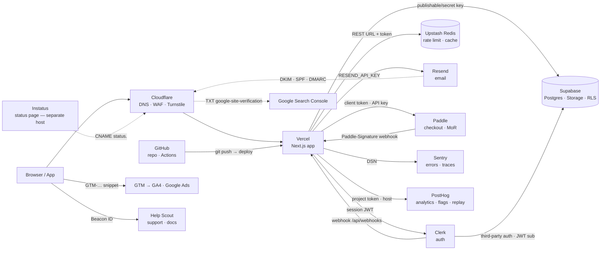

# v2p portable pack (generated 2026-09-23; do not edit)

<!-- source: SKILL.md -->

# v2p — vibe to product (router)

## 1. What this does
v2p is a thin orchestrator: each phase reads the previous handoff file and writes one of its own in `<project>/.v2p/`.
It never reimplements what superpowers or gstack already do; later phases call them.
Portable pack: if this arrives as one pasted document, the files named below follow it as sections. Run the handshake first and use only the standards sections for the chosen profile.

## 2. Entry
Optional argument: `handshake | scavenge | mapping | execute | review | deploy`.

**Before asking the first question of any phase, read that phase's file (table in §5) in full and follow it step by step.** This router only says which phase to run. Every question, template and gate lives in the phase file; never improvise them from the table.

No argument:
- `.v2p/BRIEF.md` exists → print its §1 Profile line and its "Next" line, then offer: resume, or re-run the handshake.
  - "Next" resolution: BRIEF exists and no `.v2p/SCAVENGE.md` → offer `scavenge`; SCAVENGE exists and no `.v2p/PLAN.md` → offer `mapping`.
- Otherwise ask "What are we building? One paragraph." and start the handshake.

## 3. Target directory
- The BRIEF goes to `$PWD/.v2p/BRIEF.md`.
- If `$PWD` has no code and no `.v2p/`, ask once whether this directory is the project.
- Never scaffold a project.
- Recommend committing `.v2p/`: it is the contract between phases.

## 4. Profiles
| Profile | Shape |
|---|---|
| `landing` | one-action page, no login |
| `saas-web` | logged-in, users outside your organisation |
| `internal-tool` | logged-in, users work for you |
| `native-app` | iOS/Android binary |

Disambiguators (ask only the one that separates the two candidates):
- internal-tool vs saas-web → "Do users work for you?"
- landing vs saas-web → "Does anyone log in?"
- native-app vs saas-web → "If I handed you a finished API tomorrow, how much work remains?"

No fit: pick the nearest profile and record the gap in BRIEF §10. Never invent a profile.
AI features, payments, webhooks and i18n are conditional blocks inside the standards, not profiles.

## 5. Phases
| Phase | File | Writes | Status |
|---|---|---|---|
| `handshake` | `phases/handshake.md` | `.v2p/BRIEF.md` | available |
| `scavenge` | `phases/scavenge.md` | `.v2p/SCAVENGE.md` | available |
| `mapping` | `phases/mapping.md` | `.v2p/PLAN.md` | available |
| `execute` | none | none | not available in this version |
| `review` | none | `.v2p/REVIEW.md` | not available in this version |
| `deploy` | none | none | not available in this version |

For a phase marked "not available in this version", reply exactly that and stop. Do not improvise the phase.

## 6. When to load references
- Standards: per the profile mapping below, at the end of the handshake (to fill BRIEF §9) and by later phases.

| Profile | Files loaded (in order) | Also |
|---|---|---|
| landing | `references/standards/core.md`, `references/standards/web.md`, `references/standards/landing.md` | `references/landing-10-sections.md`, `references/ux-laws.md` |
| saas-web | `references/standards/core.md`, `references/standards/web.md`, `references/standards/saas-web.md` | `references/ux-laws.md` at review |
| internal-tool | `references/standards/core.md`, `references/standards/web.md`, `references/standards/internal-tool.md` | `references/ux-laws.md` at review |
| native-app | `references/standards/core.md`, `references/standards/native-app.md` | none |

- `references/landing-10-sections.md`: only for `landing`.
- `references/ux-laws.md`: at any UI review.
- BRIEF layout: `references/brief-template.md`.
- SCAVENGE and PLAN layouts: `references/scavenge-template.md` (scavenge), `references/plan-template.md` (mapping).
- Startup stack: `references/stack/overview.md` at mapping step 1; `references/stack/wiring.md` and `references/stack/security.md` by execute/review (mapping reads them only to cite row ids).
- Source rule for every v2p file: no `---` horizontal rules (use `***`).


***

<!-- source: phases/handshake.md -->
# v2p phase: handshake

## Purpose
A short interview that turns "what are we building" into `.v2p/BRIEF.md`: profile, the one job, success criteria, scope, brand, constraints, stack and the standards that apply. Every later phase reads this file; nothing is built here.

## Discipline
Adapted (paraphrased) from github.com/Hainrixz/the-architect.
- At most 3 questions per turn.
- Skip anything the opening message already answered, and say so: "taking X from what you said".
- Relevance test: ask a question only if its answer changes BRIEF content.
- Opinionated defaults: when the user shrugs, state the default you are taking and record it as `defaulted` in the decisions log.
- Gaps are written as `[NEEDS CLARIFICATION: <question> — blocks <what>]`. Each one must end as answered, defaulted, or deferred to a non-goal before the BRIEF is written.
- After each turn, restate a running brief of 10 lines or fewer.
- Mirror the user's language in the questions and in the BRIEF.

## Question list
Turns hold at most 3 questions. (S) = skippable when the condition holds. (P) = wording varies by profile.

Turn 0 — context
- Q0 (S if `$PWD` obviously has code or is empty) — New from zero, or a change to existing code? Which directory? (`brownfield: yes` → a later scavenge phase.)
- Q1 (S if given at entry) — What are we building, in one paragraph? What breaks if it doesn't exist?
- Q2 — Who uses it, roughly how many, and how often?

Turn 1 — classification
- Q3 — "This looks like <profile> because <signal>. Correct?" If two candidates remain, ask the one disambiguator from the router's profile section.
- Q4 (P) — The one job.
  - landing: the single visitor action (demo, trial, buy, join list).
  - saas-web: the core weekly verb.
  - internal-tool: view numbers, edit records or approve? Any action expensive to undo?
  - native-app: the core loop; must it work offline?

Turn 2 — success and scope
- Q5 — (a) The one number that must move in 90 days. (b) Day-1 acceptance, 3–7 lines of `WHEN <trigger> THE SYSTEM SHALL <observable response>`. Reject "it works" or "looks right"; ask for the observable response.
- Q6 — What is explicitly NOT in v1?

Turn 3 — brand and locale
- Q7 — Brand guide?
  - `existing`: path, URL or file. Record palette, type, voice and logo in BRIEF §6.
    If it cannot be read (missing, wrong path, unsupported format), say so once and ask for the right location. If it isn't available now, don't block: record `Status: existing (source: pending)`, write `pending brand file` for palette/type/voice/logo, log `brand file | deferred | provide before UI work` in §10, and continue.
  - `new`: 3 adjectives, 1–2 reference sites, a must-avoid list (default: the anti-"made-by-AI" traits in `references/standards/landing.md`). Record `brand: to-create`; it is created in a later phase.
  - `none needed`: internal-tool default is the organisation's UI kit.
- Q8 (S; default one language) — One language or several? Translated, or per-market content?

Turn 4 — constraints and stack
- Q9 — Deadline; monthly infrastructure budget ceiling; data sensitivity (personal data, payments, health/financial, minors, public-sector or EU accessibility obligation); who operates it after launch (solo or team).
- Q10 — Stack must-have, won't-accept, existing accounts (hosting, domain, payments, Apple/Google developer). No preference → state the profile default and record `defaulted`.
- Q11 (S; skip for landing and internal-tool) — Money model: free / flat / per-seat / usage / in-app purchase.
- Q12 (S; default none) — Integrations: email, payments, calendar, Slack, external APIs, inbound webhooks. Any yes → the webhook/idempotency block is ON in BRIEF §9.

## Confirmation gate
Show, together:
1. the running brief,
2. the decisions log: one row per question Q0–Q12, each marked answered / defaulted / deferred / skipped, with the value (or, for skipped, the reason). "Answered" only when the user's own words cover it. A reply to a different question, or silence, makes it defaulted (state the default) or a new question. Record the user's latest value, not an earlier one or a blend.
3. any open `[NEEDS CLARIFICATION: …]` markers.

Write only on an explicit "yes", "ok" or "confirmed". A change request or a question re-enters the loop: apply it, show the gate again, and write nothing in the meantime. Open markers block writing; resolve each one first.

## Write step
1. Load the standards for the confirmed profile (router §6) and fill BRIEF §9, including which conditional blocks are ON.
2. Write `.v2p/BRIEF.md` from `references/brief-template.md`. §11 must be literally `none`.
3. Print the path, then: `Next: /v2p scavenge`.

If you cannot write files, print the BRIEF in one code block and ask the user to save it as `.v2p/BRIEF.md`.


***

<!-- source: references/brief-template.md -->
# BRIEF template

Copy the block below into `.v2p/BRIEF.md` and replace every `<…>`. §11 must be literally `none` before the file is written.

```
# BRIEF — <project name>
written: <YYYY-MM-DD> by v2p handshake · language: <xx>

## 1. Project
- Profile: <landing|saas-web|native-app|internal-tool> · secondary: <profile|none>
- Code: <greenfield | existing at <path>>
- Vision: <one paragraph>
- Breaks without it: <one line>

## 2. Audience and scale
- Who: <…> · How many / how often: <…>

## 3. The one job
- <primary action or core verb>; expensive-to-undo actions: <list|none>; offline: <yes|no|n/a>

## 4. Success criteria
- 90-day metric: <number + how measured>
- Day-1 acceptance:
  - WHEN <trigger> THE SYSTEM SHALL <observable response>

## 5. Non-goals (v1)
- <…>

## 6. Brand
- Status: <existing (source: <path/url>) | to-create | none>
- Palette / type / voice / logo: <… | pending brand phase>
- Adjectives: <…> · References: <…> · Must-avoid: <…>
- Locales: <one | list; translated | per-market>

## 7. Constraints
- Deadline: <…> · Budget/month: <…> · Data sensitivity: <flags|none> · Operator after launch: <solo|team>

## 8. Stack
- Must-have: <…> · Won't-accept: <…> · Existing accounts: <…>
- Money model: <…|none> · Integrations: <…|none>

## 9. Standards loaded
- references/standards/core.md + <web.md +> <profile>.md <+ landing-10-sections.md + ux-laws.md>
- Conditional blocks ON: <AI feature | payments | webhooks/idempotency | i18n | offline | load test | none>

## 10. Decisions log
| item | answered / defaulted / deferred | value |
|---|---|---|

## 11. Open markers
none  ← must be literally "none" for the file to be written

Next: /v2p scavenge
```

***

<!-- source: phases/scavenge.md -->
# v2p phase: scavenge

## Purpose
Turn the BRIEF into a short evidence file, `.v2p/SCAVENGE.md`: what already exists (references, docs, blueprints, standards) and, for brownfield, what the current code is.
Nothing is decided here; mapping decides.

## Preconditions
- `.v2p/BRIEF.md` must exist with §11 = `none`. Otherwise print `Run /v2p handshake first.` and stop.
- If `.v2p/SCAVENGE.md` exists: print its `written:` line and offer resume (keep) or re-run.

## Research questions (derived, not invented)
Exactly these, each skipped when its BRIEF source is empty or `none`:

| # | From BRIEF | Question | Preferred source |
|---|---|---|---|
| Q1 | §1 profile + §8 stack | Reference architecture or official starter for `<profile>` on `<stack>` (one, from the framework/provider vendor) | library/SDK docs, official docs |
| Q2 | §3 the one job | Proven implementation pattern for `<the one job>` (checkout flow, booking, upload, etc.): one official guide or one maintained repo | official docs > repo pushed <6 months, not archived |
| Q3 | §8 integrations + money model | One row per integration listed in §8. For each: the exact keys/webhooks needed. If the tool is TBD, compare 2–3 candidates on price vs §7 budget, the §6 locales and the §4 acceptance lines, and name one default. **Look in `references/stack/wiring.md` first; go to the web only for a provider not in the guide.** | stack guide, then official docs |
| Q4 | §7 data sensitivity | The primary legal text that applies to the flags set (personal data, payments, health, minors, EU accessibility) for the audience's jurisdiction. Cite the law/regulator page, not a blog. Never state obligations from memory. | government/regulator or standards body |
| Q5 | §2 audience | Up to 3 adjacent products and what their users complain about in the last 30 days (pain language reused in copy and the FAQ) | social-trends search, then web search |
| Q6 | §1 `Code: existing at <path>` (brownfield only) | Inventory: stack, entry points, env vars referenced, tests present, dependencies with created-date <6 months, TODO/FIXME count, files >200 lines | code search on the repo; no web |

## Source-quality rules
1. Rank: official docs > maintained repos (pushed within 6 months, not archived, >100 stars or vendor-owned) > posts/forums/social. A lower rank never overrides a higher one on a technical fact.
2. Every claim row carries `source URL · accessed YYYY-MM-DD`. No URL → the row is deleted, not kept as "known". The URL must itself show the claim: a claim with no fetched evidence is deleted, never pinned to a nearby source. A deferred question writes only `[OPEN]`, no findings.
3. Social/trend results (Q5) inform copy and FAQ only; never a technical decision.
4. Numbers (limits, prices) are copied verbatim with the page's own wording; if the page did not show it, write `(not on page)`.
5. Disagreement between two official sources → record both, mark `[CONFLICT]`, mapping decides.

## Budget and stop rule
- ≤3 sources per question; stop a question when two official sources agree.
- Hard cap: **25 fetches total** (every page or docs fetch counts) and ~30 minutes wall time. The count is written into SCAVENGE.md §6.
- Q6 is not budgeted by fetches; it is budgeted by files: read ≤40 files, never the whole tree (use search and symbol lookups).
- When the cap hits, unanswered questions are written as `[OPEN: <question> — answer needed by <mapping task>]`, never guessed.

## Tools and degradation
- Use whatever web-reading tool your runtime has; if none, ask the user to paste the pages.

## Execution
Portable: do steps 1–4 yourself in one pass. List the applicable questions, answer them within the budget, fill `references/scavenge-template.md`, write `.v2p/SCAVENGE.md` (or print it in one code block if you cannot write files), then print `Next: /v2p mapping`.


***

<!-- source: phases/mapping.md -->
# v2p phase: mapping

## Purpose
Turn BRIEF + SCAVENGE into `.v2p/PLAN.md`: an executable plan with providers, skills, pre-filled standards rows, and tasks that each carry a verifier.
Plan-writing itself follows a plan-writing method (superpowers in Claude Code); v2p adds the sections below.

## Preconditions
- `.v2p/BRIEF.md` required, with §11 = `none`. Otherwise print `Run /v2p handshake first.` and stop.
- `.v2p/SCAVENGE.md` optional: if absent, ask once "Run scavenge first (recommended) or plan without it?"; if planning without it, record `scavenge: skipped` in the PLAN.md header.
- Existing `.v2p/PLAN.md` → offer resume (keep) or re-run.

## Step 1 — Provider selection
Five rules, in order. Each records a `defaulted` or `answered` row in PLAN §2.
1. BRIEF §8 must-have / won't-accept / existing accounts win over any default.
2. Profile default set from `references/stack/overview.md` §"Happy path per profile".
3. Commercial use and budget. Ask "Is it commercial yet? (first sale, ads, paid client work)" and write the answer into PLAN §2. Not yet → Vercel Hobby, with the switch trigger written in the Vercel row: at the first commercial use, move to Vercel Pro or Cloudflare Pages. Yes → Vercel Pro or Cloudflare Pages now. If `Budget/month` (§7) is `0` and the profile default has a paid-only requirement (Vercel commercial use → Pro; Instatus custom domain → Pro; Clerk MFA → Pro), name it and ask.
4. Money model ≠ none → payments provider: default **Paddle** (MoR; Panama is not on its unsupported-country list). Stripe only if the user has a US/supported-country entity. Lemon Squeezy only for an existing account (in migration to Stripe Managed Payments). Ask with the three options and the tax/entity trade-off in each.
5. Data sensitivity flags → region-aware picks: EU audience → Sentry EU org, PostHog EU, Supabase EU region, Plausible (EU, cookieless) instead of GA4; Clerk has no EU hosting → say so and offer Supabase Auth.

Closed choices are asked; everything else is defaulted with one line saying so.

## Step 2 — Skills for this project
Portable: write `none` in PLAN §3.

## Step 3 — Write the plan
Portable: write the plan yourself from `references/plan-template.md`, using BRIEF as the spec. Do not run a separate brainstorm; the BRIEF is the spec.

## Step 4 — v2p sections (the template enforces them)
- §2 Providers: one row per provider with plan, monthly cost at launch (from the overview table), and the wiring rows it needs (row ids from `references/stack/wiring.md`). The Vercel row states the commercial answer from rule 3.
- §3 Skills: installed rows to use, and at which task.
- §4 Standards: **one row per checklist item** of the loaded files (landing 155, saas-web 152, internal-tool 147, native-app 108 — measured with `grep -c '^- \[ \]'` on 2026-09-23: core 96, web 43, landing 16, saas-web 13, internal-tool 8, native-app 12), status `pending` or `N/A <reason citing BRIEF §>`; conditional blocks OFF in BRIEF §9 → `N/A`. Evidence column empty (execute fills it).
- §5 Tasks: the plan method's task structure plus a **Verifier** line per task: `mechanical: <command> → <expected>` or `manual: <who checks what>`. Only `mechanical` tasks are eligible for an automated retry loop in execute (always with an iteration cap).
- §6 Review focus: the plan method's "five uncovered inputs" list, unchanged.

## Step 5 — Write and hand off
Write `.v2p/PLAN.md` (or print it in one code block if you cannot write files), print the path, the count of tasks (mechanical / manual), and `Next: /v2p execute (not available in this version)`.
Do **not** ask how to execute the plan; execute is not available yet.


***

<!-- source: references/scavenge-template.md -->
# SCAVENGE template

Copy the block below into `.v2p/SCAVENGE.md` and replace every `<…>`.
Rule: every bullet and row in §1–§5 must contain `http` and `accessed`; a row without both is deleted before writing.

````
# SCAVENGE — <project name>
written: <YYYY-MM-DD> by v2p scavenge · reads: .v2p/BRIEF.md (<written date>)

## 1. Reference architecture (Q1)
- <one starter/architecture> · why it fits BRIEF §1/§8: <one line> · <URL> · accessed <date>

## 2. The one job — proven pattern (Q2)
- <pattern> · source rank: official | repo (pushed <date>, stars) · <URL> · accessed <date>

## 3. Integrations and money (Q3)
| integration | covered by stack guide row | extra source (only if not in guide) |
|---|---|---|
| <name> | W<n> | — |

## 4. Obligations from data sensitivity (Q4)
| flag (BRIEF §7) | primary text | what it requires (one line) | URL · accessed |
|---|---|---|---|

## 5. Audience and adjacent products (Q5) · Existing code (Q6)
- Adjacent: <product> — <what users complain about, last 30 days> · <URL> · accessed <date>
- Code inventory (brownfield only): stack <…> · entry points <…> · env vars referenced <n> · tests <yes/no, runner> · deps created <6 months: <list|none> · TODO/FIXME <n> · files >200 lines <n>

## 6. Budget and tools
fetches: <n>/25 · time: <min> · tools: <names used, or none>
[CONFLICT] rows: <n> · [OPEN] rows: <n>

## 7. Open
- [OPEN: <question> — answer needed by <mapping task>]   (or: none)

Next: /v2p mapping
````

***

<!-- source: references/plan-template.md -->
# PLAN template

Copy the block below into `.v2p/PLAN.md` and replace every `<…>`. §2–§6 are v2p's additions around the plan method's own task structure.

````
# <project name> Implementation Plan

> **For agentic workers:** REQUIRED SUB-SKILL: Use superpowers:subagent-driven-development (recommended) or superpowers:executing-plans to implement this plan task-by-task. Steps use checkbox (`- [ ]`) syntax for tracking.

**Goal:** <one sentence = BRIEF §3 + §4 90-day metric>
**Architecture:** <2–3 sentences>
**Tech Stack:** <from §2 below>
**Spec:** .v2p/BRIEF.md · .v2p/SCAVENGE.md (<or: scavenge: skipped>)

## Global Constraints
<one line each, verbatim from BRIEF §5 non-goals, §7 constraints, standards hard rules: no `any`, no secrets in client code>

## Review Focus
<the five uncovered inputs — writing-plans rule; each gets a test in the owning task>

## 2. Providers
| provider | plan at launch | $/month | wiring rows | decision |
|---|---|---|---|---|
| <Vercel> | <Hobby while pre-revenue → Pro or Cloudflare Pages at the first commercial use / Pro> | <0 / 20 (unverified)> | W1 W2 W27 | answered / defaulted: <reason; commercial yet: yes/no> |
Total at launch: <sum> $/month (arithmetic shown)

## 3. Skills
| skill (installed) | used in task |
|---|---|
Optional, install first: <suggested rows or none>

## 4. Standards (pre-filled; execute fills evidence)
| item | file | status | evidence |
|---|---|---|---|
| <label> | core.md | pending | |
| <label> | landing.md | N/A — <reason citing BRIEF §> | |
Rows: <n> = <core> + <web> + <profile> (measured from BRIEF §9 files)

## 5. Tasks
### Task 1: <name>
**Files:** …  **Interfaces:** …
**Verifier:** mechanical: `<command>` → `<expected output/exit code>`   |   manual: <who checks what, where>
- [ ] Step 1 … (writing-plans step style)

## 6. Handoff
Tasks: <n> (mechanical <m>, manual <k>). `/ralph-loop` eligible: tasks <ids> (mechanical only, `--max-iterations` required).
Next: /v2p execute (not available in this version)
````

***

<!-- source: references/standards/core.md -->
# Standards: core (every profile)

Loaded for every profile, first. Profile files add to this list; they never remove from it.

## How to claim an item (evidence rule)
One row per claimed item, in a table at the end of every delivery:

| item | done / N/A / pending | evidence |
|---|---|---|
| Security headers | done | `curl -sI https://staging.x \| grep -cE 'strict-transport\|content-security'` → 2 |
| RLS | N/A | landing has no database (BRIEF §8) |

- Evidence is one of: a runnable command plus its observed output or exit code, an artefact path, or a URL.
- `N/A` needs a reason that cites a BRIEF section.
- A ticked box with no evidence is a defect, not a claim.
- The delivery footer is named **Standards evidence**.

## Warnings (not gates)
1. A file over 200 lines gets a review comment and a split proposal. Split when a reader can no longer hold the file in their head, not because of the count.
2. A request that violates a security or performance item: name the item and the consequence, proceed only on an explicit user override, and record the override in BRIEF §10.
3. Hard rules that stay: no `any` types; no secrets in client code.

## Interface (any UI)
- [ ] Button micro-interactions
- [ ] Hover states for buttons and links
- [ ] Loading skeletons/shimmer effects
- [ ] Progress bar for page loading/form submission
- [ ] Dark mode support with system preference detection
- [ ] **Custom Tooltips** for complex UI elements (Modern Polish)
- [ ] **Accessibility (a11y):** Ensure ARIA labels, keyboard navigation, and color contrast ratios (WCAG). Target WCAG 2.2 AA: contrast 4.5:1; keyboard-only pass; focus not obscured (2.4.11); target size at least 24×24 CSS px (2.5.8); non-drag alternative (2.5.7); no redundant entry (3.3.7); accessible authentication (3.3.8); axe-core clean. Evidence: axe-core report with 0 violations plus a keyboard-only walkthrough note. (verified: 2026-09)

## Security
### Credentials & Secrets
- [ ] Hide all API keys from version control
- [ ] Purge secrets from Git history
- [ ] Proper usage of Database Public Keys
- [ ] Zero secrets exposed in frontend code
- [ ] **Secrets Vault:** Use a secure manager (AWS Secrets Manager, HashiCorp Vault) for production.

### Data Protection
- [ ] Encryption of sensitive data at rest
- [ ] Secure password hashing (e.g., Argon2 or bcrypt)
- [ ] HTTP-Only and Secure cookie flags
- [ ] **Deep Sanitization:** Prevent XSS and NoSQL injection in all user-generated content.
- [ ] File system access restrictions

### Access & Authentication
- [ ] Strengthened authentication flow
- [ ] Rate limiting for login attempts/Brute force protection
- [ ] Bot protection (CAPTCHA/Turnstile)
- [ ] Restricted access to system logs
- [ ] Prevention of sensitive field manipulation
- [ ] **Endpoint Rate Limiting:** Strict limits on high-cost endpoints (Search, Auth) to prevent scraping.
- [ ] **OWASP ASVS Level 1 self-check:** for every profile with login. Evidence: `docs/asvs-l1.md` with one row per requirement. (verified: 2026-09)

### Network & Headers
- [ ] Implementation of Security Headers (CSP, HSTS, X-Frame-Options)
- [ ] Forced HTTPS redirection
- [ ] Valid SSL Certificate installation
- [ ] **CSP Audit:** Verify the Content Security Policy doesn't block essential scripts.

### Security Additions
- [ ] **CORS Policy:** Strictly define allowed origins for API requests.
- [ ] **Dependency Scanning:** Implement `npm audit` or Snyk to find vulnerable packages.
- [ ] **Session Management:** Implement JWT expiration and secure refresh token rotation.
- [ ] **ReDoS Audit:** Review AI-generated Regular Expressions for potential Denial of Service.
- [ ] **Threat model:** assets, entry points and the top 5 abuse cases, written to `docs/threat-model.md` before the review phase. Evidence: the file path.
- [ ] **Supply chain:** lockfile committed; `npm audit` / `pnpm audit` / `osv-scanner` clean; versions pinned. Evidence: the audit command and its exit code.
- [ ] **Hallucinated-package check:** every AI-added dependency exists on the registry, was created more than 6 months ago and has a maintained repo. Evidence: `npm view <pkg> time.created` per package.

## Backend & API
### Data & Logic
- [ ] Use of parameterized queries to prevent SQL Injection
- [ ] Server-side input validation
- [ ] API response limiting/pagination

### Backend Additions
- [ ] **API Documentation:** Implement Swagger/OpenAPI for endpoint documentation.
- [ ] **Caching Strategy:** Implement Redis or server-side caching for frequent queries.
- [ ] **Error Logging:** Integrate Sentry or LogRocket for real-time error tracking.
- [ ] **Log Structuring:** Transition from `console.log` to structured logging (Winston, Pino) for production searchability.
- [ ] **Database Migrations:** Implement a version-controlled migration system.
- [ ] **Global Error Boundaries:** Unified handler to prevent app crashes on unhandled exceptions.
- [ ] **Observability:** OpenTelemetry traces, metrics and structured logs; the trace id is echoed in error responses; error pages reveal nothing internal. Evidence: one error response showing the trace id and the matching trace. (verified: 2026-09)
- [ ] **Feature flags:** a kill switch for every risky feature; per-tenant if multi-tenant. Evidence: flag list with the owner of each switch.

## Infrastructure & Performance
### Optimization
- [ ] General load speed optimization
- [ ] Image compression and modern formats (WebP/AVIF)
- [ ] Page load time auditing
- [ ] Responsive/Adaptive versioning
- [ ] **Core Web Vitals Audit:** Verify LCP, INP, and CLS are in the "Green" zone. Evidence: field or lab report with all three values. (verified: 2026-09)

### Infrastructure Additions
- [ ] **CDN Integration:** Use a Content Delivery Network for static assets.
- [ ] **CI/CD Pipeline:** Automate tests and deployment via GitHub Actions/GitLab CI.
- [ ] **Automated Backups** and **Backup Verification:** Schedule daily database backups; trigger one manual backup and verify restoration. State RPO and RTO, and rehearse one restore. Evidence: restore log with timestamp and row count.
- [ ] **Rollback Strategy:** Implement a one-click rollback to the previous stable version.
- [ ] **Graceful Degradation:** Ensure non-critical feature failures (e.g. a widget) don't crash the entire page.
- [ ] **SLOs:** availability and p95 latency per critical endpoint, with an alert on error-budget burn. Evidence: SLO definition file and alert rule.
- [ ] **Incident readiness:** status page on a separate host; post-mortem template in the repo. Evidence: status page URL and template path.

## Privacy & Legal
### Compliance
- [ ] Privacy Policy page
- [ ] Terms and Conditions page
- [ ] Refund/Return Policy page
- [ ] Contact information protection from scrapers

### Privacy Additions
- [ ] **GDPR/CCPA Compliance:** Implement a way for users to request data deletion.
- [ ] **Consent Management:** Link cookie banner to actual script blocking.
- [ ] **Account deletion and retention policy:** users can delete their account; the retention period per data type is written down. Evidence: deletion flow path and policy URL.

## Quality Assurance
- [ ] **Unit Testing:** Core business logic covered by tests.
- [ ] **Integration Testing:** Critical API flows tested.
- [ ] **E2E Testing:** Core user journeys automated (Playwright/Cypress).
- [ ] **a11y Testing:** Automated accessibility scan (axe-core).
- [ ] **Stress Testing:** Input boundaries (max chars, emoji injection, invalid formats) to prevent crashes.

## Vibe-to-Product Refactor (AI-code stabilization)
### Code Hygiene & Technical Debt
- [ ] **Redundancy Audit:** Remove duplicate logic/functions generated across different files.
- [ ] **Dead Code Purge:** Remove all commented-out AI suggestions and unused variables.
- [ ] **Component Decomposition:** Break down "Mega-Components" into small, reusable atomic pieces.
- [ ] **Type Strengthening:** Replace all `any` types with strict interfaces (TypeScript).
- [ ] **Dependency Audit:** Verify AI-suggested packages are necessary, stable, and up-to-date.

### Maintainability & Documentation
- [ ] **"The Why" Documentation:** Document the reasoning behind complex logic, not just the "what."
- [ ] **Environment Mapping:** Create a `.env.example` file for effortless setup.
- [ ] **Architecture Map:** Document the data flow (e.g., Frontend $\rightarrow$ API $\rightarrow$ DB).
- [ ] **API Contract Verification:** Verify AI-generated API calls against current official documentation.

## Pre-flight (before "Live")
### Environment & Config
- [ ] **Prod Env Vars:** Switch all keys from `development/staging` to `production`.
- [ ] **API Rate Limits:** Set reasonable limits to prevent DDoS or cost spikes.
- [ ] **Logs:** Ensure logging is set to `error` or `warn` level.

### QA & Smoke Testing
- [ ] **Critical Path Test:** Manually perform every core user action.
- [ ] **Lighthouse Audit:** Run a final Google Lighthouse report.

### Monitoring & Maintenance
- [ ] **Uptime Monitoring:** Setup BetterStack/UptimeRobot for alerts.
- [ ] **Analytics Check:** Confirm that the first "Live" visit is recorded.

## Conditional blocks (switched on by BRIEF §9)
### If the product has an AI feature
OWASP Top 10 for LLM Applications. (verified: 2026-09)
- [ ] **Prompt-injection defence:** untrusted input never reaches the system prompt unmarked; tools the model can call are allow-listed. Evidence: injection test cases and their results.
- [ ] **Per-user AI usage limits:** a cap per user per period. Evidence: the limit config and one rejected over-limit request.
- [ ] **Output validation:** model output is validated before it reaches users. Evidence: the validator and a test that rejects bad output.

### If the product takes payments
- [ ] **Server-side prices:** the client never sends the amount charged. Evidence: the checkout handler reading prices from the server.
- [ ] **Payment test:** one real transaction in production, then refunded. Evidence: provider transaction id.
- [ ] **Refund policy:** linked from checkout. Evidence: URL.

### If the product receives inbound webhooks
- [ ] **Webhook signature verification:** on every inbound webhook. Evidence: a test that rejects an unsigned request.
- [ ] **Idempotency:** store the event id before processing; 24 h replay window; duplicates return success without reprocessing. Evidence: a test that sends one event twice.

### If the product is multilingual (i18n)
- [ ] **Locales:** every user-facing string comes from a locale file; dates, numbers and currency are formatted per locale. Evidence: a string-extraction lint with 0 hard-coded strings.

### If audience > 100 concurrent users (load test)
- [ ] **Load test:** k6 against staging with the p95 target from BRIEF §4. Evidence: k6 summary with p95 below target. (verified: 2026-09)

***

<!-- source: references/standards/web.md -->
# Standards: web (landing, saas-web, internal-tool)

Loaded after `core.md` for every browser-based profile. Not loaded for `native-app`.

## Layout & Responsiveness
- [ ] Full responsiveness across all devices and screen sizes
- [ ] Mobile-specific navigation
- [ ] Hamburger menu implementation
- [ ] Fix mobile overflow issues
- [ ] Cross-browser compatibility testing

## Components & Content
- [ ] Custom 404 page (with suggested paths back to home/search)
- [ ] Clickable Logo, Phone, and Email
- [ ] Removal of all placeholder texts
- [ ] Removal of unused navigation links
- [ ] **Device-specific Favicons** (Apple Touch Icon, Android Chrome, etc.)
- [ ] **Micro-copy Audit:** Action-oriented CTA text (e.g., "Get Started" $\rightarrow$ "Start My Free Trial")
- [ ] **Empty State Design:** Custom UI for "No data found" or "Your cart is empty" states (Avoid blank screens)
- [ ] **Skip-to-content link:** first focusable element on every page. Evidence: first `Tab` press focuses it.
- [ ] **Copyright year current:** footer year matches the current year. Evidence: `grep` of the rendered footer.

## Forms & Validation
- [ ] Client-side field validation for all inputs
- [ ] **Input field `autocomplete` attributes** for improved UX
- [ ] Clear success, error, and confirmation messages
- [ ] Explicit error states for form fields
- [ ] End-to-end form testing
- [ ] **Loading State Granularity:** Contextual loading messages (e.g., "Verifying Email...")
- [ ] **Request Debouncing/Throttling:** Prevent multiple identical submissions on rapid clicks

## Frontend Additions
- [ ] **PWA Basics:** Implement `manifest.json` and a basic Service Worker for "Add to Home Screen".
- [ ] **State Management:** Implement global loading and error handling patterns.
- [ ] **Image Lazy Loading:** Implement native `loading="lazy"` or Intersection Observer for performance.
- [ ] **Bundle Size Analysis:** Run a bundle analyzer to remove heavy dependencies.

## SEO: Metadata & Indexing
- [ ] Custom Favicon configuration
- [ ] Correct Page Titles and Meta-descriptions per page
- [ ] Open Graph (OG) tags and custom images
- [ ] **OG Image Verification:** Use OpenGraph.xyz to verify social previews.
- [ ] Image Alt text implementation
- [ ] **Sitemap Generation:** Create and upload `sitemap.xml`.
- [ ] **Robots.txt:** Configure correct crawler access and point to the sitemap.

## SEO Additions
- [ ] **Canonical Tags:** Prevent duplicate content issues.
- [ ] **Structured Data:** Implement JSON-LD for rich snippets.

## Analysis & External Tools
- [ ] **Google Search Console:** Setup and verify ownership.
- [ ] **Bing Webmaster Tools:** Setup and submit sitemap.
- [ ] **Google Analytics:** Setup and verify tracking codes.
- [ ] **Broken link checking:** Final audit of all internal and external links.

## Privacy
- [ ] Cookie consent banner

## Pre-flight
### DNS & Domain
- [ ] **DNS Propagation:** Verify A records, CNAME, and MX records.
- [ ] **SSL Verification:** Ensure the SSL certificate is active and auto-renews.
- [ ] **Custom Domain:** Ensure redirects from www to non-www (or vice-versa).

### Environment & Config
- [ ] **Mixed Content Check:** Ensure no `http://` resources are called on an `https://` site.

***

<!-- source: references/standards/landing.md -->
# Standards: landing

Loaded after `core.md` and `web.md`. Section-by-section checks live in `../landing-10-sections.md`.

## Conversion & Lead Generation (CRO)
- [ ] **Lead Magnet Implementation:** Clear "Value Exchange" (e.g., Free Guide $\rightarrow$ Email).
- [ ] **CRO Tooling:** Setup Heatmaps (Hotjar/Microsoft Clarity) to analyze user behavior.
- [ ] **Thank You Page Optimization:** Lead the user to the "Next Step" after conversion.
- [ ] **Referral Loop:** "Refer a friend" mechanics integrated into the flow.

## Components & Content
- [ ] Testimonials section (with dynamic social proof)
- [ ] Contact form implementation
- [ ] Social media integration buttons
- [ ] Share button integration

## Not "made by AI"
- [ ] **Anti-"made-by-AI" pass:** no gradient headline text; no default three-icon-card row; no fake testimonials; no "it's not X, it's Y" copy. Evidence: reviewer note per trait, or a `grep` of the copy for the pattern.

## Polish — optional, do last
Each item applies only when its condition holds; otherwise mark it N/A with the reason.
- [ ] Smooth scroll animations
- [ ] Hero section animations
- [ ] Section transitions
- [ ] **Custom Cursor implementation** for branded experience — only if the brand guide asks for it.
- [ ] **Urgency/Scarcity Triggers:** Strategic use of social proof or limited offers — only true, dated claims; fake ones are removed.
- [ ] WhatsApp/Chat floating button — local business or sales-led only.
- [ ] Back-to-top button — only if the page is longer than 3 screens.

***

<!-- source: references/standards/saas-web.md -->
# Standards: saas-web

Loaded after `core.md` and `web.md`. Backend Additions and Security (including Session Management) live in `core.md`; they apply here in full.

## Data & Logic
- [ ] Database Row Level Security (RLS) configuration
- [ ] API response limiting/pagination
- [ ] **Database Indexing Audit:** Verify that all high-frequency query columns are indexed for performance at scale
- [ ] **Query scoping:** every query is scoped to the authenticated user or tenant. Evidence: a test where user A requests user B's record and gets 403/404.
- [ ] **Session Management:** Implement JWT expiration and secure refresh token rotation.

## Accounts and activation
- [ ] **Account lifecycle:** sign-up, login, email verification, password recovery and account deletion all work end to end. Evidence: one E2E test per flow.
- [ ] **Onboarding + activation metric:** the activation event is defined and tracked. Evidence: the event name and one recorded occurrence.
- [ ] **UI states:** every data view has empty, loading, error and offline states. Evidence: screenshot or story per state.

## Pre-flight
- [ ] **Payment Test:** Perform one real transaction in production (and refund it).
- [ ] **Email Delivery:** Confirm that welcome emails are arriving in the inbox.

## Conditional
- [ ] Language selector/i18n implementation — only if BRIEF §6 lists more than one locale.
- [ ] **Money model:** prices are computed server-side — only if BRIEF §8 has a paid money model. Evidence: the checkout handler reading prices from the server.

## Polish — optional, do last
- [ ] **Dark/Light mode toggle animation** (Modern Polish)

***

<!-- source: references/standards/internal-tool.md -->
# Standards: internal-tool

Loaded after `core.md` and `web.md`. Users work for you; the bar is correctness and traceability, not growth.

## Data & Access
- [ ] Database Row Level Security (RLS) configuration
- [ ] **Database Indexing Audit:** Verify that all high-frequency query columns are indexed for performance at scale
- [ ] Restricted access to system logs
- [ ] Prevention of sensitive field manipulation
- [ ] **SSO via the existing identity provider:** never a custom login for colleagues. Evidence: IdP app registration and one SSO login.
- [ ] **Expensive-to-undo actions:** a confirmation step plus an immutable audit log entry (who, what, when, before/after). Evidence: audit log row for one test action.
- [ ] **Soft deletes:** records are marked deleted, not removed. Evidence: schema column and a restore test.
- [ ] **CSV export / scheduled report:** the numbers people ask for leave the tool without a developer. Evidence: one exported file.

## Pre-answered N/A
| item | status | reason |
|---|---|---|
| SEO (Metadata & Indexing, SEO Additions, Analysis & External Tools) | N/A | internal audience |
| Conversion & Lead Generation (CRO) | N/A | internal audience |
| Cookie consent banner | N/A | internal audience |

***

<!-- source: references/standards/native-app.md -->
# Standards: native-app

Loaded after `core.md`. `web.md` does not apply. Dark mode with system preference detection lives in `core.md`.

## Build and release
- [ ] **Expo SDK + EAS Build / Submit / Update:** builds and store submissions run from EAS; OTA updates have a written rollback plan. Evidence: EAS build URL and the rollback steps. (verified: 2026-09)
- [ ] **App-size budget:** a size ceiling per platform, checked on every release build. Evidence: build size vs budget.
- [ ] **Device matrix:** tested on the oldest and newest supported OS versions and one small screen. Evidence: matrix table with results.
- [ ] **Crash reporting:** crashes reach a dashboard with symbolicated stack traces. Evidence: one test crash visible. (verified: 2026-09)

## Store review readiness
- [ ] **iOS privacy manifest + Android data-safety form:** both filled and consistent with what the app collects. Evidence: `PrivacyInfo.xcprivacy` path and the Play Console form. (verified: 2026-09)
- [ ] **In-app account deletion:** reachable from settings when the app has accounts. Evidence: screen path.
- [ ] **Demo account for reviewers:** credentials in the review notes. Evidence: the note text.

## Platform features
- [ ] **Push via expo-notifications:** permission asked in context, not at launch; token rotation handled server-side. Evidence: the permission trigger and the token refresh handler. (verified: 2026-09)
- [ ] **Deep links:** universal links / app links verified (AASA and `assetlinks.json` served); every callback parameter is validated. Evidence: `curl` of both files and a test with a malformed parameter.
- [ ] **Offline:** read-only cache or a write queue with a stated conflict policy. Evidence: airplane-mode test result.
- [ ] **Secure storage:** tokens in Keychain/Keystore; no secrets in the bundle; TLS only. Evidence: storage call site and a `strings` scan of the bundle.

## Interaction
- [ ] **Interactive Feedback:** Subtle visual feedback on mobile interactions (Aesthetic Tech)

***

<!-- source: references/landing-10-sections.md -->
# Landing page: 10 sections

Loaded for the `landing` profile only. Each section has a purpose and a **Check**: a pass condition and how it is measured.

## Global rules
- Sections may be omitted; record each omission and its reason in BRIEF §10.
- Exactly one primary action page-wide, and it is the BRIEF §3 action.
- One `h2` per section.

## 1. Hero
Purpose: say what the visitor gets and give them the one action.
**Check:** the H1 states the outcome for the BRIEF §2 audience in 12 words or fewer; a single primary CTA equal to the BRIEF §3 action is visible without scrolling at 375×667 and 1440×900 (Playwright: `boundingBox().y + height < viewport.height`); no gradient headline text.

## 2. Social proof
Purpose: show that real people or companies already trust this.
**Check:** at least 3 real, attributable logos or numbers, each traceable to a source file that records its source URL; zero placeholder names (`grep -riE 'lorem|acme|john doe'` → 0).

## 3. Problem
Purpose: name the audience's pain in their own words (BRIEF §2).
**Check:** 3 bullets or fewer; each phrase can be traced to something the audience said or wrote.

## 4. Solution
Purpose: connect the pain to the product.
**Check:** one sentence of the form "we do X so you get Y"; links forward to Features.

## 5. Features
Purpose: show how the solution delivers.
**Check:** 3–6 features, each written as benefit + how; not the default three-icon-card row unless the brand guide asks for it.

## 6. How it works
Purpose: remove the "what happens next" doubt.
**Check:** 3 steps or fewer, each starting with a verb.

## 7. Testimonials
Purpose: let customers make the claim.
**Check:** each testimonial has name + role + company, or a photo; consent is recorded in the repo. None exist → omit the section; never fake one.

## 8. Pricing
Purpose: let the visitor decide without a sales call.
**Check:** plans side by side; price visible without a click; one CTA per plan; refund/return policy linked. Lead-generation pages may omit the section with a reason.

## 9. FAQ
Purpose: answer the objections that stop the action.
**Check:** at least 5 questions taken from real objections; built with `<details>` or an ARIA accordion that works by keyboard alone; shows a "last updated" date.

## 10. Final CTA
Purpose: give the action one last time.
**Check:** repeats the hero CTA text verbatim; a sticky CTA on mobile; submitting lands on a thank-you page that states the next step.

***

<!-- source: references/ux-laws.md -->
# UX laws as checks

Source: general UX literature (Laws of UX); not derived from the project's extraction files.

When to run: `landing` always; any UI at the review phase, against staging. Each law is a check plus how to measure it.

## Fitts
- Primary CTA hit area at least 44×44 CSS px.
- Mobile sticky CTA sits in the bottom third of the viewport.
- A destructive control is at least 8 px from the primary one and styled unlike it.
- Measure: Playwright `boundingBox()`; axe rule `target-size`.

## Hick
- At most 1 primary CTA per viewport.
- At most 7 top-level navigation items.
- At most 4 pricing plans.
- One question per step on mobile forms.
- Measure: element counts.

## Jakob
- Logo top-left, linking home.
- Login/account top-right.
- Search at the top.
- Conventional form patterns.
- No custom cursor unless the brand demands it.
- Measure: DOM position assertions.

## Miller
- Lists chunked to 7 or fewer (features 3–6, steps 5 or fewer).
- Card and phone inputs grouped.
- Measure: child counts.

## Parkinson
- Every form field maps to a BRIEF requirement or is removed.
- Multi-step forms show progress.
- `autocomplete` on every eligible input.
- Measure: field list vs requirements; eligible `input:not([autocomplete])` → 0.

## Proximity
- Label-to-input gap smaller than field-to-field gap (8 px or less vs 16 px or more).
- A plan and its CTA share one container.
- Measure: computed margins.

## Von Restorff
- Exactly one primary-styled element per viewport.
- Alerts and destructive actions use a distinct style.
- Measure: primary-style count per viewport == 1.

***

<!-- source: references/stack/overview.md -->
# Startup stack — overview

Startup stack for a solo founder. Prices and limits change; each line carries its verification date and source. Re-verify any `(unverified)` line before relying on it. Panama-specific notes are marked `[PA]`.
Read at mapping step 1. Wiring details: `references/stack/wiring.md`. Security and privacy: `references/stack/security.md`.

## 0. Not yet verified (re-check before relying)
Vercel Pro price; Vercel DNS record values; Vercel WAF plan limits; Supabase↔Vercel integration variable names; Supabase regions/DPA pages; Clerk dashboard 2FA; Cloudflare account 2FA; Resend API-key scopes; Paddle payout schedule/methods, Paddle DPA wording, Paddle dashboard 2FA; Stripe key prefixes on the webhooks page; Stripe Atlas price/filings (third-party); Lemon Squeezy API-key page; Instatus Pro price (third-party); Help Scout secure-key location and agent 2FA/SSO; GTM container-ID format/snippet placement; Google Ads `AW-` prefix and consent-mode page; Plausible exact new snippet text; Postmark DNS records; Serpstat pricing (page 404).

## 1. Happy path (setup order)
1. GitHub: create the private repo; enable 2FA; add `.env.example` (core.md item).
2. Cloudflare: register/transfer the domain, DNS here; Turnstile widget for every public form.
3. Vercel: import repo → project; Vercel Hobby while pre-revenue → Pro or Cloudflare Pages at the first commercial use (first sale, ads, paid client work); set Sensitive env-var policy; connect domain (DNS-only in Cloudflare for Vercel records).
4. Supabase: project in the audience's region; copy `sb_publishable_`/`sb_secret_` keys; RLS on every table before first insert.
5. Clerk (if login): app → API keys → Supabase third-party-auth integration → webhook endpoint.
6. Upstash Redis: rate limiting + cache; read-only token where reads only.
7. Resend: domain on a subdomain (`send.` / `updates.`), DKIM/SPF/DMARC records in Cloudflare.
8. Sentry: org in the right region (immutable), DSN + auth token; scrubbing on.
9. PostHog: project in the right region; reverse proxy; cookieless or consent; replay masking.
10. Payments (if money model ≠ none): Paddle sandbox → live; webhook destination; server-side prices.
11. Instatus: public status page on Instatus' host (separate host = core.md "Incident readiness"); custom domain later (Pro).
12. Help Scout: Beacon on the app; Docs site for FAQ.
13. Google: GSC domain property (DNS TXT), GA4 property + GTM container (or Plausible), Google Ads only when there is a conversion to track.

### Happy path per profile
| Profile | Use from the base | Skip | Add |
|---|---|---|---|
| landing | 1,2,3,7 (form email),8,9 or Plausible,13; 11 optional | 4,5,6,10,12 | Resend only for the form/thank-you email |
| saas-web | all | — | 10 only when money model ≠ free |
| internal-tool | 1,2,3,4,5(SSO via the org IdP — Clerk Enterprise SSO is paid),6,8 | 7 marketing, 9 (or self-host), 11,12,13 | Sentry + PostHog error tracking only |
| native-app | 1,4,5,6,7,8,9,10 (IAP via stores, Paddle for web checkout only), 11 | 2,3 (no web host), 13 GA4/GSC | EAS Build/Submit (native-app.md) |

## 2. Provider table
Strengths and weaknesses are an assessment; the numbers are quoted.

| Provider | Role | Free tier / entry price | Strengths | Weaknesses | Pick the alternative when |
|---|---|---|---|---|---|
| GitHub | source, CI | Free: unlimited private repos, 2,000 Actions min/mo, 500 MB packages; Team $4/user/mo. Dependabot & secret scanning free on **public** repos only; private needs GitHub Secret Protection (Team/Enterprise) (verified: 2026-09) https://github.com/pricing · https://docs.github.com/en/code-security/secret-scanning/introduction/about-secret-scanning | default for every skill/tool here | secret-scanning gap on private repos → run `gitleaks` in CI (core.md supply chain) | never |
| Cloudflare | DNS, WAF, Turnstile, Workers | Free plan: 5 custom WAF rules, 1 rate-limiting rule (Pro: 20 / 2); Workers 100k req/day, 10 ms CPU, Paid $5/mo 10M req; Turnstile free, 20 widgets × 10 hostnames (verified: 2026-09) https://developers.cloudflare.com/waf/custom-rules/ · https://developers.cloudflare.com/waf/rate-limiting-rules/ · https://developers.cloudflare.com/workers/platform/pricing/ · https://developers.cloudflare.com/turnstile/plans/ | free DNS+DDoS+bot check; Turnstile replaces CAPTCHA | one rate-limit rule on Free; proxying Vercel/Resend records breaks them | you host on Cloudflare Pages/Workers instead of Vercel (then drop Vercel) |
| Vercel | hosting (Next.js) | Hobby: **non-commercial only**; 100 GB fast data transfer, 1M function invocations, 4 h active CPU, 360 GB-hrs, 5K image transformations/mo; runtime logs 1 h; 100 deploys/day; 1 concurrent build (verified: 2026-09) https://vercel.com/docs/limits/fair-use-guidelines · https://vercel.com/docs/limits — Pro $20/user/mo (unverified) | zero-config previews, Sensitive env vars, free DDoS | switch trigger: at the first commercial use (first sale, ads, paid client work) Hobby must move to Pro or to Cloudflare Pages; Hobby cannot connect repos owned by a Git org | Cloudflare Pages at the first commercial use when the budget is 0 (free for commercial use, per user decision 2026-09-23) |
| Supabase | Postgres, auth, storage | Free: 500 MB DB, 50,000 MAU, 1 GB storage, 5 GB egress, 500k edge invocations, **paused after 1 week inactivity**, 2 active projects; Pro from $25/mo: 100k MAU, 8 GB disk, 250 GB egress, 100 GB storage, 7-day backups (verified: 2026-09) https://supabase.com/pricing | RLS, region choice, one bill for DB+auth+storage | free projects pause; free = no daily backups → Pro before launch for saas | Neon when you only need Postgres with branching |
| Clerk | auth UI + sessions | Hobby: 50,000 monthly retained users (MRU) per app; Pro $25/mo, $0.02/MRU over; **MFA Pro-only**, allowlist Pro-only; Enterprise SSO 1 connection on Pro, $75/mo each extra (verified: 2026-09) https://clerk.com/pricing | fastest login UI; Supabase third-party auth; webhooks | **US-only hosting, no region selection**; MFA costs $25/mo | Supabase Auth when EU residency or MFA-for-free matters, or for internal-tool SSO via the org IdP |
| Upstash Redis | rate limit, cache, queues | Free: 500K commands/mo, 256 MB, 10 GB bandwidth, 1 DB; PAYG $0.2/100K commands; Fixed 250 MB $10/mo (verified: 2026-09) https://upstash.com/pricing/redis | REST from edge; read-only tokens; IP allowlist | 1 free DB; per-command billing surprises with chatty libs | Redis Cloud for a persistent 30 MB free DB with TCP (Essentials from $5/mo) |
| Resend | transactional email | Free: 3,000/mo, 100/day, 3 domains, 30-day retention; Pro $20/mo 50k (verified: 2026-09) https://resend.com/pricing | React email, DMARC guide, subdomain isolation | 100/day cap; SES-backed (SPF includes amazonses.com) | Postmark when deliverability history matters (100/mo free, $15/mo 10k) |
| Sentry | errors, tracing, replay | Developer: 5k errors, 50 replays, 5M spans, 1 user, 30-day; Team $26/mo annual (verified: 2026-09) https://sentry.io/pricing/ | region choice at org creation (US Iowa / EU Frankfurt); server-side PII scrubbing default | 1 user on free; region immutable | PostHog error tracking (100k exceptions free) for a landing page with no backend |
| PostHog | analytics, flags, replay, surveys, errors | Free monthly: 1M events, 5K recordings, 1M flag requests, 1500 survey responses, 100K exceptions; no card (verified: 2026-09) https://posthog.com/pricing | one tool for 5 jobs; EU cloud; `cookieless_mode`; managed reverse proxy free | replay needs masking discipline | Plausible when you want cookieless-by-design pageviews only (no free plan; $9/mo 10k pageviews, EU) |
| Paddle | payments, MoR | 5% + 50¢ per transaction, no monthly fee; MoR: tax registration/filing/remittance (verified: 2026-09) https://www.paddle.com/pricing · [PA] Panama is not on the unsupported-country list https://www.paddle.com/help/start/intro-to-paddle/which-countries-are-supported-by-paddle (verified: 2026-09) | zero sales-tax liability; scoped API keys; sellers vetted at signup | 5% + 50¢ > Stripe's 2.9%; approval before go-live; payout schedule/methods (unverified) | Stripe when you have a supported-country entity and volume makes 2% matter |
| Lemon Squeezy | payments, MoR | 5% + 50¢, $0/mo, MoR; **2026: migrating merchants to Stripe Managed Payments (35+ countries)**, no EOL date; still operates standalone (verified: 2026-09) https://www.lemonsqueezy.com/pricing · https://www.lemonsqueezy.com/blog/2026-update · [PA] Panama listed for bank payouts; PayPal payouts cover 200+ countries https://docs.lemonsqueezy.com/help/getting-started/supported-countries (verified: 2026-09) | simplest checkout; [PA] bank payouts | product in transition; new features go to Stripe Managed Payments | Paddle for a new integration in 2026 |
| Stripe | payments (PSP, not MoR) | US: 2.9% + 30¢ domestic, +1.5% international cards; Stripe Tax 0.5%; Billing 0.7% (verified: 2026-09, US page) https://stripe.com/pricing · [PA] **Panama not listed** on https://stripe.com/global (verified: 2026-09; the only Latin American countries are Brazil and Mexico) | lowest fees, deepest API, 2FA/passkeys | you are the merchant: tax registration is yours; [PA] needs a US entity — Stripe Atlas ~$500 one-time + ~$100/yr agent + annual IRS filings (unverified, third-party) | Paddle unless you already have the entity |
| Neon | Postgres alt | Free: 0.5 GB/project, 100 CU-hours/project, 100 projects, 10 branches; Launch PAYG $0.106/CU-hour + $0.35/GB-month, no minimum (verified: 2026-09) https://neon.com/pricing | branch per PR via Vercel integration | no auth/storage bundle | Supabase when you want auth+storage+RLS in one place |
| Instatus | status page | Free: 15 monitors, 2-min checks, 5 team members, 200 subscribers, public page, **no custom domain**; Pro adds custom domain, 50 monitors, 5,000 subscribers (verified: 2026-09) https://instatus.com/pricing — Pro $20/mo (unverified, third-party) | separate host by design (core.md incident readiness) | custom domain paid | none needed; the free page on Instatus' host satisfies the standard |
| Help Scout | support inbox + docs | Free: up to 5 users, 100 contacts/mo, 1 inbox, 1 Docs site; Standard $25/user/mo (verified: 2026-09) https://www.helpscout.com/pricing/ | free tier fits a solo founder; Docs site = FAQ host | 100 contacts/mo cap; Beacon secure-mode key location (unverified) | Missive when you want shared email/SMS/social in one inbox (no free plan; Starter $14/user/mo yearly, ≤5 users) |
| Google Search Console | indexing | free (verified: 2026-09 — verification methods page) https://support.google.com/webmasters/answer/9008080 | required for SEO items in web.md | — | — |
| GA4 + GTM (Google Marketing Platform) | analytics, tags | free; GA4 retention 2 months default, 14 max (verified: 2026-09) https://support.google.com/analytics/answer/9019185 · https://support.google.com/analytics/answer/12270356 | ads attribution; GTM one snippet for all tags | cookies + consent banner needed (web.md); data leaves the region | Plausible or PostHog cookieless when no ads |
| Google Ads | paid acquisition | pay-per-click; conversion action gives Conversion ID + Conversion Label (verified: 2026-09) https://support.google.com/tagmanager/answer/6105160 | only channel with search intent | needs GA4/GTM wiring first | skip until the 90-day metric needs paid traffic |
| SEO suites | research | Ahrefs: free tier ("Ahrefs Free"), Starter $29/mo; Semrush: 7-day trial, SEO plan $139/mo; SE Ranking: 14-day trial, Core $129/mo (verified: 2026-09) https://ahrefs.com/pricing · https://www.semrush.com/prices/ · https://seranking.com/pricing.html · Serpstat: pricing page 404 twice, third-party says ~$50/mo, 7-day trial (unverified) | Ahrefs free tier covers a verified site | others start ≥$100/mo | Ahrefs Free + GSC first; buy a suite only for keyword research at scale |
| Comments | blog comments | **Cusdis repo archived 2026-07-17** (verified: 2026-09) https://github.com/djyde/cusdis → do not adopt. giscus (GitHub Discussions, active, 12k stars) https://github.com/giscus/giscus (verified: 2026-09) | — | giscus requires a GitHub login → dev audiences only | no comments at all for a consumer landing (YAGNI) |

## 3. Cost at launch
- landing: $0 on Vercel Hobby while pre-revenue. At the first commercial use: Vercel Pro (price above, unverified) or Cloudflare Pages ($0).
- saas-web: pre-revenue on Vercel Hobby ≈ Supabase Pro $25 + Clerk Pro $25 if MFA = $50/mo. At the first commercial use: + Vercel Pro $20 = $70/mo `(unverified for Vercel)`, or stay at $50/mo on Cloudflare Pages.
- Everything else: free tier.

## 4. Architecture diagram
Node ids are the keys the wiring matrix maps to.



Alternatives (Neon, Postmark, Plausible, Stripe, Lemon Squeezy, Redis Cloud, Missive, giscus) are **not** nodes; they appear in the wiring matrix as `alt:` rows.

***

<!-- source: references/stack/wiring.md -->
# Startup stack — config wiring matrix

Column A is the value **as named in the source dashboard**; column B is where to put it. Env var names are conventions unless the vendor mandates them (mandated ones are marked `vendor-named`). Store secrets as Vercel **Sensitive** env vars (production/preview). Never put a `sb_secret_`, `CLERK_SECRET_KEY`, `pdl_live_apikey_`, `whsec_`, `SENTRY_AUTH_TOKEN` or Turnstile secret in a `NEXT_PUBLIC_*` variable.

Cloudflare Pages uses its own env-var UI (`wrangler` / dashboard); no Vercel rows apply there.

| id | Integration | Get from A (exact name / location) | Set in B | Notes |
|---|---|---|---|---|
| W1 | GitHub → Vercel | repo (Vercel: Add New → Project → Import) | Vercel project Git integration | Hobby cannot import repos owned by a GitHub org (verified: 2026-09) https://vercel.com/docs/limits |
| W2 | Vercel → Cloudflare DNS | Vercel Project → Settings → Domains shows the A/CNAME to add | Cloudflare DNS record, **proxy off (DNS only)** | record values not fetched (unverified); take them from the Vercel Domains page |
| W3 | Clerk → Vercel env | Clerk Dashboard → **API Keys**: `NEXT_PUBLIC_CLERK_PUBLISHABLE_KEY`, `CLERK_SECRET_KEY` (vendor-named) (verified: 2026-09) https://clerk.com/docs/deployments/clerk-environment-variables | Vercel env: same names; secret as Sensitive | optional `NEXT_PUBLIC_CLERK_SIGN_IN_URL`, `..._SIGN_UP_URL`, `..._FALLBACK_REDIRECT_URL` |
| W4 | Vercel → Clerk webhook | your URL `https://<domain>/api/webhooks` | Clerk Dashboard → **Webhooks** → endpoint; copy **Signing Secret** → Vercel env `CLERK_WEBHOOK_SIGNING_SECRET` (vendor-named); verify with `verifyWebhook()` from `@clerk/nextjs/webhooks` (verified: 2026-09) https://clerk.com/docs/webhooks/sync-data | route must be public (no auth middleware) |
| W5 | Clerk → Supabase auth | Clerk Dashboard → Supabase integration → "Activate Supabase integration" → copy **Clerk domain** | Supabase → Authentication → **Sign In / Providers** → Third-Party Auth → Clerk → paste domain; RLS uses `(select auth.jwt()->>'sub') = user_id::text`; Clerk adds `"role":"authenticated"` (verified: 2026-09) https://clerk.com/docs/guides/development/integrations/databases/supabase | |
| W6 | Supabase → Vercel env | Supabase → Settings → **API Keys**: `sb_publishable_…`, `sb_secret_…` (legacy `anon`/`service_role` deprecated) | Vercel env: `NEXT_PUBLIC_SUPABASE_URL`, `NEXT_PUBLIC_SUPABASE_PUBLISHABLE_KEY`; server: `SUPABASE_URL`, `SUPABASE_SECRET_KEY` (Sensitive) (verified: 2026-09) https://supabase.com/docs/guides/api/api-keys | names of variables written by the Supabase↔Vercel marketplace integration (unverified) — prefer manual |
| W7 | Upstash → Vercel env | Upstash console → database → **REST API** section: `UPSTASH_REDIS_REST_URL`, `UPSTASH_REDIS_REST_TOKEN`; **Read-Only Token** toggle for read-only apps (verified: 2026-09) https://upstash.com/docs/redis/sdks/ts/getstarted · https://upstash.com/docs/redis/troubleshooting/readonly_connection | Vercel env, token Sensitive | |
| W8 | Resend → Cloudflare DNS | Resend → Domains → add `send.<domain>` (subdomain recommended) shows: MX `send` → `feedback-smtp.<region>.amazonses.com` prio 10; TXT `send` = `v=spf1 include:amazonses.com ~all`; TXT `resend._domainkey` = `p=…` (verified: 2026-09) https://resend.com/docs/dashboard/domains/cloudflare · https://resend.com/docs/dashboard/domains/introduction | Cloudflare DNS, **DKIM record DNS-only (no proxy)** | plus W9 |
| W9 | DMARC | — | Cloudflare TXT `_dmarc` = `v=DMARC1; p=none; rua=mailto:dmarc@<domain>;` → later `p=quarantine` → `p=reject` (verified: 2026-09) https://resend.com/docs/dashboard/domains/dmarc | applies to Postmark too |
| W10 | Resend → Vercel env | Resend → API Keys → create key (scope: sending only, restrict to the domain — scopes (unverified)) | Vercel env `RESEND_API_KEY` (verified: 2026-09) https://resend.com/docs/send-with-nextjs | |
| W11 | Paddle → Vercel env | Paddle → **Developer tools → Authentication**: API key `pdl_live_apikey_…` / sandbox `pdl_sdbx_apikey_…` with scoped permissions; client-side token `live_…`/`test_…` for Paddle.js (verified: 2026-09) https://developer.paddle.com/api-reference/about/authentication | Vercel env `PADDLE_API_KEY` (Sensitive), `NEXT_PUBLIC_PADDLE_CLIENT_TOKEN` | legacy 50-char keys (pre 2025-05-06) must be replaced |
| W12 | Vercel → Paddle webhook | your URL `https://<domain>/api/webhooks/paddle` | Paddle → Developer tools → **Notifications** → destination; **Edit destination** shows secret `pdl_ntfset_…` → Vercel env `PADDLE_WEBHOOK_SECRET_KEY` (Paddle's suggested name); header `Paddle-Signature` (`ts;h1`) (verified: 2026-09) https://developer.paddle.com/webhooks/signature-verification | |
| W13 | alt: Stripe → Vercel | Stripe Workbench → **Webhooks** → endpoint → **Reveal secret** `whsec_…`; header `Stripe-Signature`; ≤16 endpoints; roll secrets periodically (verified: 2026-09) https://docs.stripe.com/webhooks | Vercel env `STRIPE_SECRET_KEY`, `STRIPE_WEBHOOK_SECRET` (conventional; Stripe's examples use `STRIPE_API_KEY`/`WEBHOOK_SECRET`), `NEXT_PUBLIC_STRIPE_PUBLISHABLE_KEY` | key prefixes `pk_`/`sk_`/`rk_` (unverified on this page) |
| W14 | alt: Lemon Squeezy → Vercel | Settings » **Webhooks** → form field *signing secret* (6–40 chars, you choose it); header `X-Signature`, HMAC-SHA256 (verified: 2026-09) https://docs.lemonsqueezy.com/help/webhooks · https://docs.lemonsqueezy.com/help/webhooks/signing-requests | Vercel env `LEMONSQUEEZY_WEBHOOK_SECRET`, `LEMONSQUEEZY_API_KEY` (conventional) | API key page location (unverified) |
| W15 | Sentry → Vercel env | Sentry → Settings → Projects → [project] → **Client Keys (DSN)** — DSN is not a secret (verified: 2026-09) https://docs.sentry.io/concepts/key-terms/dsn-explainer/ ; org/project slugs in `next.config` `withSentryConfig`; `tunnelRoute: "/sentry-tunnel"` (verified: 2026-09) https://docs.sentry.io/platforms/javascript/guides/nextjs/manual-setup/ | Vercel env `NEXT_PUBLIC_SENTRY_DSN`; `SENTRY_AUTH_TOKEN` (Sensitive; source maps) | EU org → API host `de.sentry.io` (W16) |
| W16 | Sentry region | chosen at **Create a New Organization → Data Storage Location** (US Iowa / EU Frankfurt), immutable (verified: 2026-09) https://docs.sentry.io/organization/data-storage-location/ | — | wrong region = new org |
| W17 | PostHog → Vercel env | PostHog → Project settings → project token | Vercel env `NEXT_PUBLIC_POSTHOG_PROJECT_TOKEN` (name in current Next.js guide; older guides use `NEXT_PUBLIC_POSTHOG_KEY`), `NEXT_PUBLIC_POSTHOG_HOST` = `https://us.i.posthog.com` or `https://eu.i.posthog.com` (verified: 2026-09) https://posthog.com/docs/libraries/next-js · https://posthog.com/docs/libraries/js/config | reverse proxy recommended (managed one free for Cloud users) |
| W18 | Cloudflare Turnstile → Vercel | Turnstile widget → **Sitekey** (public), **Secret key** (server) | Vercel env `NEXT_PUBLIC_TURNSTILE_SITE_KEY`, `TURNSTILE_SECRET_KEY` (Sensitive); server POST `https://challenges.cloudflare.com/turnstile/v0/siteverify` with `secret`,`response`(,`remoteip`); token valid 300 s, single use (verified: 2026-09) https://developers.cloudflare.com/turnstile/get-started/ · https://developers.cloudflare.com/turnstile/get-started/server-side-validation/ | |
| W19 | Instatus → Cloudflare DNS | Instatus custom domain (Pro) | Cloudflare CNAME `status` → `cname.instatus.com`, default TTL (verified: 2026-09) https://instatus.com/help/custom-domain | Free plan: link the `*.instatus.com` page from the footer |
| W20 | Help Scout → app | Tools → Beacons → [beacon] → Edit Beacon → **Installation**: `Beacon('init', 'BEACON_ID')` (verified: 2026-09) https://docs.helpscout.com/article/1356-add-beacon-to-your-website-or-app · https://developer.helpscout.com/beacon-2/web/javascript-api/ | app layout; secure mode: server HMAC-SHA256 signature passed to `Beacon('identify', {signature})` | location of the secure key (unverified) |
| W21 | GSC ← Cloudflare DNS | Search Console → Domain property → TXT value `google-site-verification=…` | Cloudflare TXT at `@` (verified: 2026-09) https://support.google.com/webmasters/answer/9008080 | URL-prefix alternative: meta tag / HTML file / GA / GTM |
| W22 | GA4 → GTM → app | GA4 Admin → **Data streams** → Web → **Measurement ID** `G-…` (verified: 2026-09) https://support.google.com/analytics/answer/12270356 | GTM → GA4 tag; GTM container ID `GTM-…` snippet in app `<head>`/`<body>` (format/placement (unverified) — copy from GTM Admin → Install) | consent banner wired to actual blocking (core.md) |
| W23 | Google Ads → GTM | Google Ads → Goals → Conversions → Summary → action → **Tag setup → Use Google Tag Manager**: **Conversion ID** + **Conversion Label** (verified: 2026-09) https://support.google.com/tagmanager/answer/6105160 | GTM Google Ads Conversion Tracking tag | `AW-` prefix (unverified) |
| W24 | alt: Neon → Vercel | Neon Vercel native integration writes `DATABASE_URL` (pooled), `DATABASE_URL_UNPOOLED`, `PGHOST`, `PGUSER`, `PGDATABASE`, `PGPASSWORD`, legacy `POSTGRES_*`; preview-branch values injected at deploy time, not visible in the UI (verified: 2026-09) https://neon.com/docs/guides/vercel-native-integration | Vercel env (auto) | |
| W25 | alt: Postmark → Vercel | Postmark → Servers → **API Tokens**; header `X-Postmark-Server-Token`; streams transactional / inbound / broadcast (verified: 2026-09) https://postmarkapp.com/developer/api/overview | Vercel env `POSTMARK_SERVER_TOKEN` (conventional) | DKIM/Return-Path DNS records (unverified) |
| W26 | alt: Plausible → app | Site settings → General → **Site installation** snippet (new format: per-site script `pa-<id>.js` + `plausible.init({...})`; legacy `data-domain` snippet still works per Oct-2025 update) (verified: 2026-09, snippet text itself not shown on the page) https://plausible.io/docs/script-update-guide · https://plausible.io/docs/plausible-script | app `<head>` | proxy option available |
| W27 | Vercel env policy | Team Settings → **Security & Privacy → Enforce Sensitive Environment Variables** | — | Sensitive = unreadable after creation; build-log redaction for values ≥32 chars; prod/preview only (verified: 2026-09) https://vercel.com/docs/environment-variables/sensitive-environment-variables |

***

<!-- source: references/stack/security.md -->
# Startup stack — security and privacy per provider

Read at execute and review. Row ids `W<n>` refer to `references/stack/wiring.md`.

## GitHub
- 2FA on the account; fine-grained PATs scoped to one repo, expiring; branch protection on `main`; Dependabot alerts (free on public; private repos: enable Dependabot, and run `gitleaks`/`osv-scanner` in Actions because secret scanning/push protection are paid for private repos) (verified: 2026-09) https://docs.github.com/en/code-security/secret-scanning/introduction/about-secret-scanning

## Cloudflare
- WAF: managed free ruleset + up to 5 custom rules and 1 rate-limiting rule on Free (verified: 2026-09) https://developers.cloudflare.com/waf/custom-rules/ · https://developers.cloudflare.com/waf/rate-limiting-rules/
- Turnstile on every public form, server-side siteverify only, tokens single-use/300 s (verified: 2026-09) https://developers.cloudflare.com/turnstile/get-started/server-side-validation/
- DNS-only for Vercel and DKIM records (W2, W8); account 2FA (unverified: not fetched).

## Vercel
- Platform DDoS mitigation on all plans; WAF custom rules, IP blocking, managed rulesets, Attack Mode (plan limits (unverified)) (verified: 2026-09) https://vercel.com/docs/vercel-firewall
- Sensitive env vars + team policy (W27); runtime logs kept 1 h on Hobby → ship logs to Sentry/PostHog (verified: 2026-09) https://vercel.com/docs/limits
- Hobby is non-commercial (verified: 2026-09) https://vercel.com/docs/limits/fair-use-guidelines

## Supabase
- RLS on every table, policies keyed on `auth.jwt()->>'sub'` (with Clerk) or `auth.uid()`; `sb_secret_` never in the client; dashboard TOTP MFA; org-wide MFA enforcement on Pro/Team/Enterprise; no recovery codes → register a backup TOTP (verified: 2026-09) https://supabase.com/docs/guides/platform/multi-factor-authentication
- Region chosen at project creation (EU for EU audiences) (unverified: regions page not fetched); DPA at supabase.com/legal/dpa (unverified).

## Clerk
- End-user MFA is Pro-only; allowlist/blocklist Pro-only (verified: 2026-09) https://clerk.com/pricing
- **US-only hosting, no region selection; SOC 2 Type 2 + HIPAA; GDPR via EU-U.S. DPF; DPA public** (verified: 2026-09, via https://clerk.com/security surfaced in search — read the page before quoting in a DPA)
- Webhook signature via `verifyWebhook()` (W4); dashboard 2FA (unverified).

## Upstash
- HTTPS-only REST; read-only token for read paths; TLS on the Redis port; IP allowlist; encryption at rest; SOC 2/HIPAA (verified: 2026-09, docs pages via search: https://upstash.com/docs/redis/features/restapi · https://upstash.com/docs/redis/troubleshooting/readonly_connection).

## Resend
- Send from a subdomain; DKIM DNS-only; SPF `~all`; DMARC `p=none` → `quarantine` → `reject` (W8, W9) (verified: 2026-09) https://resend.com/docs/dashboard/domains/dmarc
- Sending-only, domain-scoped API key (scopes (unverified)).

## Sentry
- Region immutable at org creation (W16); DSN public but rotate/revoke if abused; server-side data scrubber on by default + Advanced Data Scrubbing rules; SDK `beforeSend` to drop/redact; SDK v10 `dataCollection` option replaces deprecated `sendDefaultPii` — keep `userInfo` off unless needed (verified: 2026-09) https://docs.sentry.io/security-legal-pii/scrubbing/ · https://docs.sentry.io/platforms/javascript/configuration/options/
- `tunnelRoute` to bypass blockers is not a privacy control.

## PostHog
- EU Cloud (Frankfurt); `cookieless_mode: 'always' | 'on_reject'` (no cookies/storage, server-side hash) or `persistence: 'memory'`; replay: `maskAllInputs` true by default, `maskTextSelector: "*"` to mask all text, `ph-no-capture` class; DPA at app.posthog.com/legal (verified: 2026-09) https://posthog.com/docs/libraries/js/config · https://posthog.com/docs/session-replay/privacy · https://posthog.com/docs/privacy

## Paddle
- Scoped API keys, replace legacy 50-char keys; client tokens only open checkout/preview prices; verify `Paddle-Signature` on every webhook; secrets `pdl_ntfset_` per destination (verified: 2026-09) https://developer.paddle.com/api-reference/about/authentication · https://developer.paddle.com/webhooks/signature-verification
- As MoR Paddle holds the customer PII/payment data — your DPA is with Paddle (unverified wording); dashboard 2FA (unverified).

## Payments alternatives
- Stripe: verify `Stripe-Signature`, IP allowlist Stripe's published IPs, roll `whsec_` periodically, 5-min timestamp tolerance (verified: 2026-09) https://docs.stripe.com/webhooks
- Stripe Dashboard 2FA with passkeys/security keys/authenticator/SMS and team-wide enforcement (verified: 2026-09, support pages via search: https://support.stripe.com/questions/require-two-step-authentication-for-your-team).
- Lemon Squeezy: `X-Signature` HMAC-SHA256, secret you choose 6–40 chars (verified: 2026-09) https://docs.lemonsqueezy.com/help/webhooks/signing-requests

## Instatus
- Keep it on a separate host (design of the standard); SAML SSO not on Free (verified: 2026-09) https://instatus.com/pricing
- Subscribers' emails are PII → mention in the privacy policy.

## Help Scout
- Beacon secure mode (HMAC signature) whenever you identify users, so a visitor cannot impersonate another customer's history (verified: 2026-09) https://developer.helpscout.com/beacon-2/web/javascript-api/
- 2FA/SSO for agents (unverified).

## Google (GSC, GA4/GTM, Ads)
- GA4 retention 2 months default / 14 max (verified: 2026-09) https://support.google.com/analytics/answer/9019185
- Consent banner must block GTM until consent (web.md item); for EU audiences prefer Plausible/PostHog cookieless; Google Ads conversion tags only through GTM with consent mode (consent-mode page (unverified)).

## Analytics alternatives
- Plausible: no cookies, no persistent identifiers, EU-only processing (verified: 2026-09) https://plausible.io/#pricing

## Dev tools
- Orca (optional agent desktop): sends anonymous telemetry by default; opt out in its privacy settings (reported by the user 2026-09-23).

## Cross-cutting (from core.md)
- Every secret is a Vercel Sensitive var; `.env.example` lists names only; webhook idempotency block ON whenever W4/W12/W13/W14 exist; threat model names each provider as an entry point.

***

Copyright © 2026 Rafael Arciniegas. Licensed under the MIT License.
