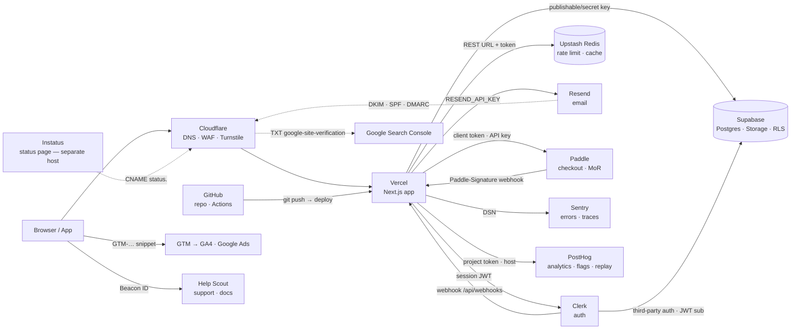

# v2p SLICE 2 — implementation spec (scavenge, mapping, stack guide, skills catalog, router)

## User decisions 2026-09-23 — OVERRIDE the body below wherever they conflict
1. **Jurisdiction = Panama, not Colombia.** Replace every `[CO]` note with `[PA]`. Verified today (write these with `(verified: 2026-09)` and the URL):
   - Stripe: Panama is not listed; the only Latin American countries are Brazil and Mexico. https://stripe.com/global
   - Paddle: Panama is not on the unsupported-country list. https://www.paddle.com/help/start/intro-to-paddle/which-countries-are-supported-by-paddle
   - Lemon Squeezy: Panama is listed for bank payouts; PayPal payouts cover 200+ countries. https://docs.lemonsqueezy.com/help/getting-started/supported-countries

   Payments default stays **Paddle**. Stripe only via a US entity. Drop the Colombia-specific rows and claims, including the Colombia payout note.
2. **Code graph default = tirth8205/code-review-graph**, not Graphify. Catalog row "Brownfield understanding": default Serena, plus code-review-graph as the graph tool.
   - It is an MCP server (30 tools, including `get_impact_radius`, `detect_changes`, `get_review_context`). Graph built locally with tree-sitter into SQLite. No LLM calls. Incremental through git hooks. MIT, 31.7k★, pushed 2026-09-18.
   - Install, verbatim: `pip install code-review-graph && code-review-graph install && code-review-graph build`.
   - Also list it in the review-phase notes (impact radius of a diff).
   - Caveats: the ~63x saving is the author's own benchmark; the README says its blast-radius recall is circular.
   - Alternatives column: Graphify (only when docs, SQL or PDFs need indexing; LLM calls for non-code; invasive always-use hooks) and Understand-Anything (human onboarding; LLM tokens; `curl | bash` installer).
   - Delete the "rtk already condenses" rationale: rtk shortens command output, it does not analyse impact.
3. **Hosting: Vercel Hobby is the startup default; Cloudflare Pages is the option.** Vercel's fair-use terms make Hobby non-commercial, so the docs must state a **switch trigger**: at the first commercial use (first sale, ads, paid client work), move to Vercel Pro or to Cloudflare Pages, which is free for commercial use. Happy-path step 3 reads: "Vercel Hobby while pre-revenue → Pro or Cloudflare Pages at the first commercial use". mapping.md asks "is it commercial yet?" and writes the answer into PLAN §2. Update the cost-at-launch lines to match. The wiring matrix stays Vercel-only; add a single note that Cloudflare Pages uses its own env-var UI (`wrangler` / dashboard) and no Vercel rows apply.
4. **find-skills scatter has been FIXED** by the coordinator. `~/.claude/skills/find-skills` is now a real directory; the `~/.agents/skills/find-skills` copy and its entry in `~/.agents/.skill-lock.json` are gone (backup in `~/.claude-backups/find-skills-move-2026-09-23/`). Catalog row "Discovery": status `installed`; delete the scatter flag and check-10's `readlink` expectation. Add one warning: `npx skills add` installs into `~/.agents/skills` by default, so anything installed that way must be moved to `~/.claude/skills` per CLAUDE.md §7. Whether it has a flag to target Claude Code directly is `(unverified)`.
5. The Orca row in the catalog is fine as written (optional; a skill cannot drive it). Also add to security.md: Orca sends anonymous telemetry by default; opt out in its privacy settings.

**Conclusion first.** Build 7 new files and touch 5 existing ones. The stack guide is split in three (`overview.md`, `wiring.md`, `security.md`) and ships in the portable pack; `skills-catalog.md` is Claude-only. Two decisions the user should hear before the builder starts: (1) **Vercel Hobby is non-commercial only** — any paid product or ad-bearing landing needs Pro from day one; (2) **Stripe does not open accounts in Colombia** — the MoR path (Paddle, or Lemon Squeezy → Stripe Managed Payments) is the default; Stripe only via a US entity (Atlas). Also: **Cusdis is archived (2026-07-17)** — drop it.

Verification coverage of the stack research: **61 items verified against official pages (2026-09-23), 14 marked `(unverified)`** — list in §7.

Everything below is what I verified myself unless marked `(unverified)` or "reported by coordinator".

***

## 1. File tree delta

```
vibe-to-product/
├── build-portable.sh                        # MODIFIED: add 5 parts (see 2.9)
├── README.md                                # MODIFIED: phases table, file map, verify block
├── docs/specs/slice-2-spec.md               # NEW: this document (builder saves it verbatim)
└── skills/v2p/
    ├── SKILL.md                             # MODIFIED: §2 entry, §5 phase table, §6 references
    ├── phases/
    │   ├── handshake.md                     # MODIFIED: line 60 "Next" → scavenge
    │   ├── scavenge.md                      # NEW (~90 lines)
    │   └── mapping.md                       # NEW (~80 lines)
    └── references/
        ├── brief-template.md                # MODIFIED: last "Next" line
        ├── model-routing.md                 # MODIFIED: scavenge/mapping rows
        ├── scavenge-template.md             # NEW (~45 lines)  — portable
        ├── plan-template.md                 # NEW (~55 lines)  — portable
        ├── skills-catalog.md                # NEW (~110 lines) — Claude-only, excluded from dist
        └── stack/
            ├── overview.md                  # NEW (~170 lines) — happy path, provider table, Mermaid
            ├── wiring.md                    # NEW (~110 lines) — config wiring matrix
            └── security.md                  # NEW (~130 lines) — per-provider security/privacy
```

Rules carried from slice 1: `***` not `---`; copyright line last; `(verified: 2026-09)` marker at end of line **with the source URL on the same line**; `<!-- claude-only -->` blocks stripped by the build.

Why 3 stack files, not 1 or 4: overview is read at mapping for every project; wiring only when a provider is chosen; security only at execute/review. Per-profile happy paths live in `overview.md` as four short lists (they differ by ≤3 steps; separate files would duplicate the provider table).

***

## 2. Per-file spec

### 2.1 `phases/scavenge.md` — writes `.v2p/SCAVENGE.md`

Sections, in order:

**Purpose** (2 lines). Turn BRIEF into a short evidence file: what already exists (references, docs, blueprints, standards) and, for brownfield, what the current code is. Nothing is decided here; mapping decides.

**Preconditions.** `.v2p/BRIEF.md` must exist with §11 = `none`; otherwise print `Run /v2p handshake first.` and stop. If `.v2p/SCAVENGE.md` exists: print its `written:` line and offer resume (keep) or re-run.

**Research questions — derived, not invented.** Exactly these, each skipped when its BRIEF source is empty/none:

| # | From BRIEF | Question | Preferred source |
|---|---|---|---|
| Q1 | §1 profile + §8 stack | Reference architecture or official starter for `<profile>` on `<stack>` (one, from the framework/provider vendor) | context7 (library docs), official docs |
| Q2 | §3 the one job | Proven implementation pattern for `<the one job>` (checkout flow, booking, upload, etc.) — one official guide or one maintained repo | official docs > repo pushed <6 months, not archived |
| Q3 | §8 integrations + money model | For each integration: the exact keys/webhooks needed. **Look in `references/stack/wiring.md` first; go to the web only for a provider not in the guide.** | stack guide, then official docs |
| Q4 | §7 data sensitivity | The primary legal text that applies to the flags set (personal data, payments, health, minors, EU accessibility) for the audience's jurisdiction. Cite the law/regulator page, not a blog. Never state obligations from memory. | government/regulator or standards body |
| Q5 | §2 audience | Up to 3 adjacent products and what their users complain about in the last 30 days (pain language reused in copy and the FAQ) | `/last30days` (social), then WebSearch |
| Q6 | §1 `Code: existing at <path>` (brownfield only) | Inventory: stack, entry points, env vars referenced, tests present, dependencies with created-date <6 months, TODO/FIXME count, files >200 lines | Serena (installed) / `rg`; no web |

**Source-quality rules.**
1. Rank: official docs > maintained repos (pushed within 6 months, not archived, >100 stars or vendor-owned) > posts/forums/social. A lower rank never overrides a higher one on a technical fact.
2. Every claim row carries `source URL · accessed YYYY-MM-DD`. No URL → the row is deleted, not kept as "known".
3. Social/trend results (Q5) inform copy and FAQ only; never a technical decision.
4. Numbers (limits, prices) are copied verbatim with the page's own wording; if the page did not show it, write `(not on page)`.
5. Disagreement between two official sources → record both, mark `[CONFLICT]`, mapping decides.

**Budget / stop rule.**
- ≤3 sources per question; stop a question when two official sources agree.
- Hard cap: **25 fetches total** (WebFetch + context7 + firecrawl combined) and ~30 minutes wall time. Count is written into SCAVENGE.md §6.
- Q6 is not budgeted by fetches; it is budgeted by files: read ≤40 files, never the whole tree (`rg`/Serena symbol lookups).
- When the cap hits, unanswered questions are written as `[OPEN: <question> — answer needed by <mapping task>]`, never guessed.

**Tools and degradation** (portable pack sees the generic line only):
- Generic: "Use whatever web-reading tool your runtime has; if none, ask the user to paste the pages."
<!-- claude-only -->
- context7 MCP: first choice for library/SDK docs (`resolve-library-id` → `query-docs`).
- WebFetch/WebSearch: default for everything else.
- **Firecrawl: use only if a `firecrawl` / `firecrawl-scrape` skill appears in this session's available-skills list. It is installed in the plugin cache but disabled** (`~/.claude/settings.json` → `firecrawl@claude-plugins-official=false`, verified 2026-09-23), so by default its tools are not loaded. Do not run `npx firecrawl-cli`, do not install, do not enable; write `firecrawl: unavailable` in SCAVENGE.md §6. When it is available, prefer `firecrawl-scrape` over WebFetch for JS-rendered pages only.
- `/last30days` (installed, enabled): Q5 only; runs on the main thread (needs Bash + AskUserQuestion); works without API keys via WebSearch fallback (reported by the skill's own frontmatter).
- gstack `/browse`: only when a page needs a click or login (pricing calculators, dashboards). Never `mcp__claude-in-chrome__*`.
- Perplexity: not installed; do not reference.
- Brownfield Q6: Serena MCP is installed (`~/.claude.json` `mcpServers.serena`); use `find_symbol`/`get_symbols_overview`; fall back to `rg`. No graph tool is required (see catalog).
<!-- /claude-only -->

**Execution (Claude Code)** — thin, in a claude-only block:
1. Main thread reads BRIEF, lists the applicable questions, prints them (≤6 lines), and asks one closed question via `AskUserQuestion` only if Q5 is applicable: "Run the social-trends scan (uses /last30days, ~2 min)?" default yes.
2. Spawn in parallel: `planner` (Fable) with Q1–Q5 and the rules above — it returns the filled §1–§5 text and its fetch count (planner does not write files); `quick` (Sonnet) with Q6 for brownfield — returns §5 inventory text.
3. Main thread runs `/last30days` for Q5 if accepted.
4. Main thread assembles `.v2p/SCAVENGE.md` from `references/scavenge-template.md`, writes it, prints the path and `Next: /v2p mapping`.
Portable pack: the model does steps 1–4 itself in one pass.

**Claude Code note**: `AskUserQuestion` for the Q5 opt-in and for resume/re-run. Nothing else is asked; open items go to `[OPEN: …]`.

Copyright line.

### 2.2 `phases/mapping.md` — writes `.v2p/PLAN.md`

**Purpose** (2 lines). Turn BRIEF + SCAVENGE into an executable plan with providers, skills, pre-filled standards rows, and tasks that each carry a verifier. Plan-writing itself is superpowers' job.

**Preconditions.** BRIEF required (§11 = `none`). SCAVENGE optional: if absent, ask once "Run scavenge first (recommended) or plan without it?"; record `scavenge: skipped` in PLAN.md header. Existing PLAN.md → resume/re-run.

**Step 1 — Provider selection** (main thread; 5 rules, in order; each records a `defaulted`/`answered` row in PLAN §2):
1. BRIEF §8 must-have/won't-accept/existing accounts win over any default.
2. Profile default set from `references/stack/overview.md` §"Happy path per profile".
3. Budget (§7) vs free tiers: if `Budget/month` is `0` and the profile default has a paid-only requirement (Vercel commercial use → Pro; Instatus custom domain → Pro; Clerk MFA → Pro), name it and ask.
4. Money model ≠ none → payments provider: default **Paddle** (MoR, Colombia supported); Stripe only if the user has a US/supported-country entity; Lemon Squeezy only for an existing account (in migration to Stripe Managed Payments). Asked via `AskUserQuestion` with the three options and the tax/entity trade-off in each description.
5. Data sensitivity flags → region-aware picks: EU audience → Sentry EU org, PostHog EU, Supabase EU region, Plausible (EU, cookieless) instead of GA4; Clerk has no EU hosting → say so and offer Supabase Auth.
Closed choices use `AskUserQuestion`; everything else is defaulted with one line saying so.

**Step 2 — Skills for this project.** From `references/skills-catalog.md`, list only rows whose `Use when` matches the profile/blocks ON and whose status is `installed`. `suggested` rows appear under "optional, install first" — never auto-installed.

**Step 3 — Delegate the plan.** Spawn `planner` with: BRIEF, SCAVENGE, the provider decisions, the skills list, the standards files from BRIEF §9, and the instruction "Use `superpowers:writing-plans` and load `writing-plans-extras` in the same turn. Plan location: `.v2p/PLAN.md` (overrides the skill default). Spec path in the header: `.v2p/BRIEF.md` + `.v2p/SCAVENGE.md`. Add the v2p sections from `references/plan-template.md` around the skill's own task structure. Do not run brainstorming — the BRIEF is the spec." Planner returns the PLAN body; main thread writes the file.
Note for `model-routing.md`: drop `superpowers:brainstorming` from the mapping row; it duplicates the handshake. Keep it as "only if BRIEF §10 has ≥3 `deferred` rows that affect architecture".

**Step 4 — v2p additions the planner must fill** (the template enforces them):
- §2 Providers: one row per provider with plan, monthly cost at launch (from overview table), and the wiring rows it needs (row ids from `wiring.md`).
- §3 Skills: installed rows to use, and at which task.
- §4 Standards: **one row per checklist item** of the loaded files (landing 155, saas-web 152, internal-tool 147, native-app 108 — measured with `grep -c '^- \[ \]'` on 2026-09-23: core 96, web 43, landing 16, saas-web 13, internal-tool 8, native-app 12), status `pending` or `N/A <reason citing BRIEF §>`; conditional blocks OFF in BRIEF §9 → `N/A`. Evidence column empty (execute fills it).
- §5 Tasks: writing-plans task structure plus a **Verifier** line per task: `mechanical: <command> → <expected>` or `manual: <who checks what>`. Only `mechanical` tasks are eligible for `/ralph-loop` in execute (always with `--max-iterations`).
- §6 Review focus: the writing-plans "five uncovered inputs" list, unchanged.

**Step 5 — Write and hand off.** Write `.v2p/PLAN.md`, print the path, the count of tasks (mechanical/manual), and `Next: /v2p execute (not available in this version)`. Do **not** ask the writing-plans execution-method question; execute is not available yet.

**Claude Code note**: `AskUserQuestion` for payments provider, paid-tier acceptance, EU-region choice, scavenge-skip. `planner` never writes; `quick` may write the file if the main thread prefers.

### 2.3 `references/scavenge-template.md` — see §3.
### 2.4 `references/plan-template.md` — see §3.

### 2.5 `references/stack/overview.md`

Header: "Startup stack for a solo founder. Prices and limits change; each line carries its verification date and source. Re-verify any `(unverified)` line before relying on it. Colombia-specific notes are marked 🇨🇴-free text `[CO]`."

**§1 Happy path (setup order)** — the base list; per-profile deltas below it:
1. GitHub: create the private repo; enable 2FA; add `.env.example` (core.md item).
2. Cloudflare: register/transfer the domain, DNS here; Turnstile widget for every public form.
3. Vercel: import repo → project; **Pro if commercial**; set Sensitive env-var policy; connect domain (DNS-only in Cloudflare for Vercel records).
4. Supabase: project in the audience's region; copy `sb_publishable_`/`sb_secret_` keys; RLS on every table before first insert.
5. Clerk (if login): app → API keys → Supabase third-party-auth integration → webhook endpoint.
6. Upstash Redis: rate limiting + cache; read-only token where reads only.
7. Resend: domain on a subdomain (`send.` / `updates.`), DKIM/SPF/DMARC records in Cloudflare.
8. Sentry: org in the right region (immutable), DSN + auth token; scrubbing on.
9. PostHog: project in the right region; reverse proxy; cookieless or consent; replay masking.
10. Payments (if money model ≠ none): Paddle sandbox → live; webhook destination; server-side prices.
11. Instatus: public status page on Instatus' host (separate host = core.md "Incident readiness"); custom domain later (Pro).
12. Help Scout: Beacon on the app; Docs site for FAQ.
13. Google: GSC domain property (DNS TXT), GA4 property + GTM container (or Plausible), Google Ads only when there is a conversion to track.

Per-profile delta table:

| Profile | Use from the base | Skip | Add |
|---|---|---|---|
| landing | 1,2,3,7 (form email),8,9 or Plausible,13; 11 optional | 4,5,6,10,12 | Resend only for the form/thank-you email |
| saas-web | all | — | 10 only when money model ≠ free |
| internal-tool | 1,2,3,4,5(SSO via the org IdP — Clerk Enterprise SSO is paid),6,8 | 7 marketing, 9 (or self-host), 11,12,13 | Sentry + PostHog error tracking only |
| native-app | 1,4,5,6,7,8,9,10 (IAP via stores, Paddle for web checkout only), 11 | 2,3 (no web host), 13 GA4/GSC | EAS Build/Submit (native-app.md) |

**§2 Provider table** (transcribe; one row per provider; strengths/weaknesses are my assessment, the numbers are quoted):

| Provider | Role | Free tier / entry price | Strengths | Weaknesses | Pick the alternative when |
|---|---|---|---|---|---|
| GitHub | source, CI | Free: unlimited private repos, 2,000 Actions min/mo, 500 MB packages; Team $4/user/mo. Dependabot & secret scanning free on **public** repos only; private needs GitHub Secret Protection (Team/Enterprise) (verified: 2026-09) https://github.com/pricing · https://docs.github.com/en/code-security/secret-scanning/introduction/about-secret-scanning | default for every skill/tool here | secret-scanning gap on private repos → run `gitleaks` in CI (core.md supply chain) | never |
| Cloudflare | DNS, WAF, Turnstile, Workers | Free plan: 5 custom WAF rules, 1 rate-limiting rule (Pro: 20 / 2); Workers 100k req/day, 10 ms CPU, Paid $5/mo 10M req; Turnstile free, 20 widgets × 10 hostnames (verified: 2026-09) https://developers.cloudflare.com/waf/custom-rules/ · https://developers.cloudflare.com/waf/rate-limiting-rules/ · https://developers.cloudflare.com/workers/platform/pricing/ · https://developers.cloudflare.com/turnstile/plans/ | free DNS+DDoS+bot check; Turnstile replaces CAPTCHA | one rate-limit rule on Free; proxying Vercel/Resend records breaks them | you host on Cloudflare Pages/Workers instead of Vercel (then drop Vercel) |
| Vercel | hosting (Next.js) | Hobby: **non-commercial only**; 100 GB fast data transfer, 1M function invocations, 4 h active CPU, 360 GB-hrs, 5K image transformations/mo; runtime logs 1 h; 100 deploys/day; 1 concurrent build (verified: 2026-09) https://vercel.com/docs/limits/fair-use-guidelines · https://vercel.com/docs/limits — Pro $20/user/mo (unverified) | zero-config previews, Sensitive env vars, free DDoS | commercial = Pro from day one; Hobby cannot connect repos owned by a Git org | Cloudflare Pages when the budget is 0 and the site is commercial |
| Supabase | Postgres, auth, storage | Free: 500 MB DB, 50,000 MAU, 1 GB storage, 5 GB egress, 500k edge invocations, **paused after 1 week inactivity**, 2 active projects; Pro from $25/mo: 100k MAU, 8 GB disk, 250 GB egress, 100 GB storage, 7-day backups (verified: 2026-09) https://supabase.com/pricing | RLS, region choice, one bill for DB+auth+storage | free projects pause; free = no daily backups → Pro before launch for saas | Neon when you only need Postgres with branching |
| Clerk | auth UI + sessions | Hobby: 50,000 monthly retained users (MRU) per app; Pro $25/mo, $0.02/MRU over; **MFA Pro-only**, allowlist Pro-only; Enterprise SSO 1 connection on Pro, $75/mo each extra (verified: 2026-09) https://clerk.com/pricing | fastest login UI; Supabase third-party auth; webhooks | **US-only hosting, no region selection**; MFA costs $25/mo | Supabase Auth when EU residency or MFA-for-free matters, or for internal-tool SSO via the org IdP |
| Upstash Redis | rate limit, cache, queues | Free: 500K commands/mo, 256 MB, 10 GB bandwidth, 1 DB; PAYG $0.2/100K commands; Fixed 250 MB $10/mo (verified: 2026-09) https://upstash.com/pricing/redis | REST from edge; read-only tokens; IP allowlist | 1 free DB; per-command billing surprises with chatty libs | Redis Cloud for a persistent 30 MB free DB with TCP (Essentials from $5/mo) |
| Resend | transactional email | Free: 3,000/mo, 100/day, 3 domains, 30-day retention; Pro $20/mo 50k (verified: 2026-09) https://resend.com/pricing | React email, DMARC guide, subdomain isolation | 100/day cap; SES-backed (SPF includes amazonses.com) | Postmark when deliverability history matters (100/mo free, $15/mo 10k) |
| Sentry | errors, tracing, replay | Developer: 5k errors, 50 replays, 5M spans, 1 user, 30-day; Team $26/mo annual (verified: 2026-09) https://sentry.io/pricing/ | region choice at org creation (US Iowa / EU Frankfurt); server-side PII scrubbing default | 1 user on free; region immutable | PostHog error tracking (100k exceptions free) for a landing page with no backend |
| PostHog | analytics, flags, replay, surveys, errors | Free monthly: 1M events, 5K recordings, 1M flag requests, 1500 survey responses, 100K exceptions; no card (verified: 2026-09) https://posthog.com/pricing | one tool for 5 jobs; EU cloud; `cookieless_mode`; managed reverse proxy free | replay needs masking discipline | Plausible when you want cookieless-by-design pageviews only (no free plan; $9/mo 10k pageviews, EU) |
| Paddle | payments, MoR | 5% + 50¢ per transaction, no monthly fee; MoR: tax registration/filing/remittance (verified: 2026-09) https://www.paddle.com/pricing · unsupported-country list does not include Colombia https://www.paddle.com/help/start/intro-to-paddle/which-countries-are-supported-by-paddle (verified: 2026-09) | zero sales-tax liability; scoped API keys; [CO] sellers accepted (vetted at signup) | 5% + 50¢ > Stripe's 2.9%; approval before go-live; payout schedule/methods (unverified) | Stripe when you have a supported-country entity and volume makes 2% matter |
| Lemon Squeezy | payments, MoR | 5% + 50¢, $0/mo, MoR; **2026: migrating merchants to Stripe Managed Payments (35+ countries)**, no EOL date; still operates standalone (verified: 2026-09) https://www.lemonsqueezy.com/pricing · https://www.lemonsqueezy.com/blog/2026-update · [CO] Colombia listed for bank payouts https://docs.lemonsqueezy.com/help/getting-started/supported-countries (verified: 2026-09) | simplest checkout; [CO] bank payouts | product in transition; new features go to Stripe Managed Payments | Paddle for a new integration in 2026 |
| Stripe | payments (PSP, not MoR) | US: 2.9% + 30¢ domestic, +1.5% international cards; Stripe Tax 0.5%; Billing 0.7% (verified: 2026-09, US page) https://stripe.com/pricing · **Colombia not listed** on https://stripe.com/global (verified: 2026-09; LatAm: Brazil, Mexico) | lowest fees, deepest API, 2FA/passkeys | you are the merchant: tax registration is yours; [CO] needs a US entity — Stripe Atlas ~$500 one-time + ~$100/yr agent + annual IRS filings (unverified, third-party) | Paddle unless you already have the entity |
| Neon | Postgres alt | Free: 0.5 GB/project, 100 CU-hours/project, 100 projects, 10 branches; Launch PAYG $0.106/CU-hour + $0.35/GB-month, no minimum (verified: 2026-09) https://neon.com/pricing | branch per PR via Vercel integration | no auth/storage bundle | Supabase when you want auth+storage+RLS in one place |
| Instatus | status page | Free: 15 monitors, 2-min checks, 5 team members, 200 subscribers, public page, **no custom domain**; Pro adds custom domain, 50 monitors, 5,000 subscribers (verified: 2026-09) https://instatus.com/pricing — Pro $20/mo (unverified, third-party) | separate host by design (core.md incident readiness) | custom domain paid | none needed; the free page on Instatus' host satisfies the standard |
| Help Scout | support inbox + docs | Free: up to 5 users, 100 contacts/mo, 1 inbox, 1 Docs site; Standard $25/user/mo (verified: 2026-09) https://www.helpscout.com/pricing/ | free tier fits a solo founder; Docs site = FAQ host | 100 contacts/mo cap; Beacon secure-mode key location (unverified) | Missive when you want shared email/SMS/social in one inbox (no free plan; Starter $14/user/mo yearly, ≤5 users) |
| Google Search Console | indexing | free (verified: 2026-09 — verification methods page) https://support.google.com/webmasters/answer/9008080 | required for SEO items in web.md | — | — |
| GA4 + GTM (Google Marketing Platform) | analytics, tags | free; GA4 retention 2 months default, 14 max (verified: 2026-09) https://support.google.com/analytics/answer/9019185 · https://support.google.com/analytics/answer/12270356 | ads attribution; GTM one snippet for all tags | cookies + consent banner needed (web.md); data leaves the region | Plausible or PostHog cookieless when no ads |
| Google Ads | paid acquisition | pay-per-click; conversion action gives Conversion ID + Conversion Label (verified: 2026-09) https://support.google.com/tagmanager/answer/6105160 | only channel with search intent | needs GA4/GTM wiring first | skip until the 90-day metric needs paid traffic |
| SEO suites | research | Ahrefs: free tier ("Ahrefs Free"), Starter $29/mo; Semrush: 7-day trial, SEO plan $139/mo; SE Ranking: 14-day trial, Core $129/mo (verified: 2026-09) https://ahrefs.com/pricing · https://www.semrush.com/prices/ · https://seranking.com/pricing.html · Serpstat: pricing page 404 twice, third-party says ~$50/mo, 7-day trial (unverified) | Ahrefs free tier covers a verified site | others start ≥$100/mo | Ahrefs Free + GSC first; buy a suite only for keyword research at scale |
| Comments | blog comments | **Cusdis repo archived 2026-07-17** (verified: 2026-09) https://github.com/djyde/cusdis → do not adopt. giscus (GitHub Discussions, active, 12k stars) https://github.com/giscus/giscus (verified: 2026-09) | — | giscus requires a GitHub login → dev audiences only | no comments at all for a consumer landing (YAGNI) |

**§3 Cost at launch** (from the table; builder transcribes): landing $0 if non-commercial else Vercel Pro; saas-web at launch ≈ Vercel Pro + Supabase Pro + Clerk Pro-if-MFA = $70/mo + Pro prices `(unverified for Vercel)`; everything else free tier.

**§4 Architecture diagram** (Mermaid source, transcribe verbatim; node ids are the matrix keys):



Alternatives (Neon, Postmark, Plausible, Stripe, Lemon Squeezy, Redis Cloud, Missive, giscus) are **not** nodes; they appear in the matrix as `alt:` rows so the diagram↔matrix check compares primaries only (see §5 check 3).

### 2.6 `references/stack/wiring.md` — config wiring matrix

Header: "Column A is the value **as named in the source dashboard**; column B is where to put it. Env var names are conventions unless the vendor mandates them (mandated ones are marked `vendor-named`). Store secrets as Vercel **Sensitive** env vars (production/preview). Never put a `sb_secret_`, `CLERK_SECRET_KEY`, `pdl_live_apikey_`, `whsec_`, `SENTRY_AUTH_TOKEN` or Turnstile secret in a `NEXT_PUBLIC_*` variable."

| id | Integration | Get from A (exact name / location) | Set in B | Notes |
|---|---|---|---|---|
| W1 | GitHub → Vercel | repo (Vercel: Add New → Project → Import) | Vercel project Git integration | Hobby cannot import repos owned by a GitHub org (verified: 2026-09) https://vercel.com/docs/limits |
| W2 | Vercel → Cloudflare DNS | Vercel Project → Settings → Domains shows the A/CNAME to add | Cloudflare DNS record, **proxy off (DNS only)** | record values not fetched (unverified); take them from the Vercel Domains page |
| W3 | Clerk → Vercel env | Clerk Dashboard → **API Keys**: `NEXT_PUBLIC_CLERK_PUBLISHABLE_KEY`, `CLERK_SECRET_KEY` (vendor-named) (verified: 2026-09) https://clerk.com/docs/deployments/clerk-environment-variables | Vercel env: same names; secret as Sensitive | optional `NEXT_PUBLIC_CLERK_SIGN_IN_URL`, `..._SIGN_UP_URL`, `..._FALLBACK_REDIRECT_URL` |
| W4 | Vercel → Clerk webhook | your URL `https://<domain>/api/webhooks` | Clerk Dashboard → **Webhooks** → endpoint; copy **Signing Secret** → Vercel env `CLERK_WEBHOOK_SIGNING_SECRET` (vendor-named); verify with `verifyWebhook()` from `@clerk/nextjs/webhooks` (verified: 2026-09) https://clerk.com/docs/webhooks/sync-data | route must be public (no auth middleware) |
| W5 | Clerk → Supabase auth | Clerk Dashboard → Supabase integration → "Activate Supabase integration" → copy **Clerk domain** | Supabase → Authentication → **Sign In / Providers** → Third-Party Auth → Clerk → paste domain; RLS uses `(select auth.jwt()->>'sub') = user_id::text`; Clerk adds `"role":"authenticated"` (verified: 2026-09) https://clerk.com/docs/guides/development/integrations/databases/supabase | |
| W6 | Supabase → Vercel env | Supabase → Settings → **API Keys**: `sb_publishable_…`, `sb_secret_…` (legacy `anon`/`service_role` deprecated) | Vercel env: `NEXT_PUBLIC_SUPABASE_URL`, `NEXT_PUBLIC_SUPABASE_PUBLISHABLE_KEY`; server: `SUPABASE_URL`, `SUPABASE_SECRET_KEY` (Sensitive) (verified: 2026-09) https://supabase.com/docs/guides/api/api-keys | names of variables written by the Supabase↔Vercel marketplace integration (unverified) — prefer manual |
| W7 | Upstash → Vercel env | Upstash console → database → **REST API** section: `UPSTASH_REDIS_REST_URL`, `UPSTASH_REDIS_REST_TOKEN`; **Read-Only Token** toggle for read-only apps (verified: 2026-09) https://upstash.com/docs/redis/sdks/ts/getstarted · https://upstash.com/docs/redis/troubleshooting/readonly_connection | Vercel env, token Sensitive | |
| W8 | Resend → Cloudflare DNS | Resend → Domains → add `send.<domain>` (subdomain recommended) shows: MX `send` → `feedback-smtp.<region>.amazonses.com` prio 10; TXT `send` = `v=spf1 include:amazonses.com ~all`; TXT `resend._domainkey` = `p=…` (verified: 2026-09) https://resend.com/docs/dashboard/domains/cloudflare · https://resend.com/docs/dashboard/domains/introduction | Cloudflare DNS, **DKIM record DNS-only (no proxy)** | plus W9 |
| W9 | DMARC | — | Cloudflare TXT `_dmarc` = `v=DMARC1; p=none; rua=mailto:dmarc@<domain>;` → later `p=quarantine` → `p=reject` (verified: 2026-09) https://resend.com/docs/dashboard/domains/dmarc | applies to Postmark too |
| W10 | Resend → Vercel env | Resend → API Keys → create key (scope: sending only, restrict to the domain — scopes (unverified)) | Vercel env `RESEND_API_KEY` (verified: 2026-09) https://resend.com/docs/send-with-nextjs | |
| W11 | Paddle → Vercel env | Paddle → **Developer tools → Authentication**: API key `pdl_live_apikey_…` / sandbox `pdl_sdbx_apikey_…` with scoped permissions; client-side token `live_…`/`test_…` for Paddle.js (verified: 2026-09) https://developer.paddle.com/api-reference/about/authentication | Vercel env `PADDLE_API_KEY` (Sensitive), `NEXT_PUBLIC_PADDLE_CLIENT_TOKEN` | legacy 50-char keys (pre 2025-05-06) must be replaced |
| W12 | Vercel → Paddle webhook | your URL `https://<domain>/api/webhooks/paddle` | Paddle → Developer tools → **Notifications** → destination; **Edit destination** shows secret `pdl_ntfset_…` → Vercel env `PADDLE_WEBHOOK_SECRET_KEY` (Paddle's suggested name); header `Paddle-Signature` (`ts;h1`) (verified: 2026-09) https://developer.paddle.com/webhooks/signature-verification | |
| W13 | alt: Stripe → Vercel | Stripe Workbench → **Webhooks** → endpoint → **Reveal secret** `whsec_…`; header `Stripe-Signature`; ≤16 endpoints; roll secrets periodically (verified: 2026-09) https://docs.stripe.com/webhooks | Vercel env `STRIPE_SECRET_KEY`, `STRIPE_WEBHOOK_SECRET` (conventional; Stripe's examples use `STRIPE_API_KEY`/`WEBHOOK_SECRET`), `NEXT_PUBLIC_STRIPE_PUBLISHABLE_KEY` | key prefixes `pk_`/`sk_`/`rk_` (unverified on this page) |
| W14 | alt: Lemon Squeezy → Vercel | Settings » **Webhooks** → form field *signing secret* (6–40 chars, you choose it); header `X-Signature`, HMAC-SHA256 (verified: 2026-09) https://docs.lemonsqueezy.com/help/webhooks · https://docs.lemonsqueezy.com/help/webhooks/signing-requests | Vercel env `LEMONSQUEEZY_WEBHOOK_SECRET`, `LEMONSQUEEZY_API_KEY` (conventional) | API key page location (unverified) |
| W15 | Sentry → Vercel env | Sentry → Settings → Projects → [project] → **Client Keys (DSN)** — DSN is not a secret (verified: 2026-09) https://docs.sentry.io/concepts/key-terms/dsn-explainer/ ; org/project slugs in `next.config` `withSentryConfig`; `tunnelRoute: "/sentry-tunnel"` (verified: 2026-09) https://docs.sentry.io/platforms/javascript/guides/nextjs/manual-setup/ | Vercel env `NEXT_PUBLIC_SENTRY_DSN`; `SENTRY_AUTH_TOKEN` (Sensitive; source maps) | EU org → API host `de.sentry.io` (W16) |
| W16 | Sentry region | chosen at **Create a New Organization → Data Storage Location** (US Iowa / EU Frankfurt), immutable (verified: 2026-09) https://docs.sentry.io/organization/data-storage-location/ | — | wrong region = new org |
| W17 | PostHog → Vercel env | PostHog → Project settings → project token | Vercel env `NEXT_PUBLIC_POSTHOG_PROJECT_TOKEN` (name in current Next.js guide; older guides use `NEXT_PUBLIC_POSTHOG_KEY`), `NEXT_PUBLIC_POSTHOG_HOST` = `https://us.i.posthog.com` or `https://eu.i.posthog.com` (verified: 2026-09) https://posthog.com/docs/libraries/next-js · https://posthog.com/docs/libraries/js/config | reverse proxy recommended (managed one free for Cloud users) |
| W18 | Cloudflare Turnstile → Vercel | Turnstile widget → **Sitekey** (public), **Secret key** (server) | Vercel env `NEXT_PUBLIC_TURNSTILE_SITE_KEY`, `TURNSTILE_SECRET_KEY` (Sensitive); server POST `https://challenges.cloudflare.com/turnstile/v0/siteverify` with `secret`,`response`(,`remoteip`); token valid 300 s, single use (verified: 2026-09) https://developers.cloudflare.com/turnstile/get-started/ · https://developers.cloudflare.com/turnstile/get-started/server-side-validation/ | |
| W19 | Instatus → Cloudflare DNS | Instatus custom domain (Pro) | Cloudflare CNAME `status` → `cname.instatus.com`, default TTL (verified: 2026-09) https://instatus.com/help/custom-domain | Free plan: link the `*.instatus.com` page from the footer |
| W20 | Help Scout → app | Tools → Beacons → [beacon] → Edit Beacon → **Installation**: `Beacon('init', 'BEACON_ID')` (verified: 2026-09) https://docs.helpscout.com/article/1356-add-beacon-to-your-website-or-app · https://developer.helpscout.com/beacon-2/web/javascript-api/ | app layout; secure mode: server HMAC-SHA256 signature passed to `Beacon('identify', {signature})` | location of the secure key (unverified) |
| W21 | GSC ← Cloudflare DNS | Search Console → Domain property → TXT value `google-site-verification=…` | Cloudflare TXT at `@` (verified: 2026-09) https://support.google.com/webmasters/answer/9008080 | URL-prefix alternative: meta tag / HTML file / GA / GTM |
| W22 | GA4 → GTM → app | GA4 Admin → **Data streams** → Web → **Measurement ID** `G-…` (verified: 2026-09) https://support.google.com/analytics/answer/12270356 | GTM → GA4 tag; GTM container ID `GTM-…` snippet in app `<head>`/`<body>` (format/placement (unverified) — copy from GTM Admin → Install) | consent banner wired to actual blocking (core.md) |
| W23 | Google Ads → GTM | Google Ads → Goals → Conversions → Summary → action → **Tag setup → Use Google Tag Manager**: **Conversion ID** + **Conversion Label** (verified: 2026-09) https://support.google.com/tagmanager/answer/6105160 | GTM Google Ads Conversion Tracking tag | `AW-` prefix (unverified) |
| W24 | alt: Neon → Vercel | Neon Vercel native integration writes `DATABASE_URL` (pooled), `DATABASE_URL_UNPOOLED`, `PGHOST`, `PGUSER`, `PGDATABASE`, `PGPASSWORD`, legacy `POSTGRES_*`; preview-branch values injected at deploy time, not visible in the UI (verified: 2026-09) https://neon.com/docs/guides/vercel-native-integration | Vercel env (auto) | |
| W25 | alt: Postmark → Vercel | Postmark → Servers → **API Tokens**; header `X-Postmark-Server-Token`; streams transactional / inbound / broadcast (verified: 2026-09) https://postmarkapp.com/developer/api/overview | Vercel env `POSTMARK_SERVER_TOKEN` (conventional) | DKIM/Return-Path DNS records (unverified) |
| W26 | alt: Plausible → app | Site settings → General → **Site installation** snippet (new format: per-site script `pa-<id>.js` + `plausible.init({...})`; legacy `data-domain` snippet still works per Oct-2025 update) (verified: 2026-09, snippet text itself not shown on the page) https://plausible.io/docs/script-update-guide · https://plausible.io/docs/plausible-script | app `<head>` | proxy option available |
| W27 | Vercel env policy | Team Settings → **Security & Privacy → Enforce Sensitive Environment Variables** | — | Sensitive = unreadable after creation; build-log redaction for values ≥32 chars; prod/preview only (verified: 2026-09) https://vercel.com/docs/environment-variables/sensitive-environment-variables |

### 2.7 `references/stack/security.md` — per-provider security & privacy

One `##` heading per provider (same names as the overview table primaries + a "Payments alternatives" and "Analytics alternatives" heading). Bullets, each ends with the marker + URL. Transcribe:

- **GitHub** — 2FA on the account; fine-grained PATs scoped to one repo, expiring; branch protection on `main`; Dependabot alerts (free on public; private repos: enable Dependabot, and run `gitleaks`/`osv-scanner` in Actions because secret scanning/push protection are paid for private repos) (verified: 2026-09) https://docs.github.com/en/code-security/secret-scanning/introduction/about-secret-scanning
- **Cloudflare** — WAF: managed free ruleset + up to 5 custom rules and 1 rate-limiting rule on Free (verified: 2026-09) https://developers.cloudflare.com/waf/custom-rules/ · https://developers.cloudflare.com/waf/rate-limiting-rules/; Turnstile on every public form, server-side siteverify only, tokens single-use/300 s (verified: 2026-09) https://developers.cloudflare.com/turnstile/get-started/server-side-validation/; DNS-only for Vercel and DKIM records (W2, W8); account 2FA (unverified: not fetched).
- **Vercel** — platform DDoS mitigation on all plans; WAF custom rules, IP blocking, managed rulesets, Attack Mode (plan limits (unverified)) (verified: 2026-09) https://vercel.com/docs/vercel-firewall; Sensitive env vars + team policy (W27); runtime logs kept 1 h on Hobby → ship logs to Sentry/PostHog (verified: 2026-09) https://vercel.com/docs/limits; Hobby is non-commercial (verified: 2026-09) https://vercel.com/docs/limits/fair-use-guidelines.
- **Supabase** — RLS on every table, policies keyed on `auth.jwt()->>'sub'` (with Clerk) or `auth.uid()`; `sb_secret_` never in the client; dashboard TOTP MFA; org-wide MFA enforcement on Pro/Team/Enterprise; no recovery codes → register a backup TOTP (verified: 2026-09) https://supabase.com/docs/guides/platform/multi-factor-authentication; region chosen at project creation (EU for EU audiences) (unverified: regions page not fetched); DPA at supabase.com/legal/dpa (unverified).
- **Clerk** — end-user MFA is Pro-only; allowlist/blocklist Pro-only (verified: 2026-09) https://clerk.com/pricing; **US-only hosting, no region selection; SOC 2 Type 2 + HIPAA; GDPR via EU-U.S. DPF; DPA public** (verified: 2026-09, via https://clerk.com/security surfaced in search — read the page before quoting in a DPA) ; webhook signature via `verifyWebhook()` (W4); dashboard 2FA (unverified).
- **Upstash** — HTTPS-only REST; read-only token for read paths; TLS on the Redis port; IP allowlist; encryption at rest; SOC 2/HIPAA (verified: 2026-09, docs pages via search: https://upstash.com/docs/redis/features/restapi · https://upstash.com/docs/redis/troubleshooting/readonly_connection).
- **Resend** — send from a subdomain; DKIM DNS-only; SPF `~all`; DMARC `p=none` → `quarantine` → `reject` (W8, W9) (verified: 2026-09) https://resend.com/docs/dashboard/domains/dmarc; sending-only, domain-scoped API key (scopes (unverified)).
- **Sentry** — region immutable at org creation (W16); DSN public but rotate/revoke if abused; server-side data scrubber on by default + Advanced Data Scrubbing rules; SDK `beforeSend` to drop/redact; SDK v10 `dataCollection` option replaces deprecated `sendDefaultPii` — keep `userInfo` off unless needed (verified: 2026-09) https://docs.sentry.io/security-legal-pii/scrubbing/ · https://docs.sentry.io/platforms/javascript/configuration/options/; `tunnelRoute` to bypass blockers is not a privacy control.
- **PostHog** — EU Cloud (Frankfurt); `cookieless_mode: 'always' | 'on_reject'` (no cookies/storage, server-side hash) or `persistence: 'memory'`; replay: `maskAllInputs` true by default, `maskTextSelector: "*"` to mask all text, `ph-no-capture` class; DPA at app.posthog.com/legal (verified: 2026-09) https://posthog.com/docs/libraries/js/config · https://posthog.com/docs/session-replay/privacy · https://posthog.com/docs/privacy.
- **Paddle** — scoped API keys, replace legacy 50-char keys; client tokens only open checkout/preview prices; verify `Paddle-Signature` on every webhook; secrets `pdl_ntfset_` per destination (verified: 2026-09) https://developer.paddle.com/api-reference/about/authentication · https://developer.paddle.com/webhooks/signature-verification; as MoR Paddle holds the customer PII/payment data — your DPA is with Paddle (unverified wording); dashboard 2FA (unverified).
- **Payments alternatives** — Stripe: verify `Stripe-Signature`, IP allowlist Stripe's published IPs, roll `whsec_` periodically, 5-min timestamp tolerance (verified: 2026-09) https://docs.stripe.com/webhooks; Stripe Dashboard 2FA with passkeys/security keys/authenticator/SMS and team-wide enforcement (verified: 2026-09, support pages via search: https://support.stripe.com/questions/require-two-step-authentication-for-your-team). Lemon Squeezy: `X-Signature` HMAC-SHA256, secret you choose 6–40 chars (verified: 2026-09) https://docs.lemonsqueezy.com/help/webhooks/signing-requests.
- **Instatus** — keep it on a separate host (design of the standard); SAML SSO not on Free (verified: 2026-09) https://instatus.com/pricing; subscribers' emails are PII → mention in the privacy policy.
- **Help Scout** — Beacon secure mode (HMAC signature) whenever you identify users, so a visitor cannot impersonate another customer's history (verified: 2026-09) https://developer.helpscout.com/beacon-2/web/javascript-api/; 2FA/SSO for agents (unverified).
- **Google (GSC, GA4/GTM, Ads)** — GA4 retention 2 months default / 14 max (verified: 2026-09) https://support.google.com/analytics/answer/9019185; consent banner must block GTM until consent (web.md item); for EU audiences prefer Plausible/PostHog cookieless; Google Ads conversion tags only through GTM with consent mode (consent-mode page (unverified)).
- **Analytics alternatives** — Plausible: no cookies, no persistent identifiers, EU-only processing (verified: 2026-09) https://plausible.io/#pricing.
- **Cross-cutting (from core.md)** — every secret is a Vercel Sensitive var; `.env.example` lists names only; webhook idempotency block ON whenever W4/W12/W13/W14 exist; threat model names each provider as an entry point.

### 2.8 `references/skills-catalog.md` — see §4 (Claude-only; excluded from dist).

### 2.9 Router and build updates
- `SKILL.md` §2 entry: unchanged wording, but "Next" resolution: BRIEF exists and no SCAVENGE → offer `scavenge`; SCAVENGE exists and no PLAN → offer `mapping`.
- `SKILL.md` §5 phase table: `scavenge` → `phases/scavenge.md` → `.v2p/SCAVENGE.md` → available; `mapping` → `phases/mapping.md` → `.v2p/PLAN.md` → available; execute/review/deploy unchanged ("not available in this version").
- `SKILL.md` §6 add: `references/stack/overview.md` at mapping step 1; `wiring.md` and `security.md` by execute/review (and by mapping only to cite row ids); `references/scavenge-template.md`, `references/plan-template.md` by their phases; claude-only: `references/skills-catalog.md` at mapping step 2.
- `phases/handshake.md` line 60 and `references/brief-template.md` last line: `Next: /v2p scavenge`.
- `references/model-routing.md`: scavenge row → "`planner` (Fable) research Q1–Q5, returns text; `quick` (Sonnet) brownfield inventory; main thread runs `/last30days` and writes the file"; mapping row → "`planner` (Fable) via `superpowers:writing-plans` + `writing-plans-extras`; brainstorming only if ≥3 architecture-affecting `deferred` rows; main thread asks provider questions and writes the file". Add note: "`planner` has no Write/Edit tool — every phase's file is written by the main thread or `quick`."
- `build-portable.sh`: insert after `references/brief-template.md`: `phases/scavenge.md phases/mapping.md references/scavenge-template.md references/plan-template.md`; and after `references/ux-laws.md`: `references/stack/overview.md references/stack/wiring.md references/stack/security.md`. **Not** included: `references/skills-catalog.md`, `references/model-routing.md`. Mermaid fences and tables pass through unchanged.
- `README.md`: phases table (scavenge, mapping → available), file map rows for the 7 new files, verify block gains the 4 one-liners from §5 (checks 1, 4, 7, 15).

***

## 3. Templates

### 3.1 `references/scavenge-template.md`
````
# SCAVENGE — <project name>
written: <YYYY-MM-DD> by v2p scavenge · reads: .v2p/BRIEF.md (<written date>)

## 1. Reference architecture (Q1)
- <one starter/architecture> · why it fits BRIEF §1/§8: <one line> · <URL> · accessed <date>

## 2. The one job — proven pattern (Q2)
- <pattern> · source rank: official | repo (pushed <date>, stars) · <URL> · accessed <date>

## 3. Integrations and money (Q3)
| integration | covered by stack guide row | extra source (only if not in guide) |
|---|---|---|
| <name> | W<n> | — |

## 4. Obligations from data sensitivity (Q4)
| flag (BRIEF §7) | primary text | what it requires (one line) | URL · accessed |
|---|---|---|---|

## 5. Audience and adjacent products (Q5) · Existing code (Q6)
- Adjacent: <product> — <what users complain about, last 30 days> · <URL> · accessed <date>
- Code inventory (brownfield only): stack <…> · entry points <…> · env vars referenced <n> · tests <yes/no, runner> · deps created <6 months: <list|none> · TODO/FIXME <n> · files >200 lines <n>

## 6. Budget and tools
fetches: <n>/25 · time: <min> · tools: context7 <used|no> · firecrawl <used|unavailable> · last30days <used|skipped> · browse <used|no>
[CONFLICT] rows: <n> · [OPEN] rows: <n>

## 7. Open
- [OPEN: <question> — answer needed by <mapping task>]   (or: none)

Next: /v2p mapping
````
Rule printed above the block: every bullet in §1–§5 must contain `http` and `accessed`; a row without both is deleted before writing.

### 3.2 `references/plan-template.md`
````
# <project name> Implementation Plan

> **For agentic workers:** REQUIRED SUB-SKILL: Use superpowers:subagent-driven-development (recommended) or superpowers:executing-plans to implement this plan task-by-task. Steps use checkbox (`- [ ]`) syntax for tracking.

**Goal:** <one sentence = BRIEF §3 + §4 90-day metric>
**Architecture:** <2–3 sentences>
**Tech Stack:** <from §2 below>
**Spec:** .v2p/BRIEF.md · .v2p/SCAVENGE.md (<or: scavenge: skipped>)

## Global Constraints
<one line each, verbatim from BRIEF §5 non-goals, §7 constraints, standards hard rules: no `any`, no secrets in client code>

## Review Focus
<the five uncovered inputs — writing-plans rule; each gets a test in the owning task>

## 2. Providers
| provider | plan at launch | $/month | wiring rows | decision |
|---|---|---|---|---|
| <Vercel> | <Pro> | <20 (unverified)> | W1 W2 W27 | answered / defaulted: <reason> |
Total at launch: <sum> $/month (arithmetic shown)

## 3. Skills
| skill (installed) | used in task |
|---|---|
Optional, install first: <suggested rows or none>

## 4. Standards (pre-filled; execute fills evidence)
| item | file | status | evidence |
|---|---|---|---|
| <label> | core.md | pending | |
| <label> | landing.md | N/A — <reason citing BRIEF §> | |
Rows: <n> = <core> + <web> + <profile> (measured from BRIEF §9 files)

## 5. Tasks
### Task 1: <name>
**Files:** …  **Interfaces:** …
**Verifier:** mechanical: `<command>` → `<expected output/exit code>`   |   manual: <who checks what, where>
- [ ] Step 1 … (writing-plans step style)

## 6. Handoff
Tasks: <n> (mechanical <m>, manual <k>). `/ralph-loop` eligible: tasks <ids> (mechanical only, `--max-iterations` required).
Next: /v2p execute (not available in this version)
````

***

## 4. Skills catalog — `references/skills-catalog.md`

Header: "Status measured on this machine 2026-09-23 (`~/.claude/skills`, `~/.claude/plugins/cache`, `~/.claude/settings.json` enabledPlugins, `claude mcp list`, `command -v`). `cached-disabled` = in the plugin cache but `enabledPlugins=false`, so its tools are NOT loaded. One default per need; alternatives in the last column. Nothing here is installed by v2p."

| Need | Default (status) | Repo · one-line "use when" | Verdict / alternatives |
|---|---|---|---|
| **Discovery** of new skills | `find-skills` (installed — **symlink into `~/.agents/skills/`, scatter per CLAUDE.md §7; move to `~/.claude/skills/`**) | vercel-labs/skills (32k★, pushed 2026-09-18) — `npx skills add <owner/repo>`; use when a need has no row here | Sources, all live: anthropics/skills (178k★), anthropics/claude-plugins-official (37k★, the marketplace already configured), ComposioHQ/awesome-claude-skills (76k★), skills.sh (Vercel directory), mcpmarket.com/tools/skills (community directory, links out). Scavenge cites these; never installs. |
| **UI design system** | `impeccable` (plugin enabled) | pbakaus/impeccable (70k★, 2026-09-22) — any UI task, before writing components | ui-ux-pro-max (plugin enabled + `ui-ux-pro-max-extras`; 130k★) for platform-specific guidance; VoltAgent/awesome-design-md (117k★) — **suggested**: drop one DESIGN.md when BRIEF §6 brand = existing and matches a listed brand; Leonxlnx/taste-skill (90k★) — not installed (`gpt-taste` present, origin unverified) — duplicative of impeccable → skip. |
| **Interaction / motion** | `make-interfaces-feel-better` (installed) | jakubkrehel/make-interfaces-feel-better (3.5k★, 2026-08-29) — polish pass on any UI | emilkowalski/skills (41k★; `animate`, `emil-design-eng`, `review-animations` present — installed, origin not recorded locally); Kylezantos/design-motion-principles (1.1k★, 2026-05-30) — suggested only if the two above feel thin; likely duplicative → skip. |
| **UI from image / 3D** | `img2threejs` (installed) | img2threejs/img2threejs (17k★) — only when BRIEF asks for a 3D object | 21st-dev/magic-mcp (5.9k★) — not installed; component search; requires their API key → optional, saas-web only. google-labs-code/stitch-skills (8.4k★; `stitch-design-taste` present) — needs Stitch MCP, not configured → optional. |
| **Image generation** (brand phase, later slice) | banana-claude (cached-disabled) | AgriciDaniel/banana-claude (1.1k★, Gemini) — brand assets; **installer is `install.sh` + pyproject — read before enabling** | banana-pro-director is a Higgsfield video-prompt skill inside aywalh/ai-film-pipeline → out of scope (excluded with ai-film-pipeline). |
| **Landing / marketing** | marketing-skills (cached-disabled — enable for landing profile) | coreyhaines31/marketingskills (51k★, 2026-09-05) — 50 skills; map: `cro`, `ab-testing`, `popups` → landing.md Conversion & CRO; `seo-audit`, `schema`, `site-architecture`, `programmatic-seo` → web.md SEO; `copywriting`, `copy-editing` → 10-sections Hero/Problem/Solution/Features; `pricing`, `paywalls` → section 8; `lead-magnets` → Lead Magnet; `referrals` → Referral Loop; `analytics` → Analytics Check; `signup`, `onboarding` → saas-web activation; `launch` → pre-flight | no alternative needed |
| **Docs / prose** | `stop-slop` (installed, git remote confirmed) | hardikpandya/stop-slop (18k★, last push 2026-03-17 — slow but a static skill file) — every user-facing text | humanizer (cached-disabled, 52k★) duplicates it → keep disabled; `proofread` (installed, origin unknown) — Automattic/harper (16k★, Rust grammar checker) suggested only as an editor/CLI, not a skill; `translation-quality` = senshinji/claude-translation-skill (installed; 29★, 2026-03) — i18n block ON only. |
| **Doc ingestion** (scavenge) | markitdown (installed: CLI on PATH + `markitdown-auto` skill) | microsoft/markitdown (187k★) — PDFs/DOCX brand guides, contracts | firecrawl/anydoc (22k★, Rust) — alternative only if markitdown fails on a file type; not installed. |
| **Diagrams** | `diagram` (installed, origin unknown — verify it is cathrynlavery/diagram-design before relying) | cathrynlavery/diagram-design (42k★, 2026-09-19) — architecture map (core.md) | tt-a1i/archify (70k★, 2026-09-23) — HTML diagrams with motion; suggested only for docs sites; likely duplicate → skip. Mermaid in `stack/overview.md` needs no skill. |
| **Brownfield understanding** (scavenge Q6) | Serena (installed MCP + CLI) | oraios/serena (30k★) — symbols, references, module boundaries | **one graph tool if wanted: Graphify-Labs/graphify** (121k★, 2026-09-22; `/graphify` skill, local AST, docs+SQL+PDF). Skip tirth8205/code-review-graph (32k★; review-context reduction — rtk already condenses) and Egonex-AI/Understand-Anything (84k★; teaching graphs, not planning input). |
| **Watermarks** | watermarks-remover (plugin enabled) | guillaumemeyer/watermarks-remover (23k★) — assets you own | — |
| **Security review** | `/security-review` (Claude Code built-in — verify with `/help`) + claude-security (plugin enabled) + security-guidance (enabled) | use at review phase against core.md Security | `vibesec` (installed, BehiSecc) overlaps; Hainrixz/cyber-neo (268★, 2026-07-18, OWASP 2025 scanner with 60+ secret patterns) — suggested only as a second scanner; cybersecurity-skills (cached-disabled, Anthropic). |
| **Code review** | gstack `/review` (installed) + `/codex` (installed; review-only) | per model-routing.md | code-review plugin (cached-disabled) — duplicate → keep disabled; openclaw/clawpatch (814★, 2026-09-22, "review, patch, land PRs") — **skip**: it authors patches, which contradicts the user's Claude+Codex-review-only decision; `ponytail-audit` (installed) — debt/over-engineering audit; `/simplify` — code-simplifier plugin cached-disabled; whether a built-in `/simplify` exists (unverified: check `/help`). |
| **Testing / QA** | gstack `/qa`, `/qa-only`, `/design-review` (installed) + playwright plugin (enabled) | review phase; UI at staging | none |
| **Deploy** | gstack `/ship`, `/land-and-deploy`, `/cso` (installed) | deploy phase | Hainrixz/all-deploy (59★, 2026-09-19, EN/ES) — duplicate → skip. |
| **Research** (scavenge) | context7 (MCP connected), WebFetch/WebSearch, `/last30days` (plugin enabled, 3.23.0), gstack `/browse` | see phases/scavenge.md | firecrawl (cached-disabled; needs `FIRECRAWL_API_KEY`) — enable only if JS-rendered pages block research. |
| **Planning method** | superpowers `writing-plans` + `writing-plans-extras` (installed) | mapping phase | coleam00/context-engineering-intro (14k★, last push 2026-03-16) PRP pattern — ECC's `prp-plan/prp-prd/prp-implement/prp-commit/prp-pr` commands are already in `~/.claude/commands` (5 files); not used by v2p; note only. |
| **Execute / parallel agents** | superpowers `subagent-driven-development` + extras, `dispatching-parallel-agents`, `using-git-worktrees` (installed) | execute phase (later slice) | stablyai/orca (76k★, desktop ADE for agent fleets) — optional, outside a skill's control; ruvnet/ruflo (73k★, **556 MB repo**, swarm harness) — confirmed heavy and overlapping → skip. |
| **Multi-LLM gateway** (optional) | none — user decision: Claude + Codex review only | — | diegosouzapw/OmniRoute (70k★; `omniroute` on PATH at /opt/homebrew/bin, not wired) — optional; decolua/9router (~30k★) reaches "free" models through free tiers (Kiro, OpenCode Free, Vertex credits); its page states no provider-ToS position → **do not route product code through it**; unverified beyond the README. |
| **Ops / cost** (appendix) | rtk hook (active) + ponytail | already condensing output | codeburn (11k★, usage/cost across 37 tools), sylearn/AIUsage (681★, subscriptions dashboard), headroom (74k★; binary on PATH at ~/.local/bin, not wired), caveman (108k★, terse-output skill/proxy), context-mode (24k★; appears in `~/.claude.json` as `"context-mode@context-mode"`, no MCP entry) — all overlap rtk; none needed by v2p. |
| **Media** (appendix) | none | remotion-dev/remotion (60k★, license "Other" — company license for teams, check before commercial use) — product video only when BRIEF asks | — |

Flags: (a) `find-skills` scatter; (b) `diagram`, `gpt-taste`, `proofread`, `emil-*` have no recorded origin — catalog says "origin unverified" rather than guessing; (c) banana-claude ships an `install.sh`; (d) Cusdis archived (see stack).

***

## 5. Verification plan (run from the project dir; expected output stated; falsifier where structural)

1. **Router phase table**: `grep -cE '^\| `(scavenge|mapping)` \| `phases/(scavenge|mapping)\.md` \| `\.v2p/(SCAVENGE|PLAN)\.md` \| available' skills/v2p/SKILL.md` → `2`; `grep -c 'not available in this version' skills/v2p/SKILL.md` → `4` (three rows + the sentence). `grep -rn 'mapping (not available' skills/v2p` → no output.
2. **Referenced paths exist** (slice-1 check 2, rerun): extract `(references|phases)/[A-Za-z0-9_./-]+\.md` from SKILL.md, phases/*.md, references/*.md, references/stack/*.md → each `test -f` → no `MISSING`. Falsifier: add `references/stack/nope.md` to a scratch copy of mapping.md → `MISSING` printed once.
3. **Diagram ↔ matrix** (new structural check, falsifier mandatory): node ids from the Mermaid block `grep -oE '^\s*[A-Z]+\[' … | tr -d ' ['` → set D = {U? no — exclude `U`} = CF V GH SB CK UP RS PD SE PH GT GSC HS ST (14). Provider names from wiring.md non-`alt:` rows mapped through a fixed id table in the check script (Cloudflare→CF, Vercel→V, GitHub→GH, Supabase→SB, Clerk→CK, Upstash→UP, Resend→RS, Paddle→PD, Sentry→SE, PostHog→PH, GTM/GA4/Ads→GT, GSC→GSC, Help Scout→HS, Instatus→ST). `comm -3` both ways → empty. Falsifier: delete W19 in a scratch copy → `ST` printed; delete node `HS` → `HS` printed. State once: this check does not see a wrong edge label, only a missing party.
4. **Every verified line has a URL on the same line**: `grep -rn '(verified: 2026-09)' skills/v2p/references/stack | grep -vc 'https\?://'` → `0`. Falsifier: append a `(verified: 2026-09)` line without URL in a scratch copy → `1`. Also report `grep -rc '(unverified)' skills/v2p/references/stack` → total **14** (list in §7); more or fewer means the builder added/removed claims — say which.
5. **Overview ↔ security headings**: every primary provider in the overview table (col 1, excluding "SEO suites", "Comments", alternatives) appears as a `## ` heading in security.md → `comm` empty. Falsifier: remove `## Upstash` in scratch → printed.
6. **No `---` rules; copyright last**: `grep -ln '^---$' skills/v2p/phases/scavenge.md skills/v2p/phases/mapping.md skills/v2p/references/*template.md skills/v2p/references/skills-catalog.md skills/v2p/references/stack/*.md` → no output; `for f in <new files>; do tail -1 "$f" | grep -c 'Rafael Arciniegas'; done` → all `1`.
7. **Portable build**: `sh build-portable.sh`; `grep -c '<!-- source: references/stack/' dist/v2p-portable.md` → `3`; `grep -c 'skills-catalog\|model-routing' dist/v2p-portable.md` → `0`; `grep -c 'claude-only\|AskUserQuestion\|firecrawl' dist/v2p-portable.md` → `0` (firecrawl only inside claude-only blocks); `grep -c 'Rafael Arciniegas' dist/…` → `1`; `grep -c '^```mermaid' dist/…` → `1`; size: record `wc -c`; expected under 140,000 bytes (slice-1 limit 80,000 no longer applies — builder reports the measured number). Rebuild to a temp path and `diff` → empty.
8. **Templates**: `grep -c 'accessed' skills/v2p/references/scavenge-template.md` → ≥4; `grep -c 'Verifier' skills/v2p/references/plan-template.md` → ≥1; `grep -c 'max-iterations' …plan-template.md` → `1`.
9. **Standards row arithmetic**: `grep -c '^- \[ \]' skills/v2p/references/standards/*.md` → core 96, web 43, landing 16, saas-web 13, internal-tool 8, native-app 12 (measured 2026-09-23; re-measure — if slice-1 files changed, update mapping.md §4 numbers, not the check).
10. **Catalog installed paths** (falsifier mandatory): for each row marked `installed` with a path in the builder's transcription, `test -e` → 0 missing; falsifier: change one path → 1 missing. Plus `readlink ~/.claude/skills/find-skills` → contains `.agents` (documents the scatter flag; if the user moves it, update the row).
11. **Firecrawl state**: `jq -r '.enabledPlugins["firecrawl@claude-plugins-official"]' ~/.claude/settings.json` → `false`; `command -v firecrawl` → empty. Scavenge dry-run must print `firecrawl: unavailable` in SCAVENGE.md §6.
12. **model-routing**: `grep -c '(stub)' skills/v2p/references/model-routing.md` → `3` (execute, review, deploy).
13. **Dry-run scavenge** (new session, scratch dir with a landing BRIEF: "dog-grooming bookings in Bogotá, brand.pdf exists, integrations: none, data: personal data"): expect Q3 skipped (no integrations), Q4 present with a primary legal source for Colombia or `[OPEN]` (never a blog), Q6 skipped, `fetches: n/25` with n ≤ 25, every §1–§5 bullet has `http` + `accessed`, `firecrawl: unavailable`. Falsifier: delete BRIEF → `Run /v2p handshake first.` and no file.
14. **Dry-run mapping** on that SCAVENGE: PLAN.md has §4 rows = 155 (`grep -c '^| .* | \(core\|web\|landing\)\.md |'`), every `### Task` followed by a `**Verifier:**` line (`grep -c '^### Task'` == `grep -c '^\*\*Verifier:\*\*'`), §2 contains a Vercel row with `Pro` (commercial: bookings) and a payments row absent (money model none), `Next: /v2p execute (not available in this version)`. Falsifier: change profile to native-app in the scratch BRIEF → rows 108 and no Vercel row.
15. **README**: `grep -c 'available' README.md` phases table shows 3 available; `grep -c 'skills-catalog' README.md` → `1`.

***

## 6. Risks / pushback

- **Vercel Hobby non-commercial** (verified). A landing that sells or carries ads is commercial. Either budget Vercel Pro from day one or host on Cloudflare Pages. mapping asks this explicitly.
- **Payments for a Colombia-based solo founder**: Stripe is not available in Colombia (stripe.com/global lists Brazil and Mexico only). Options: Paddle (MoR, Colombia not excluded, vetting at signup), Lemon Squeezy (MoR, Colombia bank payouts listed — but the product is migrating to Stripe Managed Payments; new integrations should not start there), Stripe via a US entity (Atlas ~$500 + annual IRS filing, third-party numbers). Default: Paddle. MoR means the provider collects/remits VAT/sales tax worldwide; with Stripe that liability is yours. Paddle's approval step can take days — put it early in the happy path.
- **Clerk**: MFA is Pro-only and hosting is US-only. For an EU audience or when MFA-for-free matters, Supabase Auth is the cheaper and region-correct default; Clerk stays the default for speed of login UI. mapping rule 5 surfaces this.
- **Cusdis**: archived → removed from the recommended stack. giscus only for developer audiences; otherwise no comments.
- **Supabase free projects pause after 1 week idle** — a launched product on Free will go down. Pro before launch for saas-web.
- **Skills catalog has moving targets**: Claude Code built-ins (`/security-review`, `/simplify`) and the origin of four installed skill dirs are unverified; the catalog says so rather than asserting. `find-skills` is scatter (`~/.agents/skills`) — fixing it is out of slice scope; flagged.
- **9router**: "unlimited free" = free tiers of third-party providers with no stated ToS position. Sending product code through it is a data-handling risk; listed as optional/avoid.
- **ruflo**: 556 MB repo, swarm harness overlapping superpowers — confirmed heavy; skip. **clawpatch** authors patches → conflicts with the review-only decision; skip.
- **`planner` cannot write files** — every phase's write happens on the main thread (or `quick`). The spec is built around that; if the agent definition changes, the routing note in model-routing.md must too.
- **Research freshness**: 61 verified items are dated 2026-09-23; the 14 `(unverified)` are: Vercel Pro price; Vercel DNS record values; Vercel WAF plan limits; Supabase↔Vercel integration variable names; Supabase regions/DPA pages; Clerk dashboard 2FA; Cloudflare account 2FA; Resend API-key scopes; Paddle payout schedule/methods, Paddle DPA wording, Paddle dashboard 2FA; Stripe key prefixes on the webhooks page; Stripe Atlas price/filings (third-party); Lemon Squeezy API-key page; Instatus Pro price (third-party); Help Scout secure-key location and agent 2FA/SSO; GTM container-ID format/snippet placement; Google Ads `AW-` prefix and consent-mode page; Plausible exact new snippet text; Postmark DNS records; Serpstat pricing (page 404). (Counted per distinct claim, not per mention — builder keeps the same list in overview §0.)
- **PostHog env var name** changed in the current Next.js guide (`NEXT_PUBLIC_POSTHOG_PROJECT_TOKEN`); older projects use `NEXT_PUBLIC_POSTHOG_KEY`. Both work — it is your variable; the doc names it.
- **Portable pack size** grows by ~35 KB; slice-1's 80 KB cap is replaced by a measured number in check 7. If ChatGPT/Gemini paste limits bite, the fallback is to move `wiring.md` and `security.md` out of the pack (two-line change in `build-portable.sh`); the phase files do not depend on them being present.
- **Not verified**: the dry-runs (checks 13–14) — they require a session; the coordinator/builder runs them. Everything else above was measured or fetched by me today.

Relevant absolute paths: `/Users/user/SynologyDrive/code/ai/claude/Projects/personal_skills/vibe-to-product/skills/v2p/SKILL.md`, `…/skills/v2p/phases/handshake.md` (line 60), `…/skills/v2p/references/brief-template.md`, `…/skills/v2p/references/model-routing.md`, `…/build-portable.sh`, `…/README.md`, `…/docs/specs/slice-1-spec.md`; machine state: `/Users/user/.claude/settings.json` (enabledPlugins), `/Users/user/.claude/skills/find-skills` (symlink → `../../.agents/skills/find-skills`), `/Users/user/.claude/plugins/cache/claude-plugins-official/firecrawl/1.0.9/`, `/Users/user/.claude/agents/planner.md` (tools: Read, Grep, Glob, Bash, WebFetch, WebSearch).
