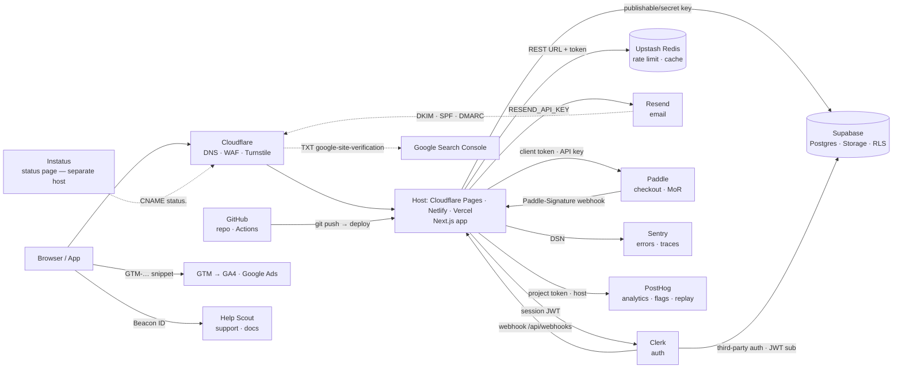

# Startup stack — overview

Startup stack for a solo founder. Prices and limits change; each line carries its verification date and source. Re-verify any `(unverified)` line before relying on it. Scope is world-wide: country rules are checked against BRIEF §7 `Operating country` at run time, never assumed.
Read at mapping step 1. This file is the happy path only; other providers, growth ladders, rejects and country-eligibility lists: `references/stack/alternatives.md`. Wiring details: `references/stack/wiring.md`. Security and privacy: `references/stack/security.md`.
Commercial use on free tiers: "no restriction in <doc>" means the named terms were read and hold no non-commercial clause; "explicit yes" means the provider says so in writing.

## 0. Not yet verified (re-check before relying)
Vercel Pro price; Netlify platform subscription agreement (URL 404; only Website Terms of Use + AUP read); Neon master terms (only the product schedule read); Vercel DNS record values; Vercel WAF plan limits; Supabase↔Vercel integration variable names; Supabase regions/DPA pages; Clerk dashboard 2FA; Cloudflare account 2FA; Resend API-key scopes; Paddle payout schedule/methods, Paddle DPA wording, Paddle dashboard 2FA; Stripe key prefixes on the webhooks page; Stripe Atlas price/filings (third-party); Lemon Squeezy API-key page; Instatus Pro price (third-party); Help Scout secure-key location and agent 2FA/SSO; GTM container-ID format/snippet placement; Google Ads `AW-` prefix and consent-mode page; Plausible exact new snippet text; Postmark DNS records; Serpstat pricing (page 404).

## 1. Happy path (setup order)
1. GitHub: create the private repo; enable 2FA; add `.env.example` (core.md item).
2. Cloudflare: register/transfer the domain, DNS here; Turnstile widget for every public form.
3. Hosting: commercial (sells, advertises, takes bookings/leads) → Cloudflare Pages ($0); Netlify Personal ($9) when the Next.js Node runtime is required; Vercel Hobby only while genuinely pre-revenue/non-commercial, moving to Cloudflare Pages at the first commercial use. On Vercel: set the Sensitive env-var policy; connect the domain (DNS-only in Cloudflare for Vercel records).
4. Supabase: project in the audience's region; copy `sb_publishable_`/`sb_secret_` keys; RLS on every table before first insert.
5. Clerk (if login): app → API keys → Supabase third-party-auth integration → webhook endpoint.
6. Upstash Redis: rate limiting + cache; read-only token where reads only.
7. Resend: domain on a subdomain (`send.` / `updates.`), DKIM/SPF/DMARC records in Cloudflare.
8. Sentry: org in the right region (immutable), DSN + auth token; scrubbing on.
9. PostHog: project in the right region; reverse proxy; cookieless or consent; replay masking.
10. Payments (if money model ≠ none): the provider whose official country list admits the operating country (mapping rule 4; Paddle first when eligible): sandbox → live; webhook destination; server-side prices.
11. Instatus: public status page on Instatus' host (separate host = core.md "Incident readiness"); custom domain later (Pro).
12. Help Scout: Beacon on the app; Docs site for FAQ.
13. Google: GSC domain property (DNS TXT), GA4 property + GTM container (or Plausible), Google Ads only when there is a conversion to track.

### Happy path per profile
| Profile | Use from the base | Skip | Add |
|---|---|---|---|
| landing | 1,2,3,7 (form email),8,9 or Plausible,13; 11 optional | 4,5,6,10,12 | Resend only for the form/thank-you email |
| saas-web | all | — | 10 only when money model ≠ free |
| internal-tool | 1,2,3,4,5(SSO via the org IdP — Clerk Enterprise SSO is paid),6,8 | 7 marketing, 9 (or self-host), 11,12,13 | Sentry + PostHog error tracking only |
| native-app | 1,4,5,6,7,8,9,10 (IAP via stores, Paddle for web checkout only), 11 | 2,3 (no web host), 13 GA4/GSC | EAS Build/Submit (native-app.md) |

## 2. Provider table
Strengths and weaknesses are an assessment; the numbers are quoted.

| Provider | Role | Free tier / entry price | Strengths | Weaknesses | Pick the alternative when |
|---|---|---|---|---|---|
| GitHub | source, CI | Free: unlimited private repos, 2,000 Actions min/mo, 500 MB packages; Team $4/user/mo. Dependabot & secret scanning free on **public** repos only; private needs GitHub Secret Protection (Team/Enterprise) (verified: 2026-09) https://github.com/pricing · https://docs.github.com/en/code-security/secret-scanning/introduction/about-secret-scanning | default for every skill/tool here | secret-scanning gap on private repos → run `gitleaks` in CI (core.md supply chain) | never |
| Cloudflare | DNS, WAF, Turnstile, Workers, Pages (hosting) | Commercial on Free: no restriction in the Developer Platform Service-Specific Terms (Workers/Pages/R2/Queues/D1) (verified: 2026-09) https://www.cloudflare.com/service-specific-terms-developer-platform/ · Free plan: 5 custom WAF rules, 1 rate-limiting rule (Pro: 20 / 2); Workers 100k req/day, 10 ms CPU, Paid $5/mo 10M req; Turnstile free, 20 widgets × 10 hostnames (verified: 2026-09) https://developers.cloudflare.com/waf/custom-rules/ · https://developers.cloudflare.com/waf/rate-limiting-rules/ · https://developers.cloudflare.com/workers/platform/pricing/ · https://developers.cloudflare.com/turnstile/plans/ | free DNS+DDoS+bot check; Turnstile replaces CAPTCHA; $0 commercial hosting | one rate-limit rule on Free; proxying Vercel/Resend records breaks them; Next.js runs on the Workers runtime (OpenNext), not Node | Netlify Personal when a Node-only library blocks the Workers runtime |
| Vercel | hosting (Next.js) | Hobby: **non-commercial only**; 100 GB fast data transfer, 1M function invocations, 4 h active CPU, 360 GB-hrs, 5K image transformations/mo; runtime logs 1 h; 100 deploys/day; 1 concurrent build (verified: 2026-09) https://vercel.com/docs/limits/fair-use-guidelines · https://vercel.com/docs/limits — Pro $20/user/mo (unverified) | zero-config previews, Sensitive env vars, free DDoS | switch trigger: at the first commercial use (first sale, ads, paid client work) Hobby must move to Cloudflare Pages (or Pro, only if the budget covers it and a Vercel-only need exists); Hobby cannot connect repos owned by a Git org | Cloudflare Pages for any commercial use (Cloudflare row) |
| Netlify | hosting (Next.js on Node) | Free: 300 credits/mo (credit-based); Personal $9/mo (verified: 2026-09) https://www.netlify.com/pricing/ · commercial on Free: explicit yes from Netlify staff (forum, not ToS) https://answers.netlify.com/t/can-we-use-netlify-free-plan-for-commercial-purposes/41545 (verified: 2026-09); no restriction in the Website Terms of Use / AUP https://www.netlify.com/legal/terms-of-use/ · https://www.netlify.com/legal/acceptable-use-policy/ (verified: 2026-09) — what 300 credits buy (unverified) | cheapest paid host with a Node runtime | credit model is opaque; platform agreement not located | Cloudflare Pages when the Workers runtime is enough |
| Supabase | Postgres, auth, storage | Free: 500 MB DB, 50,000 MAU, 1 GB storage, 5 GB egress, 500k edge invocations, **paused after 1 week inactivity**, 2 active projects; Pro from $25/mo: 100k MAU, 8 GB disk, 250 GB egress, 100 GB storage, 7-day backups (verified: 2026-09) https://supabase.com/pricing · commercial on Free: no restriction in Terms of Service (verified: 2026-09) https://supabase.com/terms | RLS, region choice, one bill for DB+auth+storage | free projects pause; free = no daily backups → Pro before launch for saas | Neon when you only need Postgres with branching |
| Clerk | auth UI + sessions | Hobby: 50,000 monthly retained users (MRU) per app; Pro $25/mo, $0.02/MRU over; **MFA Pro-only**, allowlist Pro-only; Enterprise SSO 1 connection on Pro, $75/mo each extra (verified: 2026-09) https://clerk.com/pricing · commercial on free: no restriction in Standard Terms (Jul 2, 2026) (verified: 2026-09) https://clerk.com/legal/terms | fastest login UI; Supabase third-party auth; webhooks | **US-only hosting, no region selection**; MFA costs $25/mo | Supabase Auth when EU residency or MFA-for-free matters, or for internal-tool SSO via the org IdP |
| Upstash Redis | rate limit, cache, queues | Free: 500K commands/mo, 256 MB, 10 GB bandwidth, 1 DB; PAYG $0.2/100K commands; Fixed 250 MB $10/mo (verified: 2026-09) https://upstash.com/pricing/redis · commercial on Free: no restriction in Terms (Apr 2025); free resources idle 1 week may be deleted (verified: 2026-09) https://upstash.com/trust/terms.pdf | REST from edge; read-only tokens; IP allowlist | 1 free DB; per-command billing surprises with chatty libs | Redis Cloud for a persistent 30 MB free DB with TCP (Essentials from $5/mo) |
| Resend | transactional email | Free: 3,000/mo, 100/day, 3 domains, 30-day retention; Pro $20/mo 50k (verified: 2026-09) https://resend.com/pricing · commercial on Free: no restriction in ToS/AUP (AUP bans restricted industries) (verified: 2026-09) https://resend.com/legal/terms-of-service · https://resend.com/legal/acceptable-use | React email, DMARC guide, subdomain isolation | 100/day cap; SES-backed (SPF includes amazonses.com) | Postmark when deliverability history matters (100/mo free, $15/mo 10k) |
| Sentry | errors, tracing, replay | Developer: 5k errors, 50 replays, 5M spans, 1 user, 30-day; Team $26/mo annual (verified: 2026-09) https://sentry.io/pricing/ · commercial on free: no restriction in ToS 3.0.0; no-charge products terminable at any time (verified: 2026-09) https://sentry.io/terms/ | region choice at org creation (US Iowa / EU Frankfurt); server-side PII scrubbing default | 1 user on free; region immutable | PostHog error tracking (100k exceptions free) for a landing page with no backend |
| PostHog | analytics, flags, replay, surveys, errors | Free monthly: 1M events, 5K recordings, 1M flag requests, 1500 survey responses, 100K exceptions; no card (verified: 2026-09) https://posthog.com/pricing · commercial on free: no restriction in terms (verified: 2026-09) https://posthog.com/terms | one tool for 5 jobs; EU cloud; `cookieless_mode`; managed reverse proxy free | replay needs masking discipline | Plausible when you want cookieless-by-design pageviews only (no free plan; $9/mo 10k pageviews, EU) |
| Paddle | payments, MoR | 5% + 50¢ per transaction, no monthly fee; MoR: tax registration/filing/remittance (verified: 2026-09) https://www.paddle.com/pricing · eligibility: **unsupported** list covering suppliers and buyers; absence is not approval (sellers vetted) https://www.paddle.com/help/start/intro-to-paddle/which-countries-are-supported-by-paddle (verified: 2026-09) | zero sales-tax liability; scoped API keys; sellers vetted at signup | 5% + 50¢ > Stripe's 2.9%; approval before go-live; payout schedule/methods (unverified) | Stripe when you have a supported-country entity and volume makes 2% matter |
| Lemon Squeezy | payments, MoR | 5% + 50¢, $0/mo, MoR; **2026: migrating merchants to Stripe Managed Payments (35+ countries)**, no EOL date; still operates standalone (verified: 2026-09) https://www.lemonsqueezy.com/pricing · https://www.lemonsqueezy.com/blog/2026-update · eligibility: supported seller-payout lists (bank ≈130 countries; PayPal 200+) https://docs.lemonsqueezy.com/help/getting-started/supported-countries (verified: 2026-09) | simplest checkout; wide payout coverage | product in transition; new features go to Stripe Managed Payments | Paddle for a new integration in 2026 |
| Stripe | payments (PSP, not MoR) | US: 2.9% + 30¢ domestic, +1.5% international cards; Stripe Tax 0.5%; Billing 0.7% (verified: 2026-09, US page) https://stripe.com/pricing · eligibility: 50 supported **account** countries; in Latin America only Brazil and Mexico https://stripe.com/global (verified: 2026-09) | lowest fees, deepest API, 2FA/passkeys | you are the merchant: tax registration is yours; outside the account countries you need an entity in one — e.g. a US entity via Stripe Atlas ~$500 one-time + ~$100/yr agent + annual IRS filings (unverified, third-party) | Paddle unless you already have the entity |
| Neon | Postgres alt | Free: 0.5 GB/project, 100 CU-hours/project, 100 projects, 10 branches; Launch PAYG $0.106/CU-hour + $0.35/GB-month, no minimum (verified: 2026-09) https://neon.com/pricing · commercial on Free: no restriction in the Neon product schedule (verified: 2026-09) https://neon.com/terms-of-service — master terms (unverified) | branch per PR via Vercel integration | no auth/storage bundle | Supabase when you want auth+storage+RLS in one place |
| Instatus | status page | Free: 15 monitors, 2-min checks, 5 team members, 200 subscribers, public page, **no custom domain**; Pro adds custom domain, 50 monitors, 5,000 subscribers (verified: 2026-09) https://instatus.com/pricing — Pro $20/mo (unverified, third-party) | separate host by design (core.md incident readiness) | custom domain paid | none needed; the free page on Instatus' host satisfies the standard |
| Help Scout | support inbox + docs | Free: up to 5 users, 100 contacts/mo, 1 inbox, 1 Docs site; Standard $25/user/mo (verified: 2026-09) https://www.helpscout.com/pricing/ | free tier fits a solo founder; Docs site = FAQ host | 100 contacts/mo cap; Beacon secure-mode key location (unverified) | Missive when you want shared email/SMS/social in one inbox (no free plan; Starter $14/user/mo yearly, ≤5 users) |
| Google Search Console | indexing | free (verified: 2026-09 — verification methods page) https://support.google.com/webmasters/answer/9008080 | required for SEO items in web.md | — | — |
| GA4 + GTM (Google Marketing Platform) | analytics, tags | free; GA4 retention 2 months default, 14 max (verified: 2026-09) https://support.google.com/analytics/answer/9019185 · https://support.google.com/analytics/answer/12270356 | ads attribution; GTM one snippet for all tags | cookies + consent banner needed (web.md); data leaves the region | Plausible or PostHog cookieless when no ads |
| Google Ads | paid acquisition | pay-per-click; conversion action gives Conversion ID + Conversion Label (verified: 2026-09) https://support.google.com/tagmanager/answer/6105160 | only channel with search intent | needs GA4/GTM wiring first | skip until the 90-day metric needs paid traffic |
| SEO suites | research | Ahrefs: free tier ("Ahrefs Free"), Starter $29/mo; Semrush: 7-day trial, SEO plan $139/mo; SE Ranking: 14-day trial, Core $129/mo (verified: 2026-09) https://ahrefs.com/pricing · https://www.semrush.com/prices/ · https://seranking.com/pricing.html · Serpstat: pricing page 404 twice, third-party says ~$50/mo, 7-day trial (unverified) | Ahrefs free tier covers a verified site | others start ≥$100/mo | Ahrefs Free + GSC first; buy a suite only for keyword research at scale |
| Comments | blog comments | **Cusdis repo archived 2026-07-17** (verified: 2026-09) https://github.com/djyde/cusdis → do not adopt. giscus (GitHub Discussions, active, 12k stars) https://github.com/giscus/giscus (verified: 2026-09) | — | giscus requires a GitHub login → dev audiences only | no comments at all for a consumer landing (YAGNI) |

### Growth rungs (name these before any $99 tier)
| Need | Free start | First paid rung | Upgrade trigger | Cliff it avoids |
|---|---|---|---|---|
| Postgres with backups (off Supabase) | Prisma Postgres Free: 500 MB, 200k ops/mo, no backups | Starter $10/mo: 10 GB, 1M ops, 7-day daily backups (verified: 2026-09) https://www.prisma.io/pricing · commercial: no restriction in ToS (verified: 2026-09) https://www.prisma.io/terms | real users (backups), >500 MB | Prisma Pro $49 / Business $129 |
| Background jobs, cron | Trigger.dev Free: $5/mo compute credit | Hobby $10/mo: 50 concurrent runs, 7-day logs (verified: 2026-09) https://trigger.dev/pricing · commercial: no restriction in ToS (verified: 2026-09) https://trigger.dev/legal | credit runs out; need run logs | Inngest Pro $99 |
| Images | ImageKit Free: 20 GB bandwidth, 3 GB storage | Lite $9/mo: 40 GB, 10 GB storage (verified: 2026-09) https://imagekit.io/plans · commercial: no restriction in Terms of Use (verified: 2026-09) https://imagekit.io/terms/ | >20 GB/mo image bandwidth | Cloudinary Plus $99 |
| Auth with MFA + SOC 2 report | Kinde Free: 10,500 MAU, MFA | Pro $25/mo (SOC 2 report) (verified: 2026-09) https://kinde.com/pricing/ · commercial: explicit yes in ToS (verified: 2026-09) https://docs.kinde.com/trust-center/agreements/terms-of-service/ | a buyer asks for SOC 2 | Auth0 B2B Essentials $150 |
| Hosting with Node runtime | Cloudflare Pages ($0) | Netlify Personal $9 (row above) | Node-only library | Vercel Pro (price unverified) |

Stale defaults, do not pick from memory (details and sources in alternatives.md, under each category): AWS Free Tier (incl. SES) is now 6-month credits, not a free start; Railway Free is a $1 credit, so its real entry is $5; Payload Cloud is paused (self-host only); Highlight.io is gone (redirects to LaunchDarkly); PlanetScale has no free tier.

## 3. Cost at launch
- landing: $0 on Cloudflare Pages (commercial) or on Vercel Hobby while genuinely pre-revenue.
- saas-web: Supabase Pro $25 + Clerk Pro $25 if MFA = $50/mo on Cloudflare Pages ($0), or $59/mo on Netlify Personal when the Node runtime is needed. Vercel Pro only when the budget covers it and a Vercel-only need is named (price unverified).
- Everything else: free tier.

## 4. Architecture diagram
Node ids are the keys the wiring matrix maps to.

Alternatives (Neon, Postmark, Plausible, Stripe, Lemon Squeezy, Redis Cloud, Missive, giscus) are **not** nodes; they appear in the wiring matrix as `alt:` rows. Wiring rows are written for Vercel; Cloudflare Pages and Netlify use their own env-var UI. Everything else: `references/stack/alternatives.md`.

***
Copyright © 2026 Rafael Arciniegas. Licensed under the MIT License.
